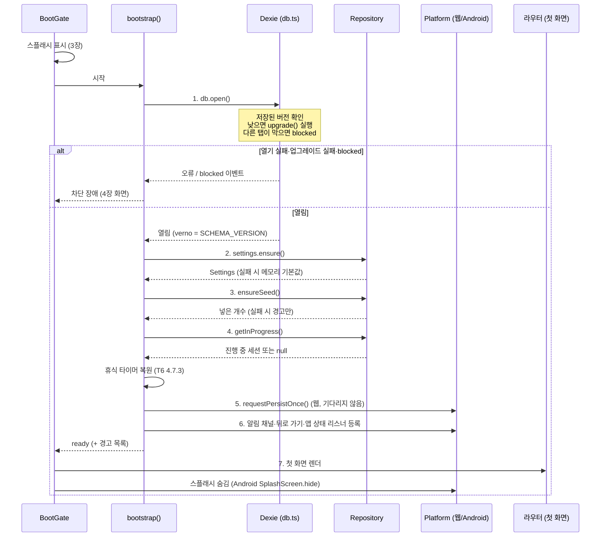
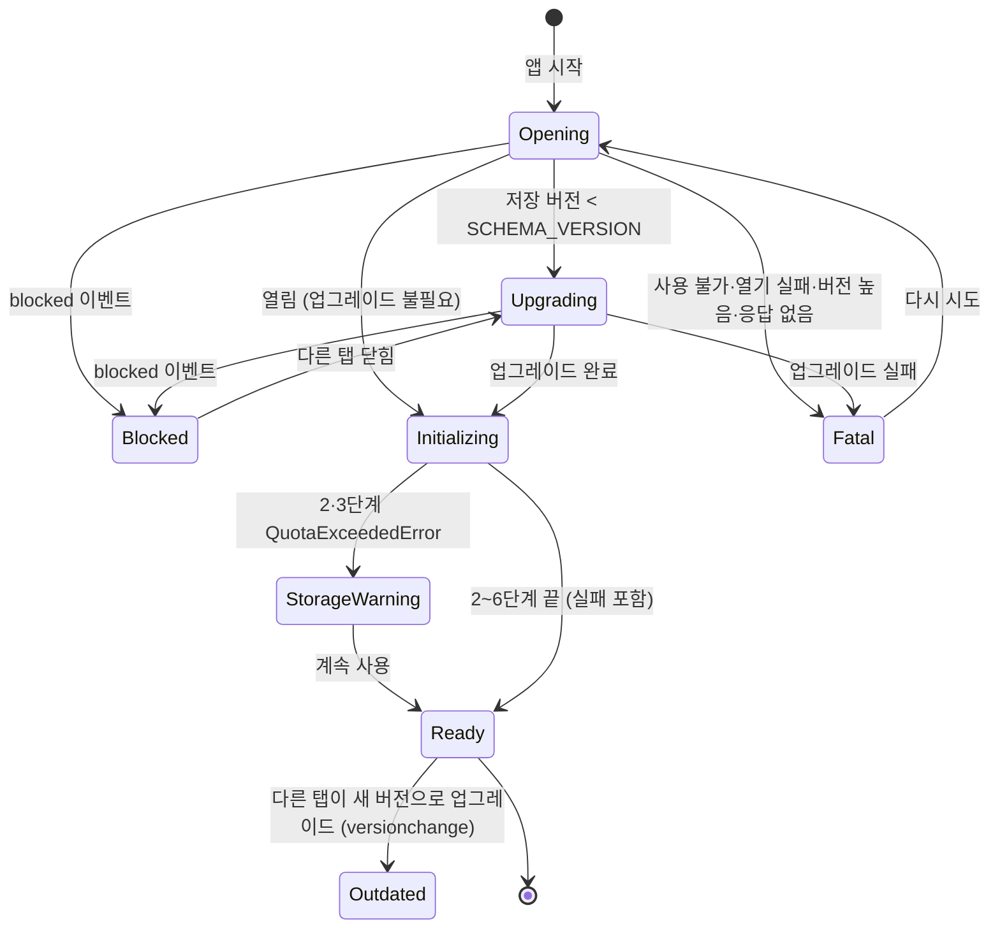
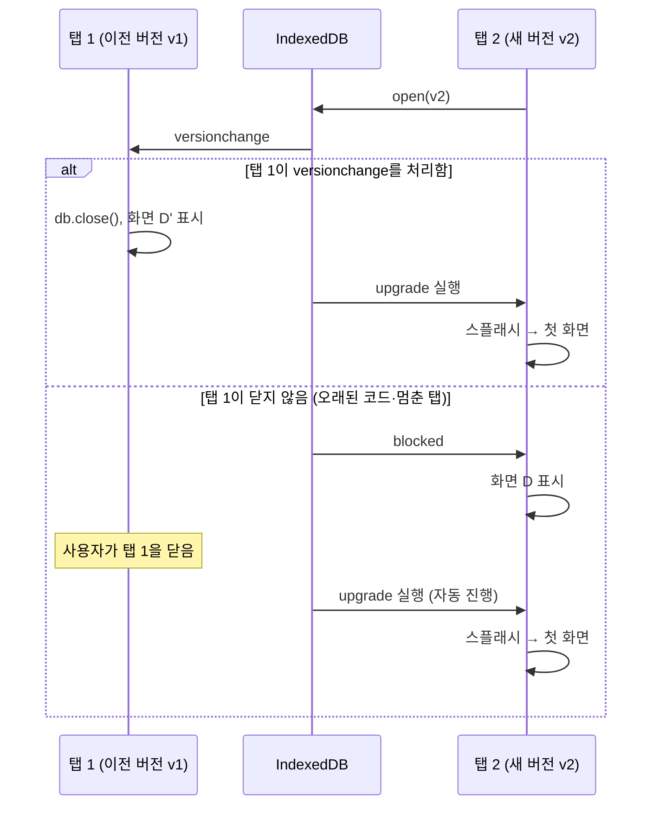
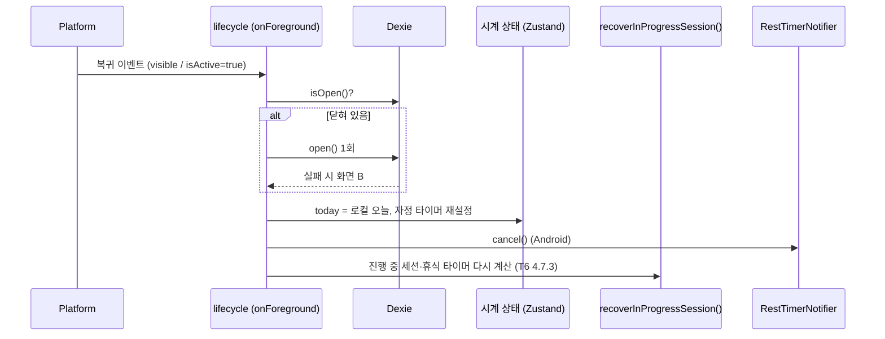

# 앱 시작 순서·로컬 DB 수명주기·장애 처리 설계

- 작업: FP-30 (상위: FP-22 MVP 명세 정합성 확보 및 누락 설계 보완)
- 작성일: 2026-10-01
- 상태: 초안
- 기준 문서
  - [데이터 모델·도메인 규칙 v1.1](./data-model-v1.md) (이하 **T1**) 2.8절(Settings), 3.1절(Dexie 스키마), 7.2절(진행 중 세션)
  - [공통 UI·IA·내비게이션 명세](./ia-navigation.md) (이하 **IA**) 2.4절(뒤로 가기), 4장(와이어프레임 표기), 5.5절(저장 실패 처리), 5.6절(접근성)
  - [운동 라이브러리(F-EX)](../../2.feature/mvp-spec/exercise-library.md) (이하 **T3**) 3.3절(시드 넣기), 3.5절(시드 실패)
  - [루틴·주간 계획과 홈](../../2.feature/mvp-spec/routine-plan-home.md) (이하 **T5**) 6.6절(자정·복귀)
  - [운동 세션 기록(F-WS)](../../2.feature/mvp-spec/workout-session.md) (이하 **T6**) 4.4.4절(AN-1~9, 웹 타이머), 4.7.3절(세션 복구)
  - [히스토리·통계(F-ST)](../../2.feature/mvp-spec/history-stats.md) (이하 **T7**) 2.5절(오늘·이번 주 재계산)
  - [데이터 내보내기·가져오기와 설정](../../2.feature/mvp-spec/data-io-settings.md) (이하 **T9**) 2장(내보내기), 3.2절(백업 마이그레이션), 5.4절(`storage.persist`)
  - [사전조사 종합 요약](../pre-research-summary.md) ADR-002(Dexie), ADR-005(테스트), R-1(WebView 데이터 유실)

앱을 켤 때 하는 일은 T1·T3·T6·T9에 흩어져 있었다. 이 문서는 그 일들의 **실행 순서와 단계별 실패 처리**, 시작 중 보이는 **스플래시와 장애 화면**, **스키마 마이그레이션 원칙**, **포그라운드 복귀 때 할 일**을 한곳에 정한다.
각 단계의 세부 규칙(시드 넣기 규칙, 세션 복구 규칙, 보존 요청 규칙 등)은 원래 문서에 있고, 여기서는 반복하지 않고 참조한다.

**외부 동작 표기**: 브라우저·WebView·라이브러리의 동작에 기대는 서술은 작성자가 알고 있는 내용으로 적었고, 끝에 **(기준 시점 2026-10, 확인 필요)** 를 붙였다. 구현 전에 실제 환경에서 다시 확인한다(9장).

---

## 1. 범위와 용어

| 용어 | 뜻 |
| --- | --- |
| 부트(boot) | 앱 프로세스·탭이 시작된 뒤 첫 화면(라우트)을 그리기까지의 처리. 2장 1~7단계 |
| 부트 게이트(`BootGate`) | 라우터 바깥에서 부트 상태에 따라 스플래시·장애 화면·라우터 중 하나를 그리는 최상위 컴포넌트 |
| 차단 장애 | 앱을 쓸 수 없어 라우터를 그리지 않고 장애 화면만 보이는 상태 |
| 비차단 장애 | 앱은 그대로 쓰고, 영향을 받는 영역만 오류 표시하는 상태 |
| 포그라운드 복귀 | 웹 탭이 다시 보이거나(`visibilitychange` → `visible`), Android 앱이 활성화될 때(`appStateChange`의 `isActive=true`) |
| 비상 내보내기 | 앱 스키마로 DB를 열 수 없을 때, 버전을 지정하지 않고 DB를 열어 저장된 데이터를 그대로 백업 파일로 내보내는 것(4.3절) |

- 이 문서는 웹(PWA)과 Android(Capacitor) 공통이다. 플랫폼별로 다른 부분은 표에 따로 적었다.
- 범위 밖: 서비스 워커 업데이트 안내 UI, 오류 수집(텔레메트리). MVP에서 오류의 기술 정보는 콘솔에만 남긴다(IA 5.5절).

---

## 2. 시작 순서

### 2.1 시퀀스



### 2.2 단계 정의

| # | 단계 | 하는 일 | 끝날 때까지 기다리나 | 세부 규칙 |
| --- | --- | --- | --- | --- |
| 1 | DB 열기 | `db.open()`. Dexie가 저장된 DB 버전과 코드의 `SCHEMA_VERSION`을 비교해 낮으면 `upgrade()`를 실행한다. `blocked`·`versionchange` 핸들러는 열기 전에 등록한다(5.4절) | 기다림 | T1 3.1절, 이 문서 5장 |
| 2 | Settings 확보 | 하나의 `rw` 트랜잭션에서 `settings.get(SETTINGS_ID)`를 읽고 없으면 기본값(`defaultRestSec=90`, `weightUnit='KG'`, `weekStartsOn=1`)으로 `add`한다. 결과를 Zustand 설정 상태에 넣는다 | 기다림 | T1 2.8절 |
| 3 | 기본 운동 시드 | `ensureSeed()`: 하나의 `rw` 트랜잭션에서 시드 `id` 중 없는 것만 넣는다 | 기다림 | T3 3.3절 |
| 4 | 진행 중 세션 복구 | `getInProgress()` → 있으면 `restTimerEndsAt` 정리·타이머 복원, Android 예약 알림 `cancel()` | 기다림 | T6 4.7.3절, T1 7.2절 |
| 5 | 저장소 보존 요청 (웹) | `requestPersistOnce()`: 설치당 1회 `navigator.storage.persist()` | **기다리지 않음**(시작만 한다) | T9 5.4절 |
| 6 | 플랫폼 초기화 | Android: 알림 채널 `rest-timer` 만들기(AN-5), `backButton` 리스너(IA 2.4절), `appStateChange` 리스너(AN-1, 6장), 알림 탭 리스너(AN-6). 웹: `visibilitychange`·`pageshow` 리스너(6장) | 리스너 등록은 즉시, 채널 만들기는 기다리지 않음 | T6 4.4.4절, IA 2.4절 |
| 7 | 첫 화면 렌더 | 라우터를 그린다. 현재 URL의 화면을 연다(보통 홈 `/`). Android에서 휴식 알림을 눌러 시작했으면 `/workout`으로 이동한다(AN-6). 4단계에서 찾은 진행 중 세션은 홈 배너로 보인다(S-08로 자동 이동하지 않음, T6 4.7.3절) | — | T5 6.6절, T6 4.7.3절 |

- 2~4단계는 같은 DB를 쓰므로 순서대로 실행한다. 레코드 수가 적어(시드 141개, Settings 1개, 진행 중 세션 조회 1회) 보통 합쳐 수백 ms 안에 끝난다고 본다. 측정 후 느리면 2·3단계를 병렬로 바꿀 수 있다(서로 다른 테이블).
- 4단계를 첫 렌더 전에 끝내는 이유: 홈이 진행 중 세션 여부를 모른 채 `운동 시작` 버튼을 그렸다가 바꾸는 깜빡임을 막는다(T5 6.6절 "로딩 중").
- 5단계를 기다리지 않는 이유: Firefox 등은 `persist()`에서 사용자에게 권한을 물어 응답까지 오래 걸릴 수 있다(T9 5.4절, **기준 시점 2026-10, 확인 필요**). 결과는 첫 화면 렌더와 관계없다.
- 여러 탭이 동시에 첫 실행돼도 2·3단계는 같은 테이블의 `rw` 트랜잭션이 직렬로 실행되므로 Settings·시드가 두 번 들어가지 않는다. 트랜잭션 안에서 "읽고 없으면 넣기"를 해야 하며, 트랜잭션 밖에서 읽고 따로 넣으면 안 된다.

### 2.3 단계별 실패 처리

| 단계 | 실패 원인 | 앱 차단 | 사용자 표시 | 다음 동작 |
| --- | --- | --- | --- | --- |
| 1 DB 열기 | IndexedDB를 쓸 수 없음(API 없음, 보안 설정·일부 사생활 보호 모드에서 열기 거부) | **차단** | 화면 A (4.2절) | `다시 시도` → 1단계부터 |
| 1 DB 열기 | 그 밖의 열기 실패(손상, 알 수 없는 오류) | **차단** | 화면 B (4.3절) | `다시 시도` → 1단계부터. 비상 내보내기 시도 가능 |
| 1 DB 열기 | 저장된 DB 버전이 앱보다 높음(새 버전 앱으로 연 뒤 이전 버전 코드가 캐시에서 실행됨) | **차단** | 화면 B 변형 "새 버전" (4.3절) | `새로고침`(웹) → 새 코드 받기 |
| 1 DB 열기 | 응답 없음(10초 안에 열리지도, 실패하지도, `blocked`도 오지 않음) | **차단** | 화면 B 변형 "응답 없음" (4.3절) | `다시 시도` → 페이지 다시 불러오기(웹) / 1단계부터(Android) |
| 1 DB 열기 | 업그레이드 함수 오류(`upgrade()`에서 예외, 트랜잭션 중단) | **차단** | 화면 C (4.4절) | 비상 내보내기 권장, `다시 시도` → 페이지 다시 불러오기 |
| 1 DB 열기 | 업그레이드 중 저장 공간 부족(`QuotaExceededError`) | **차단** | 화면 C 변형 "공간 부족" (4.4절) | 공간 확보 후 `다시 시도` |
| 1 DB 열기 | 다른 탭이 이전 버전으로 열려 있어 업그레이드가 막힘(`blocked`) | **차단**(풀릴 때까지) | 화면 D (4.5절) | 다른 탭이 닫히면 **자동으로** 이어서 진행 |
| 2 Settings | 읽기·쓰기 실패(트랜잭션 오류) | 비차단 | 없음(콘솔 기록) | 메모리 기본값(`DEFAULT_SETTINGS`)으로 계속. S-16에서 바꾸려 하면 IA 5.5절 저장 실패. 다음 시작 때 다시 만든다 |
| 2 Settings | 저장 공간 부족 | 비차단 | 화면 E (4.7절), `계속 사용`으로 진행 | 위와 같음 |
| 3 시드 | 트랜잭션 오류 | 비차단 | 시작 때는 없음. S-02에서 기본 운동이 없으면 오류 상태 + `다시 시도`(T3 3.5절) | 다음 시작 때 다시 실행 |
| 3 시드 | 저장 공간 부족 | 비차단 | 화면 E (2단계에서 이미 보였으면 다시 보이지 않음) | 위와 같음 |
| 4 진행 중 세션 | `getInProgress()` 실패 | 비차단 | 홈 이어하기 자리 오류 상태 + `다시 시도`, 시작 버튼 비활성(T6 4.7.5절) | 홈에서 재시도 |
| 4 진행 중 세션 | `restTimerEndsAt=null` 저장 실패 | 비차단 | 없음 | 화면은 대기, 다음 복구 때 다시 정리(T6 4.7.5절) |
| 4 진행 중 세션 | 진행 중 세션 2개 이상(손상) | 비차단 | 홈 "정리가 필요한 세션 N개"(T6 4.7.5절) | — |
| 5 보존 요청 | API 없음, 거부, 예외, `localStorage` 사용 불가 | 비차단 | 없음. S-16 보존 상태에 반영(T9 5.4절) | `localStorage`를 못 쓰면 매 시작 때 요청할 수 있으나 막지 않는다 |
| 6 플랫폼 | 알림 채널 만들기 실패(Android) | 비차단 | 없음(콘솔 기록) | 알림 예약 실패와 같게 본다(T6 4.4.6절). 다음 시작 때 다시 |
| 6 플랫폼 | 리스너 등록 실패 | 비차단 | 없음(콘솔 기록) | 해당 기능(뒤로 가기·복귀 재계산)만 동작하지 않음 |
| 7 렌더 | 화면 컴포넌트 렌더 오류 | 해당 화면 | 최상위 ErrorBoundary "문제가 생겼어요" + `다시 불러오기` | 이 문서 범위 밖(공통 오류 경계는 IA 개정 때 정의) |

- **앱을 막는 것은 1단계 실패뿐이다.** DB가 열리면 나머지 단계가 실패해도 사용자는 기록을 보고 남길 수 있어야 한다.
- 2~6단계의 실패는 한 단계가 실패해도 다음 단계를 계속 실행한다.
- 같은 부트에서 화면 E는 최대 1번만 보인다.

### 2.4 부트 상태



| 상태 | `BootGate`가 그리는 것 |
| --- | --- |
| `Opening`, `Upgrading`, `Initializing` | 스플래시(3장). `Upgrading`이면 문구가 "데이터를 새 버전에 맞추는 중..." |
| `Blocked` | 화면 D |
| `Fatal` | 원인에 따라 화면 A·B·C |
| `StorageWarning` | 화면 E |
| `Ready` | 라우터(첫 화면) |
| `Outdated` | 화면 D' (4.6절) |

### 2.5 구현 위치 (초안)

```ts
// src/app/bootstrap.ts (초안)
export type FatalReason =
  | 'IDB_UNAVAILABLE'   // 화면 A
  | 'OPEN_FAILED'       // 화면 B
  | 'DB_TOO_NEW'        // 화면 B 변형
  | 'OPEN_TIMEOUT'      // 화면 B 변형
  | 'UPGRADE_FAILED'    // 화면 C
  | 'UPGRADE_QUOTA';    // 화면 C 변형

export type BootWarning = 'STORAGE_FULL' | 'SETTINGS_FALLBACK' | 'SEED_FAILED' | 'SESSION_LOOKUP_FAILED';

export type BootEvent =
  | { type: 'upgrading' }
  | { type: 'blocked' }
  | { type: 'unblocked' }
  | { type: 'fatal'; reason: FatalReason }
  | { type: 'ready'; warnings: BootWarning[] };

export async function bootstrap(emit: (e: BootEvent) => void): Promise<void>;
```

- 단계별 함수는 각 소유 모듈에 둔다: `SettingsRepository.ensure()`, `ensureSeed()`(T3), `recoverInProgressSession()`(T6 4.7.3절), `requestPersistOnce()`(T9 5.4절), `platform.init()`.
- `bootstrap()`은 순서와 실패 분류만 맡고 각 단계의 규칙을 다시 구현하지 않는다.
- Dexie 오류 이름을 `FatalReason`으로 바꾸는 표는 4.1절에 있다.

---

## 3. 스플래시·초기 로딩 화면

### 3.1 표시 규칙

| 항목 | 웹(PWA) | Android(Capacitor) |
| --- | --- | --- |
| 처음 보이는 것 | `index.html`에 넣은 정적 스플래시(HTML·CSS, JS 로드 전에 보임) | 네이티브 스플래시(`@capacitor/splash-screen`, `launchAutoHide: false`) |
| JS 로드 후 | `BootGate`가 같은 모양의 스플래시를 그리고 정적 스플래시를 지운다 | `BootGate`가 같은 모양의 스플래시를 그린다. 네이티브 스플래시는 아래 "숨김 시점"까지 유지 |
| 표시 조건 | 부트 상태가 `Opening`·`Upgrading`·`Initializing`인 동안 | 같음 |
| 숨김 시점 | 첫 화면 렌더(7단계) 직후 또는 장애 화면(A~E)을 그린 직후 | 같음. 이때 `SplashScreen.hide()`를 부른다 |
| 최소 표시 시간 | **두지 않는다(0ms).** 일부러 기다리게 하지 않는다. 깜빡임은 "불러오는 중" 문구 지연으로 막는다 | 같음 |
| "불러오는 중..." 문구 | 시작 후 **1초**가 지나도 부트가 끝나지 않으면 보인다(빠른 시작에서는 로고만 보였다 사라짐) | 같음 |
| 최대 표시 시간 | `Opening` 상태가 **10초**를 넘으면 화면 B 변형 "응답 없음"으로 바꾼다. `Upgrading` 중에는 시간 제한을 두지 않는다(업그레이드를 중간에 끊지 않음). `Initializing`(2~4단계)이 10초를 넘으면 남은 단계를 기다리지 않고 첫 화면을 그린다(각 영역은 자체 로딩·오류 상태를 따름) | 같음. 네이티브 스플래시 안전장치로 `launchShowDuration`은 쓰지 않는다(`launchAutoHide: false`) |
| 업그레이드 중 문구 | "데이터를 새 버전에 맞추는 중..." (1초 지연 없이 바로) | 같음 |

- 스플래시는 경로가 없고 탭 바·헤더도 없다. 화면 ID를 따로 두지 않는다.
- 접근성: 문구 영역은 `role="status"`, `aria-live="polite"`. 로고는 장식이므로 `alt=""`. 움직이는 진행 표시는 `prefers-reduced-motion`이면 멈춘다(IA 5.6절).
- 네이티브 스플래시·정적 스플래시·`BootGate` 스플래시는 배경색·로고 위치를 같게 해서 바뀌는 순간이 보이지 않게 한다.

### 3.2 와이어프레임

```text
+--------------------------------------+
|                                      |
|                                      |
|                                      |
|             /// 로고 ///          #1 |
|                                      |
|             헬스 플래너              |
|                                      |
|                                      |
|             불러오는 중...        #2 |
|                                      |
|                                      |
|                                      |
+--------------------------------------+
```

| # | 요소 | 동작·규칙 |
| --- | --- | --- |
| 1 | 로고·앱 이름 | 화면 가운데. 정적 스플래시·네이티브 스플래시와 같은 위치 |
| 2 | 상태 문구 | 1초 뒤 "불러오는 중...". `Upgrading`이면 바로 "데이터를 새 버전에 맞추는 중...". 문구 아래에 작은 원형 진행 표시(무한) |

---

## 4. 장애 화면

### 4.1 공통 규칙과 오류 분류

- 장애 화면은 라우터 바깥(`BootGate`)에서 그리는 **전체 화면**이다. 헤더 뒤로 버튼·탭 바가 없고 URL을 바꾸지 않는다. 그래서 `다시 시도`·새로고침 후 원래 보려던 화면으로 돌아간다.
- 제목은 `!`로 시작하는 오류 문구(IA 4.2절 기호), 제목 요소에 포커스를 두고 `role="alert"`로 알린다(IA 5.6절).
- 오류의 기술 정보(예외 이름·메시지)는 화면에 보이지 않고 콘솔에 남긴다(IA 5.5절).
- `다시 시도`는 `db.close()` 후 2장 1단계부터 다시 실행한다. 표에 "다시 불러오기"로 적은 경우는 웹 `location.reload()`, Android는 같은 동작(WebView 다시 불러오기)이다.
- Android 뒤로 버튼은 장애 화면에서 앱을 종료한다(IA 2.4절 홈과 같음).

**Dexie 오류 → 화면** (오류 이름은 Dexie 4 기준, **기준 시점 2026-10, 확인 필요**)

| 오류 | 언제 | 화면 |
| --- | --- | --- |
| `MissingAPIError` | `indexedDB` 전역이 없음 | A |
| `OpenFailedError` 안의 `SecurityError`, `InvalidStateError` | 보안 설정·일부 사생활 보호 모드에서 열기 거부 | A |
| `VersionError` | 저장된 DB 버전 > 코드 버전 | B 변형 "새 버전" |
| `UpgradeError`, 업그레이드 트랜잭션 중단(`AbortError`) | `upgrade()` 안에서 예외 | C |
| 업그레이드 중 `QuotaExceededError` | 변환 데이터를 쓸 공간 없음 | C 변형 "공간 부족" |
| `db.on('blocked')` | 다른 연결이 이전 버전으로 열려 있음 | D |
| `db.on('versionchange')` | (이미 열린 탭) 다른 탭이 더 높은 버전으로 열려고 함 | D' |
| 그 밖의 `OpenFailedError`, `DatabaseClosedError`, `UnknownError` | 손상·내부 오류 | B |
| 10초 무응답 | — | B 변형 "응답 없음" |

**버튼과 백업 내보내기 가능 여부 요약**

| 화면 | 상황 | 차단 | Primary 버튼 | 보조 버튼 | 백업 내보내기 |
| --- | --- | --- | --- | --- | --- |
| A | IndexedDB 사용 불가 | 차단 | `다시 시도` | — | **불가**(읽을 DB가 없음) |
| B | DB 열기 실패 | 차단 | `다시 시도` | `백업 내보내기` | 비상 내보내기 **시도**(열리면 가능, 4.3절) |
| C | 업그레이드 실패 | 차단 | `백업 내보내기` | `다시 시도` | **가능**(이전 버전 데이터, 4.4절) |
| D | 다른 탭 때문에 업그레이드 막힘 | 차단 | `다시 시도` | — | **불가**(대기 중인 업그레이드 요청 뒤에 막힘). 이전 버전 탭에서 내보낼 수 있다 |
| D' | 이 탭이 이전 버전(다른 탭이 업그레이드) | 차단 | `새로고침` | — | **불가**(DB 연결을 닫음) |
| E | 저장 공간 부족 | 비차단 | `백업 내보내기` | `계속 사용` | **가능**(일반 내보내기, T9 2장) |

### 4.2 화면 A — IndexedDB를 쓸 수 없음

```text
+--------------------------------------+
| ! 저장 공간을 쓸 수 없어요        #1 |
+--------------------------------------+
|                                      |
| 이 브라우저에서는 기록을 저장할 수   |
| 없어요. 사생활 보호(시크릿) 모드나   |
| 사이트 데이터 차단을 끄고 다시       |
| 열어 주세요.                      #2 |
|                                      |
| [[           다시 시도            ]] |
|                                      |
+--------------------------------------+
```

| # | 요소 | 동작·규칙 |
| --- | --- | --- |
| 1 | 제목 | "저장 공간을 쓸 수 없어요" |
| 2 | 본문 | 원인을 알 수 없으므로 흔한 원인 두 가지(사생활 보호 모드, 사이트 데이터 차단)를 함께 안내한다. Android 앱에서는 이 화면이 나올 일이 거의 없지만, 나오면 본문을 "기기에서 데이터를 저장할 수 없어요. 앱을 다시 시작해 주세요."로 바꾼다 |
| — | `다시 시도` | 1단계부터 다시. 설정을 바꾼 뒤 새로고침 없이 되는 경우는 드물어 같은 화면이 다시 나올 수 있다 |
| — | 백업 내보내기 | 없음. 이 환경에는 읽을 데이터가 없다 |

- 사생활 보호 모드 여부는 감지하지 않는다. 브라우저가 감지를 막고 있고, 감지 결과가 맞는지 보장할 수 없다(**기준 시점 2026-10, 확인 필요**).
- 사생활 보호 모드에서 IndexedDB가 **동작하는** 브라우저는 창을 닫으면 데이터를 지운다. 이 경우 앱은 정상 시작하므로 이 화면은 나오지 않는다. 경고하지 않는다(감지할 수 없음). 4.8절 표 참고.

### 4.3 화면 B — DB 열기 실패

```text
+--------------------------------------+
| ! 데이터를 열지 못했어요          #1 |
+--------------------------------------+
|                                      |
| 기록을 불러오는 중 문제가 생겼어요.  |
| 기록은 기기에 그대로 남아 있어요.    |
| 다시 시도해도 안 되면 기기를      #2 |
| 다시 켜 보거나 백업을 내보내 주세요. |
|                                      |
| [[           다시 시도            ]] |
| [ 백업 내보내기 ]                 #3 |
+--------------------------------------+
```

| # | 요소 | 동작·규칙 |
| --- | --- | --- |
| 1 | 제목 | 변형별 제목은 아래 표 |
| 2 | 본문 | 변형별 본문은 아래 표 |
| 3 | `백업 내보내기` | 비상 내보내기(아래). 실패하면 `<< 백업을 내보내지 못했어요 >>` 토스트를 띄우고 버튼을 비활성 `[- 백업 내보내기 -]`으로 바꾼다 |

| 변형 | 조건 | 제목 | 본문 | 버튼 |
| --- | --- | --- | --- | --- |
| 기본 | `OPEN_FAILED` | 데이터를 열지 못했어요 | 위 와이어프레임 | `다시 시도`, `백업 내보내기` |
| 새 버전 | `DB_TOO_NEW` | 앱을 새로 고쳐 주세요 | 이 기기의 데이터가 더 새로운 버전의 앱으로 저장돼 있어요. 새로고침해서 최신 버전을 받아 주세요. | `새로고침`(Primary). 백업 내보내기 없음(이전 코드로 새 데이터를 다루지 않음) |
| 응답 없음 | `OPEN_TIMEOUT` | 데이터를 여는 데 오래 걸려요 | 다른 탭이나 창에 이 앱이 열려 있으면 닫고 다시 시도해 주세요. | `다시 시도`(다시 불러오기). 백업 내보내기 없음 |

**비상 내보내기**

1. 앱 스키마를 선언하지 않은 별도 Dexie 인스턴스(`new Dexie(DB_NAME)`)로 연다. Dexie는 버전 선언이 없으면 저장된 버전·테이블 그대로 연다(**기준 시점 2026-10, 확인 필요**).
2. 열리면 모든 테이블을 하나의 읽기 트랜잭션으로 읽어 T9 2.2절 봉투로 만든다. `schemaVersion`은 **저장된 DB 버전**(`db.verno`)을 쓴다. 그래서 이전 버전 데이터도 가져오기 때 T9 3.2절 마이그레이션을 거쳐 복원된다.
3. Zod 자체 검사는 `schemaVersion`이 현재 버전과 같을 때만 하고, 결과와 관계없이 내보낸다(T9 2.1절 "백업이 우선").
4. 파일명·저장 방법은 T9 2.4절·4장과 같다. 성공하면 `lastBackupAt`을 갱신한다.
5. 열기 자체가 실패하면 3번 주석의 실패 처리를 따른다.

### 4.4 화면 C — 업그레이드 실패

```text
+--------------------------------------+
| ! 앱 업데이트를 마치지 못했어요   #1 |
+--------------------------------------+
|                                      |
| 새 버전에 맞게 데이터를 바꾸다가     |
| 멈췄어요. 기록은 이전 상태 그대로    |
| 남아 있어요. 먼저 백업을 내보낸 뒤   |
| 다시 시도해 주세요.               #2 |
|                                      |
| [[         백업 내보내기          ]] |
| [ 다시 시도 ]                     #3 |
+--------------------------------------+
```

| # | 요소 | 동작·규칙 |
| --- | --- | --- |
| 1 | 제목 | "앱 업데이트를 마치지 못했어요" |
| 2 | 본문 | IndexedDB 업그레이드는 하나의 트랜잭션이라 실패하면 **이전 버전 데이터가 그대로 남는다**(5.3절). 그 사실을 알려 불안을 줄이고 백업을 먼저 권한다 |
| — | `백업 내보내기` (Primary) | 비상 내보내기(4.3절). 이전 버전 `schemaVersion`으로 내보낸다. 성공하면 `<< 백업 파일을 저장했어요 >>` |
| 3 | `다시 시도` | 다시 불러오기. 같은 코드면 같은 오류가 날 가능성이 높다. 고친 앱 버전이 배포되면 새로고침으로 해결된다 |

| 변형 | 조건 | 제목 | 본문 |
| --- | --- | --- | --- |
| 공간 부족 | `UPGRADE_QUOTA` | 업데이트할 공간이 부족해요 | 기기의 저장 공간이 부족해 데이터를 새 버전에 맞추지 못했어요. 기록은 그대로 있어요. 공간을 확보한 뒤 다시 시도해 주세요. |

- 버튼 구성은 변형에서도 같다.
- 업그레이드 실패는 출시 전 테스트(5.5절)로 막아야 하는 결함이다. 화면 C는 마지막 안전장치다.

### 4.5 화면 D — 다른 탭이 이전 버전으로 열려 있음 (`blocked`)

웹에서만 생긴다. Android 앱은 WebView 하나로 실행되고, 앱 업데이트 때 프로세스가 다시 시작되므로 생기지 않는다.

```text
+--------------------------------------+
| ! 다른 탭을 닫아 주세요           #1 |
+--------------------------------------+
|                                      |
| 이 앱이 다른 탭이나 창에서 이전      |
| 버전으로 열려 있어 업데이트를 할 수  |
| 없어요. 다른 탭을 모두 닫으면        |
| 자동으로 계속돼요.                #2 |
|                                      |
| [[           다시 시도            ]] |
|                                      |
+--------------------------------------+
```

| # | 요소 | 동작·규칙 |
| --- | --- | --- |
| 1 | 제목 | "다른 탭을 닫아 주세요" |
| 2 | 본문 | 다른 탭이 닫히면(연결이 닫히면) 대기 중이던 업그레이드가 이어서 실행된다. 이 화면은 스플래시("데이터를 새 버전에 맞추는 중...")로 바뀐 뒤 첫 화면으로 간다 |
| — | `다시 시도` | 다시 불러오기. 다른 탭을 닫았는데도 화면이 그대로일 때 쓴다 |
| — | 백업 내보내기 | 없음. 대기 중인 업그레이드 요청이 같은 DB의 다른 열기 요청을 막는다(**기준 시점 2026-10, 확인 필요**). 이전 버전으로 열린 탭에서 S-16 내보내기를 할 수 있다 |

- 정상이라면 이전 버전 탭은 `versionchange`를 받아 스스로 연결을 닫으므로(4.6절) 화면 D는 잠깐 보이거나 보이지 않는다. 이전 버전 탭이 `versionchange` 처리 코드가 없는 오래된 코드이거나, 백그라운드에서 멈춰 있을 때 오래 보인다.

### 4.6 화면 D' — 이 탭이 이전 버전임 (`versionchange`)

이미 열려 있는 탭이, 다른 탭이 새 버전으로 업그레이드하려 할 때 받는다(웹만).

```text
+--------------------------------------+
| ! 새 버전으로 바뀌었어요          #1 |
+--------------------------------------+
|                                      |
| 다른 탭에서 앱이 새 버전으로      #2 |
| 업데이트됐어요. 이 탭은 더 이상      |
| 저장할 수 없으니 새로고침해 주세요.  |
|                                      |
| [[           새로고침             ]] |
|                                      |
+--------------------------------------+
```

| # | 요소 | 동작·규칙 |
| --- | --- | --- |
| 1 | 제목 | "새 버전으로 바뀌었어요" |
| 2 | 본문 | `versionchange` 핸들러는 **즉시 `db.close()`** 하고 이 화면을 띄운다. 그래야 새 버전 탭의 업그레이드가 막히지 않는다(5.4절) |
| — | `새로고침` | `location.reload()`. 새 코드를 받아 새 버전 DB로 연다 |

- 이 탭에서 입력 중이던 값(포커스 칸의 저장 안 된 값)은 잃을 수 있다. 세트 입력은 칸 단위로 즉시 저장하므로(T6 2.2절) 잃는 양은 마지막 칸 하나 이하다.
- 진행 중 세션은 DB에 있으므로 새로고침 후 홈 배너로 복구된다(T6 4.7.3절).
- 이 화면은 부트 중이 아니라 사용 중에 나타난다. 열려 있던 바텀시트·다이얼로그는 모두 닫힌다.

### 4.7 화면 E — 저장 공간 부족 (비차단)

2단계(Settings) 또는 3단계(시드)에서 `QuotaExceededError`가 나면 첫 화면 전에 한 번 보인다. 사용 중에 나는 용량 부족은 IA 5.5절 문구(토스트·`설정으로`)를 따른다.

```text
+--------------------------------------+
| ! 저장 공간이 부족해요            #1 |
+--------------------------------------+
|                                      |
| 기기의 저장 공간이 부족해 새 기록을  |
| 저장하지 못할 수 있어요. 데이터를    |
| 내보낸 뒤 공간을 확보해 주세요.   #2 |
|                                      |
| [[         백업 내보내기          ]] |
| [ 계속 사용 ]                     #3 |
+--------------------------------------+
```

| # | 요소 | 동작·규칙 |
| --- | --- | --- |
| 1 | 제목 | IA 5.5절 용량 부족 문구와 같은 뜻으로 맞춘다 |
| 2 | 본문 | 앱을 막지 않는다는 점이 버튼(`계속 사용`)으로 드러나므로 본문에 따로 쓰지 않는다 |
| — | `백업 내보내기` | DB는 열려 있으므로 T9 2장 일반 내보내기. 이 화면에 머문다 |
| 3 | `계속 사용` | 첫 화면 렌더(7단계)로 간다. 이후 저장 실패는 각 화면의 IA 5.5절 처리를 따른다 |

### 4.8 외부 환경별 IndexedDB 동작 (참고)

아래 표는 작성자가 알고 있는 내용이다. 버전마다 바뀌므로 구현 전에 실제 브라우저에서 확인한다. **(기준 시점 2026-10, 확인 필요)**

| 환경 | IndexedDB | 이 앱에서 보이는 것 |
| --- | --- | --- |
| Chrome·Edge 시크릿 창 | 쓸 수 있다. 창을 닫으면 지워진다. 쓸 수 있는 용량이 일반 창보다 작다 | 정상 시작. 창을 닫으면 기록이 사라진다(경고 없음, 4.2절) |
| Firefox 사생활 보호 창 | 예전 버전은 열기에서 `InvalidStateError`로 실패했다. 최근 버전(115 무렵 이후)은 쓸 수 있고 창을 닫으면 지워진다 | 예전 버전: 화면 A / 최근 버전: 정상 시작 |
| Safari 개인 정보 보호 브라우징 (macOS·iOS) | 예전 버전은 쓸 수 없거나 쓰기 때 오류가 났다. 최근 버전은 쓸 수 있고 세션이 끝나면 지워진다 | 예전 버전: 화면 A 또는 화면 E / 최근 버전: 정상 시작 |
| 쿠키·사이트 데이터를 모두 차단한 설정 | 열기에서 `SecurityError` 등으로 실패 | 화면 A |
| 브라우저 설정으로 IndexedDB를 끈 경우(Firefox 고급 설정 등) | `indexedDB`가 없거나 열기 실패 | 화면 A |
| Safari, 탭을 오래 백그라운드에 둔 뒤 | 예전 버전에서 IndexedDB 연결이 끊기는 문제("Connection to Indexed Database server lost")가 보고됐다 | 6.3절 재연결 처리 |
| Android WebView (Capacitor) | 쓸 수 있다. 앱 데이터 삭제·앱 삭제 시 사라진다 | 정상 시작(R-1, T9 5.4절) |
| 저장 용량 한도 | 브라우저마다 기준이 다르다(디스크 여유 공간 비율 기반이 많음). 사생활 보호 모드는 더 작다 | 한도에 닿으면 화면 E 또는 IA 5.5절 |

---

## 5. 스키마 마이그레이션

### 5.1 버전 올림 절차

스키마(테이블·인덱스·필드 의미)를 바꾸는 작업은 아래 순서를 모두 지킨다.

| # | 할 일 | 위치 |
| --- | --- | --- |
| 1 | T1을 개정한다: 바뀌는 필드·인덱스, 새 `SCHEMA_VERSION`(이전 + 1), 기존 데이터 변환 규칙 | T1 2·3장, 개정 이력 |
| 2 | `SCHEMA_VERSION`을 올리고 `db.version(N).stores({...})`를 **추가**한다. 이전 `db.version(...)` 선언은 지우지 않는다 | `src/data/dexie/db.ts` |
| 3 | 데이터 변환이 필요하면 레코드 단위 순수 함수로 만들고(`src/domain/migrations/v{N-1}to{N}.ts`), Dexie `.upgrade(tx => ...)`와 백업 마이그레이션 `migrations[N-1]`(T9 3.2절)이 **같은 함수**를 부른다 | `src/domain/migrations/`, `src/data/dexie/db.ts`, `src/domain/backup/migrations.ts` |
| 4 | Zod 스키마(엔티티·백업 봉투)를 새 버전에 맞춘다 | `src/domain/schemas`, T9 3.3절 |
| 5 | 이전 버전 스키마 선언을 테스트용으로 동결한다(5.5절 `schemas/v{N-1}.ts`). 출시된 버전의 동결 파일은 고치지 않는다 | `src/data/dexie/__tests__/schemas/` |
| 6 | 5.5절 테스트를 추가하고 통과시킨다 | Vitest |
| 7 | 기본 운동 시드의 기존 레코드를 바꾸는 경우 3번 변환에 넣는다. `ensureSeed()`는 없는 것만 넣으므로 기존 레코드를 고치지 않는다(T3 3.3절 "시드 갱신") | 3번과 같음 |
| 8 | 릴리스 노트에 "업데이트 후 첫 실행 때 데이터 변환" 사실과 예상 시간을 적는다 | 릴리스 노트 |

### 5.2 업그레이드 함수 작성 규칙

| 규칙 | 내용 | 이유 |
| --- | --- | --- |
| 추가형 변경 | 필드 추가(기본값 채움)와 인덱스 추가를 기본으로 한다. **테이블 삭제·필드 삭제·필드 의미 변경(파괴적 변경)은 MVP 기간 동안 하지 않는다** | 업그레이드가 성공했지만 변환이 틀린 경우에는 트랜잭션 원자성이 데이터를 지켜 주지 않는다. 추가형이면 원본 값이 남는다 |
| 오류를 삼키지 않음 | 변환 중 예외는 그대로 던진다. 일부 레코드만 건너뛰는 처리를 하지 않는다 | 예외가 나야 트랜잭션이 중단돼 이전 버전이 그대로 남는다(화면 C) |
| `updatedAt` 유지 | 형태만 바꾸는 변환은 `updatedAt`을 바꾸지 않는다 | 같은 변환을 백업 마이그레이션도 하므로, 업그레이드한 기기와 이전 백업 사이의 LWW 병합 결과가 같아야 한다(T9 6.2절) |
| 외부 의존 없음 | 업그레이드 함수 안에서 네트워크·`localStorage`·현재 시각을 읽지 않는다. 시각이 꼭 필요하면 함수 시작 때 한 번 정한 값을 쓴다 | IndexedDB 트랜잭션은 다른 비동기 작업을 기다리면 자동으로 끝난다. 결과도 재현 가능해야 한다 |
| 대량 변경 | `table.toCollection().modify(fn)`을 쓴다. 전체를 메모리에 올리는 `toArray()` → `bulkPut()`은 피한다 | 기록이 많은 사용자에서 메모리·시간 |
| 진행 표시 | 업그레이드 함수 시작 때 부트 상태를 `Upgrading`으로 알린다(스플래시 문구, 3.1절) | 긴 업그레이드에서 앱이 멈춘 것으로 보이지 않게 |
| 다운그레이드 없음 | 이전 버전 코드는 새 버전 DB를 열지 않는다(`VersionError` → 화면 B "새 버전") | Dexie·IndexedDB는 버전 낮추기를 지원하지 않는다 |

Dexie는 내부 IndexedDB 버전으로 `SCHEMA_VERSION × 10`을 쓴다. 비상 내보내기의 `db.verno`는 Dexie 버전(나누기 10)을 돌려준다(**기준 시점 2026-10, 확인 필요**). `schemaVersion`은 항상 Dexie 버전 숫자(1, 2, ...)를 쓴다.

### 5.3 업그레이드 전 자동 백업 여부

**결정: MVP는 업그레이드 전에 자동 백업 파일을 만들지 않는다.**

| 검토 안 | 판단 |
| --- | --- |
| 업그레이드 전에 백업 파일 자동 저장 | 웹은 사용자 동작 없이 파일을 저장할 수 없다(다운로드·공유 시트는 사용자 제스처 필요, **기준 시점 2026-10, 확인 필요**). 채택하지 않음 |
| 같은 origin의 별도 IndexedDB(`fp-snapshot-v{N}`)에 복사 | 같은 저장 한도·같은 삭제 정책을 받아 원본이 지워질 때 함께 지워진다. 용량이 두 배가 돼 공간 부족을 부를 수 있다. MVP는 채택하지 않음 |
| **IndexedDB 업그레이드 트랜잭션의 원자성 + 실패 시 비상 내보내기** | **채택.** 업그레이드는 `versionchange` 트랜잭션 하나라 실패하면 이전 버전·이전 데이터가 그대로 남는다. 화면 C에서 이전 버전 데이터를 내보낼 수 있다(4.4절) |

- 원자성이 막지 못하는 "성공했지만 틀린 변환"은 5.2절 추가형 규칙과 5.5절 테스트로 막는다.
- 파괴적 변경이 꼭 필요해지면 그 작업에서 사전 스냅숏(위 둘째 안)이나 "업데이트 전 백업 권장" 안내를 다시 검토한다.
- 평소 백업은 T9 5.3절 백업 권장 경고를 따른다.

### 5.4 여러 탭과 버전 변경



- 모든 탭은 1단계 전에 `db.on('versionchange', () => { db.close(); showOutdated(); return false; })`를 등록한다. Dexie 기본 동작에 기대지 않고 명시한다(Dexie 버전에 따라 기본 동작이 다르다, **기준 시점 2026-10, 확인 필요**).
- `db.on('blocked')`는 부트 상태를 `Blocked`로 바꾸기만 한다. Dexie의 열기 약속은 막힘이 풀리면 이어서 끝나므로 다시 열지 않는다.
- 서비스 워커 업데이트(`vite-plugin-pwa`)로 새 코드가 배포되면 열려 있는 탭은 새로고침 전까지 이전 코드로 남는다. 새 탭이 새 스키마로 열 때 위 흐름이 생긴다.

### 5.5 테스트 방법 (Vitest + fake-indexeddb)

| 테스트 | 방법 | 확인 |
| --- | --- | --- |
| 업그레이드 함수 | ① 동결한 이전 스키마(`schemas/v{N-1}.ts`)로 DB를 만들고 픽스처를 넣은 뒤 닫는다 → ② 현재 앱 `db.ts`로 같은 이름의 DB를 연다 → ③ 결과를 읽는다 | 테이블별 레코드 수 그대로, 변환 필드 값, 새 인덱스로 조회됨, `updatedAt` 그대로, `verno = SCHEMA_VERSION` |
| Dexie·백업 변환 동치 | 같은 픽스처를 (가) Dexie 업그레이드 후 내보내기, (나) 백업 마이그레이션 `migrations[N-1]` 적용으로 각각 변환한다 | (가)와 (나)의 `data`가 같다(T9 3.2절 "같은 변환") |
| 업그레이드 실패 | 테스트용 업그레이드 함수가 예외를 던지게 한다 | `db.open()`이 `UpgradeError`로 실패하고, 이전 스키마로 다시 열면 버전·데이터가 그대로다 |
| blocked·versionchange | 이전 스키마 연결을 열어 둔 채 현재 스키마로 연다 | 새 연결에서 `blocked`가, 이전 연결에서 `versionchange`가 오고, 이전 연결을 닫으면 업그레이드가 끝난다(fake-indexeddb가 두 이벤트를 지원하는지 **확인 필요**) |
| 비상 내보내기 | 이전 버전 DB에 대해 버전 없는 Dexie로 내보낸다 | `schemaVersion`이 이전 버전이고, 그 파일을 현재 앱 가져오기(T9 3장)로 복원할 수 있다 |
| 부트 순서·실패 분류 | `bootstrap()`에 단계별 실패를 주입한다(Repository·Platform 대역) | 2.3절 표대로 차단 여부·`FatalReason`·`BootWarning`이 나온다. 2~6단계 실패 후에도 `ready`가 온다 |
| 첫 실행 경합 | 두 개의 Dexie 인스턴스로 2·3단계를 동시에 실행한다 | Settings 1건, 시드 중복 없음 |

- 설정: `vitest.setup.ts`에서 `import 'fake-indexeddb/auto'`. 테스트마다 DB 이름을 다르게 하거나 `new IDBFactory()`로 바꿔 서로 영향이 없게 한다.
- 픽스처: `src/data/dexie/__fixtures__/db-v{N}.json`. 형식은 T9 백업 파일(2.2절)을 그대로 쓰고, T9 테스트의 `valid-v1.json`을 v1 픽스처로 재사용한다.
- fake-indexeddb는 저장 한도를 흉내 내지 않는다(**기준 시점 2026-10, 확인 필요**). `QuotaExceededError` 경우는 Repository·`bootstrap()` 단위에서 `DOMException('…', 'QuotaExceededError')`를 던지는 대역으로 시험한다.
- 실제 브라우저 확인: 두 탭 blocked 흐름과 업그레이드 후 첫 화면은 Playwright E2E로, Android 업데이트 후 첫 실행은 실기기 스모크 테스트로 확인한다(ADR-005).

---

## 6. 포그라운드 복귀 처리

### 6.1 이벤트

| 플랫폼 | 복귀 이벤트 | 백그라운드 이벤트 |
| --- | --- | --- |
| 웹 | `document.visibilitychange`에서 `visibilityState === 'visible'`, bfcache 복원 `pageshow`(`persisted=true`) | `visibilitychange`에서 `hidden` |
| Android | `App.addListener('appStateChange')`의 `isActive=true` | `isActive=false` |

- 두 플랫폼의 이벤트를 `platform.onForeground(cb)`·`platform.onBackground(cb)` 하나로 감싼다(2장 6단계에서 등록). 화면 코드는 플랫폼 이벤트를 직접 듣지 않는다.
- 짧은 시간에 여러 번 와도(예: `pageshow`와 `visibilitychange`가 같이 옴) 한 번만 처리하도록 500ms 안의 중복은 무시한다.

### 6.2 복귀 때 할 일

흩어져 있던 규칙을 모은 표다. 세부 규칙은 원래 문서를 따른다.

| # | 할 일 | 규칙 | 원래 규칙 |
| --- | --- | --- | --- |
| 1 | DB 연결 확인 | `db.isOpen()`이 아니면 한 번 다시 연다. 실패하면 화면 B(4.3절) | 이 문서 6.3절 |
| 2 | 오늘 날짜 다시 계산 | 시계 상태(`today`, 로컬 날짜)를 현재 시각으로 갱신한다. 날짜가 바뀌었으면 홈 헤더·오늘 루틴·이번 주, 히스토리·통계의 "오늘"·"이번 주" 기준이 다시 계산된다. 로컬 자정 타이머도 다시 건다 | T5 6.6절, T7 2.5절 |
| 3 | 휴식 타이머 다시 계산 | 진행 중 세션의 `restTimerEndsAt`과 현재 시각으로 남은 시간을 다시 구한다. 지났으면 소리 없이 `restTimerEndsAt=null` 저장, 웹은 S-08 헤더 "휴식 끝" 3초 | T6 4.4.4절(웹), 4.7.3절 |
| 4 | 예약 알림 취소 (Android) | `RestTimerNotifier.cancel()`. 앱 안 표시로 돌아간다 | T6 AN-1 |
| 5 | 진행 중 세션 재확인 | 4.7.3절 흐름을 다시 실행한다(백그라운드 동안 다른 탭이나 가져오기로 바뀌었을 수 있음). 화면 갱신은 `useLiveQuery`가 맡는다 | T6 4.7.3절 |

- 경과 시간(세션 시간)은 `startedAt`으로 매번 계산하므로 따로 할 일이 없다(T6 4.7.3절).
- 2단계(부트)의 Settings·시드·보존 요청은 복귀 때 다시 하지 않는다.

**백그라운드로 갈 때 할 일** (참고)

| 할 일 | 원래 규칙 |
| --- | --- |
| 포커스 중인 입력칸 값을 즉시 저장 | T6 4.3절 예외 처리 |
| 휴식 타이머가 돌고 있으면 `restTimerEndsAt`에 로컬 알림 예약(Android) | T6 AN-1, AN-4 |



### 6.3 DB 연결이 끊긴 경우

- 일부 브라우저는 백그라운드에 오래 둔 탭의 IndexedDB 연결을 끊는 문제가 보고됐다(4.8절, **기준 시점 2026-10, 확인 필요**). 복귀 때 `db.isOpen()`을 확인하고 한 번만 다시 연다.
- 사용 중 쓰기에서 `DatabaseClosedError`가 나면 같은 방법으로 한 번 다시 열고 그 쓰기를 한 번 다시 시도한다. 다시 실패하면 IA 5.5절 저장 실패 처리를 따른다.
- `versionchange`로 닫은 경우(화면 D')는 다시 열지 않는다.

---

## 7. 기존 명세와의 연결

이 문서를 만들면서 아래 위치에 이 문서로 가는 링크를 달았다. 각 단계의 세부 규칙은 원래 문서에 그대로 있다.

| 문서 | 위치 | 연결한 내용 |
| --- | --- | --- |
| T1 | 2.8절 Settings | 시작 2단계(Settings 확보) |
| T1 | 3.1절 스키마 v1 | 5장 마이그레이션 절차 |
| T1 | 7.2절 진행 중 세션 | 시작 4단계(세션 복구) |
| T3 | 3.3절 "넣는 시점", 3.5절 "시드 넣기 실패" | 시작 3단계, 2.3절 실패 처리 |
| T5 | 6.6절 "자정이 지남", "앱 재시작 후 진행 중 세션" | 6장 복귀 처리, 시작 4단계 |
| T6 | 4.4.4절 AN-5, 웹 `visibilitychange` | 시작 6단계, 6장 복귀 처리 |
| T6 | 4.7.3절 복구 처리 | 시작 4단계, 6장 |
| T7 | 2.5절 "오늘·이번 주" 재계산 | 6장 복귀 처리 |
| T9 | 3.2절 마이그레이션 함수 | 5.1절 절차(같은 변환 함수 공유) |
| T9 | 5.4절 자동 요청 | 시작 5단계 |

---

## 8. 인수 조건

| ID | Given | When | Then |
| --- | --- | --- | --- |
| AC-LC-1 | 처음 설치한 상태 | 앱을 시작한다 | 1→2→3→4 순서로 실행되고, Settings 1건과 시드가 저장된 뒤 홈이 그려진다. 웹은 `persist()`를 1번 요청한다(T9 AC-ST-9) |
| AC-LC-2 | 부트가 0.5초 안에 끝난다 | 앱을 시작한다 | 스플래시에 "불러오는 중..." 문구가 보이지 않는다 |
| AC-LC-3 | `indexedDB`가 없는 환경 | 앱을 시작한다 | 화면 A가 보이고 라우터·탭 바는 그려지지 않는다. 백업 내보내기 버튼이 없다 |
| AC-LC-4 | DB 열기가 `UnknownError`로 실패하고, 버전 없는 열기는 성공한다 | 화면 B에서 `백업 내보내기`를 누른다 | 저장된 버전의 `schemaVersion`으로 백업 파일이 저장된다 |
| AC-LC-5 | v1 DB에 기록이 있고, v2 업그레이드 함수가 예외를 던진다 | v2 앱을 시작한다 | 화면 C가 보인다. v1으로 다시 열면 데이터·버전이 그대로다. `백업 내보내기`로 `schemaVersion=1` 파일이 저장된다 |
| AC-LC-6 | 탭 1이 v1 코드로 열려 있고 `versionchange` 처리를 한다 | 탭 2에서 v2 앱을 연다 | 탭 1은 화면 D'를 보이고 DB를 닫으며, 탭 2는 업그레이드 후 첫 화면을 그린다 |
| AC-LC-7 | 탭 1이 v1 연결을 닫지 않는다 | 탭 2에서 v2 앱을 연다 | 탭 2에 화면 D가 보이고, 탭 1을 닫으면 새로고침 없이 첫 화면으로 진행한다 |
| AC-LC-8 | `ensureSeed()`가 `QuotaExceededError`로 실패한다 | 앱을 시작한다 | 화면 E가 보이고 `계속 사용`을 누르면 홈이 그려진다 |
| AC-LC-9 | Settings 읽기가 실패한다 | 앱을 시작한다 | 장애 화면 없이 홈이 그려지고 휴식 타이머 기본값은 90초로 동작한다 |
| AC-LC-10 | 23:50에 앱을 백그라운드로 보냈다 | 다음 날 00:10에 복귀한다 | 홈 헤더 날짜·오늘 루틴·이번 주가 새 날짜로 바뀐다 |
| AC-LC-11 | 휴식 타이머 종료 예정 19:11:30, 19:10:00에 백그라운드로 보냈다 | 19:12:00에 복귀한다 | `restTimerEndsAt`이 `null`이 되고 타이머는 대기 상태다(소리 없음). Android는 예약 알림이 취소된다 |
| AC-LC-12 | v2 DB가 있는 기기에서 v1 코드가 캐시로 실행된다 | 앱을 시작한다 | 화면 B "새 버전" 변형이 보이고 `새로고침` 버튼만 있다 |

---

## 9. 확인 필요 항목

| 항목 | 확인 방법 |
| --- | --- |
| 브라우저별 사생활 보호 모드의 IndexedDB 지원·용량(4.8절) | Chrome·Edge·Firefox·Safari(iOS 포함) 최신 버전에서 실제 열기·쓰기 |
| Dexie 4의 오류 이름, `versionchange` 기본 동작, 버전 없는 열기, `verno` 값(4.1·4.3·5.2·5.4절) | Dexie 문서·소스 확인, 단위 테스트 |
| 대기 중인 업그레이드 요청이 다른 열기 요청을 막는지(4.5절) | 브라우저 두 탭 실험 |
| fake-indexeddb의 `blocked`·`versionchange` 지원과 저장 한도 미지원(5.5절) | 테스트 작성 시 확인 |
| 사용자 제스처 없는 파일 저장 불가(5.3절) | 웹·Android에서 확인 |
| 백그라운드 탭의 IndexedDB 연결 끊김 현황(6.3절) | Safari 최신 버전에서 장시간 백그라운드 후 복귀 |
