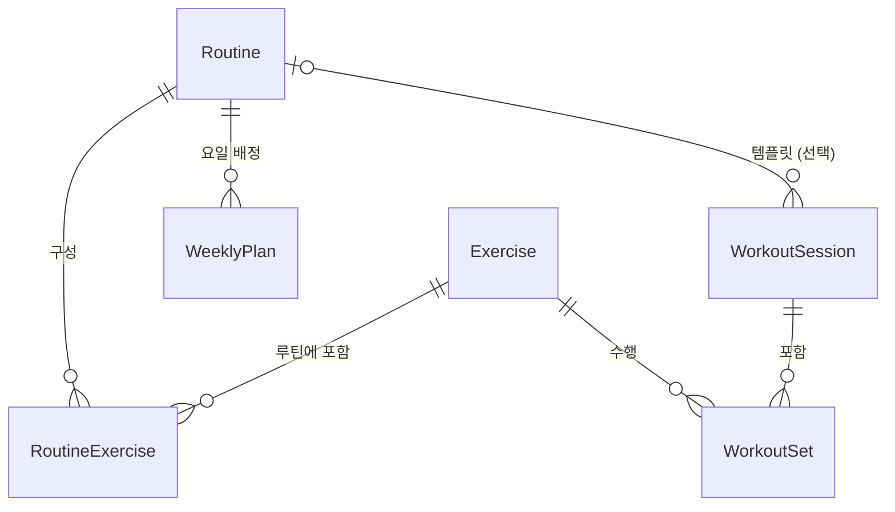
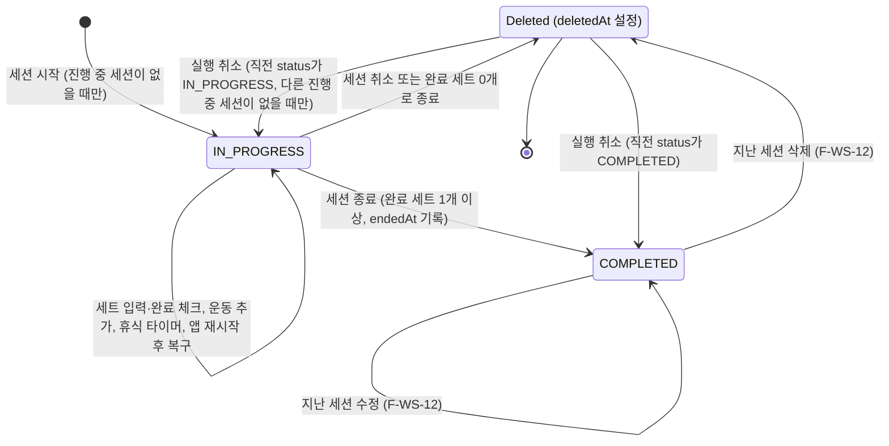

# 헬스 플래너 데이터 모델·도메인 규칙 v1.1

- 작업: FP-12 (상위: FP-11 헬스 플래너 MVP 기능 상세 명세)
- 작성일: 2026-10-01
- 버전: **v1.1** (파일 이름은 `data-model-v1.md`를 유지한다)
- 상태: 초안
- 개정 이력
  - 2026-10-01 (FP-25): I-14 — 1.2절 소수 규칙을 '저장·계산은 반올림하지 않음, 표시 형식은 IA 5.1절'로 수정
  - 2026-10-01 (FP-26, **v1.1**): [명세 인덱스 6장](../../2.feature/mvp-spec/README.md#6-문서-간-불일치-점검-결과)의 불일치 항목 반영
    - I-04 — 중량·횟수 범위 확정, 입력 스테퍼가 따라야 할 값(4.4절)
    - I-05 — 미완료 세트의 빈 입력값 정책(2.6절, 4.1절, 4.4절)
    - I-08 — BodyMeasurement 측정일 하한, 체지방량 + 골격근량 ≤ 체중(2.7절)
    - I-13 — 오류 클래스 목록(8.2절)
    - I-16 — 부위별 빈도 기간을 T7 기간 필터 기준으로(5.3절)
    - I-17 — 총 횟수·총 운동 시간·세션 시간 이름과 범위 정의(5.1절)
    - I-18 — 5장 머리말의 세션 요약 대상 정리
    - I-26 — 세션 `Deleted` 복원 전이(7.1절)
    - I-30 — 진행 중 세션이 있을 때 홈 시작 버튼 처리(7.2절)
    - I-36 — 5.3절 예시의 플랭크 보조 부위
    - 기능 명세에 주는 영향은 [11장](#11-개정-영향-v11)에 모았다.
- 기준 문서
  - [사전조사 종합 요약 및 의사결정](../pre-research-summary.md) 4장(로컬 우선 아키텍처, Repository·Dexie), 7장(미결정 사항), 8장(상충 사항 결론)
  - [기능 정의서 및 MVP 범위](../../2.feature/feature-definition.md) 2.4절(계산 규칙), 6장(개념 데이터 모델), 7장(확장 대비 원칙)

이 문서는 MVP 구현에서 쓰는 **엔티티 필드, Dexie 스키마, 도메인 규칙**을 확정한다.
기준 문서와 다르면 이 문서를 따르며, 바뀐 부분은 [10장](#10-기준-문서-대비-변경-사항)에 모았다.

---

## 1. 공통 규칙

### 1.1 공통 필드

모든 엔티티(8개)는 아래 필드를 가진다. 2장의 엔티티별 표에서는 이 필드를 다시 적지 않는다.

| 필드 | 타입 | 필수 | 범위·형식 | 기본값 | 설명 |
| --- | --- | --- | --- | --- | --- |
| `id` | `string` (UUID v7) | Y | RFC 9562 UUID v7, 소문자 | 생성 시 Repository가 부여 | PK. 기본 운동·Settings는 미리 만든 고정 UUID를 쓴다(C-2). |
| `createdAt` | `string` (ISO 8601 UTC) | Y | `YYYY-MM-DDTHH:mm:ss.sssZ` | 생성 시각 | 생성 후 바뀌지 않는다. |
| `updatedAt` | `string` (ISO 8601 UTC) | Y | 같은 형식, `>= createdAt` | 생성 시각 | 쓰기(soft delete 포함)마다 Repository가 갱신한다. 가져오기 병합의 LWW 기준이다. |
| `deletedAt` | `string \| null` (ISO 8601 UTC) | N | 같은 형식 | `null` | soft delete 시각. `null`이면 살아 있는 레코드다. |

### 1.2 값 표현 규칙

| 항목 | 규칙 |
| --- | --- |
| 시점 | `createdAt`, `updatedAt`, `deletedAt`, `startedAt`, `endedAt`, `completedAt`, `restTimerEndsAt`은 UTC ISO 8601 문자열(C-3). |
| 날짜 | `measuredOn`은 사용자 로컬 기준 `YYYY-MM-DD` 문자열(C-3). |
| 세션의 날짜 귀속 | 히스토리·캘린더·주간 집계에서 세션의 날짜는 `startedAt`을 로컬 시간대로 바꾼 날짜다. |
| 무게 단위 | 항상 kg으로 저장한다. lb 표시는 MVP 이후(Q-5). |
| 소수 | 저장 자릿수는 2장 필드별 범위를 따른다(무게·체중 등은 소수 둘째 자리까지). **저장·계산 과정에서는 반올림하지 않는다.** 화면 표시 형식(자릿수·반올림)은 [IA 5.1절](./ia-navigation.md#51-숫자-표시)을 따른다. |
| 열거값 | 표시 문자열이 아니라 코드값(대문자 스네이크)으로 저장한다. |
| 문자열 | 저장 전 앞뒤 공백을 제거한다. 선택 텍스트(`note`)는 비어 있으면 `''`로 저장한다(`null` 아님). |
| 불리언 | `true`/`false`만 쓴다. IndexedDB는 불리언을 인덱스 키로 쓸 수 없으므로 불리언 필드에는 인덱스를 두지 않는다. |

### 1.3 Soft delete 규칙

- 물리 삭제는 하지 않는다(MVP에서 purge 없음, Q-9).
- Repository의 기본 조회는 `deletedAt === null`인 레코드만 돌려준다. IndexedDB는 `null`을 인덱싱하지 않으므로 이 조건은 인덱스 조회 후 JS에서 거른다.
- 부모 삭제 시 연쇄 처리(같은 트랜잭션, 같은 `deletedAt` 값)

| 삭제 대상 | 함께 soft delete | 유지 |
| --- | --- | --- |
| Exercise (사용자 정의만) | 이 운동을 참조하는 RoutineExercise | WorkoutSet(과거 기록). 히스토리에서는 삭제된 운동 이름을 그대로 보여 준다. |
| Routine | 하위 RoutineExercise, 이 루틴을 가리키는 WeeklyPlan | 이 루틴으로 진행한 WorkoutSession |
| WorkoutSession | 하위 WorkoutSet | — |
| RoutineExercise, WeeklyPlan, WorkoutSet, BodyMeasurement | — | — |

- 기본 운동(`isCustom=false`)은 수정·삭제할 수 없다.

### 1.4 열거값

| 이름 | 값 | 비고 |
| --- | --- | --- |
| `MuscleGroup` | `CHEST`(가슴), `BACK`(등), `SHOULDERS`(어깨), `BICEPS`(이두), `TRICEPS`(삼두), `FOREARMS`(전완), `ABS`(복근), `QUADRICEPS`(대퇴사두), `HAMSTRINGS`(햄스트링), `GLUTES`(둔근), `CALVES`(종아리), `FULL_BODY`(전신), `CARDIO`(유산소) | T2 2.1절 분류 |
| `Equipment` | `BARBELL`(바벨), `DUMBBELL`(덤벨), `MACHINE`(머신), `CABLE`(케이블), `KETTLEBELL`(케틀벨), `BODYWEIGHT`(맨몸), `BAND`(밴드), `OTHER`(기타) | T2 2.1절 분류 |
| `TrackingType` | `WEIGHT_REPS`(중량×횟수), `REPS_ONLY`(횟수만), `DURATION`(시간) | 4장 |
| `SessionStatus` | `IN_PROGRESS`, `COMPLETED` | 7장 |
| `SetType` | `NORMAL`, `WARMUP` | `WARMUP` 입력 UI는 C(F-WS-05). 필드는 v1부터 둔다. |
| `WeightUnit` | `KG` | MVP는 `KG`만(Q-5) |

---

## 2. 엔티티 정의

관계는 T2 6.1절과 같고, 주간 계획만 `Routine.scheduledDays` 대신 **WeeklyPlan** 엔티티로 분리했다.



BodyMeasurement와 Settings는 다른 엔티티와 관계가 없다.

표의 "필수" 열: **Y**는 값이 항상 있어야 하고, **N**은 `null`(또는 빈 값)을 허용한다. 조건부 필수는 "조건"으로 적고 아래에 설명한다.

### 2.1 Exercise (운동 종목)

| 필드 | 타입 | 필수 | 범위·제약 | 기본값 | 설명 |
| --- | --- | --- | --- | --- | --- |
| `name` | `string` | Y | 1~50자. 살아 있는 운동끼리 대소문자·공백 무시 중복 불가 | — | 한국어 운동 이름 |
| `primaryMuscle` | `MuscleGroup` | Y | 1.4절 값 | — | 주 부위. 부위별 빈도의 집계 기준(5.3절) |
| `secondaryMuscles` | `MuscleGroup[]` | Y | 0~5개, 중복 불가, `primaryMuscle` 제외 | `[]` | 보조 부위. MVP 통계에는 쓰지 않는다(Q-1). |
| `equipment` | `Equipment` | Y | 1.4절 값 | — | 장비 |
| `trackingType` | `TrackingType` | Y | 1.4절 값. 변경 제한은 4.3절 | `WEIGHT_REPS` | 기록 유형 |
| `isCustom` | `boolean` | Y | 기본 운동 시드는 `false`, 사용자가 만든 운동은 `true` | `true` | 사용자 정의 여부 |

### 2.2 Routine (루틴)

| 필드 | 타입 | 필수 | 범위·제약 | 기본값 | 설명 |
| --- | --- | --- | --- | --- | --- |
| `name` | `string` | Y | 1~50자. 중복 허용 | — | 루틴 이름 |
| `note` | `string` | Y | 0~500자 | `''` | 루틴 설명 |

- 요일 배정은 WeeklyPlan(2.4절)에 저장한다. T2의 `scheduledDays`는 두지 않는다.

### 2.3 RoutineExercise (루틴 안의 운동 항목)

| 필드 | 타입 | 필수 | 범위·제약 | 기본값 | 설명 |
| --- | --- | --- | --- | --- | --- |
| `routineId` | `string` (UUID) | Y | 살아 있는 Routine | — | 소속 루틴 |
| `exerciseId` | `string` (UUID) | Y | 살아 있는 Exercise. 같은 루틴 안에서 중복 불가 | — | 운동 |
| `orderIndex` | `number` (정수) | Y | 0 이상, 루틴 안에서 0부터 연속 | 마지막 순서 + 1 | 루틴 안 운동 순서 |
| `targetSets` | `number` (정수) | Y | 1~20 | `3` | 목표 세트 수 |
| `targetReps` | `number \| null` (정수) | 조건 | 1~100. `WEIGHT_REPS`, `REPS_ONLY`일 때만 값, `DURATION`이면 `null` | `10` | 목표 횟수 |
| `targetWeight` | `number \| null` | N | 0~1000 kg. `WEIGHT_REPS`일 때만 값 허용, 그 외 `null` | `null` | 목표 중량(비우면 세션에서 이전 기록을 참고해 입력) |
| `targetDurationSec` | `number \| null` (정수) | 조건 | 1~3600초. `DURATION`일 때만 값, 그 외 `null` | `60` | 목표 시간 |
| `restSec` | `number \| null` (정수) | N | 10~600초 | `null` | 운동별 휴식 시간(F-RT-06, C). `null`이면 `Settings.defaultRestSec`를 쓴다. MVP UI에서는 입력하지 않는다. |

- 목표 필드의 사용 규칙은 Exercise의 `trackingType`을 따른다(4.1절 표와 같은 원칙).

### 2.4 WeeklyPlan (요일별 루틴 배정)

요일 하나에 루틴 하나를 배정한 레코드다. 주간 계획은 살아 있는 WeeklyPlan 레코드(최대 7개)의 모음이다.

| 필드 | 타입 | 필수 | 범위·제약 | 기본값 | 설명 |
| --- | --- | --- | --- | --- | --- |
| `dayOfWeek` | `number` (정수) | Y | 0~6 (`0=일`, 6.1절). 살아 있는 레코드끼리 중복 불가 | — | 요일 |
| `routineId` | `string` (UUID) | Y | 살아 있는 Routine | — | 배정한 루틴 |

- **한 요일에는 루틴 1개만** 배정한다. 홈(S-01)의 "오늘 루틴"이 하나로 정해지도록 하기 위해서다. 같은 요일에 다른 루틴을 배정하면 기존 레코드의 `routineId`를 바꾼다.
- 배정 해제는 해당 레코드를 soft delete한다.
- 같은 루틴을 여러 요일에 배정할 수 있다.
- 주차별로 다른 계획(주기화)이나 한 요일 여러 루틴은 MVP 범위가 아니다. 필요해지면 `weekIndex` 등을 추가한다.

### 2.5 WorkoutSession (운동 세션)

| 필드 | 타입 | 필수 | 범위·제약 | 기본값 | 설명 |
| --- | --- | --- | --- | --- | --- |
| `routineId` | `string \| null` (UUID) | N | Routine(삭제된 루틴도 가능) | `null` | 루틴 기반이면 루틴 id, 빈 세션이면 `null` |
| `status` | `SessionStatus` | Y | 7장 상태 전이를 따른다. `IN_PROGRESS`는 전체에서 최대 1개(7.2절) | `IN_PROGRESS` | 세션 상태 |
| `startedAt` | `string` (ISO UTC) | Y | 현재 시각 이하 | 시작 시각 | 세션 시작 시각. 날짜 귀속 기준 |
| `endedAt` | `string \| null` (ISO UTC) | 조건 | `COMPLETED`면 필수이고 `>= startedAt`. `IN_PROGRESS`면 `null` | `null` | 종료 시각 |
| `note` | `string` | Y | 0~1000자 | `''` | 세션 메모(F-WS-09, C) |
| `restTimerEndsAt` | `string \| null` (ISO UTC) | N | `IN_PROGRESS`일 때만 값. `COMPLETED`면 `null` | `null` | 진행 중 휴식 타이머의 종료 예정 시각. 앱 재시작 시 남은 시간을 다시 계산한다(R-5, F-WS-11). |

- 세션 시간 = `endedAt - startedAt`.

### 2.6 WorkoutSet (세트 기록)

| 필드 | 타입 | 필수 | 범위·제약 | 기본값 | 설명 |
| --- | --- | --- | --- | --- | --- |
| `sessionId` | `string` (UUID) | Y | WorkoutSession | — | 소속 세션 |
| `exerciseId` | `string` (UUID) | Y | Exercise | — | 운동 |
| `exerciseOrder` | `number` (정수) | Y | 0 이상. 같은 세션·같은 운동의 세트는 같은 값 | — | 세션 안 운동 순서 |
| `setOrder` | `number` (정수) | Y | 0 이상, 운동 안에서 0부터 연속 | 마지막 순서 + 1 | 운동 안 세트 순서 |
| `setType` | `SetType` | Y | `NORMAL` \| `WARMUP` | `NORMAL` | 세트 유형 |
| `weight` | `number \| null` | 조건 | 0~1000 kg, 소수 둘째 자리까지. **미완료 세트: `null` 또는 0~1000**(0은 유효한 값으로 그대로 저장). 완료 세트(`WEIGHT_REPS`): 0~1000 필수 | 4.1절 | 중량 |
| `reps` | `number \| null` (정수) | 조건 | 1~1000. **미완료 세트: `null` 또는 1~1000**(0은 저장하지 않고 `null`로 정규화). 완료 세트(`WEIGHT_REPS`, `REPS_ONLY`): 1~1000 필수 | 4.1절 | 횟수 |
| `durationSec` | `number \| null` (정수) | 조건 | 1~86400초. **미완료 세트: `null` 또는 1~86400**(0은 저장하지 않고 `null`로 정규화). 완료 세트(`DURATION`): 1~86400 필수 | 4.1절 | 수행 시간 |
| `rpe` | `number \| null` | N | 6~10, 0.5 단위 | `null` | 체감 강도(F-WS-04, S). 모든 기록 유형에서 선택 입력 |
| `isCompleted` | `boolean` | Y | — | `false` | 완료 체크 여부 |
| `completedAt` | `string \| null` (ISO UTC) | 조건 | `isCompleted=true`면 필수, `false`면 `null` | `null` | 완료 체크 시각. 이전 기록 조회 인덱스에 쓴다(3.2절). |

- `weight`, `reps`, `durationSec`의 필수·`null` 규칙은 4.1절 표를 따른다. 기록 유형 밖 필드는 완료 여부와 관계없이 항상 `null`이다.
- **빈 입력값 정책 (v1.1, I-05)**: 미완료 세트는 아직 입력하지 않은 칸을 `null`로 둔다. `reps`·`durationSec`에 0이 들어오면 Repository가 `null`로 바꿔 저장한다(0은 저장하지 않는다). 따라서 저장된 `reps`·`durationSec`는 항상 `null` 또는 1 이상이다. 완료 체크(`isCompleted=true`) 때 필수 필드가 `null`이면 저장을 거부한다(`SetValidationError`, 8.2절).
- 거리(distance) 필드는 두지 않는다. 유산소는 `DURATION`으로 기록한다.

### 2.7 BodyMeasurement (체중·체성분 측정)

| 필드 | 타입 | 필수 | 범위·제약 | 기본값 | 설명 |
| --- | --- | --- | --- | --- | --- |
| `measuredOn` | `string` (`YYYY-MM-DD`) | Y | `2000-01-01` 이상, 오늘(로컬) 이하. 살아 있는 레코드끼리 같은 날짜 중복 불가 | 오늘(로컬) | 측정일 |
| `weightKg` | `number` | Y | 20~300 kg, 소수 둘째 자리까지 | — | 체중 |
| `bodyFatPercent` | `number \| null` | N | 1~75 %, 소수 첫째 자리까지 | `null` | 체지방률 |
| `skeletalMuscleKg` | `number \| null` | N | 5~100 kg, `weightKg` 이하. 체지방량과의 합도 `weightKg` 이하(아래) | `null` | 골격근량 |
| `note` | `string` | Y | 0~200자 | `''` | 측정 메모(F-BM-05, C) |

- **하루 1건**만 저장한다. 같은 날짜로 저장하려 하면 기존 기록을 수정하도록 안내한다.
- 체지방량은 저장하지 않고 계산한다(5.4절, C-1).
- **측정일 하한 (v1.1, I-08)**: `measuredOn >= '2000-01-01'`. 연도 오입력(예: `0226`)을 막기 위한 값이다(T8 V-3).
- **체성분 합계 (v1.1, I-08)**: `bodyFatPercent`와 `skeletalMuscleKg`가 둘 다 있으면 `weightKg × bodyFatPercent / 100 + skeletalMuscleKg <= weightKg`여야 한다(T8 V-10). 체지방과 골격근은 겹치지 않는 체성분이므로 합이 체중을 넘을 수 없다. 계산 중에는 반올림하지 않는다(1.2절). 둘 중 하나라도 `null`이면 검사하지 않는다.
- 두 규칙은 Zod 스키마(폼·가져오기)와 `BodyMeasurementRepository.save()`가 함께 검사한다(8.1절).

### 2.8 Settings (앱 설정)

레코드가 하나뿐인 엔티티다. `id`는 코드에 상수로 둔 고정 UUID(`SETTINGS_ID`)를 쓰고, 앱 첫 실행 시 기본값으로 만든다. 만드는 시점·실패 처리는 [앱 시작 순서](./app-lifecycle.md#2-시작-순서) 2단계(Settings 확보)를 따른다.

| 필드 | 타입 | 필수 | 범위·제약 | 기본값 | 설명 |
| --- | --- | --- | --- | --- | --- |
| `defaultRestSec` | `number` (정수) | Y | 10~600초 | `90` | 휴식 타이머 기본 시간(2.2절 결론, C-7) |
| `weightUnit` | `WeightUnit` | Y | `KG`만 | `KG` | 표시 단위(Q-5) |
| `weekStartsOn` | `number` (정수) | Y | MVP는 `1`(월요일) 고정, 변경 UI 없음 | `1` | 주 시작 요일 표시(Q-3, 6장) |

- Settings는 soft delete하지 않는다(`deletedAt`은 항상 `null`).

---

## 3. Dexie 스키마와 인덱스

### 3.1 스키마 v1

```ts
// src/data/dexie/db.ts (초안)
export const SCHEMA_VERSION = 1;

db.version(SCHEMA_VERSION).stores({
  exercises:        'id, name, primaryMuscle, equipment, *secondaryMuscles, updatedAt',
  routines:         'id, updatedAt',
  routineExercises: 'id, routineId, exerciseId, updatedAt',
  weeklyPlans:      'id, dayOfWeek, routineId, updatedAt',
  workoutSessions:  'id, status, startedAt, routineId, updatedAt',
  workoutSets:      'id, sessionId, exerciseId, [exerciseId+completedAt], updatedAt',
  bodyMeasurements: 'id, measuredOn, updatedAt',
  settings:         'id',
});
```

- PK는 모든 테이블에서 `id`(UUID 문자열, 자동 증가 아님)다.
- Dexie 버전 번호를 `schemaVersion`으로 쓰고, JSON 내보내기 파일에도 같은 값을 넣는다. 스키마가 바뀌면 `db.version(2).stores(...).upgrade(...)`로 올린다. 버전 올림 절차·업그레이드 함수 규칙·테스트 방법·업그레이드 실패 처리는 [앱 수명주기 5장](./app-lifecycle.md#5-스키마-마이그레이션)을 따른다.

### 3.2 인덱스 용도

| 테이블 | 인덱스 | 쓰는 곳 |
| --- | --- | --- |
| exercises | `name` | 이름 정렬·중복 검사 |
| exercises | `primaryMuscle`, `equipment` | 라이브러리 필터(F-EX-02, 03), 부위별 빈도 |
| exercises | `*secondaryMuscles` (multiEntry) | 보조 부위 필터(확장 대비) |
| routineExercises | `routineId` | 루틴 편집 화면, 세션 시작 시 목표 세트 복사 |
| routineExercises | `exerciseId` | 운동 삭제 연쇄, 기록 유형 변경 가능 여부(4.3절) |
| weeklyPlans | `dayOfWeek` | 오늘 루틴 조회(S-01), 요일 중복 검사 |
| weeklyPlans | `routineId` | 루틴 삭제 연쇄 |
| workoutSessions | `status` | 진행 중 세션 조회·1개 제한(7.2절) |
| workoutSessions | `startedAt` | 히스토리 목록, 기간 통계 |
| workoutSets | `sessionId` | 세션 화면·세션 상세, 세션 삭제 연쇄 |
| workoutSets | `exerciseId` | 기록 유형 변경 가능 여부(4.3절), 운동별 히스토리 |
| workoutSets | `[exerciseId+completedAt]` | 이전 기록 표시(F-WS-08), 운동별 히스토리·1RM 추이(F-ST-03, 05) |
| bodyMeasurements | `measuredOn` | 기간별 그래프, 날짜 중복 검사 |
| 모든 테이블 | `updatedAt` | 가져오기 병합(LWW), 확장 시 증분 동기화 |

### 3.3 이전 기록 조회 (`[exerciseId+completedAt]`)

- `completedAt`이 `null`인 세트(미완료)는 IndexedDB가 복합 인덱스에 넣지 않으므로, 이 인덱스에는 **완료한 세트만** 들어간다.
- 조회 방법: `exerciseId`가 같은 범위를 `completedAt` 역순으로 읽어, 아래 조건을 만족하는 첫 세트의 `sessionId`를 찾고 그 세션에서 같은 운동의 완료 세트를 `setOrder` 순으로 가져온다.
  - `deletedAt === null`
  - 현재 진행 중 세션의 세트가 아님(`sessionId !== currentSessionId`)

```ts
const latest = await db.workoutSets
  .where('[exerciseId+completedAt]')
  .between([exerciseId, Dexie.minKey], [exerciseId, Dexie.maxKey])
  .reverse()
  .filter((s) => s.deletedAt === null && s.sessionId !== currentSessionId)
  .first();
```

---

## 4. 기록 유형(trackingType)

### 4.1 유형별 WorkoutSet 필드 규칙

| trackingType | 용도 예 | `weight` | `reps` | `durationSec` |
| --- | --- | --- | --- | --- |
| `WEIGHT_REPS` | 벤치프레스, 스쿼트, 가중 풀업 | **필수** (0~1000) | **필수** (1~1000) | **null** |
| `REPS_ONLY` | 맨몸 풀업, 푸시업, 크런치 | **null** | **필수** (1~1000) | **null** |
| `DURATION` | 플랭크, 러닝머신, 실내 자전거 | **null** | **null** | **필수** (1~86400) |

- **필수**는 `isCompleted=true`로 저장할 때 값이 있어야 한다는 뜻이다. 미완료 세트(`isCompleted=false`)는 필수 필드가 비어(`null`) 있어도 된다(세션 시작 시 목표값이 없는 칸).
- 미완료 세트의 `reps`·`durationSec`에 0이 들어오면 `null`로 정규화해 저장한다. `weight`의 0은 유효한 값이므로 그대로 저장한다(2.6절 빈 입력값 정책, v1.1).
- **null** 필드는 완료 여부와 관계없이 항상 `null`이다. Repository와 Zod 스키마가 둘 다 검사한다.
- `WEIGHT_REPS`의 `weight=0`은 허용한다(빈봉 없는 머신 최소 단계 등). 0kg 세트는 볼륨 0, 1RM 계산 제외(5.2절).
- 맨몸 운동에 중량을 더하는 경우(가중 딥스 등)는 별도 운동을 `WEIGHT_REPS`로 만든다. `weight`에는 추가 중량만 넣는다.
- 유산소 거리(distance)는 기록하지 않는다.

### 4.2 세션 시작 시 미리 채우기

루틴 기반 세션 시작(F-WS-01) 시 RoutineExercise마다 `targetSets`개의 미완료 WorkoutSet을 만든다.

| trackingType | `weight` | `reps` | `durationSec` |
| --- | --- | --- | --- |
| `WEIGHT_REPS` | `targetWeight` (`null`이면 `null`) | `targetReps` | `null` |
| `REPS_ONLY` | `null` | `targetReps` | `null` |
| `DURATION` | `null` | `null` | `targetDurationSec` |

### 4.3 기록 유형 변경 금지

- 사용자 정의 운동의 `trackingType`은 **이 운동을 참조하는 WorkoutSet 또는 RoutineExercise가 하나라도 있으면 바꿀 수 없다.** soft delete된 레코드도 참조로 센다(가져오기·동기화로 다시 살아날 수 있기 때문).
- 이유: 기존 세트의 `weight`/`reps`/`durationSec` 값이 새 유형의 규칙(4.1절)과 맞지 않게 되고, 볼륨·1RM 이력이 끊긴다.
- 운동 편집 화면(S-04)은 참조가 있으면 기록 유형 선택을 비활성화하고 "기록이 있는 운동은 기록 유형을 바꿀 수 없습니다. 새 운동을 추가하세요."를 보여 준다.
- 기본 운동(`isCustom=false`)은 필드 전체가 수정 불가다.
- Repository의 `ExerciseRepository.save()`도 같은 검사를 하고, 위반 시 `TrackingTypeLockedError`를 던진다(UI 우회 방지).

### 4.4 입력 범위와 스테퍼가 따라야 할 값 (v1.1, I-04·I-05)

**I-04 확정: 저장 범위는 v1 그대로 중량 0~1000 kg, 횟수 1~1000회, 시간 1~86400초다.** 세트 입력 UI(`NumberStepper`, `DurationInput`)는 이 범위의 값을 모두 입력·표시할 수 있어야 한다. 가져오기로 들어온 1000 kg·1000회 세트가 편집 화면에서 잘리면 안 되기 때문이다.

| 필드 | 저장 범위 (2.6절) | 스테퍼 min | 스테퍼 max | step | 빈 칸 | 0 입력 |
| --- | --- | --- | --- | --- | --- | --- |
| `weight` | 0~1000 kg, 소수 둘째 자리 | 0 | **1000** | 2.5 | 허용(`null`) | 유효 값 0으로 저장 |
| `reps` | 1~1000 (정수) | 0 | **1000** | 1 | 허용(`null`) | `null`로 저장(빈 칸으로 표시). 이 상태로는 완료할 수 없다 |
| `durationSec` | 1~86400초 (정수) | 0:00 | **1440:00** (86400초) | 15초 | 허용(`null`) | `null`로 저장(빈 칸으로 표시). 이 상태로는 완료할 수 없다 |
| `RoutineExercise.targetWeight` | 0~1000 kg | 0 | **1000** | 2.5 | 허용(`null`) | 유효 값 0 |

- 1000은 step 2.5의 배수이므로 스테퍼 `+`로 도달할 수 있다. v1 명세의 max `999.75`(중량), `999`(횟수)는 이 표의 값으로 바꾼다(11장).
- 스테퍼 min을 0으로 두는 것은 입력 편의(`-`를 눌러 0을 지나 비우는 동작) 때문이다. 저장 값은 위 "0 입력" 열을 따른다.
- 완료 체크 시 검증: `WEIGHT_REPS`는 `weight` 0~1000 + `reps` 1~1000, `REPS_ONLY`는 `reps` 1~1000, `DURATION`은 `durationSec` 1~86400. 위반이면 UI는 완료를 막고, Repository는 `SetValidationError`를 던진다.
- IA 3.1절 `NumberStepper` 항목별 설정과 T6 2.1절 입력칸 표의 수정은 후속 작업에서 한다(11장).

---

## 5. 계산 규칙

모든 통계 값은 저장하지 않고 WorkoutSet에서 계산한다(T2 6.3절). 계산 대상 세트의 공통 조건(**집계 대상 세트**)은 다음과 같다.

- `deletedAt === null`이고 `isCompleted === true`
- `setType === 'NORMAL'` (워밍업 제외)
- 소속 세션이 `deletedAt === null`이고 `status === 'COMPLETED'`
- 세션 요약(S-10)은 **방금 종료한 그 세션**(`COMPLETED`)의 집계 대상 세트로 계산한다. S-10은 `COMPLETED` 세션만 열리므로 진행 중 세션의 요약 화면은 없다(v1.1, I-18).

### 5.1 세트 볼륨과 세션 지표

```
세트 볼륨(kg) = weight × reps        (trackingType = WEIGHT_REPS 인 집계 대상 세트만)
세션·주간·운동별 볼륨 = 해당 범위 세트 볼륨의 합
```

- `REPS_ONLY`, `DURATION` 세트는 볼륨에 넣지 않는다. 세션 요약에서는 대신 아래 표의 **총 횟수**, **총 운동 시간**을 따로 보여 준다.

지표 정의 (v1.1, I-17). S는 그 세션의 집계 대상 세트다. 이름이 겹치지 않도록 아래 이름만 쓴다.

| 지표 | 계산식 | 대상 | 비고 |
| --- | --- | --- | --- |
| 볼륨 | `Σ weight × reps` (s ∈ S) | `WEIGHT_REPS` 세트만 | kg |
| 총 횟수 | `Σ reps` (s ∈ S) | `REPS_ONLY` 세트만 | `WEIGHT_REPS`의 횟수는 더하지 않는다 |
| 총 운동 시간 | `Σ durationSec` (s ∈ S) | `DURATION` 세트만 | 초. 부위와 관계없이 기록 유형으로 정한다(플랭크 포함) |
| 세션 시간 | `endedAt − startedAt` (2.5절) | 세션 1개 | 세트와 무관한 경과 시간. 휴식·미완료 세트 시간 포함 |
| 세트 수 | `\|S\|` | 유형 무관 | |

- "총 시간"이라는 이름은 쓰지 않는다. 화면 표시 형식(자릿수·`mm:ss`·`N시간 M분`)은 IA 5.1·5.3절을 따른다.
- 예시 (한 세션)

| 운동 | 세트 | 볼륨 |
| --- | --- | --- |
| 벤치프레스 | 60 kg × 10 | 600 |
| 벤치프레스 | 60 kg × 8 | 480 |
| 벤치프레스 | 40 kg × 12 (WARMUP) | 제외 |
| 풀업 (REPS_ONLY) | 10회 | 제외 (총 횟수 10회로 별도 표시) |
| **합계** | | **1,080 kg** |

- 세션 요약(F-WS-10)의 세트 수 = 그 세션의 집계 대상 세트 수(유형 무관). 위 예에서는 3세트.

### 5.2 추정 1RM (Epley, Q-2 확정)

```
대상: WEIGHT_REPS, 집계 대상 세트, weight > 0, 1 ≤ reps ≤ 12
reps = 1  → 1RM = weight
reps 2~12 → 1RM = weight × (1 + reps / 30)
reps > 12 → 계산 제외
```

- **Q-2 확정: 12회 초과 세트는 1RM 계산에서 제외한다.**
- 세션별 추정 1RM = 그 세션에서 그 운동의 세트별 1RM 최댓값. 1RM 추이 그래프(F-ST-05)는 세션 날짜(1.2절)마다 이 값을 찍는다. 대상 세트가 없는 세션은 점을 찍지 않는다.
- 예시

| 세트 | 계산 | 1RM | 표시 |
| --- | --- | --- | --- |
| 100 kg × 1 | 100 | 100 | 100.0 kg |
| 100 kg × 5 | 100 × (1 + 5/30) | 116.666… | 116.7 kg |
| 80 kg × 12 | 80 × (1 + 12/30) | 112 | 112.0 kg |
| 60 kg × 15 | 12회 초과 | 제외 | — |

  → 이 세션의 벤치프레스 추정 1RM = **116.7 kg**

### 5.3 부위별 빈도 (Q-1 확정)

```
부위별 세트 수 = Σ 집계 대상 세트 1개당 해당 운동의 primaryMuscle에 +1
부위별 횟수   = Σ 같은 세트들의 reps (WEIGHT_REPS, REPS_ONLY만. DURATION은 횟수 없음)
```

- **Q-1 확정: 주 부위(`primaryMuscle`)만 세트당 1로 센다. 보조 부위(`secondaryMuscles`)는 반영하지 않는다.**
- 기간은 [T7](../../2.feature/mvp-spec/history-stats.md) 3.1절 기간 필터(`4w`, `12w`, `1y`, `all`)이며, 선택한 기간 전체의 합계 하나를 낸다. 세션은 세션 날짜(1.2절)로 기간에 넣는다. `4w`·`12w`는 월요일 시작 주(6장) 단위다. 월간·사용자 지정 기간은 MVP에 없다(v1.1, I-16).
- 예시 (`4w` 기간 안의 기록 일부)

| 운동 (주 부위 / 보조 부위) | 집계 대상 세트 | 반영 |
| --- | --- | --- |
| 벤치프레스 (CHEST / TRICEPS, SHOULDERS) | 4세트 × 8회 | CHEST +4세트, +32회 |
| 트라이셉스 푸시다운 (TRICEPS / —) | 3세트 × 12회 | TRICEPS +3세트, +36회 |
| 플랭크 (ABS / SHOULDERS, DURATION) | 2세트 | ABS +2세트, 횟수 없음 |

  → CHEST 4세트·32회, TRICEPS 3세트·36회, ABS 2세트. 벤치프레스의 보조 부위 TRICEPS·SHOULDERS, 플랭크의 보조 부위 SHOULDERS는 더하지 않는다.

### 5.4 체지방량 (C-1)

```
체지방량(kg) = weightKg × bodyFatPercent / 100      (bodyFatPercent가 null이면 계산하지 않음)
```

- 저장하지 않고 화면(S-14 그래프·목록)에서 계산한다.
- 예시: 체중 75.0 kg, 체지방률 18.5 % → 75.0 × 18.5 / 100 = 13.875 → **13.9 kg** 표시

---

## 6. 요일 규칙 (Q-3 확정)

- **Q-3 확정: 저장은 `0=일, 1=월, …, 6=토`, 표시는 월요일 시작이다.**
- 저장 값은 JS `Date.prototype.getDay()`, date-fns `getDay()`와 같다(로컬 시간 기준).
- 표시 순서는 `[1, 2, 3, 4, 5, 6, 0]` (월 화 수 목 금 토 일)이다.

```
표시 위치(0~6) = (dayOfWeek + 6) % 7
주의 시작일    = startOfWeek(date, { weekStartsOn: 1 })   // date-fns
```

| 저장 `dayOfWeek` | 0 | 1 | 2 | 3 | 4 | 5 | 6 |
| --- | --- | --- | --- | --- | --- | --- | --- |
| 요일 | 일 | 월 | 화 | 수 | 목 | 금 | 토 |
| 표시 위치 | 6 | 0 | 1 | 2 | 3 | 4 | 5 |

- 예시: 2026-10-01(목)은 `getDay()=4` → WeeklyPlan에서 `dayOfWeek=4` 레코드가 오늘 루틴이다. 표시 위치는 3, 이번 주는 2026-09-28(월) ~ 2026-10-04(일)이다.
- 주간 볼륨·부위별 빈도·주간 계획 완료 현황(F-RT-05)의 "주"는 모두 이 월~일 구간이다.

---

## 7. WorkoutSession 상태와 진행 중 세션

### 7.1 상태 전이



- `Deleted`는 `status` 값이 아니다. `status`는 마지막 값을 유지하고 `deletedAt`만 설정한다(하위 WorkoutSet 연쇄 soft delete).
- **복원 (v1.1, I-26)**: `Deleted`에서 나가는 전이는 `실행 취소`(IA 5.4절 토스트)뿐이며, 보존해 둔 `status`(직전 값)로 돌아간다. 다른 상태로 바꿔 되살리지 않는다.
- `COMPLETED → IN_PROGRESS`(세션 재개)는 허용하지 않는다.

| 전이 | 조건 | 처리 |
| --- | --- | --- |
| 시작 | 살아 있는 `IN_PROGRESS` 세션이 없음(7.2절) | `status=IN_PROGRESS`, `startedAt=now`. 루틴 기반이면 4.2절대로 미완료 세트 생성 |
| 세트 완료 체크 | 4.1절 필수 필드가 있음 | `isCompleted=true`, `completedAt=now`. 휴식 타이머 시작 시 `restTimerEndsAt = now + 휴식 시간` |
| 세트 완료 해제 | — | `isCompleted=false`, `completedAt=null` |
| 종료 | 완료 세트 1개 이상 | 미완료 세트는 사용자 확인 후 soft delete. `status=COMPLETED`, `endedAt=now`, `restTimerEndsAt=null` |
| 종료(완료 세트 0개) | 완료 세트 없음 | "기록된 세트가 없어 세션을 삭제합니다" 확인 후 세션 soft delete |
| 취소 | 사용자 확인 | 세션과 세트 soft delete |
| 지난 세션 수정 | `COMPLETED` | 세트 값 수정·추가·삭제. 새로 추가한 세트는 `isCompleted=true`, `completedAt=endedAt`. `startedAt`, `endedAt` 수정 가능(`endedAt >= startedAt`) |
| 복원(실행 취소) → `IN_PROGRESS` | 직전 `status=IN_PROGRESS`이고, 살아 있는 다른 `IN_PROGRESS` 세션이 없음(7.2절). 같은 `rw` 트랜잭션에서 검사 | 세션과, 세션과 **같은 `deletedAt` 값**을 가진 하위 WorkoutSet을 `deletedAt=null`, `updatedAt=now`로 되살린다(1.3절 연쇄 규칙의 역). `restTimerEndsAt`은 `null`로 둔다. 다른 진행 중 세션이 있으면 `SessionAlreadyInProgressError` |
| 복원(실행 취소) → `COMPLETED` | 직전 `status=COMPLETED` | 위와 같이 세션·하위 세트를 되살린다. 진행 중 세션 검사는 하지 않는다 |

- 따라서 `COMPLETED` 세션의 살아 있는 세트는 모두 `isCompleted=true`다.

### 7.2 진행 중 세션은 1개만 (Q-6 확정)

- **Q-6 확정: 살아 있는(`deletedAt === null`) `IN_PROGRESS` 세션은 전체에서 최대 1개다.**
- `SessionRepository.start()`는 하나의 `rw` 트랜잭션 안에서 `workoutSessions.where('status').equals('IN_PROGRESS')`를 조회하고, 살아 있는 세션이 있으면 `SessionAlreadyInProgressError`를 던진다.
- 세션 복원(7.1절 실행 취소)으로 `IN_PROGRESS` 세션을 되살릴 때도 `SessionRepository.restore()`가 같은 검사를 하고 `SessionAlreadyInProgressError`를 던진다.
- 홈(S-01)은 진행 중 세션이 있으면 "이어하기"와 "세션 취소"를 보여 주고, `운동 시작`·`빈 세션으로 시작` 버튼은 숨기지 않고 **비활성**으로 남겨 사유("진행 중인 운동이 있어요")를 표시한다([T5](../../2.feature/mvp-spec/routine-plan-home.md) 6.3.2절, v1.1, I-30).
- 앱 시작 시 `getInProgress()`로 진행 중 세션을 찾아 복구한다(F-WS-11). `restTimerEndsAt`이 현재보다 미래면 남은 시간으로 타이머를 다시 띄우고, 지났으면 `null`로 지운다. 시작 순서상 위치(4단계)와 실패 처리는 [앱 시작 순서](./app-lifecycle.md#2-시작-순서)를 따른다.
- JSON 가져오기(F-IO-02)
  - 덮어쓰기: 파일 내용을 그대로 쓴다. 파일 안에 살아 있는 `IN_PROGRESS` 세션이 2개 이상이면 검증 오류로 거부한다.
  - 병합(F-IO-05): 로컬에 진행 중 세션이 있으면 가져오기를 막고 먼저 종료·취소하도록 안내한다.

---

## 8. 검증 위치와 오류 클래스

### 8.1 검증 위치

| 규칙 | Zod 스키마 (폼·가져오기) | Repository (저장 시) |
| --- | --- | --- |
| 필드 타입·범위(2장) | O | — |
| trackingType별 필수·null 필드(4.1절) | O | O |
| 미완료 세트 `reps`·`durationSec`의 0 → `null` 정규화(2.6절) | — (가져오기는 0을 범위 오류로 거부) | O |
| BodyMeasurement 측정일 하한·체성분 합계(2.7절) | O | O |
| 이름·요일·측정일 중복 | — | O |
| 기록 유형 변경 금지(4.3절) | — | O |
| 진행 중 세션 1개(7.2절) | O (가져오기 파일 내부) | O |
| 상태 전이·복원(7.1절) | — | O |
| 공통 필드 부여·`updatedAt` 갱신·soft delete 연쇄 | — | O |

### 8.2 오류 클래스 (v1.1, I-13)

Repository가 도메인 규칙 위반 시 던지는 오류를 모은다. 화면은 클래스로 구분해 처리한다. 그 밖의 Dexie 오류(`QuotaExceededError` 등)는 IA 5.5절로 처리한다. Repository 메서드 이름은 각 기능 명세의 데이터 접근 인터페이스(초안)를 따르며, 명세에 이름이 없는 것은 이 표의 이름을 쓴다.

| 오류 클래스 | 던지는 Repository 메서드 | 조건 | 규칙 근거 | 처리를 정의한 문서 |
| --- | --- | --- | --- | --- |
| `TrackingTypeLockedError` | `ExerciseRepository.save()` | 참조(WorkoutSet·RoutineExercise, soft delete 포함)가 있는 운동의 `trackingType` 변경 | 4.3절 | T3 8.4절 |
| `SessionAlreadyInProgressError` | `SessionRepository.start()`, `SessionRepository.restore()` | 살아 있는 `IN_PROGRESS` 세션이 이미 있는데 새로 시작하거나 `IN_PROGRESS` 세션을 복원 | 7.1절, 7.2절 | T6 4.7.2절, 4.6.4절, T5 6.4절 |
| `DuplicateExerciseNameError` | `ExerciseRepository.save()` | 살아 있는 운동끼리 이름 중복(대소문자·공백 무시) | 2.1절 | T3 2.2절 |
| `ExerciseInUseError` | `ExerciseRepository.remove()` | 살아 있는 `IN_PROGRESS` 세션에 이 운동의 살아 있는 WorkoutSet이 있음 | 1.3절 | T3 7.3절 |
| `BuiltInExerciseReadOnlyError` | `ExerciseRepository.save()`, `ExerciseRepository.remove()` | `isCustom=false`(기본 운동) 수정·삭제 | 1.3절, 4.3절 | T3 7장, 10장 |
| `SessionNotInProgressError` | `SessionRepository.finish()`, `SessionRepository.cancel()` | 대상 세션이 살아 있는 `IN_PROGRESS`가 아님(이미 종료·삭제) | 7.1절 | T6 6장 |
| `SetValidationError` | `SetRepository.update()`, `SetRepository.complete()`, `SetRepository.addSet()` | 기록 유형별 필수·`null` 규칙(4.1절) 또는 범위(2.6절, 4.4절) 위반. 완료 시 필수 필드가 `null` | 2.6절, 4.1절, 4.4절 | T6 4.3.3절, 6장 |
| `DuplicateMeasuredOnError` | `BodyMeasurementRepository.save()` | 살아 있는 레코드끼리 `measuredOn` 중복 | 2.7절 | T8 3.1절 |

- v1에서는 `TrackingTypeLockedError`, `SessionAlreadyInProgressError`만 이 문서에 있었고 나머지 6개는 각 기능 명세에만 있었다. 이름 충돌은 없어 이름은 그대로 쓴다.

---

## 9. TypeScript 타입 (초안)

```ts
type UUID = string;
type IsoDateTime = string; // UTC ISO 8601
type LocalDate = string;   // YYYY-MM-DD

interface BaseEntity {
  id: UUID;
  createdAt: IsoDateTime;
  updatedAt: IsoDateTime;
  deletedAt: IsoDateTime | null;
}

interface Exercise extends BaseEntity {
  name: string;
  primaryMuscle: MuscleGroup;
  secondaryMuscles: MuscleGroup[];
  equipment: Equipment;
  trackingType: TrackingType;
  isCustom: boolean;
}

interface Routine extends BaseEntity { name: string; note: string; }

interface RoutineExercise extends BaseEntity {
  routineId: UUID;
  exerciseId: UUID;
  orderIndex: number;
  targetSets: number;
  targetReps: number | null;
  targetWeight: number | null;
  targetDurationSec: number | null;
  restSec: number | null;
}

interface WeeklyPlan extends BaseEntity { dayOfWeek: 0 | 1 | 2 | 3 | 4 | 5 | 6; routineId: UUID; }

interface WorkoutSession extends BaseEntity {
  routineId: UUID | null;
  status: SessionStatus;
  startedAt: IsoDateTime;
  endedAt: IsoDateTime | null;
  note: string;
  restTimerEndsAt: IsoDateTime | null;
}

interface WorkoutSet extends BaseEntity {
  sessionId: UUID;
  exerciseId: UUID;
  exerciseOrder: number;
  setOrder: number;
  setType: SetType;
  weight: number | null;
  reps: number | null;
  durationSec: number | null;
  rpe: number | null;
  isCompleted: boolean;
  completedAt: IsoDateTime | null;
}

interface BodyMeasurement extends BaseEntity {
  measuredOn: LocalDate;
  weightKg: number;
  bodyFatPercent: number | null;
  skeletalMuscleKg: number | null;
  note: string;
}

interface Settings extends BaseEntity {
  defaultRestSec: number;
  weightUnit: WeightUnit;
  weekStartsOn: 1;
}
```

---

## 10. 기준 문서 대비 변경 사항

| 항목 | 기준 문서 | 이 문서 | 이유 |
| --- | --- | --- | --- |
| 주간 계획 | T2: `Routine.scheduledDays: int[]` | WeeklyPlan 엔티티(요일당 1레코드) | 요일 중복 검사·배정 변경이 레코드 단위가 되어 LWW 병합 충돌 범위가 작아진다. 주기화 확장도 쉽다. |
| 기록 유형 이름 | T2: `REPS` | `REPS_ONLY` | 작업 정의(FP-12)의 명칭으로 통일 |
| 시간 필드 이름 | T2: `durationSeconds`, `restSeconds` | `durationSec`, `restSec` | 작업 정의(FP-12)의 명칭으로 통일 |
| 시간 목표값 | T2: 없음 | `RoutineExercise.targetDurationSec` 추가 | `DURATION` 운동의 목표를 루틴에 담기 위해 |
| `targetReps` | T2: 필수 `int` | `DURATION`이면 `null` | 기록 유형별 규칙(4.1절)과 맞춤 |
| 휴식 타이머 복구 | T2: 없음 | `WorkoutSession.restTimerEndsAt` 추가 | R-5 대응(종료 예정 시각 저장 후 재계산) |
| Settings | T2: 없음 | Settings 엔티티 추가 | 앱 전체 기본 휴식 시간(2.2절 결론), 단위·주 시작 요일 |
| 체성분 측정 | T2: 날짜 중복 규칙 없음 | 하루 1건 | 그래프의 날짜당 값이 하나로 정해지도록 |
| 미결정 사항 | Q-1·Q-2·Q-3·Q-6 기본안 | 확정 규칙으로 반영(5.2, 5.3, 6, 7.2절) | 사전조사 9장 제안 |

---

## 11. 개정 영향 (v1.1)

v1.1에서 바꾼 결정이 기능 명세·IA에 주는 영향이다. **이 문서에서는 영향만 적고, 실제 명세 수정은 후속 작업(T5 정합성 작업)에서 한다.**

| I- 번호 | v1.1 결정 (이 문서) | 영향받는 문서·절 | 필요한 수정 |
| --- | --- | --- | --- |
| I-04 | 중량 0~1000 kg, 횟수 1~1000회 유지. 스테퍼 max 1000(4.4절) | IA 3.1절 `NumberStepper` 항목별 설정 | 중량 max `999.75` → `1000`, 횟수 max `999` → `1000` |
| I-04 | 〃 | T6 2.1절 입력칸 표, 4.3.3절 검증 표 | 중량 `0~999.75` → `0~1000`, 횟수 "완료 시 1~999" → "완료 시 1~1000"(근거 T1 4.4절) |
| I-04 | 〃 | T5 4.2절 목표값 입력, 4.6절 검증 표 | `targetWeight` 스테퍼 max와 검증 범위 `0~999.75` → `0~1000` |
| I-05 | 미완료 세트는 `null` 허용, `reps`·`durationSec`의 0은 `null`로 정규화, 완료 시 1 이상 검증(2.6절) | T6 2.1절 입력칸 표 비고, 2.2절 즉시 저장 | 횟수·시간 칸에 0을 입력하면 `null`로 저장되고 빈 칸으로 표시된다고 명시. "0은 입력 가능하지만 완료할 수 없다" → "0은 빈 칸으로 저장되며 완료할 수 없다" |
| I-05 | 〃 | T6 4.3.3절 검증, 6장 `SetRepository.update()` | 0 → `null` 정규화와 완료 시 `SetValidationError` 조건 추가 |
| I-05 | 〃 | T9 3.3절 Zod `WorkoutSetSchema` | 미완료 세트 `reps`·`durationSec`는 `null` 또는 1 이상(0 거부), `weight`는 `null` 또는 0~1000. 완료 세트는 유형별 필수(4.1절) refine |
| I-08 | 측정일 `>= 2000-01-01`, 체지방량 + 골격근량 ≤ 체중(2.7절) | T8 2.3절 V-3·V-10, 7장 | 근거를 "T1 2.7절"로 바꾸고 "데이터 모델 v1 개정 시 반영" 문구 삭제 |
| I-08 | 〃 | T9 3.3절 Zod `BodyMeasurementSchema` | `measuredOn >= '2000-01-01'` 추가, refine에 V-10(체지방량 + 골격근량 ≤ 체중) 추가 |
| I-13 | 오류 클래스 8개를 8.2절에 모음 | T3 2.2절, 8.4절, T6 6장, T8 3.1절 | 오류 클래스 근거를 "T1 8.2절"로 표기. T3 `ExerciseInUseError`·`BuiltInExerciseReadOnlyError`의 메서드 이름 `ExerciseRepository.remove()` 반영 |
| I-16 | 부위별 빈도 기간은 T7 기간 필터(`4w`/`12w`/`1y`/`all`) | T7 5.2절 | 근거를 T1 5.3절로 표기(내용 변경 없음) |
| I-17 | 지표 이름: 총 횟수 / 총 운동 시간 / 세션 시간(5.1절) | T6 4.6.2절 요약 지표 표, 3.3절 S-10 와이어프레임 | "총 시간"(`endedAt − startedAt`) → "세션 시간", "유산소 총 시간" → "총 운동 시간" |
| I-17 | 〃 | IA 5.3절 시간 표시 형식 | `DURATION` 합계(총 운동 시간) 형식 `mm:ss`, 60분 이상 `h:mm:ss` 추가 |
| I-18 | 세션 요약(S-10)은 방금 종료한 그 세션(5장 머리말) | T6 4.6.2절 첫 문단 | "요약 화면은 해당 세션 자신을 포함" → "S-10은 방금 종료한 `COMPLETED` 세션" |
| I-26 | `Deleted → 직전 status` 복원 전이, `IN_PROGRESS` 복원 시 진행 중 세션 1개 검사(7.1절) | T6 4.6.4절, 6장 `SessionRepository.restore()` | 복원 조건·`SessionAlreadyInProgressError` 근거를 T1 7.1절로 표기. 6장 오류 타입에 `restore()`의 `SessionAlreadyInProgressError` 추가 |
| I-26 | 〃 | IA 5.4절 실행 취소 | 세션 실행 취소가 진행 중 세션 검사로 거부될 수 있음(토스트 "진행 중인 세션이 있어 되돌릴 수 없어요")을 공통 규칙에 추가 |
| I-30 | 홈은 시작 버튼을 비활성으로 남기고 사유 표시(7.2절) | T5 6.3.2절, T6 4.7.1절 | 동작(비활성 + 사유)은 두 문서 모두 이미 일치. 사유 문구만 T6 "진행 중인 운동을 먼저 끝내 주세요"를 T5 "진행 중인 운동이 있어요"로 통일 |
| I-36 | 5.3절 예시 플랭크 보조 부위 `ABS / SHOULDERS` | — | 없음(T4 시드와 일치, 집계 결과 변화 없음) |
