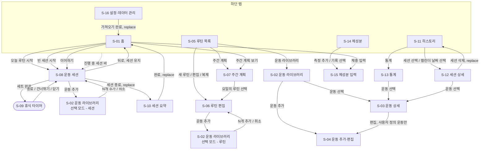

# 헬스 플래너 MVP 공통 UI·정보구조(IA)·내비게이션 명세

- 작업: FP-13 (상위: FP-11 헬스 플래너 MVP 기능 상세 명세)
- 작성일: 2026-10-01
- 상태: 초안
- 기준 문서
  - [기능 정의서 및 MVP 범위](../../2.feature/feature-definition.md) 5장 화면 목록(S-01~S-16)
  - [사전조사 종합 요약 및 의사결정](../pre-research-summary.md) ADR-004(shadcn/ui), ADR-005(React Router, date-fns), 8장 C-3(날짜 저장 규칙)

이 문서는 MVP 전체 화면이 함께 따르는 **정보구조, 내비게이션, 공통 컴포넌트, 와이어프레임 표기법, 공통 UX 규칙**을 정한다.
화면별 상세 명세 문서는 이 문서의 규칙을 따르고, 여기서 정한 내용은 반복하지 않는다. 화면별 문서와 이 문서가 다르면 이 문서를 고친 뒤 따른다.

Claude Design 시안(시각 디자인)은 이 문서에서 다루지 않는다.

---

## 1. 정보구조와 하단 탭

### 1.1 하단 탭 구성

탭은 5개이며 순서는 고정한다. 아이콘은 lucide-react(shadcn/ui 기본 아이콘 세트)를 쓴다.

| 순서 | 탭 | 탭 루트 화면 | 경로 | 아이콘(lucide) | 탭 안에서 진입하는 화면 |
| --- | --- | --- | --- | --- | --- |
| 1 | 홈 | S-01 홈(오늘) | `/` | `House` | S-08 운동 세션, S-09 휴식 타이머, S-10 세션 요약 (탭 바 숨김) |
| 2 | 루틴 | S-05 루틴 목록 | `/routines` | `ListChecks` | S-06 루틴 편집, S-07 주간 계획, S-02 운동 라이브러리, S-03 운동 상세, S-04 운동 추가·편집 |
| 3 | 히스토리 | S-11 히스토리 | `/history` | `CalendarDays` | S-12 세션 상세, S-13 통계 |
| 4 | 체성분 | S-14 체성분 | `/body` | `Scale` | S-15 체성분 입력 |
| 5 | 설정 | S-16 설정·데이터 관리 | `/settings` | `Settings` | — |

- **활성 탭은 URL 접두어로 정한다.** `/`·`/workout*` → 홈, `/routines*`·`/exercises*` → 루틴, `/history*` → 히스토리, `/body*` → 체성분, `/settings*` → 설정.
  - 히스토리·통계에서 S-03 운동 상세(`/exercises/:id`)로 들어가면 활성 탭이 루틴으로 바뀐다. S-03은 한 화면을 한 경로에 두기 위해 이 동작을 허용한다.
- **탭을 누르면 해당 탭 루트로 이동한다.** 탭별 내부 이동 기록은 보존하지 않는다(MVP 단순화).
- 이미 활성인 탭을 다시 누르면 탭 루트로 이동하고, 이미 루트면 맨 위로 스크롤한다.
- 진행 중 세션이 있으면 홈 탭 아이콘에 점 배지를 표시한다.

### 1.2 탭 바 표시 규칙

입력에 집중해야 하는 화면과 저장·취소로 끝나는 폼 화면은 탭 바를 숨긴다.

| 탭 바 | 화면 |
| --- | --- |
| 표시 | S-01, S-02(둘러보기 모드), S-03, S-05, S-07, S-11, S-12, S-13, S-14, S-16 |
| 숨김 | S-02(선택 모드), S-04, S-06, S-08, S-09(S-08 위 오버레이), S-10, S-15 |

### 1.3 반응형 레이아웃

Tailwind 기본 중단점을 쓴다. 기준 폭은 모바일 360px이다.

| 폭 | 내비게이션 | 콘텐츠 | 오버레이 |
| --- | --- | --- | --- |
| `< md` (768px 미만) | 하단 탭 바(높이 56px + 안전 영역) | 전체 폭, 좌우 여백 16px | 바텀시트(Drawer) |
| `md` ~ `lg` 미만 | 하단 탭 바 | 최대 폭 640px 가운데 정렬 | 가운데 다이얼로그(Dialog) |
| `≥ lg` (1024px 이상) | 왼쪽 사이드 내비게이션(폭 240px, 같은 5개 항목) | 최대 폭 720px, 사이드 내비 오른쪽 가운데 정렬 | 가운데 다이얼로그(Dialog) |

- 탭 바를 숨기는 화면(1.2절)도 `lg` 이상에서는 사이드 내비게이션을 그대로 보여준다. 단, S-08 운동 세션은 실수로 벗어나지 않도록 모든 폭에서 내비게이션을 숨긴다.
- 호버에만 의존하는 UI(호버로만 보이는 버튼, 툴팁에만 있는 정보)는 쓰지 않는다.

### 1.4 레이아웃 요소

모든 화면이 공유하는 틀이다. 컴포넌트 단위 정의는 3장을 따른다.

| 요소 | 위치 | 규칙 |
| --- | --- | --- |
| 상단 헤더 (`PageHeader`) | 화면 맨 위, 스크롤 시 고정 | 왼쪽: 뒤로 버튼(탭 루트에서는 없음). 가운데: 화면 제목(한 줄, 넘치면 말줄임). 오른쪽: 아이콘 액션 최대 2개, 넘치면 `더보기` 메뉴(DropdownMenu)로 묶는다. |
| 하단 고정 액션 영역 | 폼 화면(S-04, S-06, S-15) 맨 아래 | Primary "저장" 버튼 1개(전체 폭, 높이 48px). 키보드가 올라오면 키보드 위로 따라 올라온다. 취소는 헤더 뒤로 버튼이 대신한다. |
| 진행 중 세션 바 (`ActiveSessionBar`) | 탭 바 바로 위 | 진행 중(`IN_PROGRESS`) 세션이 있고 탭 바가 보이는 화면에서 표시한다(S-01은 화면 안 배너로 대신하므로 제외). 내용: 루틴 이름, 경과 시간(mm:ss), 휴식 타이머 동작 중이면 남은 시간. 누르면 S-08로 이동한다. |
| 토스트 영역 | 모바일: 탭 바(또는 하단 액션 영역) 위 8px. PC: 오른쪽 아래 | 3.5절 토스트 규칙을 따른다. |

---

## 2. 화면 이동

### 2.1 경로 표 (React Router)

S-01~S-16 전체 화면의 경로다. 경로 파라미터는 모두 UUID 문자열이다.

| ID | 화면 | 경로 | 탭 | 탭 바 | 검색 파라미터 / 진입 조건 | 비고 |
| --- | --- | --- | --- | --- | --- | --- |
| S-01 | 홈(오늘) | `/` | 홈 | 표시 | — | 앱 시작 화면 |
| S-02 | 운동 라이브러리 (둘러보기) | `/exercises` | 루틴 | 표시 | `?q=`(검색어), `?muscle=CHEST,BACK`, `?equipment=BARBELL` | 필터 상태는 URL에 둔다(2.5절) |
| S-02 | 운동 라이브러리 (선택 모드, 세션) | `/workout/exercises` | 홈 | 숨김 | 진행 중 세션이 있어야 함 | S-08의 **자식 라우트**. 부모 화면을 유지한 채 전체 화면으로 덮는다 |
| S-02 | 운동 라이브러리 (선택 모드, 루틴) | `/routines/new/exercises`, `/routines/:routineId/edit/exercises` | 루틴 | 숨김 | — | S-06의 **자식 라우트**. 편집 중인 폼 상태가 유지된다 |
| S-03 | 운동 상세 | `/exercises/:exerciseId` | 루틴 | 표시 | — | 삭제된 사용자 정의 운동도 과거 기록 링크로 열 수 있다(읽기 전용) |
| S-04 | 운동 추가·편집 | `/exercises/new`, `/exercises/:exerciseId/edit` | 루틴 | 숨김 | 편집은 `isCustom=true`인 운동만 | 기본 운동으로 `/edit` 진입 시 S-03으로 대체 이동 |
| S-05 | 루틴 목록 | `/routines` | 루틴 | 표시 | — | 탭 루트 |
| S-06 | 루틴 편집 | `/routines/new`, `/routines/:routineId/edit` | 루틴 | 숨김 | `?copyFrom=:routineId`(복제 시 원본) | 생성·편집 겸용 |
| S-07 | 주간 계획 | `/routines/plan` | 루틴 | 표시 | `?week=2026-09-28`(주 시작 월요일 날짜, 없으면 이번 주) | |
| S-08 | 운동 세션(진행) | `/workout` | 홈 | 숨김 | 진행 중 세션이 없으면 `/`로 대체 이동 + 정보 토스트 | 진행 중 세션은 1개만 허용(Q-6 기본안)이라 ID를 경로에 두지 않는다 |
| S-09 | 휴식 타이머 | 경로 없음 (S-08 `/workout` 위 바텀시트) | 홈 | 숨김 | 세트 완료 시 자동으로 열림 | 상태는 Zustand + DB(종료 예정 시각)로 관리한다. 닫아도 타이머는 계속 돈다 |
| S-10 | 세션 요약 | `/workout/summary/:sessionId` | 홈 | 숨김 | `COMPLETED` 세션만. 아니면 `/history`로 대체 이동 | S-08에서 세션 종료 시 **replace**로 진입(뒤로 가기로 S-08에 돌아가지 않음) |
| S-11 | 히스토리 | `/history` | 히스토리 | 표시 | `?view=list\|calendar`(기본 `list`), `?month=2026-10`(캘린더 표시 월) | 탭 루트 |
| S-12 | 세션 상세 | `/history/sessions/:sessionId` | 히스토리 | 표시 | — | 삭제된 세션이면 `/history`로 대체 이동 |
| S-13 | 통계 | `/history/stats` | 히스토리 | 표시 | `?range=4w\|12w\|1y\|all`(기본 `12w`) | |
| S-14 | 체성분 | `/body` | 체성분 | 표시 | `?range=1m\|3m\|1y\|all`(기본 `3m`) | 탭 루트 |
| S-15 | 체성분 입력 | `/body/new`, `/body/:measurementId/edit` | 체성분 | 숨김 | `?from=home`(홈에서 진입 시 저장 후 홈으로 복귀) | |
| S-16 | 설정·데이터 관리 | `/settings` | 설정 | 표시 | — | 내보내기·가져오기, 휴식 타이머 기본값(사전조사 2.2절) |
| — | 없는 경로 | `*` | — | — | — | `/`로 대체 이동 |

### 2.2 라우트 구성

`createBrowserRouter`를 기본으로 한다. 웹 호스팅(Q-10)이 SPA 폴백을 지원하지 않으면 `createHashRouter`로 바꾸며, 경로 자체는 그대로 둔다.

```ts
// 구조 예시 — 컴포넌트 이름은 구현 단계에서 확정
const routes: RouteObject[] = [
  {
    element: <AppLayout />,               // PageHeader 슬롯, BottomTabBar/사이드 내비, ActiveSessionBar, Toaster
    children: [
      { index: true, element: <HomePage /> },                                   // S-01
      { path: 'exercises', element: <ExerciseLibraryPage mode="browse" /> },    // S-02
      { path: 'exercises/new', element: <ExerciseFormPage /> },                 // S-04
      { path: 'exercises/:exerciseId', element: <ExerciseDetailPage /> },       // S-03
      { path: 'exercises/:exerciseId/edit', element: <ExerciseFormPage /> },    // S-04
      { path: 'routines', element: <RoutineListPage /> },                       // S-05
      { path: 'routines/plan', element: <WeeklyPlanPage /> },                   // S-07
      { path: 'routines/new', element: <RoutineEditPage />,                     // S-06
        children: [{ path: 'exercises', element: <ExercisePickerRoute target="routine" /> }] },  // S-02 선택
      { path: 'routines/:routineId/edit', element: <RoutineEditPage />,         // S-06
        children: [{ path: 'exercises', element: <ExercisePickerRoute target="routine" /> }] },  // S-02 선택
      { path: 'workout', element: <WorkoutPage />,                              // S-08 (+ S-09 시트)
        children: [{ path: 'exercises', element: <ExercisePickerRoute target="session" /> }] },  // S-02 선택
      { path: 'workout/summary/:sessionId', element: <SessionSummaryPage /> },  // S-10
      { path: 'history', element: <HistoryPage /> },                            // S-11
      { path: 'history/sessions/:sessionId', element: <SessionDetailPage /> },  // S-12
      { path: 'history/stats', element: <StatsPage /> },                        // S-13
      { path: 'body', element: <BodyPage /> },                                  // S-14
      { path: 'body/new', element: <BodyMeasurementFormPage /> },               // S-15
      { path: 'body/:measurementId/edit', element: <BodyMeasurementFormPage /> }, // S-15
      { path: 'settings', element: <SettingsPage /> },                          // S-16
      { path: '*', element: <Navigate to="/" replace /> },
    ],
  },
];
```

- **선택 모드 S-02는 부모의 자식 라우트**다. 부모(S-06, S-08)는 `<Outlet />`으로 선택 화면을 전체 화면 레이어로 덮어 그리고, 선택 결과는 `useOutletContext()`로 받은 콜백으로 넘긴다. 부모가 언마운트되지 않으므로 루틴 편집 폼(React Hook Form) 상태가 사라지지 않는다.
- 선택 모드 S-02와 둘러보기 S-02는 같은 컴포넌트(`ExerciseLibrary`)를 `mode` 값만 달리해 쓴다. 선택 모드에서는 여러 개를 체크하고 하단 Primary 버튼 "N개 추가"로 확정한다.

### 2.3 화면 이동 흐름

표기 규칙은 4.3절을 따른다. 사각형은 경로가 있는 화면, 둥근 사각형은 경로가 없는 오버레이다. 직전 화면으로 돌아가는 단순 뒤로 가기는 그리지 않는다.



| 화면 | 흐름도에 나오는 위치 |
| --- | --- |
| S-01, S-05, S-11, S-14, S-16 | 하단 탭 묶음 |
| S-02 | `LIB`(둘러보기), `PICK_S`·`PICK_R`(선택 모드) |
| S-03, S-04, S-06, S-07 | 루틴·계획 흐름 |
| S-08, S-09, S-10 | 운동 세션 흐름 |
| S-12, S-13 | 히스토리·통계 흐름 |
| S-15 | 체성분 흐름 |

### 2.4 뒤로 가기 규칙

| 상황 | 동작 |
| --- | --- |
| 헤더 뒤로 버튼 | 앱 안 이동 기록이 있으면 `navigate(-1)`, 없으면(딥 링크·새로고침) 2.1절 경로의 부모 경로로 이동한다. 예: `/history/sessions/:id` → `/history` |
| 오버레이가 열려 있음 | Android 뒤로 버튼·ESC는 **가장 위 오버레이부터 닫는다**(다이얼로그 → 바텀시트 → 선택 모드 S-02). 화면 이동은 하지 않는다 |
| 저장하지 않은 변경이 있는 폼(S-04, S-06, S-15) | React Router `useBlocker`로 막고 확인 다이얼로그 "변경 사항을 버릴까요?"(3.3절)를 띄운다 |
| S-08 운동 세션에서 뒤로 | 세션을 끝내지 않고 홈으로 이동한다. 세션은 진행 중으로 남고 진행 중 세션 바·홈 배너로 돌아올 수 있다 |
| S-10 세션 요약에서 뒤로 | 홈으로 이동한다(S-08로 돌아가지 않음) |
| 홈이 아닌 탭 루트에서 Android 뒤로 | 홈으로 이동한다 |
| 홈에서 Android 뒤로 | 앱을 종료한다(Capacitor `App.exitApp`). 웹에서는 브라우저 기본 동작 |

### 2.5 화면 상태를 어디에 두는가

| 종류 | 저장 위치 | 예 |
| --- | --- | --- |
| 공유·새로고침 후에도 유지되어야 하는 보기 조건 | URL 검색 파라미터 | 필터 칩 선택, 검색어, 기간, 목록/캘린더 전환, 표시 월·주 |
| 화면을 벗어나면 사라져도 되는 UI 상태 | 컴포넌트 상태 | 시트 열림, 펼침/접힘 |
| 화면 사이에서 유지되는 UI 상태 | Zustand | 휴식 타이머 표시 상태, 선택 모드 임시 선택 목록 |
| 데이터 | Dexie(`useLiveQuery`) | 세션, 세트, 루틴, 측정 기록, 휴식 타이머 종료 예정 시각 |

---

## 3. 공통 컴포넌트

모든 공통 컴포넌트는 shadcn/ui 컴포넌트를 조합해 만든다(ADR-004). shadcn/ui에 없는 것은 같은 디자인 토큰(Tailwind 테마 변수)으로 직접 만든다.
각 컴포넌트는 **입력(props), 출력(이벤트), 상태(기본/비활성/오류 + 컴포넌트별 추가 상태)** 를 정의한다.

| 컴포넌트 | shadcn/ui 기반 | 주요 사용 화면 |
| --- | --- | --- |
| 3.1 숫자 스테퍼 `NumberStepper` | `Button`, `Input` | S-06, S-08, S-15, S-16 |
| 3.2 바텀시트 `BottomSheet` | `Drawer`(vaul), `Dialog` | S-09, 필터·옵션 선택, 가져오기 방식 선택 |
| 3.3 확인 다이얼로그 `ConfirmDialog` | `AlertDialog` | 삭제, 변경 사항 버리기, 세션 종료, 가져오기 덮어쓰기 |
| 3.4 빈 상태 `EmptyState` | `Button` (본체는 직접 구현) | S-01, S-02, S-05, S-11, S-13, S-14 |
| 3.5 토스트 `toast()` | `Sonner` | 전 화면 |
| 3.6 필터 칩 `FilterChipGroup` | `ToggleGroup` | S-02, S-04, S-13, S-14 |

### 3.1 숫자 스테퍼 (`NumberStepper`)

중량·횟수·체중처럼 숫자를 자주 조금씩 바꾸는 입력에 쓴다. 가운데 입력칸에 직접 입력할 수도 있다.

```text
[-| 60 kg |+]
```

**입력(props)**

| prop | 타입 | 기본값 | 설명 |
| --- | --- | --- | --- |
| `value` | `number \| null` | — | 현재 값. `null`은 빈 칸 |
| `step` | `number` | `1` | `-`/`+` 한 번에 바뀌는 양 |
| `min` / `max` | `number` | `0` / `9999` | 허용 범위 |
| `precision` | `number` | `0` | 소수 자리 수. 직접 입력 값은 이 자리에서 반올림 |
| `unit` | `string` | `''` | 표시 단위(`kg`, `회`, `%`). 입력칸 안 오른쪽에 붙여 표시 |
| `placeholder` | `string` | — | 빈 칸일 때 회색 표시. 세션에서는 이전 기록 값(F-WS-08) |
| `label` | `string` | — | 접근성 이름. 화면에 라벨이 없어도 필수 |
| `disabled` | `boolean` | `false` | 비활성 |
| `error` | `string` | — | 오류 문구. 있으면 오류 상태 |
| `allowEmpty` | `boolean` | `false` | 빈 칸(`null`) 허용 여부. 선택 입력 항목(RPE, 체지방률 등)은 `true` |

**출력(이벤트)**

| 이벤트 | 시점 | 값 |
| --- | --- | --- |
| `onChange(value: number \| null)` | `-`/`+` 탭 즉시, 직접 입력은 blur 또는 Enter 시 | `min`~`max`로 자르고 `precision`으로 반올림한 값 |

**상태**

| 상태 | 조건 | 표시·동작 |
| --- | --- | --- |
| 기본 | — | 테두리 기본색. 버튼을 0.5초 이상 누르고 있으면 0.1초마다 반복 증감 |
| 포커스 | 입력칸 포커스 | 포커스 링 표시, 기존 값 전체 선택(바로 덮어쓰기), `inputMode="decimal"` 숫자 키패드 |
| 경계 | `value === min` 또는 `max` | 해당 방향 버튼만 비활성 |
| 비활성 | `disabled` | 입력칸과 두 버튼 모두 비활성, 흐리게 표시. 탭해도 반응 없음 |
| 오류 | `error` 있음, 또는 `allowEmpty=false`인데 빈 칸으로 blur | 빨간 테두리, 아래에 오류 문구, `aria-invalid="true"` + `aria-describedby`로 문구 연결. 값을 고치면 해제 |

**항목별 기본 설정** (화면 명세는 이 값을 따른다)

| 항목 | step | min | max | precision | unit |
| --- | --- | --- | --- | --- | --- |
| 중량 | 2.5 | 0 | 999.75 | 2 | kg |
| 횟수 | 1 | 0 | 999 | 0 | 회 |
| RPE | 0.5 | 6 | 10 | 1 | — |
| 목표 세트 수 | 1 | 1 | 20 | 0 | 세트 |
| 체중 | 0.1 | 20 | 300 | 1 | kg |
| 체지방률 | 0.1 | 1 | 70 | 1 | % |
| 골격근량 | 0.1 | 5 | 100 | 1 | kg |
| 휴식 시간 | 15초 | 0 | 600초 | 0 | mm:ss로 표시(5.3절) |

### 3.2 바텀시트 (`BottomSheet`)

현재 화면을 유지한 채 짧은 작업(옵션 선택, 휴식 타이머)을 할 때 쓴다. 화면 이동이 필요한 긴 작업에는 쓰지 않는다.
`md` 미만에서는 `Drawer`(아래에서 올라옴), `md` 이상에서는 `Dialog`(가운데)로 그린다.

**입력(props)**

| prop | 타입 | 기본값 | 설명 |
| --- | --- | --- | --- |
| `open` | `boolean` | — | 열림 여부(제어 컴포넌트) |
| `title` | `string` | — | 시트 제목. 필수(스크린리더 이름) |
| `description` | `string` | — | 제목 아래 보조 설명 |
| `children` | `ReactNode` | — | 본문 |
| `footer` | `ReactNode` | — | 하단 버튼 영역(선택) |
| `dismissible` | `boolean` | `true` | 드래그·배경 탭·ESC·뒤로 버튼으로 닫을 수 있는지 |
| `busy` | `boolean` | `false` | 처리 중. `true`이면 닫기와 footer 버튼을 막는다 |
| `error` | `string` | — | 본문 위 인라인 오류 문구 |

**출력(이벤트)**

| 이벤트 | 시점 |
| --- | --- |
| `onOpenChange(open: boolean)` | 아래로 드래그, 배경 탭, ESC, Android 뒤로, 닫기(X) 버튼으로 닫을 때 `false` |
| footer 버튼의 `onClick` | 시트 안 동작 확정. 성공하면 호출한 쪽이 `open=false`로 닫는다 |

**상태**

| 상태 | 조건 | 표시·동작 |
| --- | --- | --- |
| 기본 | `open=true` | 배경 어둡게, 포커스를 시트 안으로 가두고 닫히면 연 버튼으로 포커스를 돌린다(Radix 기본) |
| 비활성 | `busy=true` 또는 `dismissible=false` | 닫기 수단을 모두 막는다. footer Primary 버튼에 스피너, 나머지 버튼 비활성 |
| 오류 | `error` 있음 | 본문 위에 빨간 오류 문구(아이콘 + 텍스트, `role="alert"`). 시트는 닫지 않고 입력 값을 유지한다 |

- S-09 휴식 타이머는 `dismissible=true`이며, 닫아도 타이머는 계속 돌고 S-08 헤더에 남은 시간이 작게 표시된다.
- 시트 안에서 또 시트를 열지 않는다. 확인 다이얼로그만 위에 겹칠 수 있다.

### 3.3 확인 다이얼로그 (`ConfirmDialog`)

되돌리기 어렵거나 데이터를 버리는 동작 전에 쓴다. 언제 쓰는지는 5.4절을 따른다. 표기 예시는 4.5절 예시 2.

**입력(props)**

| prop | 타입 | 기본값 | 설명 |
| --- | --- | --- | --- |
| `open` | `boolean` | — | 열림 여부 |
| `title` | `string` | — | 질문형 제목. 예: "세션을 삭제할까요?" |
| `description` | `string` | — | 결과 설명. 무엇이 얼마나 사라지는지 구체적으로 쓴다 |
| `confirmLabel` | `string` | — | 동작 이름. "확인" 대신 "삭제", "버리기", "덮어쓰기"처럼 동사로 쓴다 |
| `cancelLabel` | `string` | `'취소'` | |
| `tone` | `'default' \| 'destructive'` | `'default'` | `destructive`면 확인 버튼을 빨간색으로 |
| `onConfirm` | `() => Promise<void>` | — | 확인 시 실행할 작업 |

**출력(이벤트)**

| 이벤트 | 시점 |
| --- | --- |
| `onConfirm()` | 확인 버튼. 성공하면 다이얼로그를 닫는다 |
| `onOpenChange(false)` | 취소 버튼, ESC, Android 뒤로. 배경 탭으로는 닫히지 않는다(AlertDialog 기본) |

**상태**

| 상태 | 조건 | 표시·동작 |
| --- | --- | --- |
| 기본 | `open=true` | `tone='destructive'`면 처음 포커스는 **취소** 버튼, 아니면 확인 버튼 |
| 비활성 | `onConfirm` 실행 중 | 두 버튼 비활성, 확인 버튼에 스피너. ESC·뒤로로 닫히지 않는다. 이중 실행 방지 |
| 오류 | `onConfirm`이 실패(예외) | 다이얼로그를 닫지 않고 설명 아래에 오류 문구를 표시한다. 확인 버튼 라벨을 "다시 시도"로 바꾼다 |

### 3.4 빈 상태 (`EmptyState`)

목록·그래프 자리에 보여줄 데이터가 없을 때, 또는 불러오기에 실패했을 때 그 자리를 채운다.

**입력(props)**

| prop | 타입 | 기본값 | 설명 |
| --- | --- | --- | --- |
| `variant` | `'empty' \| 'no-results' \| 'error'` | `'empty'` | 데이터 없음 / 검색·필터 결과 없음 / 불러오기 실패 |
| `icon` | lucide 아이콘 | variant별 기본 | |
| `title` | `string` | — | 한 줄 상태 설명 |
| `description` | `string` | — | 다음에 할 일 안내(선택) |
| `action` | `{ label: string; onClick: () => void; disabled?: boolean; disabledReason?: string }` | — | 다음 행동 버튼(선택) |

**출력(이벤트)**

| 이벤트 | 시점 |
| --- | --- |
| `action.onClick()` | 버튼 탭. `no-results`는 보통 "필터 초기화", `error`는 "다시 시도" |

**상태**

| 상태 | 조건 | 표시·동작 |
| --- | --- | --- |
| 기본 | `variant='empty'` 또는 `'no-results'` | 회색 아이콘 + 제목 + 설명 + 버튼. 영역 가운데 정렬 |
| 비활성 | `action.disabled=true` | 버튼 비활성, 버튼 아래에 `disabledReason` 표시. 예: 진행 중 세션이 있어 새 세션을 시작할 수 없음 |
| 오류 | `variant='error'` | 빨간 경고 아이콘, 제목 "불러오지 못했어요", 버튼 "다시 시도". `role="alert"` |

**화면별 문구** (화면 명세에서 바꾸려면 이 표를 고친다)

| 화면 | variant | 제목 | 버튼 |
| --- | --- | --- | --- |
| S-01 오늘 루틴 (주간 계획 미설정) | empty | 오늘 배정된 루틴이 없어요 | 주간 계획 보기 |
| S-01 오늘 루틴 (휴식일) | empty | 오늘은 휴식일이에요 | 주간 계획 보기 |
| S-01 오늘 루틴 (루틴 없음) | empty | 아직 루틴이 없어요 | 루틴 만들기 |
| S-02 | no-results | 조건에 맞는 운동이 없어요 | 필터 초기화 |
| S-05 | empty | 아직 루틴이 없어요 | 루틴 만들기 |
| S-07 | empty | 배정할 루틴이 없어요 | 루틴 만들기 |
| S-11 | empty | 아직 운동 기록이 없어요 | 운동 시작 |
| S-13 | empty | 통계를 낼 기록이 부족해요 | — |
| S-14 | empty | 측정 기록이 없어요 | 측정 추가 |

### 3.5 토스트 (`toast()`)

화면을 막지 않는 짧은 결과 알림이다. shadcn/ui `Sonner`를 쓰고, 화면 코드는 공통 래퍼 `notify.success / notify.error / notify.info`만 호출한다.

**입력(인자)**

| 인자 | 타입 | 기본값 | 설명 |
| --- | --- | --- | --- |
| `type` | `'success' \| 'error' \| 'info'` | — | 함수 이름으로 정해진다 |
| `message` | `string` | — | 한 줄(모바일 2줄 이내). "~했어요" 말투 |
| `action` | `{ label: '실행 취소' \| '다시 시도' \| string; onClick: () => void \| Promise<void> }` | — | 버튼 1개까지 |
| `duration` | `number`(ms) | success·info 3000, action 있음 5000, error 6000 | |

**출력(이벤트)**

| 이벤트 | 시점 |
| --- | --- |
| `action.onClick()` | 버튼 탭. 실행 후 토스트를 닫는다 |
| `onDismiss()` | 시간 만료, 스와이프, 닫기 버튼 |

**상태**

| 상태 | 조건 | 표시·동작 |
| --- | --- | --- |
| 기본 | success, info | 체크/정보 아이콘 + 문구. `aria-live="polite"` |
| 비활성 | `action.onClick` 실행 중 | 액션 버튼 비활성 + 스피너. 실행이 끝나면 토스트를 닫고 결과를 새 토스트로 알린다 |
| 오류 | error | 빨간 경고 아이콘 + 문구, 보통 "다시 시도" 액션 포함. `aria-live="assertive"` |

- 동시에 최대 3개까지 쌓고, 넘치면 오래된 것부터 닫는다.
- 토스트에만 중요한 정보를 두지 않는다. 오류가 계속되는 상태(예: 저장 안 된 세트)는 화면 안에도 표시한다(5.5절).
- 표기법: `<< 세션을 삭제했어요   [실행 취소] >>`

### 3.6 필터 칩 (`FilterChipGroup`)

목록을 거르는 조건(부위, 장비)과 짧은 단일 선택(기간)에 쓴다. `ToggleGroup`을 둥근 칩 모양으로 꾸민다. 칩이 넘치면 가로 스크롤한다(줄바꿈하지 않음).

```text
(*전체*) ( 가슴 ) (*등*) ( 하체 ) ~~
```

**입력(props)**

| prop | 타입 | 기본값 | 설명 |
| --- | --- | --- | --- |
| `options` | `{ value: string; label: string; disabled?: boolean }[]` | — | `value`는 코드값(`CHEST` 등, 기능 정의서 7.4절) |
| `type` | `'single' \| 'multiple'` | `'multiple'` | 단일/복수 선택 |
| `value` | `string \| string[]` | — | 선택 값(제어 컴포넌트). 보통 URL 검색 파라미터와 연결 |
| `allLabel` | `string` | — | 있으면 맨 앞에 "전체" 칩을 둔다(`multiple` 전용) |
| `label` | `string` | — | 그룹 접근성 이름. 예: "부위 필터" |
| `disabled` | `boolean` | `false` | 그룹 전체 비활성 |
| `error` | `string` | — | 오류 문구(입력 폼에서 필수 선택일 때) |

**출력(이벤트)**

| 이벤트 | 시점 | 값 |
| --- | --- | --- |
| `onChange(value)` | 칩 탭 즉시 | `multiple`에서 모두 해제하거나 "전체"를 누르면 빈 배열(= 전체) |

**상태**

| 상태 | 조건 | 표시·동작 |
| --- | --- | --- |
| 기본 | 미선택 칩 | 테두리만 있는 칩. `aria-pressed="false"` |
| 선택 | 선택된 칩 | 채운 배경 + 체크 아이콘(색만으로 구분하지 않음). `aria-pressed="true"` |
| 비활성 | `disabled` 또는 옵션별 `disabled` | 흐리게 표시, 탭 무시 |
| 오류 | `error` 있음 | 그룹 아래 빨간 오류 문구, 그룹에 `aria-invalid`·`aria-describedby`. 예: S-04 "주 부위를 하나 선택해 주세요" |

- 목록 필터로 쓸 때는 결과가 0건이어도 칩을 비활성으로 만들지 않고, 결과 영역에 `EmptyState(no-results)`를 보여준다.
- 목록/캘린더 전환(S-11)처럼 보기 방식을 바꾸는 것은 필터 칩이 아니라 `Tabs`(세그먼트)로 한다.

---

## 4. 와이어프레임 표기 규칙

화면별 명세 문서는 **와이어프레임을 마크다운 코드 블록 안의 ASCII 박스**로 그린다. 이미지·디자인 도구 시안은 명세에 넣지 않는다.

### 4.1 기본 규칙

- 코드 블록 언어는 `text`로 한다(```` ```text ````).
- **모바일 와이어프레임은 테두리를 포함해 40칸 폭**으로 그린다(360px 기준). PC 배치가 모바일과 크게 다를 때만 80칸 폭 PC 와이어프레임을 추가한다.
- 한글·전각 문자는 **2칸**, 영문·숫자·기호는 1칸으로 센다. 오른쪽 테두리 정렬은 이 기준으로 맞추되, 글꼴에 따라 어긋나는 것은 허용한다.
- 폭이 모호한 문자(`·`, `○`, `●`, `★`, `→`, 상자 그리기 문자 `┌─┐`, 이모지)는 쓰지 않는다. 테두리는 ASCII `+ - | =`만 쓴다.
- 실제 데이터처럼 보이는 예시 값을 넣는다(`72.4 kg`, `10월 1일 (목)`). 숫자·날짜는 5장 형식을 따른다.
- 설명이 필요한 요소에는 줄 끝에 `#번호`를 달고, 와이어프레임 바로 아래 **주석 표**에서 설명한다. 와이어프레임 안에 긴 설명 문장을 쓰지 않는다.
- 상태(로딩·빈 상태·오류·진행 중 세션 있음 등)에 따라 **배치가 바뀌면** 상태별로 따로 그린다. 문구나 활성 여부만 바뀌면 주석 표에 쓴다.

### 4.2 기호

| 기호 | 의미 |
| --- | --- |
| `+------+` 와 `\|` | 화면·영역 테두리. 안쪽의 `+------+` 줄은 영역 구분선 |
| `+======+` | 오버레이(바텀시트, 다이얼로그) 테두리 |
| `[ 텍스트 ]` | 일반 버튼 |
| `[[ 텍스트 ]]` | Primary 버튼. 한 화면(또는 한 오버레이)에 1개 |
| `[! 텍스트 ]` | 파괴적(destructive) 버튼 |
| `[- 텍스트 -]` | 비활성 버튼 |
| `<` | 헤더의 뒤로 버튼(줄 맨 앞) |
| `[...]` | 더보기 메뉴 버튼 |
| `>` | 항목 끝: 누르면 다음 화면으로 이동 |
| `[____]`, `[이름____]` | 텍스트 입력. 밑줄 앞 글자는 placeholder |
| `[-\| 60 kg \|+]` | 숫자 스테퍼(3.1절) |
| `[ 선택값 v]` | 드롭다운(Select) |
| `[v]` / `[ ]` | 체크됨(완료) / 체크 안 됨 |
| `( 텍스트 )` / `(*텍스트*)` | 필터 칩 미선택 / 선택(3.6절) |
| `*텍스트*` | 탭·세그먼트에서 선택된 항목 |
| `/// 설명 ///` | 차트·이미지 등 그래픽 영역 자리 |
| `<< 텍스트 >>` | 토스트(3.5절) |
| `! 텍스트` | 줄 맨 앞 `!`: 경고·오류 문구 |
| `~~` | 같은 형태 반복 또는 가로 스크롤로 이어짐(생략) |
| `#번호` | 주석 번호. 와이어프레임 아래 주석 표와 짝을 이룬다 |

### 4.3 Mermaid 사용 범위

| 용도 | 다이어그램 | 사용 |
| --- | --- | --- |
| 화면 이동 흐름 | `flowchart TD` | 사용. 화면 노드는 `영문ID[S-xx 화면명]`, 경로 없는 오버레이는 `영문ID([S-xx 화면명])`. 엣지 라벨은 사용자 동작. 직전 화면으로 돌아가는 단순 뒤로 가기는 생략하고, replace 이동은 라벨에 `replace`를 붙인다 |
| 화면·데이터 상태 전이 | `stateDiagram-v2` | 사용. 예: 세션 `IN_PROGRESS → COMPLETED`, 휴식 타이머 `실행 → 일시정지 → 종료` |
| 처리 순서 | `sequenceDiagram` | 사용. 예: 저장 실패·재시도, 가져오기 병합, 세션 복구 |
| 데이터 구조 | `erDiagram` | 사용. 기능 정의서 6장 모델을 바꾸거나 보충할 때 |
| 화면 배치(와이어프레임) | — | **사용하지 않는다.** 4.1절 ASCII 박스로 그린다 |
| 일정·간트 | — | 명세 문서에서는 쓰지 않는다 |

- 라벨에 괄호·콜론 등 특수 문자가 들어가면 `["..."]`처럼 큰따옴표로 감싼다. 줄바꿈은 `<br/>`.
- 한 다이어그램의 노드는 20개 안팎으로 유지한다. 넘치면 흐름별로 나눈다.

### 4.4 화면 명세 문서의 와이어프레임 절 형식

화면 명세 문서는 화면마다 아래 순서로 쓴다.

1. 화면 ID·이름, 경로(2.1절), 관련 기능 ID
2. 모바일 와이어프레임(`text` 코드 블록, 40칸)
3. 주석 표: `| # | 요소 | 동작·규칙 |`
4. 상태별 변형(배치가 달라지는 경우만 추가 와이어프레임)
5. 필요하면 PC 와이어프레임(80칸)과 Mermaid 다이어그램

### 4.5 예시

#### 예시 1. S-01 홈(오늘) — 모바일, 진행 중 세션 없음

```text
+--------------------------------------+
| 오늘 10월 1일 (목)                #1 |
+--------------------------------------+
| 오늘의 루틴                       #2 |
| 상체 A  (운동 5개, 18세트)           |
| [[           운동 시작            ]] |
| [ 빈 세션으로 시작 ]                 |
+--------------------------------------+
| 이번 주  2/4 완료                 #3 |
| 월  화  수  목  금  토  일           |
| v   v   -   *   -   o   -            |
| [ 주간 계획 보기 > ]                 |
+--------------------------------------+
| 최근 체중  72.4 kg (9월 29일)     #4 |
| [ + 체중 입력 ]                      |
+--------------------------------------+
| *홈*  루틴  히스토리  체성분  설정   |
+--------------------------------------+
```

| # | 요소 | 동작·규칙 |
| --- | --- | --- |
| 1 | 헤더 | 오늘 날짜(5.2절 형식). 탭 루트이므로 뒤로 버튼 없음 |
| 2 | 오늘의 루틴 | 오늘 요일의 WeeklyPlan이 가리키는 루틴. 요일당 1개다(데이터 모델 2.4절). 없으면 휴식일·루틴 없음 상태로 바뀐다. 진행 중 세션이 있으면 이 블록 위에 이어하기 배너가 생기고 `운동 시작`·`빈 세션으로 시작`은 `[- 운동 시작 -]`처럼 비활성(사유: 진행 중 세션 1개 제한). 상태별 정의는 [루틴·주간 계획·홈 명세](../../2.feature/mvp-spec/routine-plan-home.md) 6장 |
| 3 | 이번 주 | 월요일 시작(Q-3). `v` 완료, `*` 오늘(배정됨), `x` 놓침(이번 주 지난 배정일), `o` 배정됨(예정), `-` 배정 없음. 실제 화면은 기호 대신 아이콘 + 텍스트 라벨로 표시한다 |
| 4 | 최근 체중 | 가장 최근 측정. 없으면 "측정 기록이 없어요". `+ 체중 입력` → S-15 `/body/new?from=home` |

#### 예시 2. 확인 다이얼로그 — S-12 세션 삭제

```text
+======================================+
| 세션을 삭제할까요?                   |
|                                      |
| 10월 1일 상체 A 세션과 세트 18개가   |
| 삭제됩니다. 통계에서도 빠집니다.     |
|                                      |
|                  [ 취소 ]  [! 삭제 ] |
+======================================+
```

삭제에 성공하면 S-11로 replace 이동하고 `<< 세션을 삭제했어요   [실행 취소] >>` 토스트를 띄운다(5.4절).

---

## 5. 공통 UX 규칙

### 5.1 숫자 표시

숫자 포맷은 `src/ui/format.ts` 한 곳에 모으고(`Intl.NumberFormat('ko-KR')` 기반), 화면에서 직접 `toFixed`를 쓰지 않는다.

| 항목 | 형식 | 예 |
| --- | --- | --- |
| 중량(세트 입력·표시) | 소수점 최대 2자리, 끝의 0 제거. 숫자와 단위 사이 공백 | `60 kg`, `62.5 kg`, `61.25 kg` |
| 세트 요약 | `중량 × 횟수` | `60 kg × 8회` |
| 볼륨 | 정수 반올림, 천 단위 쉼표 | `12,340 kg` |
| 추정 1RM | 소수점 1자리 반올림 | `84.5 kg` |
| 체중·골격근량·체지방량 | 소수점 1자리 고정 | `72.0 kg` |
| 체지방률 | 소수점 1자리 고정, `%`는 붙여 쓴다 | `18.5%` |
| RPE | 소수점 최대 1자리 | `RPE 8.5` |
| 증감 | 부호를 항상 붙이고 화살표 아이콘을 함께 쓴다(색만으로 구분하지 않음) | `+1.2 kg`, `-0.4 kg`, `0.0 kg` |
| 횟수·개수 | 정수, 1,000 이상 쉼표 | `8회`, `18세트`, `1,024회` |
| 값 없음 | 엔 대시 | `–` |

- 숫자는 `font-variant-numeric: tabular-nums`(Tailwind `tabular-nums`)로 표시해 자릿수가 바뀌어도 흔들리지 않게 한다.
- 입력에서 소수점은 `.`만 쓴다. `,`를 입력하면 `.`으로 바꾼다.
- 단위는 MVP에서 kg만 쓴다(Q-5). 내부 저장도 kg이다.

### 5.2 날짜 형식

저장 규칙은 사전조사 요약 8장 C-3을 따른다(시점은 UTC ISO 8601, `measuredOn`은 로컬 `YYYY-MM-DD`). 표시는 date-fns + `ko` 로캘로 사용자 로컬 시간대 기준이다.

| 용도 | 형식 | 예 |
| --- | --- | --- |
| 기본(올해) | `M월 d일 (E)` | `10월 1일 (목)` |
| 기본(다른 해) | `yyyy년 M월 d일 (E)` | `2025년 12월 30일 (화)` |
| 목록의 최근 날짜 | 오늘·어제는 상대 표기, 그 외 기본 형식 | `오늘`, `어제`, `9월 29일 (월)` |
| 좁은 공간(차트 축, 캘린더 보조) | `M/d` | `10/1` |
| 월 제목 | `yyyy년 M월` | `2026년 10월` |
| 기간 | `시작 ~ 끝`, 같은 해면 연도 생략 | `9월 28일 ~ 10월 4일` |
| 시각 | 24시간 `HH:mm` | `19:30` |
| 입력(날짜 선택) | 표시는 기본 형식, 값은 `YYYY-MM-DD` | — |

- 주는 **월요일에 시작**한다(Q-3 기본안). 요일 약칭은 `월 화 수 목 금 토 일`.
- 세션의 날짜는 `startedAt`을 로컬 시간대로 바꾼 날짜로 정한다(C-3).

### 5.3 시간(지속 시간) 표시

| 용도 | 형식 | 예 |
| --- | --- | --- |
| 휴식 타이머, 세션 경과 시간, 시간 기록 세트(플랭크 등), 휴식 시간 설정 | `mm:ss`. 60분 이상이면 `h:mm:ss` | `01:30`, `00:45`, `1:05:12` |
| 세션 요약·히스토리 목록의 총 시간 | `N시간 M분`, 1시간 미만이면 `M분`, 1분 미만이면 `1분 미만` | `1시간 5분`, `48분` |

- 타이머 숫자는 `tabular-nums`로 표시한다.
- 타이머는 남은 시간을 저장하지 않고 **종료 예정 시각을 저장해 매번 다시 계산**한다(사전조사 R-5).

### 5.4 삭제 확인

모든 삭제는 soft delete(`deletedAt`)이므로 되살릴 수 있다. 그래도 사용자가 만든 독립 레코드는 확인을 받는다.

| 대상 | 확인 다이얼로그 | 삭제 후 |
| --- | --- | --- |
| 독립 레코드: 루틴(S-05·S-06), 세션(S-12), 체성분 측정(S-14·S-15), 사용자 정의 운동(S-03·S-04) | 받는다(`tone='destructive'`). 설명에 함께 사라지는 것과 영향을 쓴다. 예: "루틴을 삭제해도 지난 운동 기록은 남아요" | 목록으로 replace 이동, `실행 취소` 토스트(5초) |
| 편집 중인 하위 항목: 세션의 세트 행, 루틴 편집 중 운동 항목 | 받지 않는다 | 즉시 제거, `실행 취소` 토스트(5초) |
| 저장하지 않은 변경 버리기(폼 이탈) | 받는다: "변경 사항을 버릴까요?" / `버리기` | 이전 화면 |
| 세션 종료(미완료 세트가 남음) | 받는다: "완료하지 않은 세트 N개는 기록에서 빠져요" / `종료` | S-10으로 replace |
| 세션 취소(기록 없이 버리기) | 받는다(`destructive`): "이 세션의 기록이 모두 삭제돼요" / `세션 삭제` | 홈으로 replace, `실행 취소` 토스트 |
| 가져오기 덮어쓰기(S-16) | 받는다(`destructive`). 다이얼로그 안에 "먼저 현재 데이터 내보내기" 보조 버튼을 둔다 | 실행 취소 없음. 완료 후 홈으로 replace |

- `실행 취소`는 `deletedAt`을 `null`로 되돌리고 `updatedAt`을 갱신한다(하위 레코드 연쇄 포함).
- 확인 버튼 라벨은 "확인"이 아니라 동작 이름으로 쓴다.

### 5.5 저장 실패 처리

로컬 DB(IndexedDB) 저장도 실패할 수 있다(용량 초과 `QuotaExceededError`, 트랜잭션 오류, 데이터 검증 실패).

| 상황 | 처리 |
| --- | --- |
| 입력 검증 실패(Zod) | 해당 필드 아래 인라인 오류, 첫 오류 필드로 포커스 이동. 토스트는 띄우지 않는다 |
| 폼 저장 중 | 저장 버튼 비활성 + 스피너(이중 저장 방지) |
| 폼 저장 실패 | 입력 값을 그대로 두고 화면을 이동하지 않는다. 오류 토스트 "저장하지 못했어요" + `다시 시도`. 저장 버튼 다시 활성 |
| 세션 중 자동 저장 실패(세트 완료·값 변경) | 입력 값은 화면에 유지하고 해당 세트 행에 `! 저장 안 됨` 표시 + 행 단위 재시도 버튼, 오류 토스트. 저장 안 된 행이 있으면 세션 종료를 막고 이유를 표시한다 |
| 용량 부족(`QuotaExceededError`) | 전용 문구 "저장 공간이 부족해요. 데이터를 내보낸 뒤 공간을 확보해 주세요" + `설정으로` 액션(S-16) |
| 확인 다이얼로그 안의 작업 실패 | 3.3절 오류 상태(다이얼로그 유지, "다시 시도") |
| 데이터 불러오기 실패 | 해당 영역에 `EmptyState(variant='error')` |

- 저장 성공 후 화면을 이동하는 경우(폼 저장)는 토스트를 띄우지 않아도 된다. 같은 화면에 머무는 저장(S-16 설정 변경 등)은 성공 토스트를 띄운다.
- 낙관적 UI는 쓰지 않는다. 화면 표시는 `useLiveQuery`로 DB에 실제 저장된 값을 따른다. 단, 입력 중인 값은 저장 전까지 컴포넌트 상태로 유지한다.
- 오류의 기술 정보(예외 메시지)는 화면에 보여주지 않고 콘솔에 남긴다.

### 5.6 접근성 최소 기준

WCAG 2.1 AA를 목표로 하되, MVP 완료 조건으로는 아래 항목을 확인한다.

| 항목 | 기준 |
| --- | --- |
| 터치 대상 | 44×44 CSS px 이상. Primary 버튼 높이 48px. 인접 대상 간격 8px 이상 |
| 명도 대비 | 본문 텍스트 4.5:1 이상, 큰 텍스트·아이콘·입력 테두리·포커스 링 3:1 이상 |
| 색에 의존하지 않기 | 완료 여부, 증감, 오류, 선택 상태는 색과 함께 아이콘·텍스트·부호로도 구분한다 |
| 접근성 이름 | 아이콘만 있는 버튼은 모두 `aria-label`(예: "중량 2.5 kg 줄이기"). 입력은 `<label>`과 연결 |
| 오류 전달 | 오류 필드 `aria-invalid="true"` + `aria-describedby`로 문구 연결. 오류 토스트·인라인 오류 영역은 `role="alert"` |
| 키보드 | PC에서 모든 기능을 키보드로 사용할 수 있다. 포커스 링을 지우지 않는다(`focus-visible`). 오버레이는 포커스를 가두고 닫힐 때 연 요소로 돌려준다 |
| 확대 | 360px 폭에서 글자 200% 확대 시 가로 스크롤 없이 내용을 볼 수 있다. 본문 최소 14px, 입력칸 글자 16px 이상(모바일 브라우저 자동 확대 방지) |
| 움직임 | `prefers-reduced-motion`이면 시트·토스트 애니메이션을 줄인다 |
| 차트 | 차트마다 핵심 수치를 글로 요약한 대체 텍스트를 두고, 같은 데이터를 목록·표로도 볼 수 있게 한다(S-03, S-13, S-14) |
| 타이머 | 매초 갱신은 스크린리더가 읽지 않게 하고(`aria-live="off"`), 종료 시에만 알린다. 종료 알림은 소리·진동과 함께 화면 표시도 한다 |
| 언어 | `<html lang="ko">` |

---

## 6. 후속 작업

- 화면별 상세 명세(S-01~S-16) 작성 시 4.4절 형식으로 와이어프레임과 주석 표를 쓴다.
- 휴식 타이머 상태 전이(`stateDiagram-v2`)와 세션 저장 실패·복구 순서(`sequenceDiagram`)는 S-08·S-09 명세에서 상세화한다.
- Q-3(주 시작 요일)·Q-6(진행 중 세션 1개)은 이 문서에서 기본안대로 반영했다. 결정이 바뀌면 2.1절 경로(`/workout`)와 5.2절을 고친다.
