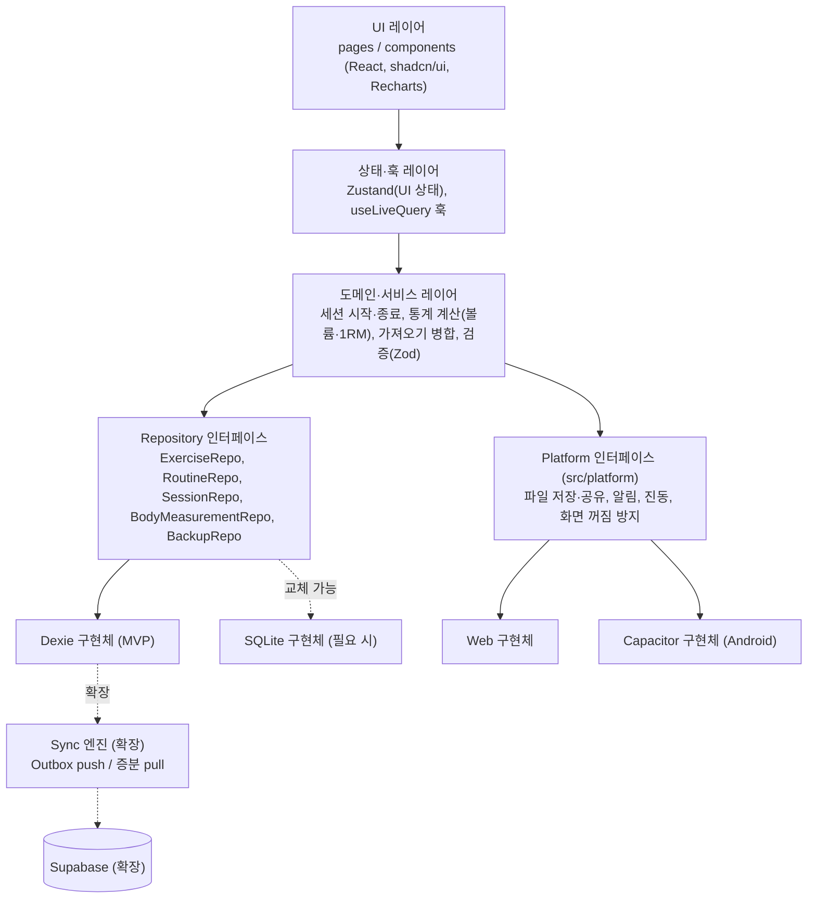
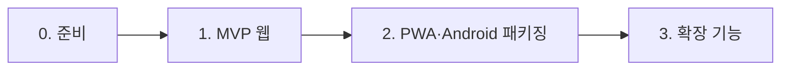

# 헬스 플래너 사전조사 종합 요약 및 의사결정

- 작업: FP-10 (상위: FP-6 헬스 플래너 앱 사전조사)
- 작성일: 2026-10-01
- 상태: 초안

이 문서는 사전조사 문서 세 개(T1~T3)를 요약하고, 이후 설계·개발에서 따를 결정을 기록한다.
원문서끼리 내용이 다르면 **이 문서의 결론을 따른다**(8장).

| 구분 | 문서 | 작업 | 내용 |
| --- | --- | --- | --- |
| T1 | [시장 조사](../0.refference/market-research.md) | FP-7 | 국내·해외 운동 기록 앱 비교, MVP에 차용할 점 |
| T2 | [기능 정의서 및 MVP 범위](../2.feature/feature-definition.md) | FP-8 | MoSCoW 기능 목록, 화면, 개념 데이터 모델, 확장 대비 원칙 |
| T3 | [PC 웹 → Android 기술 스택 조사](../0.refference/tech-stack-research.md) | FP-9 | 후보 스택 비교, 라이브러리 후보, Android 이전 경로, 동기화 백엔드 |

> T1, T3은 웹 검색 없이 작성되어 **(확인 필요)** 항목이 많다. 이 문서의 결정도 그 전제 위에 있으며, 확인 결과에 따라 바뀔 수 있는 항목은 6장(리스크)과 7장(미결정 사항)에 모았다.

---

## 1. 시장 조사 핵심 인사이트

출처: [T1 시장 조사](../0.refference/market-research.md)

1. **세트 표가 사실상 표준 UX다.** `이전 기록 | 중량 | 횟수 | 완료 체크` 형식(Strong, Hevy)과 이전 값 자동 채우기(번핏)가 입력 부담을 가장 많이 줄인다. → MVP 운동 세션 화면의 기준으로 삼는다.
2. **운동 기록과 체성분을 함께 보는 앱이 드물다.** 운동 기록 앱은 체중·둘레 정도만, 체성분 앱(인바디, 삼성 헬스)은 웨이트 기록이 약하다. → **"운동 기록 + 체성분을 같은 날짜 축에서"** 보는 것을 이 앱의 차별점으로 둔다.
3. **국내 사용자는 인바디 결과지 항목에 익숙하다.** 체중·골격근량·체지방 항목을 결과지와 같은 이름으로 입력·표시한다.
4. **국내 시장의 차별화 요소는 AI 루틴 추천(플랜핏)과 웨어러블 연동이다.** 개인용 MVP와는 거리가 멀어 범위에서 뺀다.
5. **대부분의 앱이 "기록은 무료, 고급 기능은 구독"이다.** 개인용 앱이므로 결제·광고·기능 제한은 두지 않는다.
6. **오프라인 우선 + 백업 파일(FitNotes)만으로도 개인용 기록 앱이 성립한다.** → MVP는 로컬 단독 + JSON/CSV 내보내기로 시작한다.
7. **한국어 운동 이름과 분할 루틴(가슴/등/하체 등) 관행**을 따른다.

---

## 2. 확정 MVP 범위

출처: [T2 기능 정의서](../2.feature/feature-definition.md) 1.2절·2장. 세부 기능 ID와 사용자 스토리는 T2를 따른다.

### 2.1 범위 표

| 영역 | MVP 포함 (M) | 일정 여유 시 (S) | MVP 이후 후보 (C) |
| --- | --- | --- | --- |
| 운동 라이브러리 (F-EX) | 기본 운동 목록, 부위·장비 필터, 사용자 정의 운동 추가·수정·삭제, 기록 유형 구분(FP-14에서 S→M) | 이름 검색 | — |
| 루틴·주간 계획 (F-RT) | 루틴 생성·편집, 요일별 배정 | 복제·삭제, 주간 계획 보기 | 운동별 기본 휴식 시간 |
| 세션 기록 (F-WS) | 루틴/빈 세션 시작, 세트 기록, 휴식 타이머, 이전 기록 표시, 종료 요약, 진행 중 세션 복구 | RPE, 타이머 조절, 지난 세션 수정·삭제 | 세트 유형(워밍업), 메모 |
| 히스토리·통계 (F-ST) | 세션 목록, 운동별 히스토리, 볼륨, 추정 1RM | 캘린더, 부위별 빈도 | PR 표시 |
| 체중·체성분 (F-BM) | 체중·체성분 입력, 추이 그래프, 수정·삭제 | — | 측정 메모 |
| 내보내기·가져오기 (F-IO) | JSON 내보내기·복원 | CSV 내보내기, 가져오기 충돌 처리 | CSV 가져오기 |

- **MVP 완료 기준**: 위 M 항목이 PC 웹(Chrome 최신)과 모바일 폭(360px) 브라우저에서 모두 동작한다.
- **확장 후보**: 식단·영양(X-01), 클라우드 동기화(X-02), 다중 기기(X-03), 신체 사진(X-04), 알림(X-05)
- **범위 제외**: AI 루틴 추천(N-01), 스마트워치·Health Connect 연동(N-02), 소셜·결제·광고, 시범 영상 라이브러리

### 2.2 MVP 범위에 대한 결론 (원문서 보완)

| 항목 | 결론 |
| --- | --- |
| 휴식 시간 기본값 | 운동별 기본 휴식 시간(F-RT-06)은 C로 둔다. MVP는 **앱 전체 기본값 1개(설정에서 변경)** 로 타이머를 시작한다. |
| 홈 화면 | T1의 "캘린더 중심 홈"(번핏)은 따르지 않는다. 홈은 T2의 **"오늘" 화면**(오늘 루틴, 진행 중 세션)으로 하고, 캘린더는 히스토리 탭(F-ST-02)에 둔다. |
| 체지방량 | 8장 C-1 참고. 저장하지 않고 체중 × 체지방률로 계산해 표시한다. |
| 운동 시범 자료 | 영상·GIF는 넣지 않는다. 기본 운동은 이름·부위·장비만 제공한다(이미지는 7장 Q-4). |

---

## 3. 기술 스택 결정 (ADR)

출처: [T3 기술 스택 조사](../0.refference/tech-stack-research.md) 2~7장.

### 결정 요약

| 영역 | 선택 | ADR |
| --- | --- | --- |
| 기반·배포 | React + Vite + TypeScript, PWA(웹) + Capacitor(Android) | ADR-001 |
| 로컬 저장소 | Dexie.js(IndexedDB), Repository 인터페이스 뒤에 숨김 | ADR-002 |
| 상태 관리 | Zustand(UI 상태) + Dexie `useLiveQuery`(DB 데이터) | ADR-003 |
| UI·차트 | shadcn/ui + Tailwind CSS, Recharts | ADR-004 |
| 라우팅·폼·날짜·테스트 | React Router, React Hook Form + Zod, date-fns, Vitest + RTL + fake-indexeddb, Playwright | ADR-005 |
| 기본 운동 데이터 | 자체 큐레이션 목록(free-exercise-db 참고) + 한국어 이름 | ADR-006 |
| 동기화(확장) | Supabase + Outbox/증분 Pull + LWW (보류 결정) | ADR-007 |

> 모든 라이브러리는 도입 직전에 최신 버전·유지보수 상태를 다시 확인한다(T3 기준 시점 이후 변경 가능).

### ADR-001 앱 기반 스택: React + Vite + TS (PWA) → Capacitor

- **상태**: 채택
- **맥락**: 1차 타깃은 PC 웹, 2차 타깃은 Android 앱이다. 1인 개발이며 같은 코드베이스를 최대한 재사용해야 한다. 앱은 폼·리스트·차트 위주다.
- **결정**: React + Vite + TypeScript로 반응형 웹앱을 만들고, PWA를 거쳐 Capacitor로 Android AAB를 패키징한다.
- **근거**
  - 표준 DOM 기반이라 PC 웹 품질(초기 로딩, 텍스트 선택, 접근성)이 후보 중 가장 좋다.
  - 같은 빌드 결과물을 Capacitor로 감싸므로 웹 → Android 코드 재사용률이 90% 이상(추정)이다.
  - 개발·디버깅 대부분을 브라우저 DevTools와 HMR로 처리하고, 새 언어를 배울 필요가 없다.
  - 폼·리스트·차트 중심 앱이라 WebView 성능 한계에 걸릴 가능성이 낮다.
  - PWA "홈 화면에 추가"로 스토어 출시 전에 Android에서 먼저 써 볼 수 있다.
- **대안**
  - Flutter(Web + Android): Android 품질은 가장 좋지만 Web이 Canvas 렌더링이라 웹 우선 조건에 불리하고 Dart 학습이 필요하다. **2안으로 유지**한다.
  - React Native + Expo: 웹 지원이 부차적이고 웹/네이티브 동시 지원 차트·UI 라이브러리가 적다.
  - Kotlin/Compose Multiplatform: Web 타깃이 미성숙하다.
- **재검토 조건**: Android WebView에서 차트·리스트 성능 문제가 실제로 측정되거나, 우선순위가 모바일 > 웹으로 바뀌면 2안(Flutter)을 다시 검토한다.

### ADR-002 로컬 저장소: Dexie.js + Repository 추상화

- **상태**: 채택
- **맥락**: MVP는 서버 없이 로컬에만 저장한다. 브라우저와 Capacitor WebView 양쪽에서 같은 코드로 동작해야 하고, 나중에 저장소 교체·동기화가 가능해야 한다. T2 8장은 "SQLite 등" 저장소 선정을 후속 과제로 남겼다.
- **결정**: Dexie.js(IndexedDB)를 사용한다. 화면·서비스 코드는 Dexie를 직접 부르지 않고 Repository 인터페이스만 사용한다(4장).
- **근거**
  - 브라우저와 Android WebView에서 같은 구현이 동작해 테스트 범위가 하나다.
  - TS 타입 지원, `liveQuery`로 반응형 조회, 스키마 버전 마이그레이션 기능이 있다.
  - 통계(볼륨·1RM)는 T2 6.3절에 따라 저장하지 않고 계산하므로, 개인 1명 분량의 데이터는 JS 집계로 충분하다.
- **대안**
  - `@capacitor-community/sqlite`: Android 데이터 안정성은 높지만 웹/네이티브 구현이 달라진다. **Android에서 데이터 유실이 확인되면 Repository 구현체만 교체**한다.
  - sql.js / wa-sqlite / SQLite 공식 Wasm: SQL 집계가 가능하지만 Wasm 번들과 영속화 설정 비용이 크다.
  - idb: 마이그레이션·조회 편의 기능이 없다.
- **보완 조치**: 앱 시작 시 `navigator.storage.persist()`를 요청하고, JSON 내보내기를 백업 수단으로 안내한다.

### ADR-003 상태 관리: Zustand + Dexie `useLiveQuery`

- **상태**: 채택
- **맥락**: 서버 데이터가 없고, 대부분의 데이터는 로컬 DB에 있다. UI 상태(진행 중 세션 화면 상태, 타이머, 필터)는 따로 필요하다.
- **결정**: DB 데이터는 `useLiveQuery`로 직접 구독하고, UI 상태만 Zustand로 관리한다.
- **근거**: DB를 진실의 원천으로 두면 상태 중복과 동기화 버그가 줄어든다. Zustand는 보일러플레이트가 거의 없다.
- **대안**: Redux Toolkit(소규모 앱에 코드량 과다), Jotai(상태가 흩어지기 쉬움), TanStack Query(동기화 단계에서 추가 검토).

### ADR-004 UI·차트: shadcn/ui + Tailwind CSS, Recharts

- **상태**: 채택
- **맥락**: PC 넓은 화면과 모바일 360px 폭을 같은 코드로 지원해야 한다. 차트는 볼륨·1RM·체성분 추이 정도다.
- **결정**: shadcn/ui + Tailwind CSS로 반응형 UI를 만들고, 차트는 Recharts를 쓴다.
- **근거**: shadcn/ui는 코드를 복사해 완전히 수정할 수 있고 번들이 작다. Recharts는 React 선언형으로 선/막대 차트를 빠르게 만들 수 있고, 개인 기록 데이터량에는 SVG 성능으로 충분하다.
- **대안**: MUI(번들 큼), Mantine(디자인 개성 강함), Ionic(PC 웹에서 모바일 느낌이 어색). 차트는 ECharts(데이터량·터치 성능 문제 시 교체), Chart.js.

### ADR-005 보조 라이브러리: 라우팅·폼·날짜·테스트

- **상태**: 채택
- **맥락**: 핵심 결정에 비해 교체 비용이 낮은 영역이다. 표준적이고 자료가 많은 쪽을 고른다.
- **결정**: React Router / React Hook Form + Zod / date-fns / Vitest + React Testing Library + fake-indexeddb, E2E는 Playwright. Android는 실기기·에뮬레이터 수동 스모크 테스트로 시작한다.
- **근거**: Zod 스키마는 폼 검증과 **JSON 가져오기 검증(F-IO-02)** 에 함께 쓴다. Vitest는 Vite 설정을 공유한다. fake-indexeddb로 Repository 구현을 Node에서 테스트할 수 있다.
- **대안**: TanStack Router, TanStack Form, Valibot, Day.js/Luxon, Jest, Cypress.

### ADR-006 기본 운동 데이터: 자체 큐레이션 목록

- **상태**: 채택 (라이선스 확인 후 확정)
- **맥락**: T3은 free-exercise-db(약 800개, 영어) 전체를 시드로 번들하자고 했고, T2는 기본 운동에 고정 UUID를 주고 부위·장비를 자체 코드값으로 저장하라고 했다. T1은 한국어 이름과 국내 헬스장 기구 기준을 강조했다.
- **결정**: free-exercise-db를 **참고 자료**로 쓰되, 국내에서 많이 하는 운동 위주로 **약 100~150개를 골라** 자체 시드 JSON을 만든다. 각 운동에 고정 UUID, 한국어 이름, T2의 부위·장비 코드값을 부여한다.
- **근거**: 800개 전체는 한국어 번역·분류 매핑 비용이 크고, 개인 사용자는 일부만 쓴다. 부족한 운동은 사용자 정의 운동(F-EX-05)으로 보완한다. 자체 코드 체계로 저장하면 원본 데이터셋 구조에 묶이지 않는다.
- **대안**: free-exercise-db 전체 번들(번역 비용), wger(CC-BY-SA 의무), ExerciseDB(상용 API, 오프라인 재배포 불가 가능성).

### ADR-007 클라우드 동기화: Supabase + Outbox/증분 Pull + LWW

- **상태**: 제안 (확장 단계 착수 시 확정)
- **맥락**: MVP에는 동기화가 없지만, 나중에 마이그레이션 없이 붙일 수 있어야 한다(T2 7장).
- **결정**: 동기화가 필요해지면 Supabase(PostgreSQL + Auth + RLS)를 백엔드로 하고, 클라이언트는 Outbox 패턴과 증분 Pull, LWW 충돌 해결을 직접 구현한다. MVP 단계에서는 **데이터 모델 원칙(UUID·`updatedAt`·`deletedAt`·`schemaVersion`)만 지킨다**.
- **근거**: SQL 집계가 쉽고 종속성이 낮다(셀프호스팅 가능). 개인용(사용자 1명, 기기 2~3대)에는 LWW로 충분하다.
- **대안**: Dexie Cloud(코드는 가장 적지만 유료·종속), Firebase(오프라인 내장이나 종속·집계 제약), RxDB/PowerSync(플러그인 비용·복잡도), 자체 Spring Boot 서버(운영 비용, 다중 사용자 기능 필요 시 재검토).

---

## 4. 로컬 우선 아키텍처 개요

### 4.1 원칙

- **로컬 DB가 진실의 원천이다.** UI는 항상 로컬 DB만 읽고 쓴다. 네트워크(확장 단계)는 백그라운드 동기화에만 쓴다.
- **저장소·플랫폼 의존 코드는 인터페이스 뒤로 숨긴다.** Dexie, Capacitor 플러그인을 화면 코드에서 직접 부르지 않는다.
- **모든 엔티티는 동기화 친화 필드를 처음부터 가진다**: UUID PK, `createdAt`, `updatedAt`, `deletedAt`.

### 4.2 레이어 구조



| 레이어 | 책임 | 하지 않는 것 |
| --- | --- | --- |
| UI | 화면 렌더링, 사용자 입력 | DB·플랫폼 API 직접 호출 |
| 상태·훅 | 화면 상태, DB 조회 구독 | 업무 규칙 계산 |
| 도메인·서비스 | 업무 규칙(세션 시작 시 목표 세트 복사, 볼륨·Epley 1RM 계산, soft delete 연쇄, 병합 규칙) | 저장 방식 결정 |
| Repository | 엔티티 CRUD, 조회 조건(`deletedAt IS NULL`), 타임스탬프 갱신 | 화면 로직 |
| Platform | 브라우저/Android 차이 흡수 | 업무 규칙 |

권장 폴더 구조(초안): `src/ui`, `src/state`, `src/domain`, `src/data/repositories`(인터페이스), `src/data/dexie`(구현), `src/platform/{web,capacitor}`.

### 4.3 Repository 추상화

```ts
// 예시 — 실제 시그니처는 설계 단계에서 확정
interface SessionRepository {
  getById(id: string): Promise<WorkoutSession | undefined>;
  getInProgress(): Promise<WorkoutSession | undefined>;   // F-WS-11 복구
  listCompleted(range: DateRange): Promise<WorkoutSession[]>;
  save(session: WorkoutSession): Promise<void>;            // id·타임스탬프는 저장소가 보장
  softDelete(id: string): Promise<void>;                   // 하위 WorkoutSet 연쇄 포함
}
```

- **공통 규칙은 Repository가 보장한다**: 생성 시 UUID v7 부여, 쓰기마다 `updatedAt` 갱신, 삭제는 `deletedAt` 설정, 기본 조회는 삭제 제외.
- 구현체는 MVP에서 Dexie 하나다. fake-indexeddb로 단위 테스트한다.
- `@capacitor-community/sqlite` 구현체로 바꿔도 같은 Repository 테스트를 통과하면 교체 완료로 본다.
- 이전 기록 조회(F-WS-08)를 위해 WorkoutSet에 `[exerciseId+completedAt]` 복합 인덱스를 둔다(T2 6.3절).

### 4.4 향후 동기화 지점

동기화(X-02)를 붙일 때 바뀌는 곳과 MVP에서 미리 해 둘 일을 정리한다.

| 지점 | 확장 시 변경 | MVP에서 미리 할 일 |
| --- | --- | --- |
| Repository 쓰기 경로 | 쓰기와 같은 트랜잭션에서 Outbox(`pending_changes`)에 변경 기록 | 모든 쓰기를 Repository 한 곳으로 모은다 |
| 엔티티 필드 | `userId` 추가, 최초 로그인 시 기존 데이터 귀속 | UUID·`createdAt`·`updatedAt`·`deletedAt` 유지 |
| 삭제 | 톰스톤을 다른 기기로 전파, 일정 기간 뒤 purge | 물리 삭제 금지 |
| 충돌 해결 | 서버 기준 시각/시퀀스로 LWW | 가져오기 병합(F-IO-05)에 같은 LWW 규칙 적용 |
| 스키마 버전 | 서버 스키마와 버전 맞춤 | 로컬 DB·내보내기 JSON에 `schemaVersion` 기록 |
| 상태 관리 | 동기화 상태 표시용으로 TanStack Query 검토 | DB 구독은 `useLiveQuery`로 일관 유지 |
| Sync 엔진 위치 | 도메인 레이어 밖의 백그라운드 서비스(UI와 분리) | — |

---

## 5. 개발 로드맵

일정은 1인 개발 기준이며, 기간은 MVP 설계 후 별도로 산정한다. 각 단계는 **완료 기준**을 만족해야 다음 단계로 넘어간다.



### 0단계: 준비 (설계)

- 화면 와이어프레임(M 항목 기준), 기본 운동 시드 데이터(ADR-006) 확정
- 프로젝트 생성(Vite React-TS), 린트·테스트·CI 기본 설정, 폴더 구조(4.2절)
- Repository 인터페이스와 Dexie 스키마 v1 정의
- **완료 기준**: 빈 화면 앱이 빌드되고, Repository 단위 테스트가 CI에서 돈다.

### 1단계: MVP 웹

| 순서 | 내용 | 기능 |
| --- | --- | --- |
| 1-1 | 운동 라이브러리, 사용자 정의 운동 | F-EX M |
| 1-2 | 루틴 생성·편집, 요일 배정, 홈(오늘) | F-RT M |
| 1-3 | 운동 세션 기록, 휴식 타이머, 이전 기록, 세션 복구·요약 | F-WS M |
| 1-4 | 히스토리, 볼륨·1RM 통계 | F-ST M |
| 1-5 | 체중·체성분 입력·그래프 | F-BM M |
| 1-6 | JSON 내보내기·가져오기 | F-IO M |
| 1-7 | S 항목(검색, RPE, 캘린더, CSV 내보내기, 병합 등) | S |

- 처음부터 모바일 폭(360px) 우선 반응형, 터치 대상 44~48px 이상, 호버 의존 UI 금지
- **완료 기준**: M 항목 전부 동작, Playwright로 핵심 시나리오(T2 5.3절 1~4) E2E 통과, PC·모바일 폭 브라우저 확인

### 2단계: PWA → Android 패키징

T3 5장 2~6단계를 따른다.

1. `vite-plugin-pwa`로 manifest·Service Worker, 오프라인 실행, `navigator.storage.persist()`
2. Android Chrome "홈 화면에 추가"로 실사용 검증 (이 시점에 데이터 유실 여부 관찰)
3. Capacitor 도입(`npx cap add android`), 네이티브 환경에서는 Service Worker 등록 분기
4. `src/platform`에 Capacitor 구현 추가: 뒤로가기, 상태바·스플래시, 휴식 타이머 로컬 알림·진동, 파일 내보내기·공유, 화면 꺼짐 방지
5. 안전 영역·소프트 키보드 처리, 필요 시 SQLite 구현체로 교체(ADR-002)
6. 서명 키 생성·보관, AAB 빌드, Play Console 내부 테스트 → 비공개 테스트 → 프로덕션
- **완료 기준**: 실기기에서 세션 기록·백그라운드 휴식 타이머 알림·백업 파일 내보내기가 동작하고, 내부 테스트 트랙에 배포됨

### 3단계: 확장 기능

우선순위는 MVP 사용 후 정한다. 현재 제안 순서는 다음과 같다.

| 순서 | 기능 | 비고 |
| --- | --- | --- |
| 3-1 | 알림(X-05): 운동일·측정일 로컬 알림 | 2단계 로컬 알림 플러그인 재사용, 서버 불필요 |
| 3-2 | 클라우드 동기화·백업(X-02), 다중 기기(X-03) | ADR-007 확정 후 착수. 4.4절 지점 구현 |
| 3-3 | 식단·영양 관리(X-01) | 음식 DB 확보 방안 조사 선행. 운동·체성분과 같은 날짜 축으로 표시 |
| 3-4 | 신체 사진(X-04) | 동기화 이후 저장 용량·개인정보 정책과 함께 검토 |

- 식단(X-01)은 새 엔티티(음식, 끼니 기록)를 추가하는 일이므로 동기화보다 먼저 해도 구조상 문제가 없다. 다만 음식 DB가 없으면 입력 부담이 커서, **음식 DB 조사 결과에 따라 3-2와 순서를 바꿀 수 있다**.

---

## 6. 리스크

| ID | 리스크 | 영향 | 가능성 | 대응 |
| --- | --- | --- | --- | --- |
| R-1 | Android WebView에서 IndexedDB 데이터가 OS 정리·앱 데이터 삭제로 유실 | 높음 | 중간 | `storage.persist()`, JSON 백업 안내, 유실 확인 시 SQLite 구현체로 교체(ADR-002) |
| R-2 | WebView 성능(차트·긴 리스트) 부족 | 중간 | 낮음 | 리스트 가상화, ECharts 교체, 최후 수단으로 2안(Flutter) 재검토 |
| R-3 | 운동 데이터셋 라이선스 조건이 기억과 다름 | 중간 | 중간 | 도입 전 원문 확인, 자체 큐레이션(ADR-006)으로 의존도 축소, 라이선스 화면 제공 |
| R-4 | 라이브러리 버전·유지보수 상태가 T3 작성 시점과 다름 | 중간 | 중간 | 도입 직전 재확인, 핵심 의존성(Dexie 등)은 Repository 뒤에 둠 |
| R-5 | 브라우저에서 앱 종료 시 진행 중 세션·타이머 상태 유실 | 높음 | 중간 | 세트 입력마다 즉시 DB 저장, 타이머는 종료 예정 시각을 저장해 재계산(F-WS-11) |
| R-6 | 웹 백그라운드 탭에서 휴식 타이머 지연·알림 불가 | 중간 | 높음 | 웹은 화면 내 표시 위주, Android에서 로컬 알림으로 보완 |
| R-7 | 기기 시계 차이로 LWW 병합 결과가 틀어짐 | 낮음(MVP) | 낮음 | MVP 가져오기는 수동이라 영향 작음. 동기화 시 서버 시각/HLC 사용 |
| R-8 | 1인 개발 일정 지연 | 중간 | 중간 | M 항목만으로 MVP 완료 판단, S 항목은 출시 직후로 미룰 수 있음 |
| R-9 | Google Play 신규 개인 개발자 계정의 비공개 테스트 요건 | 중간 | 중간 | 2단계 착수 전에 요건 확인, 테스트 인원 미리 확보 |
| R-10 | T1의 국내 앱 정보(짐워크·핏데이 등) 신뢰도 낮음 | 낮음 | 높음 | MVP 범위 결정에 영향이 적음. 필요 시 실제 앱 설치 후 보강 |

---

## 7. 미결정 사항

상태가 **확정**인 항목은 [데이터 모델·도메인 규칙 v1](mvp-design/data-model-v1.md)(FP-12)에서 결정했고, 결정 내용은 해당 문서 절을 따른다. 결정 경위는 [MVP 상세 명세 인덱스](../2.feature/mvp-spec/README.md) 4장에 정리했다.

| ID | 항목 | 상태 | 결정 시점 | 기본안 / 결정 |
| --- | --- | --- | --- | --- |
| Q-1 | 부위별 빈도에 보조 부위를 반영할지, 반영 시 가중치 | **확정** (FP-12) | 1-4 통계 구현 전 | 주 부위(`primaryMuscle`)만 세트당 1로 집계, 보조 부위 미반영 (데이터 모델 5.3절) |
| Q-2 | 1RM 계산에서 제외할 고반복 기준(T2 예: 12회 초과) | **확정** (FP-12) | 1-4 통계 구현 전 | 12회 초과 세트 제외, `weight > 0`만 대상 (데이터 모델 5.2절) |
| Q-3 | 주 시작 요일 표시(월/일) | **확정** (FP-12) | 0단계 와이어프레임 | 저장은 `0=일 ~ 6=토`, 표시는 월요일 시작 (데이터 모델 6장) |
| Q-4 | 기본 운동에 이미지(정지 이미지) 포함 여부 | 미결정 | ADR-006 시드 확정 시 | 이미지 없이 시작 |
| Q-5 | lb 단위 지원 | 미결정 | MVP 이후 | kg만 지원(내부 저장은 항상 kg) |
| Q-6 | 진행 중 세션 동시 2개 허용 여부 | **확정** (FP-12) | 1-3 세션 구현 전 | 살아 있는 `IN_PROGRESS` 세션은 전체에서 최대 1개 (데이터 모델 7.2절) |
| Q-7 | 동기화 백엔드 최종 선택(ADR-007), 계정·인증 방식 | 미결정 | 3-2 착수 시 | Supabase + 이메일/Google 로그인 |
| Q-8 | 식단 기능의 음식 DB 출처(공공 데이터, 상용 API 등) | 미결정 | 3-3 착수 전 | 별도 조사 작업 필요 |
| Q-9 | soft delete 레코드 purge 기준 | 미결정 | 3-2 동기화 설계 시 | MVP에서는 purge하지 않음 |
| Q-10 | 웹 버전 호스팅 위치(Vercel/Netlify/GitHub Pages) | 미결정 | 1단계 완료 전 | 정적 호스팅 중 무료 티어 |

---

## 8. 원문서 간 상충 사항과 결론

| ID | 상충 내용 | 결론 |
| --- | --- | --- |
| C-1 | T1은 체성분 항목을 **골격근량·체지방량·체지방률**로, T2 데이터 모델은 `bodyFatPercent`·`skeletalMuscleKg`만 둔다. | T2 모델을 유지한다. **체지방량은 저장하지 않고** `weightKg × bodyFatPercent / 100`으로 계산해 그래프·목록에 표시한다. 인바디 결과지처럼 체중·골격근량·체지방량을 한 그래프에서 비교하는 화면은 S-14에서 계산값으로 구현한다. |
| C-2 | UUID 버전: T2는 "v4 또는 v7 권장", T3은 "v7 권장". | **UUID v7**로 통일한다(시간 정렬 가능, 인덱스 효율). 기본 운동의 고정 UUID도 v7 형식으로 미리 생성해 둔다. |
| C-3 | 시각 저장 규칙: T2는 타임스탬프를 UTC ISO 8601로, T3은 "ISO(UTC) 또는 로컬 날짜(`YYYY-MM-DD`) 중 규칙을 정한다"고만 했다. | **시점**(`createdAt`, `updatedAt`, `deletedAt`, `startedAt`, `endedAt`, `completedAt`)은 UTC ISO 8601, **날짜**(`measuredOn`)는 사용자 로컬 기준 `YYYY-MM-DD` 문자열로 저장한다. 세션의 날짜 귀속(히스토리·캘린더)은 `startedAt`을 로컬 시간대로 변환해 정한다. |
| C-4 | 기본 운동 데이터: T3은 free-exercise-db 전체(약 800개)를 시드로 번들, T2는 고정 UUID·자체 코드값을 요구. | ADR-006대로 **자체 큐레이션 100~150개**에 고정 UUID·한국어 이름·자체 코드값을 부여한다. |
| C-5 | 로컬 저장소: T2 8장은 "SQLite 등" 선정을 후속 과제로 두었고, T3은 Dexie를 권장. | ADR-002대로 **Dexie**로 결정하고, SQLite는 Repository 교체 대안으로 둔다. |
| C-6 | 알림: T3은 Android 단계에서 휴식 타이머 로컬 알림을 넣고, T2는 알림(X-05)을 확장 후보로 둔다. | 둘은 다른 기능으로 본다. **휴식 타이머 알림은 F-WS-06(M)의 일부**로 2단계에 넣고, X-05는 운동일·측정일 **예약 알림**만 뜻한다. |
| C-7 | 휴식 시간: T1은 "운동별 기본 휴식 시간 설정"을 차용 대상으로, T2는 이를 C(F-RT-06)로 둔다. | T2를 따른다. MVP는 앱 전체 기본값 하나로 시작한다(2.2절). |
| C-8 | 홈 화면: T1은 캘린더 중심 홈(번핏)을 차용 대상으로, T2는 "오늘" 홈 + 히스토리 탭 캘린더. | T2를 따른다(2.2절). |
| C-9 | 충돌 해결 시각: T2는 `updatedAt` LWW, T3은 기기 시계 차이를 위해 서버 시각/HLC를 언급. | MVP 가져오기 병합은 **클라이언트 `updatedAt` LWW**, 동기화 단계에서는 **서버 기준 시각/시퀀스**로 비교한다(ADR-007 확정 시 상세화). |

---

## 9. 후속 작업 제안

- 0단계 작업 생성: 와이어프레임(`docs/1.architectur`), 기본 운동 시드 데이터 확정, 프로젝트 초기 설정
- 라이선스·버전 확인: free-exercise-db 라이선스 원문, T3 권장 라이브러리 최신 버전
- 미결정 사항 Q-1~Q-3, Q-6은 데이터 모델 v1(FP-12)에서 확정했다(7장). 나머지 Q 항목은 해당 작업 착수 시 결정
- 식단 확장(3-3) 전 음식 DB 조사 문서 작성(`docs/0.refference`)
