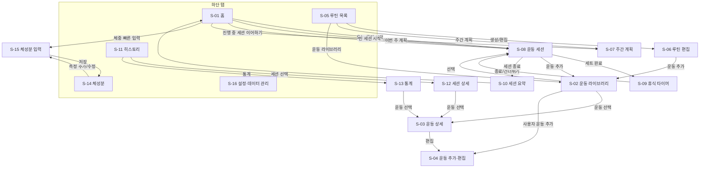
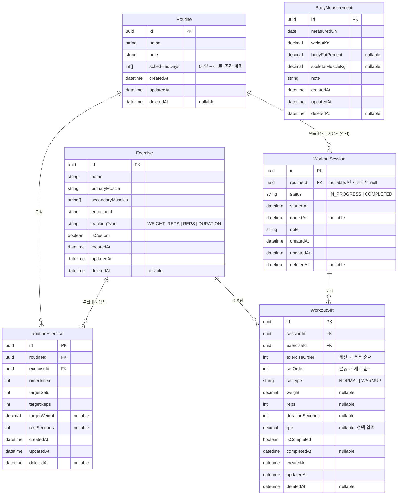

# 헬스 플래너 기능 정의서 및 MVP 범위

- 작업: FP-8 (상위: FP-6 헬스 플래너 앱 사전조사)
- 작성일: 2026-10-01
- 상태: 초안

## 1. 개요

개인 사용자가 운동 루틴을 계획하고, 운동 세션을 기록하고, 체중·체성분 변화를 추적하는 헬스 플래너 앱이다.
MVP는 **로컬 단독(오프라인 우선)** 으로 동작하며, 데이터는 기기에 저장하고 JSON/CSV 내보내기·가져오기로 백업한다.
이후 클라우드 동기화로 확장할 수 있도록 데이터 모델은 처음부터 동기화 친화적으로 설계한다(7장 참고).

### 1.1 우선순위 표기 (MoSCoW)

| 표기 | 의미 |
| --- | --- |
| **M** (Must) | MVP 출시에 반드시 필요. 없으면 출시하지 않는다. |
| **S** (Should) | MVP에 포함하는 것이 좋으나, 일정이 부족하면 출시 직후로 미룰 수 있다. |
| **C** (Could) | 여유가 있을 때 추가. MVP 이후 개선 항목 후보. |
| **W** (Won't) | 이번 범위에서는 하지 않는다. |

### 1.2 범위 요약

| 구분 | 기능 |
| --- | --- |
| **1. MVP** | 운동 라이브러리, 루틴·주간 계획, 운동 세션 기록, 히스토리·기본 통계, 체중·체성분 기록, 데이터 내보내기·가져오기 |
| **2. 확장 후보** | 식단·영양 관리, 클라우드 동기화·백업 및 다중 기기 지원, 신체 사진, 알림 |
| **3. 범위 제외** | AI 루틴 추천, 스마트워치·Health Connect 연동 |

---

## 2. MVP 기능 정의

각 기능은 `기능 ID / 사용자 스토리 / MoSCoW` 로 정의한다.
사용자 스토리 형식: "사용자로서, ~하고 싶다. 그래서 ~할 수 있다."

### 2.1 운동 라이브러리 (F-EX)

운동 종목을 부위·장비로 분류해 제공하고, 사용자가 직접 운동을 추가할 수 있다.

| ID | 기능 | 사용자 스토리 | MoSCoW |
| --- | --- | --- | --- |
| F-EX-01 | 기본 운동 목록 제공 | 사용자로서, 미리 등록된 대표 운동 목록을 보고 싶다. 그래서 운동을 일일이 입력하지 않고 바로 고를 수 있다. | M |
| F-EX-02 | 부위별 분류·필터 | 사용자로서, 가슴·등·하체 등 부위별로 운동을 걸러 보고 싶다. 그래서 오늘 훈련할 부위의 운동을 빨리 찾을 수 있다. | M |
| F-EX-03 | 장비별 분류·필터 | 사용자로서, 바벨·덤벨·머신·맨몸 등 장비별로 운동을 걸러 보고 싶다. 그래서 지금 쓸 수 있는 장비에 맞는 운동을 고를 수 있다. | M |
| F-EX-04 | 운동 이름 검색 | 사용자로서, 운동 이름으로 검색하고 싶다. 그래서 목록을 스크롤하지 않고 원하는 운동을 찾을 수 있다. | S |
| F-EX-05 | 사용자 정의 운동 추가 | 사용자로서, 목록에 없는 운동을 이름·부위·장비를 지정해 추가하고 싶다. 그래서 내가 하는 모든 운동을 기록할 수 있다. | M |
| F-EX-06 | 사용자 정의 운동 수정·삭제 | 사용자로서, 내가 추가한 운동을 고치거나 지우고 싶다. 그래서 잘못 입력한 운동을 정리할 수 있다(과거 기록은 유지). | M |
| F-EX-07 | 기록 유형 구분 | 사용자로서, 운동마다 기록 방식(중량×횟수 / 횟수만 / 시간)을 다르게 하고 싶다. 그래서 맨몸 운동이나 플랭크도 알맞게 기록할 수 있다. | S |

- 분류 기준(초안)
  - 부위: 가슴, 등, 어깨, 이두, 삼두, 전완, 복근, 대퇴사두, 햄스트링, 둔근, 종아리, 전신, 유산소
  - 장비: 바벨, 덤벨, 머신, 케이블, 케틀벨, 맨몸, 밴드, 기타
- 운동은 주 부위 1개와 보조 부위 여러 개를 가질 수 있다(부위별 빈도 통계에 사용).

### 2.2 루틴(템플릿) 및 주간 계획 (F-RT)

자주 하는 운동 구성을 루틴으로 저장하고, 요일별로 배치해 주간 계획을 만든다.

| ID | 기능 | 사용자 스토리 | MoSCoW |
| --- | --- | --- | --- |
| F-RT-01 | 루틴 생성 | 사용자로서, 운동 목록과 목표 세트·횟수·중량을 묶어 루틴으로 저장하고 싶다. 그래서 매번 같은 구성을 다시 입력하지 않아도 된다. | M |
| F-RT-02 | 루틴 편집 | 사용자로서, 루틴의 운동을 추가·삭제하고 순서와 목표 값을 바꾸고 싶다. 그래서 프로그램 변화에 맞게 루틴을 고칠 수 있다. | M |
| F-RT-03 | 루틴 복제·삭제 | 사용자로서, 기존 루틴을 복제하거나 삭제하고 싶다. 그래서 비슷한 루틴을 빠르게 만들고 안 쓰는 루틴을 정리할 수 있다. | S |
| F-RT-04 | 요일별 루틴 배정 | 사용자로서, 월요일엔 상체·화요일엔 하체처럼 요일마다 루틴을 배정하고 싶다. 그래서 오늘 해야 할 운동을 바로 알 수 있다. | M |
| F-RT-05 | 주간 계획 보기 | 사용자로서, 한 주의 계획과 완료 여부를 한 화면에서 보고 싶다. 그래서 이번 주 진행 상황을 파악할 수 있다. | S |
| F-RT-06 | 운동 기본 휴식 시간 지정 | 사용자로서, 루틴 안의 운동마다 기본 휴식 시간을 정하고 싶다. 그래서 세션 중 휴식 타이머가 자동으로 맞춰진다. | C |

### 2.3 운동 세션 기록 (F-WS)

루틴을 불러오거나 빈 세션으로 시작해 세트 단위로 기록한다.

| ID | 기능 | 사용자 스토리 | MoSCoW |
| --- | --- | --- | --- |
| F-WS-01 | 세션 시작 (루틴 기반) | 사용자로서, 오늘 배정된 루틴으로 세션을 시작하고 싶다. 그래서 목표 세트가 미리 채워진 상태로 바로 운동할 수 있다. | M |
| F-WS-02 | 세션 시작 (빈 세션) | 사용자로서, 루틴 없이 빈 세션을 시작하고 운동을 즉석에서 추가하고 싶다. 그래서 계획에 없던 운동도 기록할 수 있다. | M |
| F-WS-03 | 세트 기록 (중량·횟수) | 사용자로서, 세트마다 중량과 횟수를 입력하고 완료 표시를 하고 싶다. 그래서 실제 수행한 운동량을 정확히 남길 수 있다. | M |
| F-WS-04 | RPE 기록 (선택) | 사용자로서, 원할 때만 세트별 RPE(체감 강도)를 입력하고 싶다. 그래서 강도 관리를 하되 입력 부담은 줄일 수 있다. | S |
| F-WS-05 | 세트 유형 표시 | 사용자로서, 워밍업 세트를 본 세트와 구분하고 싶다. 그래서 통계에서 워밍업을 제외할 수 있다. | C |
| F-WS-06 | 휴식 타이머 | 사용자로서, 세트를 완료하면 휴식 타이머가 자동으로 시작되길 원한다. 그래서 휴식 시간을 지키며 운동할 수 있다. | M |
| F-WS-07 | 휴식 타이머 조절 | 사용자로서, 타이머를 ±시간 조절하거나 건너뛰고 싶다. 그래서 컨디션에 맞게 휴식을 바꿀 수 있다. | S |
| F-WS-08 | 이전 기록 표시 | 사용자로서, 세트를 입력할 때 같은 운동의 지난번 중량·횟수를 보고 싶다. 그래서 점진적 과부하를 계획할 수 있다. | M |
| F-WS-09 | 세션 메모 | 사용자로서, 세션이나 운동에 짧은 메모를 남기고 싶다. 그래서 컨디션이나 자세 피드백을 기억할 수 있다. | C |
| F-WS-10 | 세션 종료·요약 | 사용자로서, 세션을 마치면 총 시간·총 볼륨·세트 수 요약을 보고 싶다. 그래서 오늘 운동을 한눈에 확인할 수 있다. | M |
| F-WS-11 | 진행 중 세션 복구 | 사용자로서, 앱이 꺼져도 진행 중이던 세션을 이어서 하고 싶다. 그래서 기록을 잃지 않는다. | M |
| F-WS-12 | 지난 세션 수정·삭제 | 사용자로서, 이미 끝난 세션의 세트를 고치거나 세션을 지우고 싶다. 그래서 잘못 입력한 기록을 바로잡을 수 있다. | S |

### 2.4 운동 히스토리 및 기본 통계 (F-ST)

| ID | 기능 | 사용자 스토리 | MoSCoW |
| --- | --- | --- | --- |
| F-ST-01 | 세션 히스토리 목록 | 사용자로서, 지난 운동 세션을 날짜순으로 보고 싶다. 그래서 언제 무엇을 했는지 확인할 수 있다. | M |
| F-ST-02 | 캘린더 보기 | 사용자로서, 달력에서 운동한 날을 표시해 보고 싶다. 그래서 운동 빈도와 꾸준함을 파악할 수 있다. | S |
| F-ST-03 | 운동별 기록 히스토리 | 사용자로서, 특정 운동의 지난 세트 기록을 모아 보고 싶다. 그래서 그 운동의 성장 과정을 볼 수 있다. | M |
| F-ST-04 | 볼륨 통계 | 사용자로서, 세션·주간·운동별 총 볼륨(중량×횟수 합)을 보고 싶다. 그래서 훈련량 변화를 추적할 수 있다. | M |
| F-ST-05 | 1RM 추정 | 사용자로서, 기록된 세트로 추정 1RM과 그 추이를 보고 싶다. 그래서 최대 근력이 늘고 있는지 알 수 있다. | M |
| F-ST-06 | 부위별 빈도 | 사용자로서, 기간별로 부위마다 몇 세트·몇 회 훈련했는지 보고 싶다. 그래서 소홀한 부위를 찾을 수 있다. | S |
| F-ST-07 | 개인 기록(PR) 표시 | 사용자로서, 운동별 최고 중량·최고 추정 1RM을 보고 새 기록 달성 시 알림 표시를 받고 싶다. 그래서 성취감을 느낄 수 있다. | C |

- 계산 규칙(초안)
  - 세트 볼륨 = 중량 × 횟수. 워밍업 세트(F-WS-05 구현 시)와 미완료 세트는 제외한다.
  - 추정 1RM = Epley 공식 `중량 × (1 + 횟수 / 30)`. 횟수 1이면 중량 그대로. 정확도가 떨어지는 고반복(예: 12회 초과) 세트는 제외한다.
  - 부위별 빈도는 주 부위 기준 세트 수로 집계하고, 보조 부위 반영 여부는 설계 단계에서 확정한다.

### 2.5 체중·체성분 기록 (F-BM)

인바디 등에서 측정한 수치를 수동으로 입력하고 추이를 그래프로 본다.

| ID | 기능 | 사용자 스토리 | MoSCoW |
| --- | --- | --- | --- |
| F-BM-01 | 체중 기록 | 사용자로서, 날짜별 체중을 입력하고 싶다. 그래서 체중 변화를 추적할 수 있다. | M |
| F-BM-02 | 체성분 기록 | 사용자로서, 인바디 결과의 체지방률·골격근량을 수동으로 입력하고 싶다. 그래서 체중만으로 알 수 없는 몸의 변화를 볼 수 있다. | M |
| F-BM-03 | 추이 그래프 | 사용자로서, 체중·체지방률·골격근량 추이를 기간(1개월/3개월/1년/전체)별 그래프로 보고 싶다. 그래서 변화 방향을 직관적으로 알 수 있다. | M |
| F-BM-04 | 측정 기록 수정·삭제 | 사용자로서, 잘못 입력한 측정값을 고치거나 지우고 싶다. 그래서 그래프가 정확해진다. | M |
| F-BM-05 | 측정 메모 | 사용자로서, 측정 조건(공복, 운동 후 등)을 메모로 남기고 싶다. 그래서 수치 차이의 원인을 해석할 수 있다. | C |

- 체지방률·골격근량은 선택 입력이며, 체중만 입력해도 저장된다.
- 단위: 체중·골격근량 kg, 체지방률 %. (lb 단위 지원은 설정 기능으로 후속 검토)

### 2.6 데이터 내보내기·가져오기 (F-IO)

서버가 없는 MVP에서 로컬 백업·복원 및 기기 이전 수단으로 사용한다.

| ID | 기능 | 사용자 스토리 | MoSCoW |
| --- | --- | --- | --- |
| F-IO-01 | 전체 데이터 JSON 내보내기 | 사용자로서, 모든 데이터를 JSON 파일 하나로 내보내고 싶다. 그래서 기기를 잃어도 데이터를 지킬 수 있다. | M |
| F-IO-02 | JSON 가져오기(복원) | 사용자로서, 내보낸 JSON 파일로 데이터를 복원하고 싶다. 그래서 새 기기나 재설치 후에도 기록을 이어갈 수 있다. | M |
| F-IO-03 | CSV 내보내기 | 사용자로서, 운동 기록과 체성분 기록을 CSV로 내보내고 싶다. 그래서 스프레드시트에서 직접 분석할 수 있다. | S |
| F-IO-04 | CSV 가져오기 | 사용자로서, CSV 형식의 운동·체성분 기록을 가져오고 싶다. 그래서 다른 앱이나 엑셀에 쌓은 기록을 옮겨올 수 있다. | C |
| F-IO-05 | 가져오기 충돌 처리 | 사용자로서, 가져올 때 기존 데이터를 덮어쓸지 병합할지 고르고 싶다. 그래서 실수로 데이터를 잃지 않는다. | S |

- JSON 내보내기 파일에는 `schemaVersion`, `exportedAt` 메타 정보를 포함해 이후 버전에서도 마이그레이션 후 가져올 수 있게 한다.
- 병합 시 동일 `id`(UUID)는 `updatedAt`이 최신인 쪽을 채택한다(7장 원칙과 동일한 규칙).

---

## 3. 확장 후보

MVP 이후 사용자 반응을 보고 추진 여부를 결정한다. MVP 관점의 MoSCoW는 모두 **W(이번 범위 아님)** 이다.

| ID | 기능 | 사용자 스토리 | 비고 |
| --- | --- | --- | --- |
| X-01 | 식단·영양 관리 | 사용자로서, 끼니별 음식과 칼로리·탄단지를 기록하고 싶다. 그래서 운동과 식단을 함께 관리할 수 있다. | 음식 DB 확보 방안 검토 필요 |
| X-02 | 클라우드 동기화·백업 | 사용자로서, 데이터가 자동으로 클라우드에 백업되길 원한다. 그래서 수동 내보내기 없이도 데이터를 지킬 수 있다. | 계정·서버 필요. 7장 원칙으로 대비 |
| X-03 | 다중 기기 지원 | 사용자로서, 휴대폰과 태블릿에서 같은 데이터를 보고 싶다. 그래서 어느 기기에서든 기록할 수 있다. | X-02에 의존 |
| X-04 | 신체 사진 | 사용자로서, 날짜별 신체 사진을 저장하고 비교하고 싶다. 그래서 수치로 안 보이는 변화를 눈으로 확인할 수 있다. | 사진 저장 용량·개인정보 보호 검토 |
| X-05 | 알림 | 사용자로서, 운동일과 체중 측정일에 알림을 받고 싶다. 그래서 계획을 잊지 않는다. | 로컬 알림으로 시작 가능 |

## 4. 범위 제외

이번 제품 범위에서 다루지 않는다. MoSCoW **W**.

| ID | 기능 | 제외 사유 |
| --- | --- | --- |
| N-01 | AI 루틴 추천 | 추천 품질 검증과 안전성(부상 위험) 책임 문제가 크고, 핵심 가치(기록·추적)와 거리가 있다. |
| N-02 | 스마트워치·Health Connect 연동 | 플랫폼별 연동 비용이 크고, MVP는 수동 입력으로도 핵심 가치를 검증할 수 있다. |

---

## 5. MVP 핵심 화면

### 5.1 화면 목록

| ID | 화면 | 주요 내용 | 관련 기능 |
| --- | --- | --- | --- |
| S-01 | 홈(오늘) | 오늘 배정된 루틴, 운동 시작 버튼, 진행 중 세션 이어하기, 이번 주 진행 요약, 최근 체중 | F-RT-04, F-RT-05, F-WS-01, F-WS-02, F-WS-11 |
| S-02 | 운동 라이브러리 | 부위·장비 필터, 검색, 운동 목록, 사용자 정의 운동 추가 버튼 | F-EX-01~04 |
| S-03 | 운동 상세 | 운동 정보, 이 운동의 기록 히스토리, 추정 1RM 추이 | F-ST-03, F-ST-05 |
| S-04 | 운동 추가·편집 | 이름, 주 부위·보조 부위, 장비, 기록 유형 입력 | F-EX-05~07 |
| S-05 | 루틴 목록 | 루틴 목록, 생성·복제·삭제 | F-RT-01, F-RT-03 |
| S-06 | 루틴 편집 | 운동 추가(라이브러리 선택), 순서 변경, 목표 세트·횟수·중량·휴식 시간 | F-RT-01, F-RT-02, F-RT-06 |
| S-07 | 주간 계획 | 요일별 루틴 배정, 주간 완료 현황 | F-RT-04, F-RT-05 |
| S-08 | 운동 세션(진행) | 운동별 세트 입력(중량·횟수·RPE), 이전 기록, 세트 완료, 운동 추가 | F-WS-03~05, F-WS-08, F-WS-09 |
| S-09 | 휴식 타이머 | 세션 화면 위 오버레이/하단 시트. 남은 시간, ±조절, 건너뛰기 | F-WS-06, F-WS-07 |
| S-10 | 세션 요약 | 총 시간·볼륨·세트 수, 새 기록 표시, 메모 | F-WS-10, F-ST-07 |
| S-11 | 히스토리 | 세션 목록/캘린더 전환, 세션 상세 진입 | F-ST-01, F-ST-02 |
| S-12 | 세션 상세 | 지난 세션의 세트 기록 조회·수정·삭제 | F-WS-12 |
| S-13 | 통계 | 주간 볼륨, 부위별 빈도, 운동별 1RM 추이 | F-ST-04~06 |
| S-14 | 체성분 | 체중·체지방률·골격근량 추이 그래프, 기간 선택, 측정 기록 목록 | F-BM-03, F-BM-04 |
| S-15 | 체성분 입력 | 날짜, 체중, 체지방률, 골격근량, 메모 입력 | F-BM-01, F-BM-02, F-BM-05 |
| S-16 | 설정·데이터 관리 | JSON/CSV 내보내기, 가져오기(덮어쓰기/병합 선택) | F-IO-01~05 |

하단 탭: **홈 / 루틴 / 히스토리 / 체성분 / 설정**. 운동 라이브러리(S-02)와 통계(S-13)는 각각 루틴 탭과 히스토리 탭 안에서 진입한다.

### 5.2 화면 흐름

### 5.3 핵심 사용 시나리오 (텍스트)

1. **운동하기**: 홈 → 오늘 루틴 시작 → 세션 화면에서 이전 기록 참고하며 세트 입력 → 세트 완료 시 휴식 타이머 → 모든 운동 후 세션 종료 → 요약 확인 → 홈
2. **루틴 만들기**: 루틴 탭 → 새 루틴 → 라이브러리에서 운동 선택 → 목표 세트·횟수·중량 설정 → 저장 → 주간 계획에서 요일 배정
3. **체성분 기록**: 체성분 탭 → 측정 추가 → 체중·체지방률·골격근량 입력 → 저장 → 추이 그래프 확인
4. **백업**: 설정 → JSON 내보내기 → 파일 저장 / 새 기기에서 설정 → 가져오기 → 덮어쓰기 또는 병합

---

## 6. 개념 데이터 모델 (초안)

### 6.1 엔티티 관계도

### 6.2 엔티티 설명

| 엔티티 | 설명 | 관계 |
| --- | --- | --- |
| **Exercise** | 운동 종목. 기본 제공 운동과 사용자 정의 운동(`isCustom=true`)을 함께 저장한다. | RoutineExercise, WorkoutSet이 참조 (1:N) |
| **Routine** | 루틴(템플릿). `scheduledDays`로 요일 배정을 표현해 주간 계획을 구성한다. | RoutineExercise를 소유 (1:N), WorkoutSession이 선택적으로 참조 (1:N) |
| **RoutineExercise** | 루틴 안의 운동 항목과 목표값(세트·횟수·중량·휴식). Routine과 Exercise의 N:M을 풀어주는 연결 엔티티. | Routine N:1, Exercise N:1 |
| **WorkoutSession** | 실제 수행한 운동 세션 1회. 루틴 기반이면 `routineId`를 가지며, 빈 세션이면 null. | Routine N:1(선택), WorkoutSet을 소유 (1:N) |
| **WorkoutSet** | 세션에서 수행한 세트 1개. 중량·횟수·RPE 등 실제 기록. 통계(볼륨·1RM·부위별 빈도)와 이전 기록 표시의 원천 데이터. | WorkoutSession N:1, Exercise N:1 |
| **BodyMeasurement** | 체중·체성분 측정 1회. 체지방률·골격근량은 선택값. | 독립 엔티티 (MVP는 단일 사용자) |

### 6.3 설계 메모

- **세션은 루틴의 스냅샷이 아니다.** 세션 시작 시 RoutineExercise의 목표값을 복사해 WorkoutSet(미완료 상태)을 미리 생성한다. 이후 루틴을 수정해도 과거 세션 기록은 바뀌지 않는다.
- **주간 계획**은 MVP에서 `Routine.scheduledDays`로 단순하게 표현한다. 같은 요일에 여러 루틴, 주차별로 다른 계획(주기화)이 필요해지면 별도 `WeeklyPlan`/`PlanDay` 엔티티로 분리한다.
- **이전 기록 표시**는 같은 `exerciseId`의 가장 최근 COMPLETED 세션 WorkoutSet을 조회한다. 조회 성능을 위해 `(exerciseId, completedAt)` 인덱스를 둔다.
- **통계 값(볼륨, 추정 1RM, 부위별 빈도)은 저장하지 않고** WorkoutSet에서 계산한다. 성능 문제가 생기면 캐시 테이블을 추가한다.
- **단위**는 내부적으로 kg으로 저장하고 표시 단계에서 변환한다.
- MVP는 단일 사용자·로컬 저장이라 `userId`가 없다. 동기화 확장 시 모든 엔티티에 `userId`를 추가한다(아래 7장).

---

## 7. 확장 대비 데이터 설계 원칙

MVP는 로컬 전용이지만, 확장 후보인 클라우드 동기화·다중 기기 지원(X-02, X-03)을 데이터 마이그레이션 없이 붙일 수 있도록 아래 원칙을 **모든 엔티티에 처음부터** 적용한다.

### 7.1 UUID 기본키

- 모든 엔티티의 PK는 클라이언트에서 생성하는 **UUID**(v4, 또는 시간 정렬이 가능한 v7 권장)로 한다.
- 이유: 자동 증가 정수 키는 여러 기기에서 오프라인으로 생성한 레코드끼리 충돌한다. UUID는 서버 없이도 전역 고유성을 보장해 동기화·가져오기 병합 시 ID 재매핑이 필요 없다.
- 외래키 역시 UUID로 참조한다. 기본 제공 운동(Exercise)도 고정 UUID를 부여해 기기마다 같은 ID를 갖게 한다.

### 7.2 타임스탬프 (createdAt / updatedAt)

- 모든 엔티티는 `createdAt`, `updatedAt`을 가진다. 값은 **UTC ISO 8601** 형식으로 저장한다.
- 레코드가 변경될 때마다 `updatedAt`을 갱신한다(soft delete 포함).
- 용도
  - 동기화 시 "마지막 동기화 이후 변경분(`updatedAt > lastSyncedAt`)"만 전송하는 증분 동기화
  - 충돌 해결: 같은 `id`가 양쪽에서 수정되면 기본 정책은 `updatedAt`이 최신인 쪽 채택(Last-Write-Wins)
  - JSON 가져오기의 병합 모드(F-IO-05)도 같은 규칙을 사용한다.
- 업무 의미의 시각(`startedAt`, `completedAt`, `measuredOn`)은 타임스탬프 필드와 구분해 별도로 둔다.

### 7.3 Soft delete

- 삭제는 레코드를 지우지 않고 `deletedAt`(nullable datetime)에 삭제 시각을 기록한다. 조회 시 `deletedAt IS NULL` 조건으로 걸러낸다.
- 이유
  - 동기화 시 "삭제되었다"는 사실 자체를 다른 기기로 전파해야 한다. 물리 삭제하면 다른 기기에서 해당 레코드가 다시 살아난다.
  - 사용자 정의 운동을 삭제해도 과거 WorkoutSet이 참조하는 Exercise가 남아 히스토리·통계가 깨지지 않는다.
- 부모 삭제 시 처리
  - Routine 삭제 → 하위 RoutineExercise도 soft delete. 해당 루틴을 참조하는 WorkoutSession은 유지(과거 기록 보존).
  - WorkoutSession 삭제 → 하위 WorkoutSet도 soft delete.
  - Exercise 삭제 → 라이브러리·루틴 편집 화면에서 숨기되, 과거 기록에서는 이름을 계속 표시.
- soft delete된 레코드의 영구 정리(purge)는 동기화 도입 후 "모든 기기가 동기화를 마친 뒤 일정 기간 경과" 기준으로 정한다.

### 7.4 기타 원칙

- **스키마 버전 관리**: 로컬 DB와 내보내기 JSON 모두 `schemaVersion`을 기록하고, 버전별 마이그레이션 스크립트로 올린다.
- **사용자 식별자 확장 여지**: 동기화 도입 시 모든 엔티티에 `userId`를 추가한다. MVP 데이터는 최초 로그인 시 해당 사용자로 귀속시킨다.
- **정규화된 열거값**: 부위·장비·세트 유형 등은 표시용 문자열이 아니라 코드값(`CHEST`, `BARBELL`, `WARMUP` 등)으로 저장해 다국어·서버 연동 시 변환이 필요 없게 한다.

---

## 8. 후속 작업 제안

- MVP 기능 중 M 항목 기준으로 화면 와이어프레임 작성 (`docs/1.architectur`)
- 기본 제공 운동 목록(이름·부위·장비) 데이터셋 확정
- 기술 스택 및 로컬 저장소(SQLite 등) 선정 조사 (`docs/0.refference`)
- 1RM 추정 공식과 부위별 빈도 집계 기준(보조 부위 반영 여부) 확정
