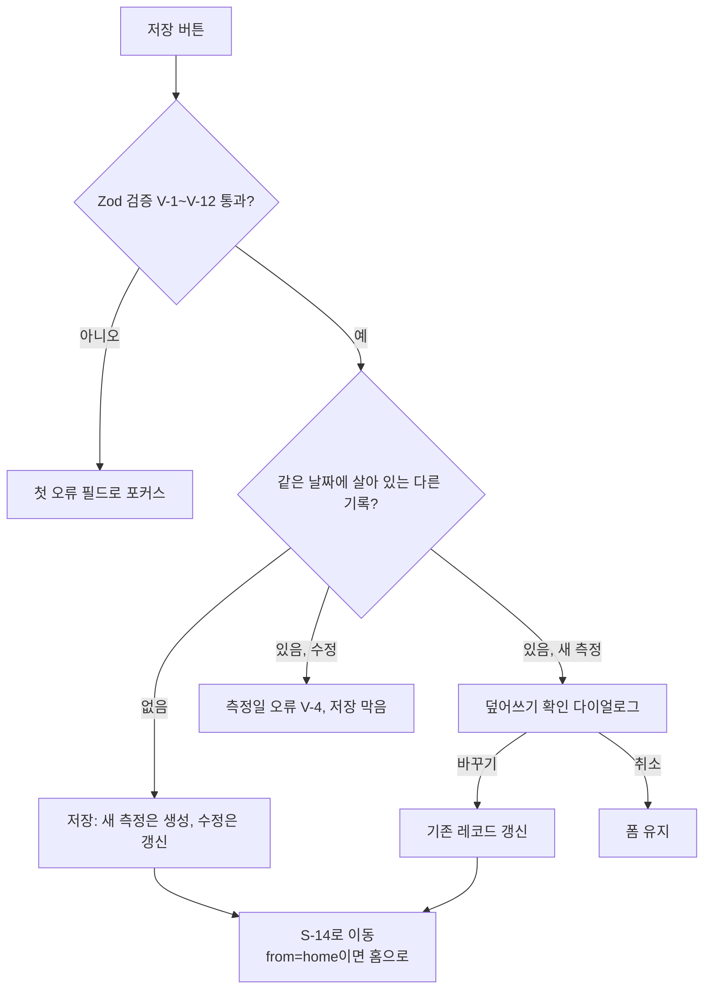
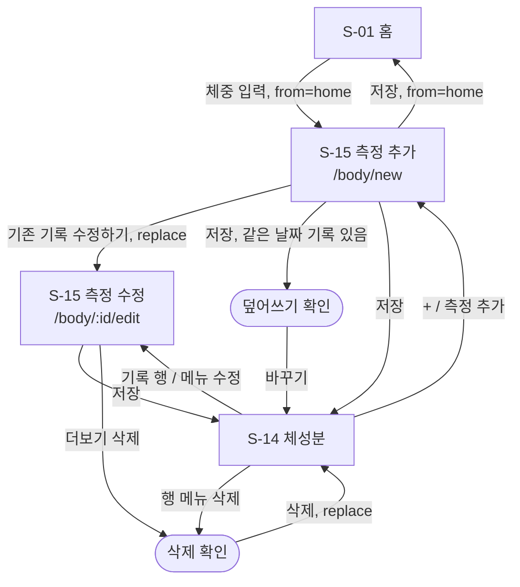

# 체중·체성분(F-BM) 상세 기능 명세

- 작업: FP-19 (상위: FP-11 헬스 플래너 MVP 기능 상세 명세)
- 작성일: 2026-10-01
- 상태: 초안
- 대상 화면: S-14 체성분, S-15 체성분 입력
- 대상 기능: F-BM-01 체중 기록, F-BM-02 체성분 기록, F-BM-03 추이 그래프, F-BM-04 측정 기록 수정·삭제 (모두 M)
- 기준 문서
  - [기능 정의서 및 MVP 범위](../feature-definition.md) 2.5절(F-BM), 5장(S-14, S-15)
  - [데이터 모델·도메인 규칙 v1](../../1.architectur/mvp-design/data-model-v1.md) 2.7절(BodyMeasurement), 5.4절(체지방량), 8장(검증 위치)
  - [공통 UI·IA·내비게이션 명세](../../1.architectur/mvp-design/ia-navigation.md) 2.1절(경로), 3장(공통 컴포넌트), 4장(와이어프레임 표기), 5장(공통 UX 규칙)
  - [사전조사 종합 요약](../../1.architectur/pre-research-summary.md) 8장 C-1(체지방량)

공통 컴포넌트·숫자/날짜 형식·삭제 확인·저장 실패 처리는 IA 명세를 따르고, 여기서는 F-BM에만 해당하는 규칙을 정한다.

---

## 1. 범위

### 1.1 포함

| ID | 기능 | 이 문서에서 정하는 것 |
| --- | --- | --- |
| F-BM-01 | 체중 기록 | 측정일·체중 입력, 범위·자릿수, 같은 날짜 중복 입력 규칙 |
| F-BM-02 | 체성분 기록 | 체지방률·골격근량 선택 입력, 범위·자릿수, 값끼리의 교차 검증, 체지방량 계산 표시 |
| F-BM-03 | 추이 그래프 | 기간(1개월/3개월/1년/전체), 지표 보기, 값이 빠진 날·빠진 항목 처리, 기간 변화량 |
| F-BM-04 | 측정 기록 수정·삭제 | 수정 진입·저장, 날짜 변경 시 충돌, 삭제 확인·실행 취소 |

### 1.2 제외

| 항목 | 이유 |
| --- | --- |
| BMI | 키를 입력받지 않는다. 키 입력·저장이 필요해 MVP 범위 밖으로 둔다. |
| 기초대사량(BMR) | 공식(인바디 값 / Harris-Benedict / Katch-McArdle 등) 선택과 성별·나이·키 입력이 필요하다. MVP 범위 밖이다. |
| 체지방량 직접 입력 | 체지방률로만 입력받고 체지방량은 계산한다(4장). |
| 하루 여러 번 측정(측정 시각) | 하루 1건만 저장한다(3장). |
| lb 단위 | 데이터 모델 Q-5. MVP는 kg만. |
| 측정 메모(F-BM-05) | C 항목. 입력칸 자리만 정의하고(S-15 #7), 일정이 부족하면 숨긴다. 숨겨도 `note`는 `''`로 저장한다. |
| 목표 체중, 신체 사진(X-04), 인바디 연동(N-02) | MVP 범위 아님 |

---

## 2. 입력 값 규칙

### 2.1 필드 정의

저장 형식은 데이터 모델 2.7절과 같다. 이 표는 **입력 UI의 자릿수**를 정한다.

| 필드 | 화면 이름 | 필수 | 단위 | 범위 | 입력 자릿수 | 저장 자릿수 | 스테퍼 step | 기본값(새 측정) |
| --- | --- | --- | --- | --- | --- | --- | --- | --- |
| `measuredOn` | 측정일 | Y | — | 2000-01-01 ~ 오늘(로컬) | — | `YYYY-MM-DD` | — | 오늘 |
| `weightKg` | 체중 | Y | kg | 20.0 ~ 300.0 | 소수 첫째 자리 | 소수 둘째 자리까지 | 0.1 | 빈 칸(placeholder: 최근 체중) |
| `bodyFatPercent` | 체지방률 | N | % | 1.0 ~ 75.0 | 소수 첫째 자리 | 소수 첫째 자리 | 0.1 | 빈 칸(placeholder: 최근 값) |
| `skeletalMuscleKg` | 골격근량 | N | kg | 5.0 ~ 100.0, 체중 이하 | 소수 첫째 자리 | 소수 둘째 자리까지 | 0.1 | 빈 칸(placeholder: 최근 값) |
| `note` | 메모 | N | — | 0 ~ 200자 | — | 앞뒤 공백 제거, 비면 `''` | — | `''` |

- **입력은 소수 첫째 자리**까지 받는다(인바디 결과지 표기와 같다). 둘째 자리 이하를 입력하면 첫째 자리로 반올림한다(`NumberStepper` `precision=1`).
- 저장 자릿수가 입력보다 넓은 것은 JSON/CSV 가져오기 값(예: `72.35`)을 잃지 않기 위해서다. 화면 표시는 항상 소수 첫째 자리로 반올림한다(IA 5.1절).
- 수정 화면에서 **사용자가 건드리지 않은 필드는 저장된 값을 그대로 둔다.** 예: 가져온 `72.35`는 화면에 `72.4`로 보이지만, 체중을 바꾸지 않고 저장하면 `72.35`가 유지된다. 값을 바꾸면 첫째 자리로 저장된다.
- 빈 칸 상태에서 `-`/`+`를 누르면 placeholder 값(같은 항목의 가장 최근 기록)에서 시작한다. 최근 기록이 없으면 체중 70.0, 체지방률 20.0, 골격근량 30.0에서 시작한다.
- 숫자 키패드(`inputMode="decimal"`)를 쓰고, `,`는 `.`으로 바꾼다. 숫자·`.` 이외 문자는 입력되지 않는다.
- 측정일 범위 하한(2000-01-01)은 연도 오입력(예: `0226`)을 막기 위한 값이다.

### 2.2 범위 밖 입력 처리

IA 3.1절 `NumberStepper`는 직접 입력 값을 `min`~`max`로 자른다. 체성분 입력은 **자르지 않고 오류로 표시**한다(`clamp={false}`). 예를 들어 체중 `7`(70의 오타)을 20.0으로 바꿔 저장하면 잘못된 값이 조용히 남기 때문이다.

- 직접 입력한 값은 그대로 두고 필드 아래에 범위 오류를 표시한다. 저장 버튼을 누르면 첫 오류 필드로 포커스를 옮긴다(IA 5.5절).
- `-`/`+` 버튼은 범위 경계에서 비활성이 된다(IA 3.1절 "경계" 상태).

### 2.3 입력 검증 표

검사 시점: **blur** = 입력칸을 벗어날 때, **저장** = 저장 버튼을 누를 때(Zod 스키마), **Repo** = `BodyMeasurementRepository.save()`(데이터 모델 8장).

| # | 필드 | 규칙 | 검사 시점 | 위반 시 처리 | 오류 문구 |
| --- | --- | --- | --- | --- | --- |
| V-1 | 측정일 | 필수 | 저장 | 저장 막음 | 측정일을 선택해 주세요 |
| V-2 | 측정일 | 오늘(로컬) 이하 | 날짜 선택기에서 미래 날짜 비활성, 저장, Repo | 저장 막음 | 미래 날짜는 선택할 수 없어요 |
| V-3 | 측정일 | 2000-01-01 이상 | 날짜 선택기, 저장 | 저장 막음 | 2000년 1월 1일 이후 날짜를 선택해 주세요 |
| V-4 | 측정일 | 살아 있는 다른 기록과 같은 날짜 불가 | 날짜 변경 즉시(조회), 저장, Repo | 3장 규칙 | 3장 참고 |
| V-5 | 체중 | 필수 | blur, 저장 | 저장 막음 | 체중을 입력해 주세요 |
| V-6 | 체중 | 20.0 ~ 300.0 | blur, 저장, Repo | 저장 막음 | 체중은 20.0~300.0 kg 사이로 입력해 주세요 |
| V-7 | 체지방률 | 비어 있거나 1.0 ~ 75.0 | blur, 저장, Repo | 저장 막음 | 체지방률은 1.0~75.0% 사이로 입력해 주세요 |
| V-8 | 골격근량 | 비어 있거나 5.0 ~ 100.0 | blur, 저장, Repo | 저장 막음 | 골격근량은 5.0~100.0 kg 사이로 입력해 주세요 |
| V-9 | 골격근량 | 체중 이하 | 체중·골격근량 blur, 저장, Repo | 저장 막음, 골격근량 필드에 표시 | 골격근량은 체중보다 클 수 없어요 |
| V-10 | 체지방률 + 골격근량 | 둘 다 있으면 `체지방량 + 골격근량 ≤ 체중` | 세 값 중 하나 blur, 저장, Repo | 저장 막음, 골격근량 필드에 표시 | 체지방량(13.9 kg)과 골격근량의 합이 체중보다 커요. 값을 확인해 주세요 |
| V-11 | 숫자 자릿수 | 소수 둘째 자리 이하 | 입력 중(스테퍼가 첫째 자리로 반올림), Repo(셋째 자리 이하 거부) | 화면: 자동 반올림. Repo: 저장 거부 | (화면 문구 없음) |
| V-12 | 메모 | 200자 이하 | 입력 중 | 200자에서 더 입력되지 않음, 글자 수 `N/200` 표시 | — |

- V-9는 데이터 모델 2.7절 규칙이고, V-10은 이 문서에서 추가한 교차 검증이다(체지방과 골격근은 겹치지 않는 체성분이므로 합이 체중을 넘을 수 없다). V-10은 데이터 모델 8장 표의 "필드 타입·범위(Zod)"에 함께 넣는다.
- 오류가 있으면 저장 버튼은 활성 상태로 두고, 누르면 첫 오류 필드로 포커스를 옮긴다(IA 5.5절). 값을 고치면 오류가 바로 사라진다.

---

## 3. 같은 날짜 중복 입력 규칙

**하루에 살아 있는(`deletedAt === null`) 측정 기록은 1건만 둔다**(데이터 모델 2.7절). 그래프의 날짜당 값이 하나로 정해지게 하기 위해서다.

### 3.1 상황별 처리

| 상황 | 처리 |
| --- | --- |
| 새 측정(`/body/new`)에서 기록이 이미 있는 날짜를 고름 (진입 시 기본값인 오늘 포함) | 측정일 아래에 안내 `! 10월 1일 기록이 이미 있어요`와 `[ 기존 기록 수정하기 > ]`를 표시한다. 입력은 막지 않는다. |
| 위 상태에서 `기존 기록 수정하기` | 입력한 값을 버리고 `/body/:id/edit`로 **replace** 이동한다. 입력한 값이 있으면 먼저 "변경 사항을 버릴까요?" 확인을 받는다(IA 2.4절). |
| 위 상태에서 `저장` | 덮어쓰기 확인 다이얼로그(5.3절)를 띄운다. 기존 값 → 새 값을 항목별로 보여 준다. |
| 덮어쓰기 확인에서 `바꾸기` | **기존 레코드를 수정한다.** `id`·`createdAt`은 유지하고 모든 입력 필드를 폼 값으로 바꾼 뒤 `updatedAt`을 갱신한다. 새 레코드는 만들지 않는다. 폼에서 비운 선택 항목은 `null`이 된다. S-14로 이동하고 `<< 10월 1일 기록을 바꿨어요   [실행 취소] >>` 토스트를 띄운다. 실행 취소는 바꾸기 전 값으로 다시 저장한다. |
| 덮어쓰기 확인에서 `취소` | 다이얼로그만 닫는다. 입력 값은 유지된다. |
| 수정(`/body/:id/edit`)에서 다른 기록이 있는 날짜로 바꿈 | 측정일 필드 오류 `9월 29일에는 이미 기록이 있어요`. 두 기록을 합치지 않으며 저장을 막는다. 원래 날짜로 되돌리거나 다른 날짜를 고르면 오류가 사라진다. |
| 삭제된(`deletedAt` 있음) 기록과 같은 날짜 | 중복으로 보지 않는다. 새 레코드를 만든다. |
| 삭제 실행 취소 시 그 날짜에 새 기록이 생겨 있음 | 되살리지 않는다. 오류 토스트 `같은 날짜에 새 기록이 있어 되돌릴 수 없어요`. |
| 저장 직전 다른 경로(가져오기 등)로 같은 날짜 기록이 생김 | Repository가 `DuplicateMeasuredOnError`를 던진다. 화면은 덮어쓰기 확인 다이얼로그를 띄운다(새 측정) 또는 V-4 오류를 표시한다(수정). |

- 날짜 중복 검사는 `bodyMeasurements.where('measuredOn').equals(date)` 조회 후 `deletedAt === null`이고 `id !== 현재 편집 중 id`인 레코드가 있는지 본다. Repository는 같은 `rw` 트랜잭션 안에서 다시 검사한다.
- JSON/CSV 가져오기로 같은 날짜의 서로 다른 `id`가 생기는 경우의 병합 규칙은 F-IO 명세에서 정한다. F-IO 명세 전까지의 기본안: 같은 날짜면 `updatedAt`이 최신인 레코드를 남기고 나머지를 soft delete한다.

### 3.2 저장 처리 순서



---

## 4. 체지방량 계산 (저장하지 않음)

### 4.1 계산식

```
체지방량(kg) = weightKg × bodyFatPercent / 100
```

| 조건 | 결과 |
| --- | --- |
| `bodyFatPercent`가 `null` | 계산하지 않는다. 화면 표시는 `–` |
| `bodyFatPercent`가 있음 | 저장된 `weightKg`, `bodyFatPercent`로 계산한다. 계산 중에는 반올림하지 않고, 표시할 때만 소수 첫째 자리로 반올림한다(데이터 모델 1.2절). |

| 체중 | 체지방률 | 계산 | 표시 |
| --- | --- | --- | --- |
| 72.4 kg | 18.5 % | 72.4 × 18.5 / 100 = 13.394 | 13.4 kg |
| 75.0 kg | 18.5 % | 75.0 × 18.5 / 100 = 13.875 | 13.9 kg |
| 72.35 kg (가져온 값) | 18.5 % | 72.35 × 18.5 / 100 = 13.38475 | 13.4 kg |
| 72.4 kg | (없음) | — | – |

### 4.2 '저장하지 않음' 규칙

- **체지방량은 어떤 저장소에도 저장하지 않는다.** BodyMeasurement에 필드를 두지 않고(데이터 모델 2.7절·C-1), Dexie 인덱스·캐시 테이블도 만들지 않는다.
- 계산은 도메인 함수 한 곳(`src/domain/body.ts`의 `calcBodyFatMassKg(weightKg, bodyFatPercent)`, 이름은 구현 단계에서 확정)에서만 하고, S-14 그래프·목록, S-15 입력 화면이 모두 이 함수를 쓴다.
- 체중이나 체지방률을 고치면 체지방량은 다음 표시 때 자동으로 새 값이 된다. 따로 갱신할 값이 없다.
- 입력 화면(S-15)에는 체지방량 **입력칸을 두지 않는다.** 체중·체지방률이 모두 있으면 읽기 전용 계산값을 보여 준다.
- JSON 내보내기(F-IO-01)에는 체지방량을 넣지 않는다. CSV 내보내기(F-IO-03)에 계산 열로 넣을지는 F-IO 명세에서 정하며, 넣더라도 가져오기 시 그 열은 무시한다.

---

## 5. 화면 명세

### 5.1 S-14 체성분

- 경로: `/body?range=1m|3m|1y|all&metric=weight|composition|fatPercent`
  - `range` 기본 `3m`(IA 2.1절), `metric` 기본 `weight`. 알 수 없는 값이면 기본값으로 바꿔 replace한다.
- 탭: 체성분(탭 루트), 탭 바 표시
- 관련 기능: F-BM-03, F-BM-04

#### 와이어프레임 — 기록 있음, 체중 보기

```text
+--------------------------------------+
| 체성분                     [ + ]  #1 |
+--------------------------------------+
| (1개월) (*3개월*) (1년) (전체)    #2 |
| *체중*  골격근/지방  체지방률     #3 |
+--------------------------------------+
| 72.4 kg  10월 1일 (목)            #4 |
| 3개월 변화  -1.6 kg                  |
| /// 체중 꺾은선 그래프 ///        #5 |
| ///                            ///   |
| 7/1       8/1       9/1      10/1    |
+--------------------------------------+
| 측정 기록 12건                    #6 |
| 10월 1일 (목)              [...]  #7 |
|  체중 72.4 kg  체지방률 18.5%        |
|  골격근량 33.1 kg  체지방량 13.4 kg  |
| 9월 29일 (월)              [...]     |
|  체중 72.8 kg  체지방률 -            |
|  골격근량 -  체지방량 -              |
| ~~                                   |
+--------------------------------------+
| 홈  루틴  히스토리  *체성분*  설정   |
+--------------------------------------+
```

| # | 요소 | 동작·규칙 |
| --- | --- | --- |
| 1 | 헤더 | 제목 "체성분". `+` 버튼(`aria-label="측정 추가"`) → S-15 `/body/new` |
| 2 | 기간 칩 | `FilterChipGroup type="single"`. 1개월/3개월/1년/전체. 선택 값은 URL `range`. 기간 계산은 5.1.2절 |
| 3 | 지표 세그먼트 | `Tabs`. `체중`(weight) / `골격근/지방`(composition) / `체지방률`(fatPercent). URL `metric`. 그릴 계열은 5.1.2절 표 |
| 4 | 요약 | 첫 줄: 선택 지표의 기간 내 **가장 최근 값**과 그 날짜. 둘째 줄: 기간 변화량 = 기간 내 마지막 값 − 첫 값. 부호와 화살표 아이콘을 함께 표시(IA 5.1절). 기간 내 값이 1개 이하이면 `–`. `composition`이면 세 값을 나란히 쓴다(변형 A) |
| 5 | 그래프 | Recharts `LineChart`. 5.1.2절 규칙. 점을 탭하면 그 날짜의 값 툴팁(체중·체지방률·골격근량·체지방량, 없는 값은 `–`). 그래프 대체 텍스트: "3개월 체중 74.0 kg에서 72.4 kg, 1.6 kg 감소, 측정 12회" |
| 6 | 측정 기록 목록 | 선택 기간의 기록을 측정일 **내림차순**으로 보여 준다(그래프와 같은 데이터의 표 대체물, IA 5.6절). 제목에 건수. 날짜는 IA 5.2절 목록 형식(오늘·어제 상대 표기) |
| 7 | 기록 행 | 행을 누르면 S-15 `/body/:id/edit`. `[...]`(`aria-label="10월 1일 기록 메뉴"`) → `수정` / `삭제`. 값이 없는 항목은 `–`(와이어프레임에서는 `-`로 표기). 체지방량은 4장 계산값 |

#### 와이어프레임 변형 A — 골격근/지방 보기 (차트 영역만)

```text
| (1개월) (*3개월*) (1년) (전체)       |
| 체중  *골격근/지방*  체지방률        |
+--------------------------------------+
| 체중 72.4  골격근량 33.1             |
| 체지방량 13.4 (kg, 10월 1일)         |
| /// 꺾은선 그래프 3개 (kg) ///       |
| ///                            ///   |
| 7/1       8/1       9/1      10/1    |
| -- 체중  == 골격근량  .. 체지방량    |
```

- 인바디 결과지의 "골격근·지방 분석"처럼 체중·골격근량·체지방량을 같은 kg 축에 그린다(C-1).
- 범례는 선 모양(실선/굵은 선/점선)과 라벨을 함께 써서 색만으로 구분하지 않는다. 범례 항목을 누르면 그 계열을 숨기거나 다시 보인다.
- 변화량 줄은 이 보기에서 생략한다(세 값의 변화는 툴팁·목록으로 본다).

#### 와이어프레임 변형 B — 빈 상태 (측정 기록 0건)

```text
+--------------------------------------+
| 체성분                     [ + ]     |
+--------------------------------------+
|                                      |
|          측정 기록이 없어요          |
|   체중만 입력해도 그래프가 그려져요  |
|           [[ 측정 추가 ]]            |
|                                      |
+--------------------------------------+
| 홈  루틴  히스토리  *체성분*  설정   |
+--------------------------------------+
```

- `EmptyState variant="empty"`(IA 3.4절 문구). 기간 칩·지표 세그먼트·목록을 모두 숨긴다. `측정 추가` → `/body/new`.

#### 와이어프레임 변형 C — 선택 기간에 기록 없음 (다른 기간에는 있음)

```text
| (*1개월*) (3개월) (1년) (전체)       |
| *체중*  골격근/지방  체지방률        |
+--------------------------------------+
|   이 기간에 측정 기록이 없어요       |
|   [ 전체 기간 보기 ]                 |
+--------------------------------------+
```

- 요약·그래프·목록 자리를 이 안내로 바꾼다. `전체 기간 보기` → `range=all`.
- 기록은 있지만 선택 지표의 값이 하나도 없으면(예: 체지방률을 한 번도 입력하지 않음) 그래프 자리에 "이 기간에 체지방률 기록이 없어요"를 보여 주고 목록은 그대로 둔다.

#### 5.1.2 그래프 규칙 (F-BM-03)

**기간**

`today` = 오늘(로컬 날짜). 시작일과 오늘을 모두 포함한다. 날짜 계산은 date-fns를 쓴다.

| `range` | 라벨 | 시작일 | 예 (오늘 2026-10-01) | X축 눈금 |
| --- | --- | --- | --- | --- |
| `1m` | 1개월 | `subMonths(today, 1)` | 2026-09-01 ~ 2026-10-01 | 주 단위 `M/d` |
| `3m` | 3개월 | `subMonths(today, 3)` | 2026-07-01 ~ 2026-10-01 | 월 단위 `M/d` |
| `1y` | 1년 | `subYears(today, 1)` | 2025-10-01 ~ 2026-10-01 | 2~3개월 단위 `yy/M` |
| `all` | 전체 | 가장 이른 살아 있는 기록의 `measuredOn` | 첫 기록 ~ 2026-10-01 | 기간 길이에 따라 위 규칙 중 하나 |

- 조회: `bodyMeasurements.where('measuredOn').between(start, today, true, true)` 후 `deletedAt === null`로 거른다(데이터 모델 3.2절 인덱스).
- **X축은 시간 축**(Recharts `XAxis type="number" scale="time"`)이다. 측정한 날짜만 나열하는 범주 축을 쓰지 않는다. 측정 간격이 그래프 위 거리로 그대로 보여야 하기 때문이다. 축 범위는 [시작일, 오늘]로 고정한다(`all`은 [첫 기록일, 오늘]).
- Y축은 0부터 시작하지 않는다. 표시 계열 값의 [최솟값 − 1, 최댓값 + 1]을 정수로 내림·올림한 범위를 쓴다. 단위가 `kg`인 계열은 한 축을 함께 쓴다.

**지표별 계열**

| `metric` | 계열 | 단위 | 값 |
| --- | --- | --- | --- |
| `weight` | 체중 | kg | `weightKg` |
| `composition` | 체중, 골격근량, 체지방량 | kg (한 축) | `weightKg`, `skeletalMuscleKg`, 4장 계산값 |
| `fatPercent` | 체지방률 | % | `bodyFatPercent` |

**값이 빠진 날·빠진 항목 처리**

| 경우 | 처리 |
| --- | --- |
| 측정하지 않은 날 | 점을 만들지 않는다. **값을 보간해 채우지 않는다.** 앞뒤 측정점을 직선으로 잇는다. 시간 축이라 측정 간격이 길면 선분이 길게 보인다. |
| 측정은 했지만 그 항목이 비어 있음 (예: 체중만 입력한 날의 체지방률·골격근량·체지방량) | 그 계열에서만 점을 빼고, 같은 계열의 앞뒤 점을 잇는다(`connectNulls`). 다른 계열에는 영향이 없다. 계열마다 따로 판단한다. |
| 체지방률이 비어 있는 날의 체지방량 | 계산하지 않으므로(4.1절) 체지방량 계열에서 빠진다. 체중 점은 그대로 그린다. |
| 기간 안에 그 계열 점이 1개 | 선 없이 점 1개만 그린다. 변화량은 `–`. |
| 기간 안에 그 계열 점이 0개 | 계열을 그리지 않는다. `composition`에서는 범례에 "(기록 없음)"을 붙인다. 모든 계열이 0개면 변형 C 안내를 보여 준다. |
| 기간 시작 전의 기록 | 기간 밖 점과 잇지 않는다. 선은 기간 안 첫 점에서 시작한다. |
| 실제로 측정한 점 표시 | 모든 측정점에 점 마커를 찍어, 선으로 이어진 구간과 실제 측정값을 구분할 수 있게 한다. 툴팁은 실제 측정점에서만 뜬다. |
| 점이 많을 때 | MVP는 하루 1건이라 1년 최대 366점이다. 묶음 평균(주·월 평균) 같은 다운샘플링은 하지 않는다. `all`에서 730점을 넘어 성능 문제가 측정되면 주 평균으로 바꾸는 것을 검토한다(사전조사 R-2). |

```ts
// 계열 데이터 구성 예 (구현 단계에서 확정)
type ChartPoint = { t: number; weight: number; muscle: number | null; fatMass: number | null; fatPct: number | null };

const points: ChartPoint[] = rows                       // 기간 안, deletedAt === null, measuredOn 오름차순
  .map((m) => ({
    t: parseISO(m.measuredOn).getTime(),
    weight: m.weightKg,
    muscle: m.skeletalMuscleKg,
    fatMass: m.bodyFatPercent === null ? null : calcBodyFatMassKg(m.weightKg, m.bodyFatPercent),
    fatPct: m.bodyFatPercent,
  }));
// <Line dataKey="muscle" connectNulls dot /> — null인 점은 건너뛰고 앞뒤 점을 잇는다
```

**기간 변화량**

```
변화량 = (기간 안 해당 계열의 마지막 값) − (기간 안 해당 계열의 첫 값)
```

- 반올림 전 값으로 빼고, 표시할 때 소수 첫째 자리로 반올림한다. 예: 73.95 → 72.4이면 −1.55 → `-1.6 kg`(실제 표시는 IA 5.1절 반올림 규칙).
- 값이 빠진 날은 건너뛰므로, 첫 값·마지막 값은 그 계열에 값이 있는 날 기준이다.

### 5.2 S-15 체성분 입력

- 경로: `/body/new`(새 측정), `/body/:measurementId/edit`(수정). `?from=home`이면 저장 후 홈으로 돌아간다(IA 2.1절).
- 탭: 체성분, 탭 바 숨김. 하단 고정 저장 버튼(IA 1.4절)
- 관련 기능: F-BM-01, F-BM-02, F-BM-04, (F-BM-05)
- 삭제된 기록의 `/edit`로 들어오면 `/body`로 replace하고 정보 토스트 `삭제된 기록이에요`를 띄운다.

#### 와이어프레임 — 새 측정

```text
+--------------------------------------+
| <  측정 추가                      #1 |
+--------------------------------------+
| 측정일                            #2 |
| [ 10월 1일 (목)                  v]  |
|                                      |
| 체중 (필수)                       #3 |
| [-|        72.4 kg              |+]  |
|                                      |
| 체지방률 (선택)                   #4 |
| [-|        18.5%                |+]  |
|                                      |
| 골격근량 (선택)                   #5 |
| [-|        33.1 kg              |+]  |
|                                      |
| 체지방량  13.4 kg (자동 계산)     #6 |
|                                      |
| 메모 (선택)                       #7 |
| [공복, 아침____________________]     |
|                            0/200     |
+--------------------------------------+
| [[            저장            ]]  #8 |
+--------------------------------------+
```

| # | 요소 | 동작·규칙 |
| --- | --- | --- |
| 1 | 헤더 | 새 측정은 "측정 추가", 수정은 "측정 수정". 뒤로: 저장 안 한 변경이 있으면 "변경 사항을 버릴까요?"(IA 2.4절) |
| 2 | 측정일 | 날짜 선택(shadcn `Calendar` + `Popover`). 표시는 IA 5.2절 기본 형식, 값은 `YYYY-MM-DD`. 오늘 이후·2000-01-01 이전 날짜 비활성. 바꿀 때마다 같은 날짜 기록을 조회한다(3장, 변형 A) |
| 3 | 체중 | `NumberStepper` step 0.1, min 20, max 300, precision 1, unit `kg`, `allowEmpty=false`, `clamp=false`. 새 측정이면 빈 칸 + placeholder(최근 체중). 진입 시 자동 포커스 |
| 4 | 체지방률 | `NumberStepper` step 0.1, min 1, max 75, precision 1, unit `%`, `allowEmpty=true`, `clamp=false` |
| 5 | 골격근량 | `NumberStepper` step 0.1, min 5, max 100, precision 1, unit `kg`, `allowEmpty=true`, `clamp=false`. V-9, V-10 오류는 이 필드 아래 표시 |
| 6 | 체지방량 | 읽기 전용. 체중과 체지방률이 모두 유효할 때만 4장 식으로 계산해 표시하고, 아니면 이 줄을 숨긴다. 입력칸이 아니다(4.2절) |
| 7 | 메모 | F-BM-05(C). 한 줄 입력, 최대 200자, placeholder "공복, 아침". 미구현이면 이 블록을 숨긴다 |
| 8 | 저장 | Primary. 처리 순서는 3.2절. 저장 중 비활성 + 스피너. 성공 시 `from=home`이면 홈, 아니면 `/body`로 이동(이동 기록이 S-14에서 왔으면 `navigate(-1)`로 기간·지표 URL 상태 유지). 실패 시 IA 5.5절 |

#### 와이어프레임 변형 A — 새 측정, 이미 기록이 있는 날짜

```text
| 측정일                               |
| [ 10월 1일 (목)                  v]  |
| ! 10월 1일 기록이 이미 있어요        |
| [ 기존 기록 수정하기 > ]             |
```

- 안내만 하고 입력은 막지 않는다. 버튼·저장 시 동작은 3.1절 표.
- 홈의 `체중 입력`으로 들어왔는데 오늘 기록이 이미 있으면 진입 직후 이 상태로 보인다.

#### 와이어프레임 변형 B — 수정

```text
+--------------------------------------+
| <  측정 수정               [...]  #9 |
+--------------------------------------+
| 측정일                               |
| [ 10월 1일 (목)                  v]  |
| ~~ (새 측정과 같은 입력칸, 값 채움)  |
+--------------------------------------+
| [[            저장            ]]     |
+--------------------------------------+
```

| # | 요소 | 동작·규칙 |
| --- | --- | --- |
| 9 | 더보기 | `DropdownMenu` → `삭제`(빨간 글자). 삭제 흐름은 5.3절 |

- 모든 필드를 저장된 값으로 채운다(표시는 소수 첫째 자리, 2.1절의 "건드리지 않은 필드는 원래 값 유지" 규칙).
- 변경 사항이 없으면 저장 버튼을 눌러도 쓰지 않고(`updatedAt` 갱신 없음) 바로 돌아간다.
- 날짜를 다른 기록이 있는 날짜로 바꾸면 V-4 오류(3.1절).

### 5.3 다이얼로그

#### 덮어쓰기 확인 (새 측정, 같은 날짜 기록 있음)

```text
+======================================+
| 10월 1일 기록을 바꿀까요?            |
|                                      |
| 이미 저장된 기록이 있어요.           |
| 입력한 값으로 바뀌어요.              |
|                                      |
|  체중     72.8 kg -> 72.4 kg         |
|  체지방률 18.9%   -> 18.5%           |
|  골격근량 33.0 kg -> 비움            |
|                                      |
|          [ 취소 ]  [[ 바꾸기 ]]      |
+======================================+
```

- `ConfirmDialog tone="default"`, `confirmLabel="바꾸기"`. 실행 취소 토스트로 되돌릴 수 있으므로 destructive로 두지 않는다.
- 값이 같은 항목은 목록에서 뺀다. 새 값이 빈 칸이면 `비움`으로 표시한다. 메모도 바뀌면 "메모" 한 줄을 넣는다.

#### 삭제 확인 (S-14 행 메뉴, S-15 수정 더보기)

```text
+======================================+
| 측정 기록을 삭제할까요?              |
|                                      |
| 10월 1일 체중 72.4 kg 기록이         |
| 삭제되고 그래프에서 빠져요.          |
|                                      |
|                  [ 취소 ]  [! 삭제 ] |
+======================================+
```

- `ConfirmDialog tone="destructive"`(IA 5.4절 독립 레코드).
- 확인 시 `deletedAt`·`updatedAt`을 현재 시각으로 설정한다(soft delete, 하위 연쇄 없음).
- S-15에서 삭제하면 `/body`로 replace, S-14에서 삭제하면 화면에 머문다. 둘 다 `<< 측정 기록을 삭제했어요   [실행 취소] >>`(5초).
- 실행 취소: `deletedAt=null`, `updatedAt` 갱신. 그 사이 같은 날짜에 새 기록이 생겼으면 3.1절대로 되살리지 않는다.

### 5.4 화면 흐름



---

## 6. 인수 조건 (Given-When-Then)

### 6.1 F-BM-01 체중 기록

**AC-BM-01-1 체중만 입력해 저장**
- Given 2026-10-01에 측정 기록이 없다
- When S-15 새 측정에서 측정일 10월 1일, 체중 `72.4`만 입력하고 저장한다
- Then `measuredOn='2026-10-01'`, `weightKg=72.4`, `bodyFatPercent=null`, `skeletalMuscleKg=null`, `note=''`인 BodyMeasurement가 1건 생성된다
- And S-14로 이동하고 목록 맨 위에 `오늘 / 체중 72.4 kg / 체지방률 – / 골격근량 – / 체지방량 –`이 보인다

**AC-BM-01-2 체중 필수**
- Given S-15 새 측정 화면이다
- When 체중을 비운 채 저장한다
- Then 저장되지 않고 체중 필드에 "체중을 입력해 주세요"가 표시되며 체중 입력칸으로 포커스가 이동한다

**AC-BM-01-3 체중 범위**
- Given S-15 새 측정 화면이다
- When 체중 입력칸에 `7`을 입력하고 벗어난다
- Then 값은 `7`로 남고(20으로 바뀌지 않음) "체중은 20.0~300.0 kg 사이로 입력해 주세요"가 표시된다
- And 저장해도 레코드가 생기지 않는다

**AC-BM-01-4 소수 자릿수**
- Given S-15 새 측정 화면이다
- When 체중에 `72.46`을 입력하고 벗어난다
- Then 입력칸 값이 `72.5`가 되고, 저장하면 `weightKg=72.5`로 저장된다

**AC-BM-01-5 미래 날짜 금지**
- Given 오늘은 2026-10-01이다
- When 측정일 선택기를 연다
- Then 10월 2일 이후 날짜는 선택할 수 없다
- And Repository에 `measuredOn='2026-10-02'`로 저장을 요청하면 검증 오류로 거부된다

**AC-BM-01-6 같은 날짜 — 안내**
- Given 2026-10-01에 체중 72.8 kg 기록이 있다
- When 홈의 `체중 입력`으로 S-15에 들어온다
- Then 측정일이 10월 1일로 채워지고 "10월 1일 기록이 이미 있어요"와 `기존 기록 수정하기` 버튼이 보인다

**AC-BM-01-7 같은 날짜 — 덮어쓰기**
- Given 2026-10-01에 `weightKg=72.8, bodyFatPercent=18.9, skeletalMuscleKg=33.0` 기록(id=A)이 있다
- When 새 측정에서 같은 날짜로 체중 `72.4`, 체지방률 `18.5`만 입력하고 저장한 뒤 덮어쓰기 확인에서 `바꾸기`를 누른다
- Then 2026-10-01의 살아 있는 기록은 id=A 1건뿐이고 값은 `72.4 / 18.5 / null`이다
- And id=A의 `createdAt`은 그대로이고 `updatedAt`이 갱신된다
- And 다이얼로그에는 `골격근량 33.0 kg -> 비움`이 표시되었다
- When 이어서 토스트의 `실행 취소`를 누른다
- Then id=A의 값이 `72.8 / 18.9 / 33.0`으로 돌아온다

**AC-BM-01-8 같은 날짜 — 기존 기록 수정으로 이동**
- Given 2026-10-01에 기록(id=A)이 있고 새 측정 화면에서 아무 값도 입력하지 않았다
- When `기존 기록 수정하기`를 누른다
- Then `/body/A/edit`로 replace 이동하고 기존 값이 채워져 있다

### 6.2 F-BM-02 체성분 기록

**AC-BM-02-1 체성분 포함 저장**
- Given 2026-10-01에 측정 기록이 없다
- When 체중 `72.4`, 체지방률 `18.5`, 골격근량 `33.1`을 입력하고 저장한다
- Then `weightKg=72.4, bodyFatPercent=18.5, skeletalMuscleKg=33.1`로 저장된다
- And 저장된 레코드에 체지방량 필드는 없다

**AC-BM-02-2 체지방량 계산 표시**
- Given S-15에서 체중 `72.4`를 입력했다
- When 체지방률 `18.5`를 입력한다
- Then "체지방량 13.4 kg (자동 계산)"이 표시된다
- When 체지방률을 지운다
- Then 체지방량 줄이 사라진다

**AC-BM-02-3 체지방량은 저장하지 않음**
- Given 2026-10-01 기록이 `weightKg=75.0, bodyFatPercent=18.5`이다
- When S-14 목록을 본다
- Then 체지방량이 `13.9 kg`로 표시된다
- When 이 기록의 체중을 `80.0`으로 수정한다
- Then 다른 갱신 없이 목록의 체지방량이 `14.8 kg`(80.0 × 18.5 / 100 = 14.8)로 바뀐다
- And JSON 내보내기 파일의 이 레코드에는 체지방량 값이 없다

**AC-BM-02-4 체지방률·골격근량 범위**
- Given S-15 화면이다
- When 체지방률 `80`을 입력하고 벗어난다
- Then "체지방률은 1.0~75.0% 사이로 입력해 주세요"가 표시되고 저장되지 않는다
- When 골격근량 `3`을 입력하고 벗어난다
- Then "골격근량은 5.0~100.0 kg 사이로 입력해 주세요"가 표시되고 저장되지 않는다

**AC-BM-02-5 골격근량은 체중 이하**
- Given 체중 `50.0`을 입력했다
- When 골격근량 `55.0`을 입력하고 벗어난다
- Then 골격근량 필드에 "골격근량은 체중보다 클 수 없어요"가 표시되고 저장되지 않는다

**AC-BM-02-6 체지방량 + 골격근량 교차 검증**
- Given 체중 `60.0`, 체지방률 `50.0`(체지방량 30.0 kg)을 입력했다
- When 골격근량 `35.0`을 입력하고 벗어난다
- Then 골격근량 필드에 "체지방량(30.0 kg)과 골격근량의 합이 체중보다 커요. 값을 확인해 주세요"가 표시되고 저장되지 않는다

**AC-BM-02-7 선택 항목 비우기**
- Given 2026-10-01 기록이 `72.4 / 18.5 / 33.1`이다
- When 수정 화면에서 체지방률을 지우고 저장한다
- Then `bodyFatPercent=null`로 저장되고 `skeletalMuscleKg=33.1`은 유지된다

### 6.3 F-BM-03 추이 그래프

**AC-BM-03-1 기간 필터**
- Given 오늘은 2026-10-01이고 2026-06-30, 2026-07-01, 2026-09-01, 2026-10-01에 기록이 있다
- When S-14에서 `3개월`을 선택한다
- Then URL이 `/body?range=3m`이고 그래프·목록에 07-01, 09-01, 10-01 기록 3건이 나온다(06-30 제외)
- When `1개월`을 선택한다
- Then 09-01, 10-01 기록 2건이 나온다
- When `전체`를 선택한다
- Then 4건이 나오고 X축이 2026-06-30에서 시작한다

**AC-BM-03-2 측정하지 않은 날**
- Given 1개월 기간에 09-01 체중 74.0, 09-15 체중 73.0 기록만 있다
- When 체중 보기를 본다
- Then 점은 09-01과 09-15 두 개만 찍히고 그 사이를 직선으로 잇는다
- And 09-02~09-14에는 점·툴팁이 없고, 09-15 이후 오늘까지는 선이 없다

**AC-BM-03-3 일부 항목이 빠진 날**
- Given 09-01 `72.0 / 20.0 / 32.0`, 09-08 `71.5 / null / null`, 09-15 `71.0 / 19.0 / 32.5` 기록이 있다
- When `골격근/지방` 보기를 본다
- Then 체중 계열은 09-01, 09-08, 09-15 세 점을 잇는다
- And 골격근량·체지방량 계열은 09-01과 09-15 두 점만 찍고 둘을 바로 잇는다(09-08에 0이나 보간값을 찍지 않음)
- And 09-08 점을 탭하면 툴팁에 `체중 71.5 kg, 체지방률 –, 골격근량 –, 체지방량 –`가 보인다

**AC-BM-03-4 지표 값이 하나도 없음**
- Given 3개월 기간에 체중만 입력한 기록 5건이 있다
- When `체지방률` 보기를 선택한다
- Then 그래프 자리에 "이 기간에 체지방률 기록이 없어요"가 보이고 목록 5건은 그대로 보인다

**AC-BM-03-5 기간 안 기록 없음 / 전체 기록 없음**
- Given 기록이 2026-05-01 1건만 있다
- When `1개월`을 선택한다
- Then "이 기간에 측정 기록이 없어요"와 `전체 기간 보기`가 보이고, 누르면 `range=all`이 된다
- Given 기록이 0건이다
- When S-14에 들어간다
- Then `EmptyState` "측정 기록이 없어요"와 `측정 추가` 버튼만 보이고 기간 칩·그래프·목록은 보이지 않는다

**AC-BM-03-6 기간 변화량**
- Given 3개월 기간 체중 기록이 07-05 73.95, 08-20 73.0, 10-01 72.4이다
- When 체중 보기를 본다
- Then 요약에 `72.4 kg 10월 1일 (목)`과 `3개월 변화 -1.6 kg`(감소 화살표 포함)이 보인다
- Given 기간 안 체중 기록이 1건이다
- Then 변화량은 `–`이다

**AC-BM-03-7 URL 상태 유지**
- Given S-14에서 `1년`, `골격근/지방`을 선택했다
- When 기록을 눌러 수정하고 저장한다
- Then S-14로 돌아왔을 때 `range=1y&metric=composition`이 유지된다

### 6.4 F-BM-04 측정 기록 수정·삭제

**AC-BM-04-1 수정**
- Given 2026-09-29 기록(id=B) `72.8 / null / null`이 있다
- When S-14에서 그 행을 눌러 S-15 수정 화면에서 체중을 `72.6`으로 바꾸고 저장한다
- Then id=B의 `weightKg=72.6`, `updatedAt`이 갱신되고 새 레코드는 생기지 않는다
- And S-14 그래프·목록에 72.6이 반영된다

**AC-BM-04-2 수정 — 다른 기록이 있는 날짜로 변경 금지**
- Given 09-29(id=B), 10-01(id=A) 기록이 있다
- When id=B 수정 화면에서 측정일을 10월 1일로 바꾼다
- Then 측정일 필드에 "10월 1일에는 이미 기록이 있어요"가 표시되고 저장되지 않는다
- When 측정일을 9월 30일로 바꾸고 저장한다
- Then id=B의 `measuredOn='2026-09-30'`이 된다

**AC-BM-04-3 수정 — 건드리지 않은 값 유지**
- Given 가져오기로 들어온 기록이 `weightKg=72.35`이다
- When 수정 화면에서 메모만 바꾸고 저장한다
- Then 체중 입력칸에는 `72.4`가 보였지만 저장된 값은 `72.35` 그대로다

**AC-BM-04-4 수정 — 저장하지 않고 나가기**
- Given 수정 화면에서 체중을 바꿨다
- When 뒤로 버튼을 누른다
- Then "변경 사항을 버릴까요?" 확인이 뜨고, `버리기`를 누르면 저장 없이 이전 화면으로 간다

**AC-BM-04-5 삭제와 실행 취소**
- Given 10-01 기록(id=A, 체중 72.4)이 있다
- When S-15 수정 화면 더보기 → `삭제` → 확인 다이얼로그에서 `삭제`를 누른다
- Then id=A의 `deletedAt`이 설정되고(레코드는 남음) `/body`로 replace 이동한다
- And 그래프·목록에서 10-01 기록이 빠지고 `측정 기록을 삭제했어요 [실행 취소]` 토스트가 5초간 보인다
- When `실행 취소`를 누른다
- Then id=A의 `deletedAt=null`이 되고 그래프·목록에 다시 나타난다

**AC-BM-04-6 삭제 후 같은 날짜 새 기록**
- Given 10-01 기록(id=A)을 삭제했다
- When 10-01로 새 측정을 저장한다
- Then 중복 안내 없이 새 레코드(id=C)가 생성된다
- When 그 뒤 id=A 삭제의 실행 취소를 누른다
- Then id=A는 되살아나지 않고 "같은 날짜에 새 기록이 있어 되돌릴 수 없어요" 오류 토스트가 뜬다

**AC-BM-04-7 S-14 목록에서 삭제**
- Given S-14 목록에 10-01 기록이 있다
- When 행의 `[...]` → `삭제` → `삭제`를 누른다
- Then S-14에 머문 채 그 행과 그래프 점이 사라지고 실행 취소 토스트가 뜬다

**AC-BM-04-8 삭제 확인 취소**
- Given 삭제 확인 다이얼로그가 열려 있다
- When `취소`를 누른다
- Then 레코드는 바뀌지 않는다(`deletedAt=null`, `updatedAt` 그대로)

---

## 7. 다른 문서에 반영할 사항

| 문서 | 항목 | 반영 내용 |
| --- | --- | --- |
| IA 명세 3.1절 | `NumberStepper` 체지방률 max | 70 → **75** (데이터 모델 2.7절 범위 1~75와 맞춤). 이 작업에서 수정함 |
| IA 명세 3.1절 | `NumberStepper` `clamp` prop | 직접 입력 값을 범위로 자를지 정하는 `clamp`(기본 `true`) 추가. 체성분 입력은 `false`(2.2절). 이 작업에서 수정함 |
| 데이터 모델 2.7절 | 측정일 하한, V-10 교차 검증 | 측정일 `>= 2000-01-01`, `체지방량 + 골격근량 ≤ 체중`을 Zod·Repository 규칙에 추가 (데이터 모델 v1 개정 시 반영) |
| F-IO 명세 | 같은 날짜 다른 `id` 병합, CSV 체지방량 열 | 3.1절 기본안, 4.2절 규칙 |
