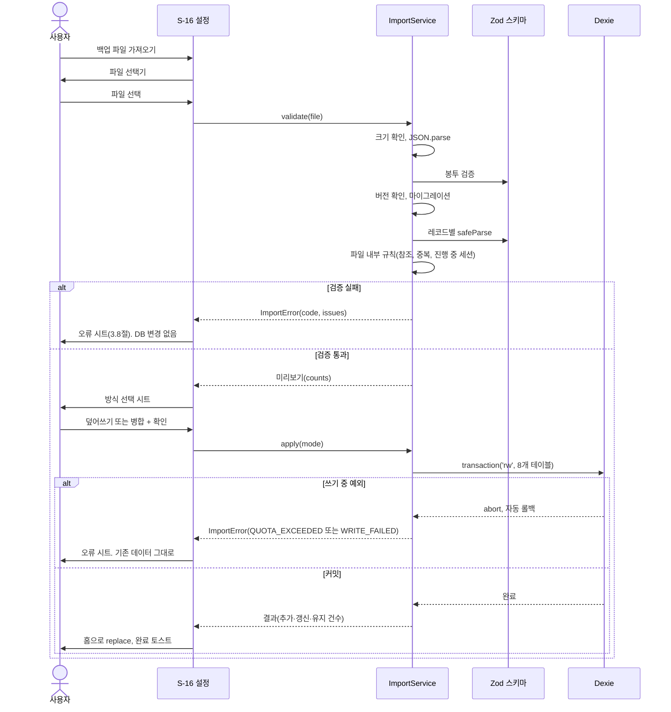

# 데이터 내보내기·가져오기(F-IO)와 설정 화면 상세 기능 명세

- 작업: FP-20 (상위: FP-11 헬스 플래너 MVP 기능 상세 명세)
- 작성일: 2026-10-01
- 상태: 초안
- 대상 화면: S-16 설정·데이터 관리 (`/settings`)
- 기준 문서
  - [기능 정의서 및 MVP 범위](../feature-definition.md) 2.6절(F-IO), 5장(S-16), 7장(확장 대비 원칙)
  - [데이터 모델·도메인 규칙 v1](../../1.architectur/mvp-design/data-model-v1.md) 1~3장(엔티티·스키마), 7.2절(가져오기와 진행 중 세션), 8장(검증 위치)
  - [공통 UI·IA·내비게이션 명세](../../1.architectur/mvp-design/ia-navigation.md) 3장(공통 컴포넌트), 4장(와이어프레임 표기), 5장(공통 UX 규칙)
  - [사전조사 종합 요약 및 의사결정](../../1.architectur/pre-research-summary.md) ADR-001(Capacitor), ADR-002(Dexie, `storage.persist`), ADR-005(Zod), C-7(휴식 시간), C-9(LWW 시각), R-1·R-7
  - [기본 운동 시드 목록](../../1.architectur/mvp-design/exercise-seed.md) 4.1절(고정 UUID)

## 0. 범위

| ID | 기능 | MoSCoW | 이 문서 |
| --- | --- | --- | --- |
| F-IO-01 | 전체 데이터 JSON 내보내기 | M | 상세(2장) |
| F-IO-02 | JSON 가져오기(복원) | M | 상세(3장) |
| — | 설정 화면(휴식 타이머 기본값, 저장소 보존 안내) | M | 상세(5장) |
| F-IO-03 | CSV 내보내기 | S | 요약(6.1절) |
| F-IO-05 | 가져오기 충돌 처리(덮어쓰기/병합, LWW) | S | 요약(6.2절) |
| F-IO-04 | CSV 가져오기 | C | 다루지 않음 |

- 이 문서는 데이터 모델 v1의 **엔티티 8개 전체**(Exercise, Routine, RoutineExercise, WeeklyPlan, WorkoutSession, WorkoutSet, BodyMeasurement, Settings)를 내보내기·가져오기 대상으로 한다.
- F-IO-05(S)를 MVP에 넣지 못하면 가져오기는 **덮어쓰기만** 제공한다. 이 경우 3.5절의 방식 선택 영역을 숨기고 나머지 규칙은 그대로 따른다.

---

## 1. 용어

| 용어 | 뜻 |
| --- | --- |
| 백업 파일 | F-IO-01로 만든 JSON 파일. 2.2절 구조를 따른다. |
| 봉투(envelope) | 백업 파일의 최상위 메타 정보(`format`, `schemaVersion`, `exportedAt` 등). |
| 레코드 | `data` 안 엔티티 배열의 원소 1개. |
| 현재 스키마 버전 | 앱 코드의 `SCHEMA_VERSION`(Dexie 버전 번호, 데이터 모델 3.1절). v1 앱은 `1`. |
| 덮어쓰기 | 기기의 데이터를 모두 지우고 파일 내용으로 바꾸는 가져오기. |
| 병합 | 기기의 데이터를 두고 `id`별로 `updatedAt`이 늦은 쪽을 남기는 가져오기(F-IO-05). |
| 롤백 | 가져오기 쓰기 중 실패하면 기기 데이터를 가져오기 전 상태로 되돌리는 것. |

---

## 2. F-IO-01 전체 데이터 JSON 내보내기 (M)

### 2.1 동작 요약

1. 사용자가 S-16에서 `JSON으로 내보내기`를 누른다.
2. 8개 테이블을 **하나의 읽기 트랜잭션**(`db.transaction('r', 모든 테이블, …)`)으로 모두 읽는다. 진행 중 세션의 세트 저장과 겹쳐도 한 시점의 일관된 스냅숏을 얻기 위해서다.
3. 2.2절 구조로 JSON 문자열을 만든다(`JSON.stringify(payload)`, 들여쓰기 없음).
4. 2.4절 파일명으로 플랫폼별 저장·공유를 실행한다(4장).
5. 성공하면 `lastBackupAt`(5.2절)을 갱신하고 `<< 백업 파일을 저장했어요 >>` 토스트를 띄운다.

| 규칙 | 내용 |
| --- | --- |
| 포함 범위 | 모든 레코드. **soft delete된 레코드(`deletedAt != null`)도 포함**한다. 병합 시 삭제 사실을 전파하기 위해서다(기능 정의서 7.3절). |
| 기본 운동 | `isCustom=false`인 기본 운동도 포함한다. 다른 버전 앱(시드 개정 전후)으로 가져올 때도 참조가 끊기지 않게 하기 위해서다. |
| 진행 중 세션 | `IN_PROGRESS` 세션과 그 세트, `restTimerEndsAt`도 그대로 포함한다. |
| 값 변환 | 하지 않는다. DB에 저장된 값(코드값, kg, UTC ISO 문자열)을 그대로 쓴다. |
| 자체 검사 | 내보내기 직전에 3.3절 Zod 스키마로 자체 검사한다. 오류가 있어도 **내보내기는 막지 않고**(백업이 우선) 경고 토스트 `<< 일부 데이터가 규칙과 맞지 않아요. 이 파일은 가져오기가 실패할 수 있어요 >>`를 띄우고 상세는 콘솔에 남긴다. |
| 처리 중 | 버튼 비활성 + 스피너. 같은 버튼 이중 실행을 막는다. |
| 실패 | 읽기·파일 쓰기 실패 시 오류 토스트 `<< 내보내지 못했어요   [다시 시도] >>`. `lastBackupAt`은 갱신하지 않는다. |

### 2.2 JSON 파일 구조

```ts
interface BackupFileV1 {
  format: 'my-fitness-planner-backup'; // 이 앱의 백업 파일 식별자(고정)
  schemaVersion: number;               // 정수, 데이터 모델 3.1절 SCHEMA_VERSION
  exportedAt: string;                  // UTC ISO 8601, 내보낸 시각
  app: {
    version: string;                   // 앱 버전(package.json version)
    platform: 'web' | 'android';       // 내보낸 환경(정보용, 검증에 쓰지 않음)
  };
  counts: Record<TableName, number>;   // 테이블별 레코드 수(soft delete 포함). 미리보기·잘림 검사용
  data: {
    exercises: Exercise[];
    routines: Routine[];
    routineExercises: RoutineExercise[];
    weeklyPlans: WeeklyPlan[];
    workoutSessions: WorkoutSession[];
    workoutSets: WorkoutSet[];
    bodyMeasurements: BodyMeasurement[];
    settings: Settings[];              // 항상 1개. 다른 엔티티와 같은 모양으로 두기 위해 배열로 둔다
  };
}

type TableName =
  | 'exercises' | 'routines' | 'routineExercises' | 'weeklyPlans'
  | 'workoutSessions' | 'workoutSets' | 'bodyMeasurements' | 'settings';
```

- `data`의 키 이름은 Dexie 테이블 이름(데이터 모델 3.1절)과 같다. 레코드 필드는 데이터 모델 9장 TypeScript 타입과 같다.
- 키 순서는 위와 같이 고정한다(사람이 읽기 쉽게). 가져오기는 키 순서에 의존하지 않는다.
- 알 수 없는 최상위 키는 가져올 때 무시한다(같은 `schemaVersion` 안에서 정보용 키를 더할 수 있도록).

### 2.3 예시 파일

8개 엔티티를 모두 담은 예시다. 사람이 읽도록 들여쓰기했으며 실제 파일은 한 줄이다.
기록 유형별 규칙(데이터 모델 4.1절)을 보이기 위해 `WEIGHT_REPS` 기본 운동(바벨 벤치프레스)과 `DURATION` 사용자 정의 운동(링 서포트 홀드)을 넣었고, soft delete된 세트 1개를 포함했다.

```json
{
  "format": "my-fitness-planner-backup",
  "schemaVersion": 1,
  "exportedAt": "2026-09-24T12:10:00.000Z",
  "app": { "version": "0.1.0", "platform": "android" },
  "counts": {
    "exercises": 2,
    "routines": 1,
    "routineExercises": 2,
    "weeklyPlans": 1,
    "workoutSessions": 1,
    "workoutSets": 3,
    "bodyMeasurements": 1,
    "settings": 1
  },
  "data": {
    "exercises": [
      {
        "id": "0192a000-0000-7000-8000-000000000001",
        "createdAt": "2026-08-01T09:00:00.000Z",
        "updatedAt": "2026-08-01T09:00:00.000Z",
        "deletedAt": null,
        "name": "바벨 벤치프레스",
        "primaryMuscle": "CHEST",
        "secondaryMuscles": ["TRICEPS", "SHOULDERS"],
        "equipment": "BARBELL",
        "trackingType": "WEIGHT_REPS",
        "isCustom": false
      },
      {
        "id": "01990a1c-4f20-7b3a-9c11-2d5e8f7a0b01",
        "createdAt": "2026-08-20T10:15:00.000Z",
        "updatedAt": "2026-08-20T10:15:00.000Z",
        "deletedAt": null,
        "name": "링 서포트 홀드",
        "primaryMuscle": "SHOULDERS",
        "secondaryMuscles": ["TRICEPS", "ABS"],
        "equipment": "OTHER",
        "trackingType": "DURATION",
        "isCustom": true
      }
    ],
    "routines": [
      {
        "id": "01990a1d-1a00-7c44-8e21-5b6c7d8e9f02",
        "createdAt": "2026-08-20T10:20:00.000Z",
        "updatedAt": "2026-09-01T11:00:00.000Z",
        "deletedAt": null,
        "name": "상체 A",
        "note": ""
      }
    ],
    "routineExercises": [
      {
        "id": "01990a1d-1a10-7d55-9f32-6c7d8e9fa003",
        "createdAt": "2026-08-20T10:20:00.000Z",
        "updatedAt": "2026-09-01T11:00:00.000Z",
        "deletedAt": null,
        "routineId": "01990a1d-1a00-7c44-8e21-5b6c7d8e9f02",
        "exerciseId": "0192a000-0000-7000-8000-000000000001",
        "orderIndex": 0,
        "targetSets": 3,
        "targetReps": 10,
        "targetWeight": 60,
        "targetDurationSec": null,
        "restSec": null
      },
      {
        "id": "01990a1d-1a20-7e66-a043-7d8e9fab0004",
        "createdAt": "2026-08-20T10:20:00.000Z",
        "updatedAt": "2026-09-01T11:00:00.000Z",
        "deletedAt": null,
        "routineId": "01990a1d-1a00-7c44-8e21-5b6c7d8e9f02",
        "exerciseId": "01990a1c-4f20-7b3a-9c11-2d5e8f7a0b01",
        "orderIndex": 1,
        "targetSets": 2,
        "targetReps": null,
        "targetWeight": null,
        "targetDurationSec": 30,
        "restSec": null
      }
    ],
    "weeklyPlans": [
      {
        "id": "01990a1e-0000-7f77-b154-8e9fabc10005",
        "createdAt": "2026-08-20T10:30:00.000Z",
        "updatedAt": "2026-08-20T10:30:00.000Z",
        "deletedAt": null,
        "dayOfWeek": 1,
        "routineId": "01990a1d-1a00-7c44-8e21-5b6c7d8e9f02"
      }
    ],
    "workoutSessions": [
      {
        "id": "01997a20-3c00-7a88-8265-9fabcd210006",
        "createdAt": "2026-09-21T10:00:00.000Z",
        "updatedAt": "2026-09-21T11:05:00.000Z",
        "deletedAt": null,
        "routineId": "01990a1d-1a00-7c44-8e21-5b6c7d8e9f02",
        "status": "COMPLETED",
        "startedAt": "2026-09-21T10:00:00.000Z",
        "endedAt": "2026-09-21T11:05:00.000Z",
        "note": "",
        "restTimerEndsAt": null
      }
    ],
    "workoutSets": [
      {
        "id": "01997a20-3c10-7b99-9376-abcde3210007",
        "createdAt": "2026-09-21T10:00:00.000Z",
        "updatedAt": "2026-09-21T10:12:30.000Z",
        "deletedAt": null,
        "sessionId": "01997a20-3c00-7a88-8265-9fabcd210006",
        "exerciseId": "0192a000-0000-7000-8000-000000000001",
        "exerciseOrder": 0,
        "setOrder": 0,
        "setType": "NORMAL",
        "weight": 60,
        "reps": 10,
        "durationSec": null,
        "rpe": 8,
        "isCompleted": true,
        "completedAt": "2026-09-21T10:12:30.000Z"
      },
      {
        "id": "01997a20-3c20-7caa-a487-bcdef4320008",
        "createdAt": "2026-09-21T10:00:00.000Z",
        "updatedAt": "2026-09-21T10:51:00.000Z",
        "deletedAt": null,
        "sessionId": "01997a20-3c00-7a88-8265-9fabcd210006",
        "exerciseId": "01990a1c-4f20-7b3a-9c11-2d5e8f7a0b01",
        "exerciseOrder": 1,
        "setOrder": 0,
        "setType": "NORMAL",
        "weight": null,
        "reps": null,
        "durationSec": 30,
        "rpe": null,
        "isCompleted": true,
        "completedAt": "2026-09-21T10:51:00.000Z"
      },
      {
        "id": "01997a20-3c30-7dbb-b598-cdef05430009",
        "createdAt": "2026-09-21T10:00:00.000Z",
        "updatedAt": "2026-09-21T11:05:00.000Z",
        "deletedAt": "2026-09-21T11:05:00.000Z",
        "sessionId": "01997a20-3c00-7a88-8265-9fabcd210006",
        "exerciseId": "01990a1c-4f20-7b3a-9c11-2d5e8f7a0b01",
        "exerciseOrder": 1,
        "setOrder": 1,
        "setType": "NORMAL",
        "weight": null,
        "reps": null,
        "durationSec": 30,
        "rpe": null,
        "isCompleted": false,
        "completedAt": null
      }
    ],
    "bodyMeasurements": [
      {
        "id": "01997f31-0000-7ecc-86a9-def016540010",
        "createdAt": "2026-09-22T22:30:00.000Z",
        "updatedAt": "2026-09-22T22:30:00.000Z",
        "deletedAt": null,
        "measuredOn": "2026-09-23",
        "weightKg": 72.4,
        "bodyFatPercent": 18.5,
        "skeletalMuscleKg": 33.1,
        "note": "공복"
      }
    ],
    "settings": [
      {
        "id": "0192a000-0000-7000-8000-000000000000",
        "createdAt": "2026-08-01T09:00:00.000Z",
        "updatedAt": "2026-09-10T08:00:00.000Z",
        "deletedAt": null,
        "defaultRestSec": 90,
        "weightUnit": "KG",
        "weekStartsOn": 1
      }
    ]
  }
}
```

- 세 번째 세트는 세션 종료 때 미완료로 soft delete된 세트다(데이터 모델 7.1절). 내보내기에 그대로 들어간다.
- Settings의 `id`는 예시 값이다. 실제 값은 코드 상수 `SETTINGS_ID`를 따른다(데이터 모델 2.8절).

### 2.4 파일명 규칙

| 파일 | 형식 | 예 |
| --- | --- | --- |
| JSON 백업 | `fitness-planner-backup-YYYYMMDD-HHmmss.json` | `fitness-planner-backup-20260924-211000.json` |
| CSV 운동 기록(F-IO-03) | `fitness-planner-sets-YYYYMMDD-HHmmss.csv` | `fitness-planner-sets-20260924-211000.csv` |
| CSV 체성분(F-IO-03) | `fitness-planner-body-YYYYMMDD-HHmmss.csv` | `fitness-planner-body-20260924-211000.csv` |

- 날짜·시각은 `exportedAt`을 **사용자 로컬 시간대**로 바꾼 값이다(위 예는 KST, `exportedAt`은 `2026-09-24T12:10:00.000Z`). 파일 목록에서 사람이 알아보기 쉽게 하기 위해서다.
- 영문 소문자·숫자·하이픈만 쓴다. 공백·한글·콜론을 넣지 않는다(Android 공유 대상 앱, Windows 파일 시스템 호환).
- 같은 초에 두 번 내보내면 웹은 브라우저가 ` (1)`을 붙이고, Android는 캐시 파일을 덮어쓴다(4.2절). 별도 처리하지 않는다.
- 파일명 생성은 `src/domain/backup/fileName.ts` 한 곳에 두고 date-fns `format(date, 'yyyyMMdd-HHmmss')`를 쓴다.

---

## 3. F-IO-02 JSON 가져오기(복원) (M)

### 3.1 처리 단계

가져오기는 **검증(1~6단계)을 모두 통과해야만 쓰기(8단계)를 시작**한다. 검증 단계에서는 DB를 바꾸지 않는다.

| 단계 | 내용 | 실패 시 오류 코드 |
| --- | --- | --- |
| 1. 파일 선택 | `가져오기` → 파일 선택기(4장). 취소하면 아무 일도 없다. | — |
| 2. 크기 확인 | 50 MB 이하 | `FILE_TOO_LARGE` |
| 3. 읽기·파싱 | `await file.text()` → `JSON.parse` | `NOT_JSON` |
| 4. 봉투 검증 | 봉투 Zod 스키마(3.3절). `format` 일치, `schemaVersion` 양의 정수, `exportedAt` ISO, `data`가 객체 | `NOT_BACKUP`, `VERSION_INVALID` |
| 5. 버전 확인·마이그레이션 | 3.2절 | `VERSION_TOO_NEW`, `MIGRATION_FAILED` |
| 6-1. 레코드 검증 | 엔티티별 Zod 스키마로 **레코드마다** `safeParse`. 오류를 모아 둔다(최대 1,000건) | `RECORD_INVALID` |
| 6-2. 파일 내부 규칙 | 3.4절(테이블 안 `id` 중복, 참조, 진행 중 세션 1개, 중복 금지 규칙, `counts` 일치) | `INTEGRITY` |
| 7. 미리보기·방식 선택·확인 | 레코드 수 요약, 덮어쓰기/병합 선택(3.5절), 덮어쓰기 확인 다이얼로그. 병합 사전 조건(진행 중 세션) 검사 | `SESSION_IN_PROGRESS` |
| 8. 쓰기 | 하나의 `rw` 트랜잭션(3.6절). 실패하면 롤백 | `QUOTA_EXCEEDED`, `WRITE_FAILED` |
| 9. 마무리 | 시드 보정, UI 상태 초기화, 홈으로 replace 이동, 결과 토스트(3.7절) | — |



### 3.2 버전 확인

| 파일 `schemaVersion` | 처리 |
| --- | --- |
| 정수가 아님, 0 이하, 없음 | `VERSION_INVALID`로 거부 |
| 현재 스키마 버전보다 큼 | `VERSION_TOO_NEW`로 거부. 앱 업데이트를 안내한다. 아래 단계로 진행하지 않는다. |
| 현재 스키마 버전과 같음 | 그대로 6단계로 |
| 현재 스키마 버전보다 작음 | `migrations[v]`를 `v → v+1` 순서로 메모리에서 적용한 뒤 6단계로. 하나라도 실패하면 `MIGRATION_FAILED` |

- 마이그레이션 함수는 Dexie `upgrade()`와 같은 변환을 **JSON 데이터에 대해** 수행하는 순수 함수다(`src/domain/backup/migrations.ts`). Dexie 스키마를 올릴 때마다 같은 버전의 백업 마이그레이션을 함께 추가하고 단위 테스트로 묶는다.
- v1 앱에는 `schemaVersion=1`보다 낮은 버전이 없으므로 마이그레이션 함수는 비어 있다. 구조만 미리 둔다.
- 하위 버전으로 내보내는 기능(다운그레이드)은 만들지 않는다.

### 3.3 Zod 스키마

봉투와 엔티티 스키마는 폼 검증과 같은 스키마 모듈(`src/domain/schemas`)에서 가져와 쓴다(ADR-005, 데이터 모델 8장).

```ts
// src/domain/backup/schema.ts (초안)
export const BACKUP_FORMAT = 'my-fitness-planner-backup';

// 4단계: 봉투. data 안쪽은 아직 검사하지 않는다(버전마다 모양이 다를 수 있음)
export const BackupEnvelopeSchema = z.object({
  format: z.literal(BACKUP_FORMAT),
  schemaVersion: z.number().int().positive(),
  exportedAt: IsoDateTimeSchema,
  app: z.object({ version: z.string(), platform: z.string() }).partial().optional(),
  counts: z.record(z.string(), z.number().int().nonnegative()).optional(),
  data: z.record(z.string(), z.unknown()),
});

// 6-1단계: 현재 버전 레코드. 엔티티 스키마는 데이터 모델 2장 범위를 그대로 옮긴다
export const BackupTablesV1 = {
  exercises: ExerciseSchema,
  routines: RoutineSchema,
  routineExercises: RoutineExerciseSchema,   // trackingType별 target 필드 규칙은 6-2단계(참조 필요)
  weeklyPlans: WeeklyPlanSchema,
  workoutSessions: WorkoutSessionSchema,     // status별 endedAt·restTimerEndsAt 규칙(refine)
  workoutSets: WorkoutSetSchema,             // isCompleted별 completedAt 규칙(refine). trackingType 규칙은 6-2단계
  bodyMeasurements: BodyMeasurementSchema,   // skeletalMuscleKg <= weightKg (refine)
  settings: SettingsSchema,
} as const;
```

- 모든 테이블 키가 `data`에 있어야 한다. 키가 없으면 `RECORD_INVALID`(`"{테이블} 목록이 없어요"`)로 본다. 단, `settings`가 빈 배열이면 기본값으로 만든다(3.6절).
- 레코드의 **알 수 없는 필드는 제거**(Zod 기본 strip)하고 오류로 보지 않는다.
- 레코드를 배열 전체 한 번이 아니라 **레코드마다** `safeParse`한다. 그래야 오류에 "몇 번째 레코드, 어떤 `id`"를 붙일 수 있다.
- `WorkoutSet`의 `weight`/`reps`/`durationSec` 규칙(데이터 모델 4.1절)과 `RoutineExercise`의 목표 필드 규칙은 소속 운동의 `trackingType`이 필요하므로 6-2단계에서 검사한다. 오류 형식은 6-1단계와 같다.
- `measuredOn`이 "오늘(로컬) 이하"라는 규칙과 `startedAt`이 "현재 시각 이하"라는 규칙은 가져오기에서는 **검사하지 않는다**(기기 시계 차이로 정상 백업이 거부되는 것을 막기 위해).

### 3.4 파일 내부 규칙 (6-2단계)

"기준" 열이 `살아 있는 것`인 규칙은 `deletedAt === null`인 레코드끼리만 비교하고, `전체`인 규칙은 soft delete된 레코드도 포함해 검사한다.

| 규칙 | 기준 | 오류 문구 예 |
| --- | --- | --- |
| 테이블 안 `id` 중복 없음 | 전체 | `id가 중복돼요` |
| 참조 무결성: `routineExercises.routineId/exerciseId`, `weeklyPlans.routineId`, `workoutSessions.routineId`(null 제외), `workoutSets.sessionId/exerciseId`가 파일 안(또는 앱 기본 운동 시드)에 있음 | 전체 | `연결된 운동(…)을 찾을 수 없어요` |
| `trackingType`별 필드 규칙(데이터 모델 4.1절, 2.3절) | 전체 | `시간 기록 운동에는 중량을 넣을 수 없어요` |
| `IN_PROGRESS` 세션 최대 1개(데이터 모델 7.2절) | 살아 있는 것 | `진행 중 세션이 2개 이상이에요` |
| `weeklyPlans.dayOfWeek` 중복 없음 | 살아 있는 것 | `같은 요일에 루틴이 2개 배정돼 있어요` |
| `bodyMeasurements.measuredOn` 중복 없음 | 살아 있는 것 | `같은 날짜 측정 기록이 2개예요` |
| `exercises.name` 중복 없음(대소문자·공백 무시) | 살아 있는 것 | `같은 이름의 운동이 2개예요` |
| `settings` 0~1개 | 전체 | `설정이 2개 이상이에요` |
| `counts`가 있으면 배열 길이와 일치 | — | `파일이 잘렸거나 손상됐어요` |

- 기본 운동 참조: `workoutSets.exerciseId`가 파일 `exercises`에 없더라도 **현재 앱 시드에 있는 고정 UUID**면 통과한다(사용자가 손으로 편집한 파일 대비).

### 3.5 일부 레코드 오류 처리 원칙 — 전부 아니면 전무

- 레코드 하나라도 6-1·6-2단계 오류가 있으면 **파일 전체를 가져오지 않는다.** 오류 없는 레코드만 골라 넣는 부분 가져오기는 하지 않는다.
- 이유
  - 레코드끼리 참조로 엮여 있어(세션-세트-운동) 일부만 넣으면 고아 레코드나 빈 세션이 생기고 통계가 조용히 틀어진다.
  - 백업 파일은 앱이 만든 파일이므로, 오류가 있다는 것은 파일 손상이나 수동 편집을 뜻한다. 사용자가 다른 백업을 고르거나 파일을 고치는 편이 안전하다.
- 오류 목록은 테이블별로 묶어 보여 주고(3.8절), 화면에는 처음 20건, `오류 내용 복사`에는 모은 오류 전부(최대 1,000건)를 넣는다.

### 3.6 쓰기와 롤백

```ts
// ImportService.apply (초안)
await db.transaction('rw', ALL_TABLES, async () => {
  if (mode === 'overwrite') {
    await Promise.all(ALL_TABLES.map((t) => t.clear()));
    for (const [table, rows] of entries(data)) await db.table(table).bulkAdd(rows);
  } else {
    await mergeLww(data);              // 6.2절. 읽기·비교·쓰기 모두 이 트랜잭션 안
  }
  await ensureSeedExercises();         // 앱 시드에 있는데 DB에 없는 기본 운동 추가
  await ensureSettings();              // settings가 비었으면 기본값 레코드 생성
});
```

| 규칙 | 내용 |
| --- | --- |
| 단일 트랜잭션 | 8개 테이블 전체를 한 `rw` 트랜잭션에서 쓴다. 트랜잭션 안에서 예외가 나면 Dexie가 abort하고 IndexedDB가 **모든 변경을 되돌린다**. 별도의 수동 롤백 코드는 두지 않는다. |
| 트랜잭션 안 금지 | `fetch`, `setTimeout`, 파일 읽기 등 Dexie가 아닌 비동기 작업을 트랜잭션 안에서 기다리지 않는다(트랜잭션이 자동 커밋돼 일부만 쓰일 수 있음). 파일 읽기·파싱·검증은 트랜잭션 **전에** 끝낸다. |
| `bulkAdd` | 덮어쓰기는 `clear()` 뒤라 `bulkAdd`를 쓴다. 예상치 못한 키 충돌도 예외로 드러나 롤백된다. |
| 앱 강제 종료 | 커밋 전 종료되면 IndexedDB가 트랜잭션을 버리므로 기존 데이터가 남는다. |
| 용량 부족 | `QuotaExceededError` → 롤백 후 `QUOTA_EXCEEDED` 오류 시트. |
| 기타 예외 | 롤백 후 `WRITE_FAILED` 오류 시트. 예외 상세는 콘솔에만 남긴다(ia-navigation 5.5절). |
| UI 상태 | Zustand 상태(휴식 타이머 표시, 선택 모드 임시 목록)는 **커밋 성공 후에만** 초기화한다. 롤백되면 그대로 둔다. |
| 미리 백업 | 자동 백업은 하지 않는다. 덮어쓰기 확인 다이얼로그에 `현재 데이터 먼저 내보내기` 버튼을 둔다(ia-navigation 5.4절). |

- 기본 운동 처리: 덮어쓰기 후 `ensureSeedExercises()`는 `id` 기준으로 **없는 기본 운동만** 추가한다. 파일에 있는 기본 운동 레코드는 그대로 둔다(같은 고정 UUID라 값도 같다).

### 3.7 가져오기 후 처리

| 항목 | 처리 |
| --- | --- |
| 화면 이동 | 홈(S-01)으로 replace(ia-navigation 2.3절). 뒤로 가기로 설정 화면의 가져오기 시트로 돌아가지 않는다. |
| 결과 토스트 | 덮어쓰기: `<< 백업 파일로 데이터를 바꿨어요 >>`. 병합: `<< 가져오기를 마쳤어요. 추가 N건, 갱신 M건 >>` |
| 진행 중 세션 | 가져온 데이터에 살아 있는 `IN_PROGRESS` 세션이 있으면 앱 시작 때와 같은 복구 절차(F-WS-11)를 실행한다. `restTimerEndsAt`이 지났으면 `null`로 지운다. |
| 실행 취소 | 제공하지 않는다(ia-navigation 5.4절). |
| `lastBackupAt` | 바꾸지 않는다(가져오기는 백업이 아님). |

### 3.8 오류 코드와 메시지

모든 오류는 S-16 위 바텀시트 "가져오지 못했어요"(3.10절 와이어프레임 C~E)로 보여 준다. 오류 시트에는 항상 "기존 데이터는 바뀌지 않았어요"를 함께 쓴다.

| 코드 | 원인 | 메시지 | 버튼 |
| --- | --- | --- | --- |
| `FILE_TOO_LARGE` | 50 MB 초과 | 파일이 너무 커요(최대 50 MB). | 다른 파일 선택 / 닫기 |
| `NOT_JSON` | JSON 파싱 실패 | 이 앱의 백업 파일이 아니에요. JSON으로 내보내기로 만든 파일을 선택해 주세요. | 다른 파일 선택 / 닫기 |
| `NOT_BACKUP` | `format` 불일치·없음, 봉투 구조 오류 | (위와 같음) | 다른 파일 선택 / 닫기 |
| `VERSION_INVALID` | `schemaVersion`이 양의 정수가 아님 | 파일의 버전 정보가 올바르지 않아요. | 다른 파일 선택 / 닫기 |
| `VERSION_TOO_NEW` | 파일 버전 > 현재 버전 | 더 새로운 앱에서 만든 파일이에요. 앱을 최신 버전으로 업데이트한 뒤 다시 가져와 주세요. (파일 버전 N / 이 앱 버전 M) | 닫기 |
| `MIGRATION_FAILED` | 하위 버전 변환 실패 | 이전 버전 파일을 변환하지 못했어요. | 오류 내용 복사 / 닫기 |
| `RECORD_INVALID` | 6-1단계 레코드 오류 | 레코드 T개 중 N개에 오류가 있어요. | 오류 내용 복사 / 닫기 |
| `INTEGRITY` | 6-2단계 규칙 위반 | 파일 안 데이터가 서로 맞지 않아요. (오류 목록) | 오류 내용 복사 / 닫기 |
| `SESSION_IN_PROGRESS` | 병합인데 기기에 진행 중 세션이 있음 | 진행 중인 운동 세션이 있어요. 세션을 끝내거나 취소한 뒤 다시 가져와 주세요. | 세션으로 이동 / 닫기 |
| `QUOTA_EXCEEDED` | 쓰기 중 용량 부족 | 저장 공간이 부족해 가져오지 못했어요. | 닫기 |
| `WRITE_FAILED` | 그 밖의 쓰기 실패 | 가져오는 중 문제가 생겼어요. 다시 시도해 주세요. | 다시 시도 / 닫기 |

레코드 오류 한 줄의 형식은 `- {n}번째: {필드 라벨} {규칙 문구}`이며, Zod issue를 아래처럼 바꾼다. 필드 라벨은 폼 검증과 같은 사전(`fieldLabels.ts`)을 쓴다.

| Zod issue | 문구 | 예 |
| --- | --- | --- |
| `invalid_type`(값 없음) | `{라벨} 값이 필요해요` | `- 1,033번째: 횟수 값이 필요해요` |
| `invalid_type`(타입 다름) | `{라벨} 형식이 올바르지 않아요` | `- 12번째: 측정일 형식이 올바르지 않아요` |
| `too_big` / `too_small` | `{라벨}은(는) {max} 이하여야 해요` / `{min} 이상이어야 해요` | `- 812번째: 중량은 1000 이하여야 해요` |
| `invalid_enum_value` | `{라벨} 값({값})을 알 수 없어요` | `- 3번째: 주 부위 값(LEGS)을 알 수 없어요` |
| `custom`(refine) | refine에 정의한 문구 | `- 40번째: 완료한 세트에는 완료 시각이 필요해요` |

`오류 내용 복사`는 아래 형식의 일반 텍스트를 클립보드에 넣는다(사용자가 문의할 때 붙여 넣는 용도).

```text
[가져오기 오류] RECORD_INVALID  schemaVersion=1  exportedAt=2026-09-24T12:10:00.000Z
workoutSets[811] id=01997a20-... weight: Number must be less than or equal to 1000
workoutSets[1032] id=01997a20-... reps: Required
bodyMeasurements[11] id=01997f31-... measuredOn: Invalid date
```

### 3.9 덮어쓰기 확인

- 확인 다이얼로그(`ConfirmDialog`, `tone='destructive'`, 확인 라벨 `덮어쓰기`).
- 설명에 **기기의 현재 데이터 건수**(살아 있는 세션 수, 체성분 기록 수)를 넣는다.
- 기기에 진행 중 세션이 있으면 설명에 "진행 중인 세션도 사라져요."를 덧붙인다(덮어쓰기는 진행 중 세션이 있어도 막지 않는다).
- `현재 데이터 먼저 내보내기` 버튼은 다이얼로그를 닫지 않고 2장 내보내기를 실행한다. 성공하면 버튼 옆에 "내보냄" 표시를 붙인다.

### 3.10 와이어프레임

#### A. 가져오기 방식 선택 시트 (검증 통과 후)

```text
+======================================+
| 백업 파일 가져오기                #1 |
| ...backup-20260924-211000.json       |
| 내보낸 날  9월 24일 (목) 21:10    #2 |
| 운동 기록 128회, 세트 2,304개        |
| 루틴 6개, 체성분 41건                |
|                                      |
| 가져오는 방식                     #3 |
| [ *병합* | 덮어쓰기 ]                |
| 기존 기록은 두고, 같은 항목은        |
| 최근에 수정된 쪽을 남겨요.           |
|                                      |
| [ 취소 ]            [[  가져오기  ]] |
+======================================+
```

| # | 요소 | 동작·규칙 |
| --- | --- | --- |
| 1 | 제목·파일명 | 파일명이 36칸을 넘으면 앞부분을 `...`으로 줄인다 |
| 2 | 미리보기 | `exportedAt`을 로컬 기본 날짜 형식 + 시각(ia-navigation 5.2절). 건수는 **살아 있는 레코드** 기준: 세션(`COMPLETED`), 세트(완료), 루틴, 체성분 |
| 3 | 방식 선택 | `Tabs`(세그먼트). 기본값 `병합`. `덮어쓰기`를 고르면 설명이 "기기의 데이터를 모두 지우고 파일 내용으로 바꿔요."로 바뀐다. F-IO-05 미구현 시 이 영역을 숨기고 덮어쓰기로 동작한다 |
| — | `가져오기` | 병합: 사전 조건(진행 중 세션 없음) 확인 후 바로 쓰기. 덮어쓰기: 3.9절 확인 다이얼로그. 쓰는 동안 시트 `busy=true`(닫기 불가, 버튼 스피너) |

#### B. 덮어쓰기 확인 다이얼로그

```text
+======================================+
| 현재 데이터를 모두 바꿀까요?         |
|                                      |
| 지금 기기의 운동 기록 128회와        |
| 체성분 41건이 파일 내용으로          |
| 바뀝니다. 되돌릴 수 없어요.          |
|                                      |
| [ 현재 데이터 먼저 내보내기 ]     #1 |
|             [ 취소 ]  [! 덮어쓰기 ]  |
+======================================+
```

| # | 요소 | 동작·규칙 |
| --- | --- | --- |
| 1 | 먼저 내보내기 | 2장 내보내기 실행. 다이얼로그는 유지. 처음 포커스는 `취소`(destructive 규칙) |

#### C. 오류 — 잘못된 파일 (`NOT_JSON`, `NOT_BACKUP`)

```text
+======================================+
| 가져오지 못했어요                    |
| ! 이 앱의 백업 파일이 아니에요.      |
| JSON으로 내보내기로 만든 파일을      |
| 선택해 주세요.                       |
| 기존 데이터는 바뀌지 않았어요.       |
|                                      |
|       [ 다른 파일 선택 ]  [[ 닫기 ]] |
+======================================+
```

#### D. 오류 — 상위 버전 파일 (`VERSION_TOO_NEW`)

```text
+======================================+
| 가져오지 못했어요                    |
| ! 더 새로운 앱에서 만든 파일이에요.  |
| 파일 버전 2 / 이 앱 버전 1           |
| 앱을 최신 버전으로 업데이트한 뒤     |
| 다시 가져와 주세요.                  |
| 기존 데이터는 바뀌지 않았어요.       |
|                                      |
|                          [[ 닫기 ]]  |
+======================================+
```

#### E. 오류 — 일부 레코드 오류 (`RECORD_INVALID`, `INTEGRITY`)

```text
+======================================+
| 가져오지 못했어요                    |
| ! 레코드 4,210개 중 3개에 오류가     |
|   있어요. 아무것도 바꾸지 않았어요.  |
|                                      |
| 세트 (workoutSets)                #1 |
| - 812번째: 중량은 1000 이하여야 해요 |
| - 1,033번째: 횟수 값이 필요해요      |
| 체성분 (bodyMeasurements)            |
| - 12번째: 측정일 형식이 올바르지     |
|   않아요                             |
|                                      |
|      [ 오류 내용 복사 ]  [[ 닫기 ]]  |
+======================================+
```

| # | 요소 | 동작·규칙 |
| --- | --- | --- |
| 1 | 오류 목록 | 테이블별로 묶는다. 번호는 1부터(사람 기준). 화면에는 처음 20건, 넘치면 마지막에 `외 N건`. 시트 본문만 스크롤 |
| — | `오류 내용 복사` | 3.8절 형식 텍스트를 클립보드로. 성공 시 `<< 오류 내용을 복사했어요 >>` |

---

## 4. Capacitor·웹에서 파일 저장과 공유

### 4.1 플랫폼 포트

화면·서비스 코드는 Capacitor 플러그인을 직접 부르지 않는다(사전조사 4장). `src/platform`에 포트를 두고 웹·Android 구현을 나눈다.

```ts
// src/platform/files.ts (초안)
export interface ExportFileInput {
  fileName: string;            // 2.4절 규칙
  mimeType: 'application/json' | 'text/csv';
  content: string;             // UTF-8 문자열. CSV는 BOM 포함
}

export type ExportResult = 'saved' | 'shared' | 'cancelled';

export interface FilePort {
  exportFile(input: ExportFileInput): Promise<ExportResult>;
  pickImportFile(): Promise<File | null>;   // 취소하면 null
}
```

### 4.2 Android (Capacitor)

| 단계 | 방법 |
| --- | --- |
| 1. 임시 파일 쓰기 | `@capacitor/filesystem`의 `Filesystem.writeFile({ path: 'exports/' + fileName, data: content, directory: Directory.Cache, encoding: Encoding.UTF8, recursive: true })` → 반환된 `uri` |
| 2. 공유 시트 | `@capacitor/share`의 `Share.share({ title: '헬스 플래너 백업', files: [uri] })` → Android 공유 시트. 사용자가 Google Drive, 내 파일(Files), 메신저 등 저장할 곳을 고른다 |
| 3. 결과 | 공유가 끝나면 `'shared'`. 사용자가 공유 시트를 닫으면 플러그인이 취소 오류를 던지므로 `'cancelled'`로 바꾼다 |
| 4. 정리 | 다음 내보내기 시작 때 `Directory.Cache`의 `exports/` 폴더를 비운다. 앱 캐시라 OS가 지워도 문제없다 |
| 가져오기 | `<input type="file">`를 쓴다(Capacitor WebView가 Android 파일 선택기를 연결한다). 일부 파일 관리자는 `.json`을 `application/octet-stream`으로 넘기므로 **Android에서는 `accept`를 지정하지 않고** 내용 검증(3.1절)으로 거른다 |

- 권한: 앱 캐시 쓰기와 공유 시트는 저장소 권한이 필요 없다. 다운로드 폴더에 직접 저장하는 방식은 Android 버전별 저장소 정책(스코프드 스토리지)과 권한 처리가 필요해 MVP에서는 하지 않는다. 공유 시트의 "파일에 저장"·Drive로 충분하다.
- `'cancelled'`이면 정보 토스트 `<< 내보내기를 취소했어요 >>`, `lastBackupAt`을 갱신하지 않는다.
- 공유를 마친 뒤 실제로 저장됐는지는 알 수 없다. `'shared'`면 백업한 것으로 본다.
- 플러그인 메서드·옵션 이름(`files` 옵션 지원 버전 등)은 도입 직전에 공식 문서로 다시 확인한다(R-4, **확인 필요**).

### 4.3 웹(PWA)

| 동작 | 방법 |
| --- | --- |
| 내보내기 | `new Blob([content], { type: mimeType })` → `URL.createObjectURL` → `<a download={fileName}>` 클릭 → `URL.revokeObjectURL`. 브라우저 다운로드 폴더에 저장된다. 완료 여부를 알 수 없으므로 바로 `'saved'` |
| 가져오기 | `<input type="file" accept=".json,application/json">` |
| 공유 | MVP 웹에서는 Web Share API로 파일을 공유하지 않는다(브라우저별 지원 차이). 모바일 브라우저도 다운로드로 처리한다 |

---

## 5. S-16 설정·데이터 관리 화면 (M)

- 경로 `/settings`, 하단 탭 "설정" 루트, 탭 바 표시(ia-navigation 2.1절).
- 관련 기능: F-IO-01~03, F-IO-05, 휴식 타이머 기본값(사전조사 2.2절, C-7), 저장소 보존(ADR-002, R-1).

### 5.1 와이어프레임 (모바일)

```text
+--------------------------------------+
| 설정                              #1 |
+--------------------------------------+
| 운동 기록                            |
| 휴식 타이머 기본값                #2 |
| [-|      01:30      |+]              |
| (60초) (*90초*) (2분) (3분)          |
| 무게 단위                      kg #3 |
| 주 시작 요일               월요일 #4 |
+--------------------------------------+
| 데이터                               |
| 마지막 백업  9월 24일 (목) 21:10  #5 |
| ! 마지막 백업 후 7일이 지났어요      |
| [[     JSON으로 내보내기      ]]  #6 |
| [ CSV로 내보내기 ]                #7 |
| [ 백업 파일 가져오기 ]            #8 |
+--------------------------------------+
| 저장소                               |
| 데이터 보존                보존됨 #9 |
| 사용량  3.2 MB / 약 1.2 GB       #10 |
| 앱을 지우면 데이터도 삭제돼요.       |
+--------------------------------------+
| 앱 정보  v0.1.0                > #11 |
+--------------------------------------+
| 홈  루틴  히스토리  체성분  *설정*   |
+--------------------------------------+
```

| # | 요소 | 동작·규칙 |
| --- | --- | --- |
| 1 | 헤더 | 탭 루트라 뒤로 버튼 없음 |
| 2 | 휴식 타이머 기본값 | `NumberStepper`(mm:ss 표시)와 프리셋 칩(`FilterChipGroup`, `single`). 값·범위는 5.2절. 칩은 현재 값과 같을 때만 선택 표시 |
| 3 | 무게 단위 | 읽기 전용 텍스트 `kg`. 누르지 않는다(Q-5) |
| 4 | 주 시작 요일 | 읽기 전용 텍스트 `월요일`(Q-3) |
| 5 | 마지막 백업 | `lastBackupAt`을 로컬 날짜·시각으로. 없으면 `아직 백업하지 않았어요`. 경고 줄은 5.3절 조건일 때만 보인다 |
| 6 | JSON으로 내보내기 | 2장. 화면의 유일한 Primary 버튼 |
| 7 | CSV로 내보내기 | 6.1절 대상 선택 시트. F-IO-03 미구현 시 숨김 |
| 8 | 백업 파일 가져오기 | 3장. 파일 선택기 → 검증(시트 `busy`, "파일을 확인하는 중…") → 3.10절 A 또는 C~E |
| 9 | 데이터 보존 | 상태 텍스트(5.4절). 누르면 저장소 안내 시트(5.4절) |
| 10 | 사용량 | `navigator.storage.estimate()`의 `usage / quota`. 지원하지 않으면 줄을 숨긴다. MB·GB는 소수 첫째 자리 |
| 11 | 앱 정보 | 앱 버전, 오픈소스 라이선스·기본 운동 데이터 출처(R-3) 화면으로. MVP에서는 시트 하나로 충분 |

- PC(`lg` 이상) 배치는 같은 세로 배치를 최대 폭 720px로 보여 준다(ia-navigation 1.3절). 별도 와이어프레임은 두지 않는다.

### 5.2 설정 항목 정의 (기본값과 범위)

| 항목 | 저장 위치 | 기본값 | 범위·허용값 | 변경 방법 | 비고 |
| --- | --- | --- | --- | --- | --- |
| 휴식 타이머 기본값 | `Settings.defaultRestSec` (DB, 내보내기 포함) | `90`초 (`01:30`) | 정수 **10~600초** | 스테퍼 `-`/`+`는 15초 단위, 프리셋 칩 `60`/`90`/`120`/`180`초, 입력칸 직접 입력(초 단위 정수 또는 `m:ss`) | 스테퍼는 15의 배수로 맞춘다(예: `10`에서 `+` → `15`, `600`에서 `+` 비활성, `15`에서 `-` → `10`). 범위 밖 직접 입력은 10/600으로 자른다 |
| 무게 단위 | `Settings.weightUnit` | `KG` | `KG`만 | 없음(읽기 전용) | lb는 MVP 이후(Q-5) |
| 주 시작 요일 | `Settings.weekStartsOn` | `1`(월요일) | `1` 고정 | 없음(읽기 전용) | Q-3 |
| 마지막 백업 시각 | `localStorage['fp.lastBackupAt']` (기기 로컬, 내보내기 제외) | 없음(`null`) | UTC ISO 문자열 | JSON 내보내기 성공 시 자동 갱신 | CSV 내보내기·가져오기는 갱신하지 않는다 |
| 백업 권장 주기 | 코드 상수 `BACKUP_REMIND_DAYS` | `7`일 | 고정 | 없음 | 5.3절 경고 기준 |
| 데이터 보존 상태 | 브라우저(`navigator.storage.persisted()`) | 앱 첫 실행 때 자동 요청 | `보존됨` / `보존 안 됨` / `확인할 수 없음` | 안내 시트의 `보존 요청` 버튼 | 5.4절 |
| 보존 요청 기록 | `localStorage['fp.persistRequestedAt']` | 없음 | UTC ISO 문자열 | 자동 요청 시 기록 | 자동 요청은 설치당 1회 |
| 가져오기 방식 | 저장하지 않음(시트 안 선택) | `병합` | `병합` / `덮어쓰기` | 3.10절 A | F-IO-05 미구현 시 `덮어쓰기`만 |
| CSV 대상 | 저장하지 않음(시트 안 선택) | `운동 기록` | `운동 기록` / `체성분` | 6.1절 | F-IO-03 |

- `lastBackupAt`을 Settings 엔티티가 아니라 `localStorage`에 두는 이유: 기기별 정보이고, 백업 파일 안에 들어가면 다른 기기로 가져왔을 때 "백업했다"고 잘못 표시되기 때문이다.

**휴식 타이머 기본값 저장 규칙**

- 값을 바꾸면 **1초 디바운스 후 자동 저장**한다(별도 저장 버튼 없음). 저장 성공 시 `<< 휴식 시간을 01:30으로 바꿨어요 >>`(같은 화면 저장이므로 성공 토스트, ia-navigation 5.5절). 실패 시 이전 값으로 되돌리고 오류 토스트 `<< 저장하지 못했어요   [다시 시도] >>`.
- 바뀐 값은 **다음에 시작하는 휴식 타이머부터** 쓴다. 이미 돌고 있는 타이머(`restTimerEndsAt`)는 바꾸지 않는다.
- `RoutineExercise.restSec`(F-RT-06, C)가 있으면 그 값이 우선한다. MVP UI에서는 입력하지 않으므로 항상 이 기본값을 쓴다.

### 5.3 백업 권장 경고

아래 조건을 **모두** 만족하면 #5 아래에 경고 줄을 보인다.

- 살아 있는 `COMPLETED` 세션 또는 체성분 기록이 1건 이상 있다(기록이 없으면 백업할 것도 없다).
- `lastBackupAt`이 없거나, 지금으로부터 `BACKUP_REMIND_DAYS`(7일) 이상 지났다.

| 상황 | 문구 |
| --- | --- |
| 백업 기록 없음 | `! 아직 백업하지 않았어요. 기기를 바꾸거나 앱을 지우면 기록이 사라져요` |
| 7일 이상 지남 | `! 마지막 백업 후 N일이 지났어요` |

### 5.4 저장소 보존(`storage.persist`) 안내

**자동 요청 (앱 시작 시)**

1. `navigator.storage?.persist`가 없으면 아무것도 하지 않는다(상태: `확인할 수 없음`).
2. `await navigator.storage.persisted()`가 `true`면 끝.
3. `fp.persistRequestedAt`이 없으면 `navigator.storage.persist()`를 한 번 호출하고 시각을 기록한다. 결과와 관계없이 앱 사용을 막지 않는다.

- 브라우저에 따라 허용 기준이 다르다(Chromium은 설치된 PWA·사이트 사용 정도로 판단하고 묻지 않으며, Firefox는 사용자에게 묻는다). 브라우저별 동작은 구현 시 다시 확인한다(**확인 필요**).

**상태 표시와 안내 시트 (#9를 누를 때)**

| 상태 | 판단 | 시트 본문 | 버튼 |
| --- | --- | --- | --- |
| `보존됨` | `persisted() === true` | 브라우저가 저장 공간이 부족해도 이 앱의 데이터를 지우지 않아요. 단, 앱(사이트 데이터)을 직접 지우면 사라지니 정기적으로 백업해 주세요. | `JSON으로 내보내기`, 닫기 |
| `보존 안 됨` | `persisted() === false` | 저장 공간이 부족하면 브라우저가 이 앱의 데이터를 지울 수 있어요. 홈 화면에 앱을 설치하면 보존될 가능성이 높아요. 정기적으로 백업해 주세요. | `보존 요청`, `JSON으로 내보내기`, 닫기 |
| `확인할 수 없음` | API 없음 | 이 환경에서는 데이터 보존 여부를 확인할 수 없어요. 정기적으로 백업해 주세요. | `JSON으로 내보내기`, 닫기 |
| Android 앱 | Capacitor 네이티브 | 데이터는 앱 저장 공간에 있어요. 앱을 삭제하거나 설정에서 '데이터 삭제'를 하면 사라져요. 기기를 바꿀 때는 백업 파일을 옮겨 주세요. | `JSON으로 내보내기`, 닫기 |

- Android 앱에서는 `persisted()` 값과 관계없이 마지막 행 문구를 쓰고 상태 텍스트는 `앱 저장 공간`으로 표시한다. WebView에서 `storage.persist()`의 실제 효과는 확인되지 않았다(R-1, **확인 필요**).
- `보존 요청` 결과: 허용되면 `<< 데이터 보존이 켜졌어요 >>`, 거부되면 `<< 브라우저가 보존 요청을 받아들이지 않았어요. 백업을 꼭 해 주세요 >>`.

---

## 6. S 항목 요약

### 6.1 F-IO-03 CSV 내보내기 (S)

| 항목 | 규칙 |
| --- | --- |
| 진입 | S-16 `CSV로 내보내기` → 바텀시트에서 `운동 기록` / `체성분` 중 하나 선택 → `내보내기`. 파일 하나씩 만든다(zip 없음) |
| 형식 | UTF-8 **BOM 포함**(엑셀 한글 깨짐 방지), 줄바꿈 CRLF, 구분자 `,`, RFC 4180 따옴표 규칙 |
| 헤더 | 영문 snake_case(스프레드시트·스크립트에서 안정적으로 쓰도록). 값은 사람이 읽는 값(운동 이름은 한국어) |
| 대상 | 살아 있는 레코드만. 운동 기록은 살아 있는 `COMPLETED` 세션의 완료 세트만(워밍업 포함, `set_type`으로 구분) |
| 시각 | 로컬 시간대 `YYYY-MM-DD HH:mm`. 날짜는 세션 날짜 규칙(데이터 모델 1.2절) |
| 저장·공유 | JSON과 같은 `FilePort.exportFile`(4장), `mimeType: 'text/csv'`, 파일명 2.4절 |
| 가져오기 | CSV 가져오기(F-IO-04)는 C. CSV는 백업 수단이 아니며 복원에는 JSON을 쓴다고 시트에 적는다 |

운동 기록 CSV 열: `date, session_started_at, routine_name, exercise_name, primary_muscle, tracking_type, exercise_order, set_order, set_type, weight_kg, reps, duration_sec, rpe, volume_kg`

- `exercise_order`, `set_order`는 1부터. `volume_kg`는 집계 대상 세트(데이터 모델 5장)일 때만 값, 아니면 빈 칸. 값 없음은 빈 칸.

체성분 CSV 열: `measured_on, weight_kg, body_fat_percent, skeletal_muscle_kg, body_fat_kg, note`

- `body_fat_kg`는 계산값(데이터 모델 5.4절, 소수 둘째 자리).

### 6.2 F-IO-05 가져오기 충돌 처리 — 병합 (S)

**비교 규칙 (C-9: 클라이언트 `updatedAt` LWW)**

테이블마다 파일 레코드를 `id`로 기기 레코드와 맞춘다.

| 경우 | 처리 | 결과 집계 |
| --- | --- | --- |
| 기기에 같은 `id` 없음 | 파일 레코드 추가 | 추가 |
| 파일 `updatedAt` > 기기 `updatedAt` | 파일 레코드로 교체(soft delete 상태 포함) | 갱신 |
| 파일 `updatedAt` <= 기기 `updatedAt` | 기기 레코드 유지 | 유지 |
| 기본 운동(`isCustom=false`) | 기기에 있으면 항상 기기 유지, 없으면 추가 | 유지/추가 |
| Settings | 일반 레코드와 같이 LWW | 갱신/유지 |

- 같은 시각이면 기기 쪽을 남긴다(불필요한 쓰기 방지).
- 삭제 전파: 파일에서 soft delete된 레코드가 더 최근이면 기기 레코드도 삭제 상태가 된다. 반대로 기기에서 지운 뒤 파일의 오래된 살아 있는 레코드는 무시된다.
- 레코드 단위로만 비교한다. 부모·자식을 묶어서 판단하지 않는다(예: 세션은 기기 쪽, 세트 일부는 파일 쪽이 남을 수 있다). 연쇄 soft delete는 같은 `deletedAt`·`updatedAt`으로 기록되므로 대부분 함께 따라간다.
- `updatedAt`은 바꾸지 않고 이긴 쪽 값을 그대로 쓴다. 그래야 같은 파일을 다시 병합해도 결과가 같다(멱등).

**병합 후 규칙 보정 (같은 트랜잭션 안)**

| 충돌 | 보정 |
| --- | --- |
| 살아 있는 WeeklyPlan이 같은 `dayOfWeek`에 2개 이상 | `updatedAt`이 가장 늦은 1개만 남기고 나머지 soft delete |
| 살아 있는 BodyMeasurement가 같은 `measuredOn`에 2개 이상 | 같은 방식 |
| 살아 있는 사용자 정의 운동 이름이 겹침 | `updatedAt`이 이른 쪽 이름 끝에 ` (2)`, ` (3)`…을 붙이고 `updatedAt` 갱신 |
| 살아 있는 `IN_PROGRESS` 세션 2개 이상 | 발생하지 않는다. 기기에 진행 중 세션이 있으면 병합을 시작하지 않는다(`SESSION_IN_PROGRESS`, 데이터 모델 7.2절). 파일 안은 6-2단계에서 1개 이하로 검증됨 |
| 참조 대상이 삭제 상태 | 허용한다(soft delete된 운동·루틴을 참조하는 기록은 원래도 있다) |

- 보정으로 바뀐 레코드는 결과 집계의 "갱신"에 넣는다.
- 결과 토스트: `<< 가져오기를 마쳤어요. 추가 N건, 갱신 M건 >>`.
- 시계 차이 리스크(R-7): 기기 시계가 크게 틀리면 LWW가 오래된 값을 남길 수 있다. MVP에서는 수동 가져오기라 영향이 작다고 보고 받아들인다. 동기화 단계(ADR-007)에서는 서버 기준 시각/시퀀스로 바꾼다(C-9).

---

## 7. 인수 조건 (Given-When-Then)

### 7.1 F-IO-01 내보내기

| ID | Given | When | Then |
| --- | --- | --- | --- |
| AC-IO01-1 | 운동·루틴·주간 계획·세션·세트·체성분·설정 데이터가 있고 soft delete된 세트가 1개 있다 | `JSON으로 내보내기`를 누른다 | 2.2절 구조의 파일이 만들어지고, `data`에 8개 테이블 배열이 모두 있으며, soft delete된 세트도 `deletedAt` 값과 함께 들어 있다 |
| AC-IO01-2 | `DURATION` 운동의 완료 세트가 있다 | 내보낸다 | 해당 운동 레코드에 `trackingType: "DURATION"`, 세트 레코드에 `durationSec` 값과 `weight: null`, `reps: null`이 있다 |
| AC-IO01-3 | 기기 시간대가 KST이고 현재 시각이 2026-09-24 21:10:00이다 | 내보낸다 | 파일명이 `fitness-planner-backup-20260924-211000.json`이고 `exportedAt`이 `2026-09-24T12:10:00.000Z`다 |
| AC-IO01-4 | Android 앱이다 | 내보낸다 | 앱 캐시에 파일이 써지고 Android 공유 시트가 열린다. 저장소 권한을 묻지 않는다 |
| AC-IO01-5 | Android 공유 시트가 열려 있다 | 사용자가 공유 시트를 닫는다 | `<< 내보내기를 취소했어요 >>`가 뜨고 마지막 백업 시각이 바뀌지 않는다 |
| AC-IO01-6 | 웹이다 | 내보낸다 | 브라우저 다운로드로 파일이 저장되고, 마지막 백업 시각이 지금으로 바뀐다 |
| AC-IO01-7 | 진행 중 세션이 있다 | 내보낸다 | 진행 중 세션과 세트, `restTimerEndsAt`이 파일에 들어간다 |

### 7.2 F-IO-02 가져오기

| ID | Given | When | Then |
| --- | --- | --- | --- |
| AC-IO02-1 | AC-IO01-1로 만든 파일이 있다 | 빈 기기에서 덮어쓰기로 가져온다 | 8개 테이블 레코드가 파일과 같아지고(`id`·필드 값 동일), 홈으로 replace 이동하며 완료 토스트가 뜬다 |
| AC-IO02-2 | 확장자는 `.json`이지만 내용이 JSON이 아닌 파일(또는 이미지 파일) | 가져오기로 선택한다 | "이 앱의 백업 파일이 아니에요" 오류 시트(3.10절 C)가 뜨고 DB는 바뀌지 않는다 |
| AC-IO02-3 | JSON이지만 `format`이 없거나 다른 값이다 | 선택한다 | AC-IO02-2와 같은 오류 시트가 뜬다 |
| AC-IO02-4 | `schemaVersion: 2`인 파일, 앱의 현재 스키마 버전은 1 | 선택한다 | "더 새로운 앱에서 만든 파일이에요" 시트(3.10절 D)에 `파일 버전 2 / 이 앱 버전 1`이 표시되고, 레코드 검증·쓰기를 하지 않으며 DB는 바뀌지 않는다 |
| AC-IO02-5 | `schemaVersion: "1"`(문자열) 또는 `0`인 파일 | 선택한다 | `VERSION_INVALID` 오류 시트가 뜬다 |
| AC-IO02-6 | 레코드 4,210개 중 `workoutSets` 812번째 `weight: 1500`, 1,033번째 완료 세트 `reps` 누락(`WEIGHT_REPS`), `bodyMeasurements` 12번째 `measuredOn: "2026/09/23"`인 파일 | 선택한다 | 오류 시트(3.10절 E)에 "레코드 4,210개 중 3개에 오류가 있어요"와 테이블별 3줄이 표시되고, 오류 없는 레코드도 **하나도 저장되지 않는다** |
| AC-IO02-7 | AC-IO02-6의 오류 시트 | `오류 내용 복사`를 누른다 | 3.8절 형식 텍스트 3줄(테이블·인덱스·id·필드 포함)이 클립보드에 들어간다 |
| AC-IO02-8 | 세트의 `exerciseId`가 파일과 앱 시드 어디에도 없는 파일 | 선택한다 | `INTEGRITY` 오류로 "연결된 운동을 찾을 수 없어요"가 표시되고 DB는 바뀌지 않는다 |
| AC-IO02-9 | 살아 있는 `IN_PROGRESS` 세션이 2개인 파일 | 선택한다 | "진행 중 세션이 2개 이상이에요" 오류가 표시된다 |
| AC-IO02-10 | `DURATION` 운동 세트에 `weight: 20`이 있는 파일 | 선택한다 | "시간 기록 운동에는 중량을 넣을 수 없어요" 오류가 표시된다 |
| AC-IO02-11 | 유효한 파일, 덮어쓰기 선택 | 쓰기 중 세 번째 테이블에서 예외가 난다(테스트에서 `bulkAdd` 모킹) | 트랜잭션이 롤백되어 기기의 8개 테이블이 가져오기 전과 같고, "가져오는 중 문제가 생겼어요" 오류 시트가 뜬다 |
| AC-IO02-12 | 유효한 파일, 쓰기 중 `QuotaExceededError` | 가져온다 | 롤백되고 "저장 공간이 부족해 가져오지 못했어요"가 표시된다 |
| AC-IO02-13 | 기기에 데이터가 있다 | 덮어쓰기를 고르고 `가져오기`를 누른다 | 확인 다이얼로그에 현재 기기 건수가 표시되고, 처음 포커스는 `취소`다. `취소`하면 DB는 바뀌지 않는다 |
| AC-IO02-14 | 덮어쓰기 확인 다이얼로그 | `현재 데이터 먼저 내보내기`를 누른다 | 다이얼로그가 열린 채로 2장 내보내기가 실행된다 |
| AC-IO02-15 | 기본 운동 레코드가 일부 빠진 파일 | 덮어쓰기로 가져온다 | 빠진 기본 운동이 앱 시드로 다시 채워진다. 파일에 있던 레코드는 바뀌지 않는다 |
| AC-IO02-16 | `settings`가 빈 배열인 파일 | 가져온다 | Settings가 기본값(`defaultRestSec=90`)으로 생성된다 |
| AC-IO02-17 | 51 MB 파일 | 선택한다 | "파일이 너무 커요(최대 50 MB)"가 표시되고 파싱하지 않는다 |
| AC-IO02-18 | 파일에 진행 중 세션이 있다 | 덮어쓰기로 가져온다 | 홈에 이어하기 배너가 보이고, `restTimerEndsAt`이 지났으면 `null`로 지워져 있다 |

### 7.3 설정 화면

| ID | Given | When | Then |
| --- | --- | --- | --- |
| AC-ST-1 | 앱 첫 실행 | S-16을 연다 | 휴식 타이머 기본값 `01:30`, `90초` 칩 선택, 무게 단위 `kg`, 주 시작 요일 `월요일`, 마지막 백업 `아직 백업하지 않았어요`가 보인다 |
| AC-ST-2 | 기본값 `90초` | `+`를 한 번 누른다 | `01:45`가 되고 1초 뒤 저장되며 `<< 휴식 시간을 01:45로 바꿨어요 >>`가 뜬다 |
| AC-ST-3 | 값 `10초` | `-`를 누르려 한다 | `-` 버튼이 비활성이다. `+`를 누르면 `15초`가 된다 |
| AC-ST-4 | 값 `600초` | 직접 `700`을 입력하고 blur | `600`(`10:00`)으로 잘리고 `+` 버튼이 비활성이다 |
| AC-ST-5 | 휴식 타이머가 돌고 있다(남은 60초) | 설정에서 기본값을 `120초`로 바꾼다 | 돌고 있는 타이머는 그대로이고, 다음 세트 완료 때 `02:00` 타이머가 시작된다 |
| AC-ST-6 | 완료 세션이 있고 `lastBackupAt`이 8일 전이다 | S-16을 연다 | `! 마지막 백업 후 8일이 지났어요`가 보인다 |
| AC-ST-7 | 완료 세션·체성분 기록이 하나도 없다 | S-16을 연다 | 백업 경고가 보이지 않는다 |
| AC-ST-8 | 웹, `persisted()`가 `false` | #9를 누른다 | `보존 안 됨` 안내 시트에 `보존 요청` 버튼이 있고, 누르면 `persist()`를 호출해 결과 토스트를 띄운다 |
| AC-ST-9 | 웹, `fp.persistRequestedAt`이 없다 | 앱을 시작한다 | `persist()`를 1번 호출하고 시각을 기록한다. 다음 시작 때는 다시 호출하지 않는다 |
| AC-ST-10 | Android 앱 | #9를 누른다 | 앱 저장 공간 안내(앱 삭제·데이터 삭제 시 사라짐)와 `JSON으로 내보내기` 버튼이 보인다 |

### 7.4 S 항목

| ID | Given | When | Then |
| --- | --- | --- | --- |
| AC-IO03-1 | 완료 세션 1개(세트 3개 중 1개 워밍업) | 운동 기록 CSV를 내보낸다 | BOM 포함 UTF-8 파일에 헤더 + 3행이 있고 워밍업 행의 `volume_kg`는 빈 칸이다 |
| AC-IO03-2 | 체성분 기록(체중 72.4, 체지방률 18.5) | 체성분 CSV를 내보낸다 | `body_fat_kg`가 `13.39`(72.4 × 18.5 / 100 = 13.394)이다 |
| AC-IO05-1 | 같은 `id` 루틴이 기기(`updatedAt` 9/20)와 파일(9/22)에 있다 | 병합한다 | 파일 쪽 루틴이 남고 "갱신 1건"으로 집계된다 |
| AC-IO05-2 | 기기에서 9/23에 삭제한 체성분 기록이 파일에는 9/10 살아 있는 상태로 있다 | 병합한다 | 기기의 삭제 상태가 유지된다 |
| AC-IO05-3 | 기기와 파일에 서로 다른 `id`의 월요일 WeeklyPlan이 살아 있다 | 병합한다 | `updatedAt`이 늦은 1개만 살아 있고 나머지는 soft delete된다 |
| AC-IO05-4 | 기기에 진행 중 세션이 있다 | 병합으로 가져오려 한다 | `SESSION_IN_PROGRESS` 시트가 뜨고 `세션으로 이동`을 누르면 S-08로 간다. DB는 바뀌지 않는다 |
| AC-IO05-5 | 같은 파일로 이미 병합했다 | 한 번 더 병합한다 | 추가 0건, 갱신 0건이다(멱등) |

---

## 8. 테스트 메모

- Vitest + fake-indexeddb로 ImportService를 단위 테스트한다. 7.2절 시나리오별 고정 파일을 `src/domain/backup/__fixtures__/`에 둔다: `valid-v1.json`, `not-json.json`, `wrong-format.json`, `version-too-new.json`, `record-errors.json`, `broken-reference.json`, `two-in-progress.json`.
- 왕복 테스트: 임의 데이터 → 내보내기 → 빈 DB에 덮어쓰기 가져오기 → 모든 테이블이 깊은 비교로 같다.
- 롤백 테스트: `bulkAdd`를 중간 테이블에서 실패시키고 가져오기 전 스냅숏과 비교한다.
- Android 저장·공유는 실기기 수동 스모크 테스트(ADR-005)로 확인한다: Drive 저장, 내 파일 저장, 공유 취소, 파일 선택기에서 `.json` 선택.

## 9. 후속 작업

- `storage.persist()`의 브라우저별 동작과 Android WebView에서의 효과 확인(R-1).
- `@capacitor/filesystem`, `@capacitor/share` 최신 버전의 API 확인(R-4).
- 다운로드 폴더 직접 저장(SAF), 자동 주기 백업, 백업 파일 암호화는 MVP 이후 개선 후보(`docs/5.improvements`)로 검토한다.
