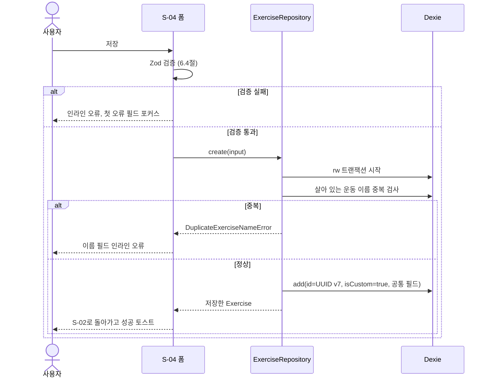

# 운동 라이브러리(F-EX) 상세 기능 명세

- 작업: FP-14 (상위: FP-11 헬스 플래너 MVP 기능 상세 명세)
- 작성일: 2026-10-01
- 상태: 초안
- 대상 화면: S-02 운동 라이브러리, S-04 운동 추가·편집
- 기준 문서
  - [기능 정의서 및 MVP 범위](../feature-definition.md) 2.1절(F-EX), 5장(화면 목록)
  - [데이터 모델·도메인 규칙 v1](../../1.architectur/mvp-design/data-model-v1.md) (이하 **T1**) 1.3절(soft delete), 1.4절(열거값), 2.1절(Exercise), 4장(기록 유형)
  - [공통 UI·IA·내비게이션 명세](../../1.architectur/mvp-design/ia-navigation.md) (이하 **IA**) 2장(경로), 3장(공통 컴포넌트), 4장(와이어프레임 표기), 5장(공통 UX)
  - [사전조사 종합 요약](../../1.architectur/pre-research-summary.md) ADR-006(기본 운동 데이터)

이 문서는 F-EX의 M 항목 6개를 화면 동작·입력 검증·예외 처리·인수 조건 수준으로 상세화한다.
엔티티 필드와 저장 규칙은 T1을, 공통 컴포넌트·표기법·삭제 확인·저장 실패 처리는 IA를 따르며 여기서 반복하지 않는다. T1·IA와 다르게 정하거나 더 구체화한 내용은 [10장](#10-기준-문서-대비-추가구체화-사항)에 모았다.

---

## 1. 범위

### 1.1 기능 목록

| ID | 기능 | MoSCoW | 화면 | 이 문서 |
| --- | --- | --- | --- | --- |
| F-EX-01 | 기본 운동 목록 제공 | M | S-02 | 3장 |
| F-EX-02 | 부위별 분류·필터 | M | S-02 | 4장 |
| F-EX-03 | 장비별 분류·필터 | M | S-02 | 5장 |
| F-EX-04 | 운동 이름 검색 | S | S-02 | 9장(요약) |
| F-EX-05 | 사용자 정의 운동 추가 | M | S-04 | 6장 |
| F-EX-06 | 사용자 정의 운동 수정·삭제 | M | S-04 (진입: S-03) | 7장 |
| F-EX-07 | 기록 유형 구분 | **M** (S에서 상향) | S-04 | 8장 |

- F-EX-07은 이번 작업에서 S에서 M으로 올렸다. 기록 유형이 없으면 맨몸 운동·플랭크·유산소를 기록할 수 없고, 세션 기록(F-WS)과 통계(F-ST) 계산이 모두 기록 유형(T1 4장)을 전제로 하기 때문이다. [기능 정의서](../feature-definition.md) 2.1절도 같이 고쳤다.

### 1.2 범위 밖

| 항목 | 처리 |
| --- | --- |
| 유산소 거리(distance) 기록 | **MVP 범위 밖.** 기록 유형은 3종뿐이며 거리 필드·거리 유형을 두지 않는다(T1 2.6절, 4.1절). |
| 운동 이미지·영상 | 넣지 않는다(사전조사 Q-4). |
| 보조 부위로 필터 | 하지 않는다. 부위 필터는 주 부위만 본다(4.2절). |
| 초성 검색, 영문 별칭 검색 | 하지 않는다(9장). |
| 기본 운동 수정·삭제·숨기기 | 하지 않는다(T1 1.3절). |
| 삭제된 운동 목록·복원 화면 | 두지 않는다. 복원은 삭제 직후 `실행 취소` 토스트로만 한다(7.3절). |
| 기본 운동 시드 목록 자체(어떤 운동 100~150개) | 별도 작업(ADR-006 시드 확정)에서 정한다. 이 문서는 시드가 지켜야 할 규칙만 정한다(3.3절). |
| S-03 운동 상세의 기록·1RM 표시 | F-ST 명세에서 다룬다. 이 문서는 S-03의 편집·삭제 진입만 다룬다. |

---

## 2. 공통 규칙

### 2.1 코드값과 표시 이름

저장은 코드값, 화면 표시는 아래 표의 이름을 쓴다. 코드값과 순서는 T1 1.4절과 같다. 칩·목록·선택지는 **표의 순서대로** 놓는다.

**부위 `MuscleGroup`** (13개)

| 순서 | 코드값 | 표시 이름 |
| --- | --- | --- |
| 1 | `CHEST` | 가슴 |
| 2 | `BACK` | 등 |
| 3 | `SHOULDERS` | 어깨 |
| 4 | `BICEPS` | 이두 |
| 5 | `TRICEPS` | 삼두 |
| 6 | `FOREARMS` | 전완 |
| 7 | `ABS` | 복근 |
| 8 | `QUADRICEPS` | 대퇴사두 |
| 9 | `HAMSTRINGS` | 햄스트링 |
| 10 | `GLUTES` | 둔근 |
| 11 | `CALVES` | 종아리 |
| 12 | `FULL_BODY` | 전신 |
| 13 | `CARDIO` | 유산소 |

**장비 `Equipment`** (8개)

| 순서 | 코드값 | 표시 이름 | 포함 예 |
| --- | --- | --- | --- |
| 1 | `BARBELL` | 바벨 | 바벨, EZ바, 스미스 머신은 제외 |
| 2 | `DUMBBELL` | 덤벨 | |
| 3 | `MACHINE` | 머신 | 웨이트 머신, 스미스 머신, **유산소 기구(러닝머신·실내 자전거·로잉머신·스텝밀)** |
| 4 | `CABLE` | 케이블 | 케이블 머신, 크로스오버 |
| 5 | `KETTLEBELL` | 케틀벨 | |
| 6 | `BODYWEIGHT` | 맨몸 | 기구 없이 하는 운동, 풀업 바·딥스 바만 쓰는 운동, 야외 달리기 |
| 7 | `BAND` | 밴드 | 저항 밴드 |
| 8 | `OTHER` | 기타 | 줄넘기, 메디신볼, 슬레드 등 위에 없는 장비 |

**기록 유형 `TrackingType`** (3개)

| 순서 | 코드값 | 표시 이름 | 짧은 표시(목록 보조 정보) |
| --- | --- | --- | --- |
| 1 | `WEIGHT_REPS` | 중량 × 횟수 | 표시하지 않음(기본값) |
| 2 | `REPS_ONLY` | 횟수만 | 횟수만 |
| 3 | `DURATION` | 시간 | 시간 |

- 표시 이름은 `src/domain/labels.ts` 한 곳에 두고 화면에서 직접 쓰지 않는다.
- 와이어프레임에서는 폭 문제로 `×`를 `x`로 적는다(IA 4.1절). 실제 화면은 `×`를 쓴다.

### 2.2 운동 이름 규칙

F-EX-05(추가)와 F-EX-06(수정)이 함께 쓴다. T1 2.1절의 `name` 제약을 구체화한 것이다.

| 항목 | 규칙 |
| --- | --- |
| 저장 전 가공 | ① 유니코드 NFC 정규화 → ② 앞뒤 공백 제거 → ③ 안쪽 연속 공백(탭 포함)을 공백 1칸으로 줄임 |
| 길이 | 가공 후 **1~50자**. 글자 수는 코드 포인트 기준(`[...name].length`)으로 센다. 한글 1글자 = 1자, 이모지 1개 = 1자 |
| 허용 문자 | 제어 문자(U+0000~U+001F, U+007F)를 뺀 모든 문자. 입력칸이 한 줄이라 줄바꿈은 들어오지 않고, 붙여넣기로 들어온 제어 문자는 공백으로 바꾼 뒤 ②③을 적용한다 |
| 중복 판정 키 | `normalizeName(name) = name.normalize('NFC').replace(/\s+/g, '').toLocaleLowerCase('ko')` |
| 중복 범위 | **살아 있는(`deletedAt === null`) 모든 운동**(기본 운동 + 사용자 정의 운동)과 비교한다. 수정할 때는 자기 자신을 뺀다. 삭제된 운동의 이름은 다시 쓸 수 있다 |
| 중복 예 | `벤치프레스` = `벤치 프레스` = ` 벤치프레스 `. `Lat Pulldown` = `lat pulldown` |
| 검사 시점 | 입력칸 blur 시, 저장 버튼을 누를 때(UI). 저장 시 `ExerciseRepository.save()`가 같은 트랜잭션에서 다시 검사하고 위반이면 `DuplicateExerciseNameError`를 던진다(T1 8장) |

### 2.3 목록 조회 규칙

| 항목 | 규칙 |
| --- | --- |
| 대상 | `deletedAt === null`인 운동(기본 + 사용자 정의) |
| 정렬 | 이름 가나다순. `Intl.Collator('ko', { sensitivity: 'base', numeric: true })`. 이름이 같은 정렬 키면 `id` 오름차순 |
| 조건 결합 | 부위 필터 AND 장비 필터 AND 검색어. 그룹 안의 여러 값은 OR(4.2절, 5.2절) |
| 데이터 갱신 | `useLiveQuery`로 구독한다. 다른 화면에서 운동을 추가·삭제하면 목록이 바로 바뀐다 |
| 거르기 위치 | 전체 운동(최대 수백 개)을 읽은 뒤 메모리에서 거른다. T1 3.2절의 `primaryMuscle`·`equipment` 인덱스는 통계 쪽 조회에 쓰고, 라이브러리는 인덱스 조회를 강제하지 않는다 |
| 가상 스크롤 | 쓰지 않는다. 살아 있는 운동이 500개를 넘으면 다시 검토한다 |

### 2.4 필터 공통 규칙 (F-EX-02, F-EX-03)

| 항목 | 규칙 |
| --- | --- |
| 컴포넌트 | `FilterChipGroup`(IA 3.6절), `type='multiple'`, `allLabel='전체'` |
| 그룹 안 | 여러 칩을 동시에 고를 수 있고 **OR**로 결합한다. 예: 가슴 + 등 → 주 부위가 가슴이거나 등인 운동 |
| 그룹 사이 | 부위 그룹과 장비 그룹은 **AND**로 결합한다. 예: 가슴 AND 덤벨 |
| 전체 칩 | 선택 값이 빈 배열이면 "전체"가 선택된 것으로 표시한다. "전체"를 누르면 그 그룹의 선택을 모두 지운다 |
| 마지막 칩 해제 | 그룹의 마지막 선택 칩을 해제하면 "전체"로 돌아간다 |
| 모두 선택 | 그룹의 모든 칩(부위 13개, 장비 8개)이 선택되면 빈 배열(= 전체)로 정규화한다 |
| 상태 저장 | URL 검색 파라미터 `muscle`, `equipment`(IA 2.1절, 2.5절). 값은 쉼표로 이은 코드값이며 2.1절 순서로 정렬해 쓴다. 예: `/exercises?muscle=CHEST,BACK&equipment=DUMBBELL` |
| 기록 방식 | 칩을 누를 때 URL을 **replace**로 바꾼다. 뒤로 가기가 필터 변경을 하나씩 되돌리지 않고 이전 화면으로 간다 |
| 유지 | S-02 → S-03 → 뒤로 오면 URL에 남아 있는 필터가 그대로 다시 적용된다. 탭을 다시 눌러 S-05로 갔다가 S-02로 새로 들어오면 필터 없음 상태다(IA 1.1절) |
| 필터 초기화 | 부위·장비·검색어 중 하나라도 조건이 있으면 결과 머리줄에 `[ 필터 초기화 ]` 버튼을 보인다. 누르면 `muscle`, `equipment`, `q`를 모두 지운다(replace). 조건이 없으면 버튼을 숨긴다 |
| 빈 결과 | 결과가 0개면 목록 자리에 `EmptyState(variant='no-results')`를 보인다. 제목 "조건에 맞는 운동이 없어요"(IA 3.4절), 설명 "{선택한 조건} 조건을 바꿔 보세요", 버튼 `필터 초기화`. 칩은 비활성으로 만들지 않는다(IA 3.6절) |
| 결과 수 | 결과 머리줄에 "운동 N개"(선택 모드는 "운동 N개 / M개 선택됨")를 표시하고 `aria-live="polite"`로 알린다 |

---

## 3. F-EX-01 기본 운동 목록 제공

### 3.1 개요

- 경로: S-02 둘러보기 `/exercises`, 선택 모드 `/routines/new/exercises`, `/routines/:routineId/edit/exercises`, `/workout/exercises`(IA 2.1절)
- 앱이 기본 운동(`isCustom=false`)을 시드로 넣어 두고, 사용자 정의 운동과 함께 한 목록으로 보여 준다.
- 둘러보기 모드는 운동을 눌러 S-03으로, 선택 모드는 여러 운동을 체크해 부모 화면(S-06, S-08)에 넘긴다(IA 2.2절).

### 3.2 와이어프레임

#### 3.2.1 S-02 둘러보기 — 기본 상태

```text
+--------------------------------------+
| < 운동 라이브러리             [+] #1 |
+--------------------------------------+
| [운동 이름 검색____________]      #2 |
| 부위 (*전체*) ( 가슴 ) ( 등 ) ~~  #3 |
| 장비 (*전체*) ( 바벨 ) ~~         #4 |
+--------------------------------------+
| 운동 128개                        #5 |
| 데드리프트                         > |
|   등 / 바벨                       #6 |
| 벤치프레스                         > |
|   가슴 / 바벨                        |
| 풀업                               > |
|   등 / 맨몸 / 횟수만              #7 |
| 케이블 Y 레이즈                    > |
|   어깨 / 케이블 / 내 운동         #8 |
| ~~                                   |
+--------------------------------------+
| 홈  *루틴*  히스토리  체성분  설정   |
+--------------------------------------+
```

| # | 요소 | 동작·규칙 |
| --- | --- | --- |
| 1 | 헤더 | 제목 "운동 라이브러리". `[+]`(`aria-label="운동 추가"`) → S-04 `/exercises/new`(6장). 뒤로 → S-05 |
| 2 | 검색 | F-EX-04(S). 9장 요약 참고 |
| 3 | 부위 필터 | F-EX-02(4장) |
| 4 | 장비 필터 | F-EX-03(5장) |
| 5 | 결과 머리줄 | "운동 N개". 조건이 있으면 오른쪽에 `[ 필터 초기화 ]`(2.4절) |
| 6 | 운동 행 | 1줄: 이름(넘치면 말줄임). 2줄: `주 부위 / 장비`. 행 전체가 터치 대상(높이 56px 이상). 누르면 S-03 `/exercises/:id` |
| 7 | 기록 유형 표시 | `REPS_ONLY`, `DURATION`이면 2줄 끝에 `/ 횟수만`, `/ 시간`을 붙인다. `WEIGHT_REPS`는 표시하지 않는다(2.1절) |
| 8 | 내 운동 표시 | `isCustom=true`면 2줄 끝에 "내 운동" 배지(텍스트 + 아이콘 `UserRound`). 정렬은 기본 운동과 섞어 가나다순 |

#### 3.2.2 S-02 선택 모드 — 루틴 편집에서 진입

```text
+--------------------------------------+
| < 운동 선택                       #1 |
+--------------------------------------+
| [운동 이름 검색____________]         |
| 부위 (*전체*) ( 가슴 ) ( 등 ) ~~     |
| 장비 (*전체*) ( 바벨 ) ~~            |
+--------------------------------------+
| 운동 128개 / 2개 선택됨           #2 |
| [v] 데드리프트                       |
| [-] 랫풀다운  추가됨              #3 |
| [ ] 바벨 로우                        |
| [v] 풀업                             |
| ~~                                   |
+--------------------------------------+
| [[           2개 추가             ]] |
+--------------------------------------+
```

| # | 요소 | 동작·규칙 |
| --- | --- | --- |
| 1 | 헤더 | 제목 "운동 선택". `[+]`(운동 추가)는 두지 않는다. 뒤로·ESC·Android 뒤로 → 선택을 버리고 부모 화면으로 돌아간다(확인 없음) |
| 2 | 결과 머리줄 | "운동 N개 / M개 선택됨". 필터·검색을 바꿔도 선택은 유지되고 M은 화면에 안 보이는 선택도 센다 |
| 3 | 제외 항목 | 부모가 넘긴 `excludedIds`에 든 운동은 체크박스 비활성(`[-]`) + "추가됨" 텍스트. 루틴 편집(S-06)은 이미 루틴에 든 운동을 넘긴다(T1 2.3절: 같은 루틴 안 중복 불가). 세션(S-08)이 무엇을 넘길지는 F-WS 명세에서 정한다 |
| — | 운동 행 | 행 전체를 누르면 체크가 바뀐다(S-03으로 가지 않음). 탭 바는 숨김(IA 1.2절) |
| — | `N개 추가` | 선택이 0개면 `[- 운동을 선택하세요 -]`로 비활성. 누르면 **선택한 순서대로** `exerciseId` 배열을 부모 콜백에 넘기고 부모 화면으로 돌아간다 |

#### 3.2.3 로딩·오류 상태

배치가 바뀌는 상태만 적는다.

| 상태 | 목록 영역 |
| --- | --- |
| 로딩(`useLiveQuery` 첫 결과 전) | 운동 행 모양 스켈레톤 6줄. 결과 머리줄은 "운동 –개" |
| 불러오기 실패 | `EmptyState(variant='error')` "불러오지 못했어요" + `다시 시도`(IA 3.4절). 필터·검색 칩은 그대로 보인다 |

### 3.3 기본 운동 시드 규칙

| 항목 | 규칙 |
| --- | --- |
| 파일 | `src/data/seed/exercises.v1.json`. 앱 번들에 넣는다 |
| 개수 | 100~150개(ADR-006) |
| 필드 | T1 2.1절 Exercise 필드 전부. `id`는 미리 만든 고정 UUID v7(C-2), `isCustom=false`, `createdAt`·`updatedAt`은 시드 작성 시각 고정값, `deletedAt=null` |
| 분류 | `primaryMuscle`·`equipment`·`trackingType`은 2.1절 코드값만 쓴다. 13개 부위마다 2개 이상, 8개 장비마다 1개 이상 있어야 한다 |
| 이름 | 2.2절 규칙을 지키고 시드끼리 `normalizeName`이 겹치지 않는다 |
| 기록 유형 | 무게를 다는 운동은 `WEIGHT_REPS`, 맨몸 반복 운동(풀업·푸시업·딥스·크런치 등)은 `REPS_ONLY`, 버티기·유산소(플랭크·러닝머신 등)는 `DURATION` |
| 넣는 시점 | 앱 시작 시 `ensureSeed()`가 한 `rw` 트랜잭션에서 시드 `id` 중 DB에 **없는 것만** 넣는다. 이미 있는 레코드는 건드리지 않는다(멱등). 첫 실행과, 가져오기(덮어쓰기)로 시드 일부가 빠진 경우를 같은 코드로 처리한다 |
| 시드 갱신 | 앱 업데이트로 기본 운동의 이름·분류를 바꾸는 일은 이 문서 범위 밖이다. 필요하면 Dexie 버전 업그레이드 함수에서 처리한다 |
| 검증 | 시드 JSON이 위 규칙을 지키는지 단위 테스트(Vitest)로 확인한다. 앱 실행 중에는 시드를 다시 검증하지 않는다 |

시드 예시(형식 확인용, 실제 목록은 시드 확정 작업에서 정함)

| 이름 | `primaryMuscle` | `secondaryMuscles` | `equipment` | `trackingType` |
| --- | --- | --- | --- | --- |
| 벤치프레스 | `CHEST` | `TRICEPS`, `SHOULDERS` | `BARBELL` | `WEIGHT_REPS` |
| 데드리프트 | `BACK` | `HAMSTRINGS`, `GLUTES` | `BARBELL` | `WEIGHT_REPS` |
| 덤벨 숄더 프레스 | `SHOULDERS` | `TRICEPS` | `DUMBBELL` | `WEIGHT_REPS` |
| 랫풀다운 | `BACK` | `BICEPS` | `MACHINE` | `WEIGHT_REPS` |
| 풀업 | `BACK` | `BICEPS` | `BODYWEIGHT` | `REPS_ONLY` |
| 크런치 | `ABS` | — | `BODYWEIGHT` | `REPS_ONLY` |
| 플랭크 | `ABS` | — | `BODYWEIGHT` | `DURATION` |
| 러닝머신 | `CARDIO` | — | `MACHINE` | `DURATION` |
| 실내 자전거 | `CARDIO` | — | `MACHINE` | `DURATION` |
| 줄넘기 | `CARDIO` | `CALVES` | `OTHER` | `DURATION` |

### 3.4 입력 검증

F-EX-01은 사용자 입력 폼이 없다. 목록이 받는 외부 입력(URL, 부모 화면 값, 시드 파일)을 검증한다.

| 입력 | 규칙 | 위반 시 |
| --- | --- | --- |
| 시드 레코드 | 3.3절 규칙(Zod `ExerciseSchema` + 시드 전용 검사) | 단위 테스트 실패로 빌드 단계에서 막는다 |
| 선택 모드 진입 경로 | `/workout/exercises`는 진행 중 세션이 있어야 한다(IA 2.1절) | 부모 S-08의 규칙대로 `/`로 대체 이동 |
| `excludedIds` | UUID 배열. 살아 있지 않은 운동 id가 섞여 있어도 오류로 보지 않는다 | 목록에 없는 id는 무시 |
| 선택 결과 | 1개 이상, 중복 없음, 살아 있는 운동만 | 확정 직전에 살아 있지 않은 운동을 빼고 넘긴다(3.5절) |

### 3.5 예외 처리

| 상황 | 처리 |
| --- | --- |
| 시드 넣기 실패(트랜잭션 오류, 용량 부족) | 앱 시작을 막지 않는다. S-02 목록은 있는 데이터만 보여 주고, 기본 운동이 하나도 없으면 `EmptyState(error)` "불러오지 못했어요" + `다시 시도`(→ `ensureSeed()` 다시 실행 후 목록 재조회). 용량 부족은 IA 5.5절 전용 문구 |
| 목록 조회 실패 | 3.2.3절 오류 상태 |
| 둘러보기 중 다른 경로로 운동이 삭제됨(실행 취소·가져오기) | `useLiveQuery`가 목록에서 바로 뺀다. 별도 안내 없음 |
| 선택 모드에서 체크한 운동이 확정 전에 삭제됨 | 체크 목록에서 빼고 "M개 선택됨"을 다시 센다. 확정 시 남은 것만 넘긴다 |
| 선택 모드에서 0개로 `N개 추가` 시도 | 버튼이 비활성이라 일어나지 않는다 |
| 운동 행의 이름이 너무 김(최대 50자) | 1줄 말줄임. 전체 이름은 S-03에서 본다 |
| 기본 운동으로 S-04 편집 경로 진입 | S-03으로 대체 이동(IA 2.1절, 7.5절) |

### 3.6 인수 조건

**AC-EX01-01 첫 실행 시 기본 운동 저장**
- **Given** 앱을 처음 설치해 `exercises` 테이블이 비어 있다
- **When** 앱을 실행한다
- **Then** 시드 파일의 운동이 모두 시드의 고정 `id`와 `isCustom=false`로 저장된다
- **And** S-02를 열면 "운동 N개"(N = 시드 개수)와 이름 가나다순 목록이 보인다

**AC-EX01-02 시드 넣기는 멱등이다**
- **Given** 기본 운동이 이미 모두 저장되어 있다
- **When** 앱을 다시 실행한다
- **Then** 기본 운동 수는 그대로이고 기존 레코드의 `updatedAt`도 바뀌지 않는다

**AC-EX01-03 빠진 시드만 다시 넣기**
- **Given** 가져오기(덮어쓰기)로 기본 운동 중 `러닝머신` 레코드가 없는 상태가 되었다
- **When** 앱이 `ensureSeed()`를 실행한다
- **Then** `러닝머신`만 시드의 고정 `id`로 다시 저장되고 나머지 운동은 바뀌지 않는다

**AC-EX01-04 목록 표시 형식**
- **Given** 기본 운동 `풀업`(`BACK`, `BODYWEIGHT`, `REPS_ONLY`)과 사용자 정의 운동 `케이블 Y 레이즈`(`SHOULDERS`, `CABLE`, `WEIGHT_REPS`)가 있다
- **When** S-02를 연다
- **Then** `풀업` 행의 보조 줄은 "등 / 맨몸 / 횟수만"이다
- **And** `케이블 Y 레이즈` 행의 보조 줄은 "어깨 / 케이블 / 내 운동"이고 기본 운동 사이에 가나다순으로 놓인다

**AC-EX01-05 삭제된 운동은 목록에 없다**
- **Given** 사용자 정의 운동 `힙 쓰러스트 머신`이 soft delete되어 있다
- **When** S-02(둘러보기 또는 선택 모드)를 연다
- **Then** `힙 쓰러스트 머신`은 목록과 개수에 포함되지 않는다

**AC-EX01-06 루틴 편집에서 여러 개 선택**
- **Given** 루틴 "등 A"에 `랫풀다운`이 이미 들어 있고 S-06에서 운동 추가로 S-02 선택 모드를 열었다
- **When** `풀업`, `데드리프트` 순서로 체크하고 `2개 추가`를 누른다
- **Then** `랫풀다운` 행은 비활성 + "추가됨"으로 보였고 체크할 수 없었다
- **And** S-06으로 돌아가 `풀업`, `데드리프트`가 이 순서로 루틴 끝에 추가된다

---

## 4. F-EX-02 부위별 분류·필터

### 4.1 개요

- 경로: S-02 `/exercises?muscle=...`(선택 모드 경로에도 같은 파라미터)
- 13개 부위 칩으로 운동의 **주 부위**를 거른다. 공통 규칙은 2.4절.

### 4.2 동작 규칙

| 항목 | 규칙 |
| --- | --- |
| 대상 필드 | `primaryMuscle`만 본다. `secondaryMuscles`는 보지 않는다. 부위별 빈도 통계(T1 5.3절, Q-1)와 같은 기준이라 "가슴 운동"의 범위가 화면마다 달라지지 않는다 |
| 칩 순서 | "전체" + 2.1절 부위 순서 13개. 한 줄 가로 스크롤 |
| 결합 | 선택한 부위끼리 OR. 장비 필터·검색어와는 AND |
| 하체 묶음 | "하체" 같은 묶음 칩은 두지 않는다. 대퇴사두·햄스트링·둔근·종아리를 여러 개 고르면 된다 |
| 선택 표시 | 선택 칩은 채운 배경 + 체크 아이콘(IA 3.6절). 가로 스크롤 바깥에 선택 칩이 있으면 그룹 라벨을 "부위 2"처럼 선택 개수와 함께 보여 준다 |

### 4.3 와이어프레임 — 가슴·등 선택

```text
+--------------------------------------+
| < 운동 라이브러리             [+]    |
+--------------------------------------+
| [운동 이름 검색____________]         |
| 부위 ( 전체 ) (*가슴*) (*등*) ~~  #1 |
| 장비 (*전체*) ( 바벨 ) ~~            |
+--------------------------------------+
| 운동 31개         [ 필터 초기화 ] #2 |
| 덤벨 플라이                        > |
|   가슴 / 덤벨                        |
| 데드리프트                         > |
|   등 / 바벨                          |
| 랫풀다운                           > |
|   등 / 머신                          |
| 벤치프레스                         > |
|   가슴 / 바벨                        |
| ~~                                   |
+--------------------------------------+
| 홈  *루틴*  히스토리  체성분  설정   |
+--------------------------------------+
```

| # | 요소 | 동작·규칙 |
| --- | --- | --- |
| 1 | 부위 필터 | 가슴·등 선택. URL `?muscle=CHEST,BACK`. "전체"는 선택 해제 상태로 보인다 |
| 2 | 결과 머리줄 | 조건이 있으므로 `[ 필터 초기화 ]`가 보인다. 결과 0개일 때의 배치는 5.3.2절과 같다 |

### 4.4 입력 검증 (`muscle` 파라미터)

| 입력 | 규칙 | 위반 시 |
| --- | --- | --- |
| 형식 | 쉼표로 구분한 코드값. 빈 값(`muscle=`)이나 파라미터 없음 = 전체 | — |
| 값 | 2.1절 `MuscleGroup` 13개 중 하나. 대소문자를 구분한다 | 모르는 값(`muscle=LEGS`, `muscle=chest`)은 조용히 버린다 |
| 중복 | 같은 값은 한 번만 | 중복을 지운다 |
| 순서 | 2.1절 순서 | 정렬한다 |
| 전체 선택 | 13개 모두 | 빈 값(전체)으로 바꾼다 |
| 정규화 반영 | 위 처리로 값이 바뀌면 URL을 replace로 고친다. 오류 토스트는 띄우지 않는다 | — |

### 4.5 예외 처리

| 상황 | 처리 |
| --- | --- |
| 결과 0개 (예: `CALVES`인데 종아리 운동을 모두 지움) | 2.4절 빈 결과. 칩은 그대로 선택 가능 |
| 잘못된 URL 파라미터(공유·직접 입력) | 4.4절대로 정규화. 유효한 값이 하나도 없으면 전체 |
| 보조 부위로 찾으려는 경우(예: 삼두를 골랐는데 벤치프레스가 없음) | 의도한 동작이다. 칩 그룹 `aria-describedby`와 S-02 도움말에 "주 부위 기준으로 걸러요"를 둔다 |
| 필터 변경 중 목록 로딩 | 메모리에서 거르므로 로딩 상태가 생기지 않는다. 첫 로딩 전이면 3.2.3절 스켈레톤 |

### 4.6 인수 조건

**AC-EX02-01 여러 부위 OR 결합**
- **Given** S-02에서 부위 "전체"가 선택되어 있다
- **When** "가슴"과 "등" 칩을 누른다
- **Then** 주 부위가 `CHEST` 또는 `BACK`인 운동만 보인다
- **And** URL이 `?muscle=CHEST,BACK`으로 replace되고 "전체" 칩은 선택 해제로 보인다

**AC-EX02-02 주 부위만 본다**
- **Given** `벤치프레스`의 주 부위는 `CHEST`, 보조 부위는 `TRICEPS`다
- **When** 부위 필터에서 "삼두"만 고른다
- **Then** `벤치프레스`는 결과에 없다

**AC-EX02-03 마지막 칩 해제와 전체 칩**
- **Given** 부위 필터에 "가슴"만 선택되어 있다
- **When** "가슴" 칩을 다시 누른다
- **Then** 부위 선택이 빈 배열이 되어 "전체"가 선택으로 보이고 URL에서 `muscle`이 빠진다

**AC-EX02-04 모두 선택하면 전체**
- **Given** 부위 칩 12개가 선택되어 있다
- **When** 남은 1개를 마저 누른다
- **Then** 선택이 빈 배열(전체)로 정규화되어 "전체"만 선택으로 보인다

**AC-EX02-05 잘못된 URL 정규화**
- **Given** 사용자가 `/exercises?muscle=BACK,LEGS,CHEST,BACK`으로 들어온다
- **When** S-02가 열린다
- **Then** `LEGS`는 버리고 중복을 지워 URL이 `?muscle=CHEST,BACK`으로 replace된다
- **And** 오류 토스트는 뜨지 않는다

**AC-EX02-06 필터 상태 유지**
- **Given** 부위 "가슴"을 고른 S-02에서 `벤치프레스`를 눌러 S-03으로 갔다
- **When** 헤더 뒤로 버튼을 누른다
- **Then** S-02에 "가슴" 필터가 그대로 적용되어 있다

---

## 5. F-EX-03 장비별 분류·필터

### 5.1 개요

- 경로: S-02 `/exercises?equipment=...`(선택 모드 경로에도 같은 파라미터)
- 8개 장비 칩으로 운동의 `equipment`를 거른다. 공통 규칙은 2.4절.

### 5.2 동작 규칙

| 항목 | 규칙 |
| --- | --- |
| 대상 필드 | `equipment`(운동당 1개) |
| 칩 순서 | "전체" + 2.1절 장비 순서 8개. 한 줄 가로 스크롤 |
| 결합 | 선택한 장비끼리 OR. 부위 필터·검색어와는 AND |
| 유산소 기구 | 별도 장비 코드가 없다. 러닝머신·실내 자전거 같은 기구는 `MACHINE`에 든다(2.1절). 유산소 운동만 보려면 부위 "유산소"(`CARDIO`)를 고른다. 장비 칩 그룹 도움말에 "유산소 기구는 머신에 있어요"를 둔다 |

### 5.3 와이어프레임

#### 5.3.1 덤벨 선택

```text
+--------------------------------------+
| < 운동 라이브러리             [+]    |
+--------------------------------------+
| [운동 이름 검색____________]         |
| 부위 (*전체*) ( 가슴 ) ( 등 ) ~~     |
| 장비 ( 전체 ) ( 바벨 ) (*덤벨*) ~~   |
+--------------------------------------+
| 운동 18개         [ 필터 초기화 ] #1 |
| 덤벨 숄더 프레스                   > |
|   어깨 / 덤벨                        |
| 덤벨 컬                            > |
|   이두 / 덤벨                        |
| 덤벨 플라이                        > |
|   가슴 / 덤벨                        |
| ~~                                   |
+--------------------------------------+
| 홈  *루틴*  히스토리  체성분  설정   |
+--------------------------------------+
```

| # | 요소 | 동작·규칙 |
| --- | --- | --- |
| 1 | 결과 머리줄 | URL `?equipment=DUMBBELL`. `[ 필터 초기화 ]`를 누르면 부위·장비·검색어를 모두 지운다 |

#### 5.3.2 결과 없음 (가슴 + 케틀벨)

```text
+--------------------------------------+
| < 운동 라이브러리             [+]    |
+--------------------------------------+
| [운동 이름 검색____________]         |
| 부위 ( 전체 ) (*가슴*) ( 등 ) ~~     |
| 장비 ( 전체 ) ~~ (*케틀벨*) ~~    #1 |
+--------------------------------------+
| 운동 0개                             |
|                                      |
|         /// 아이콘 ///            #2 |
|      조건에 맞는 운동이 없어요       |
|   가슴 / 케틀벨 조건을 바꿔 보세요   |
|          [ 필터 초기화 ]          #3 |
|                                      |
+--------------------------------------+
| 홈  *루틴*  히스토리  체성분  설정   |
+--------------------------------------+
```

| # | 요소 | 동작·규칙 |
| --- | --- | --- |
| 1 | 장비 필터 | 케틀벨 선택. 선택 칩이 처음 화면 밖이면 그룹 라벨을 "장비 1"로 보인다(4.2절과 같은 규칙) |
| 2 | 빈 상태 | `EmptyState(variant='no-results')`, 아이콘 `SearchX` |
| 3 | 필터 초기화 | 결과 머리줄의 버튼과 같은 동작. 결과 머리줄의 버튼은 빈 상태에서는 숨긴다(버튼 중복 방지) |

- 설명 문구의 조건 표기: 부위 이름들(쉼표) + ` / ` + 장비 이름들 + 검색어가 있으면 ` / '검색어'`. 30자를 넘으면 "선택한 조건을 바꿔 보세요"로 줄인다.

### 5.4 입력 검증 (`equipment` 파라미터)

| 입력 | 규칙 | 위반 시 |
| --- | --- | --- |
| 형식 | 쉼표로 구분한 코드값. 빈 값이나 파라미터 없음 = 전체 | — |
| 값 | 2.1절 `Equipment` 8개 중 하나. 대소문자 구분 | 모르는 값(`equipment=CARDIO_MACHINE`)은 조용히 버린다 |
| 중복·순서 | 중복 제거, 2.1절 순서로 정렬 | 정규화 |
| 전체 선택 | 8개 모두 | 빈 값(전체) |
| 정규화 반영 | 값이 바뀌면 URL replace. 토스트 없음 | — |

### 5.5 예외 처리

| 상황 | 처리 |
| --- | --- |
| 부위 AND 장비 결과 0개 | 5.3.2절 빈 결과 |
| 검색어 때문에 0개 | 같은 빈 결과. `필터 초기화`가 검색어도 지우므로 한 번에 전체 목록으로 돌아간다 |
| 잘못된 URL 파라미터 | 5.4절대로 정규화 |
| 장비 칩에서 "유산소 기구"를 찾음 | 5.2절 도움말. 기능 동작은 바뀌지 않는다 |

### 5.6 인수 조건

**AC-EX03-01 장비 필터 적용**
- **Given** S-02에 필터가 없다
- **When** 장비 "덤벨" 칩을 누른다
- **Then** `equipment`가 `DUMBBELL`인 운동만 보이고 URL이 `?equipment=DUMBBELL`이 된다

**AC-EX03-02 부위와 장비는 AND**
- **Given** 부위 "가슴"이 선택되어 있다
- **When** 장비 "바벨"과 "덤벨"을 고른다
- **Then** 주 부위가 `CHEST`이면서 장비가 `BARBELL` 또는 `DUMBBELL`인 운동만 보인다

**AC-EX03-03 빈 결과와 필터 초기화**
- **Given** 부위 "가슴", 장비 "케틀벨" 조건에 맞는 운동이 없다
- **When** 두 칩을 선택한 상태에서 빈 상태의 `필터 초기화`를 누른다
- **Then** 선택 직후에는 "조건에 맞는 운동이 없어요"와 "가슴 / 케틀벨 조건을 바꿔 보세요"가 보였다
- **And** 누른 뒤에는 `muscle`, `equipment`, `q`가 모두 지워지고 전체 목록이 보인다

**AC-EX03-04 유산소 기구는 머신**
- **Given** 기본 운동 `러닝머신`의 장비는 `MACHINE`, 주 부위는 `CARDIO`다
- **When** 장비 "머신"을 고른다
- **Then** `러닝머신`이 결과에 포함된다

**AC-EX03-05 필터 초기화 버튼 노출**
- **Given** 부위·장비·검색어 조건이 모두 없다
- **When** S-02를 연다
- **Then** 결과 머리줄에 `필터 초기화` 버튼이 없다

---

## 6. F-EX-05 사용자 정의 운동 추가

### 6.1 개요

- 경로: S-04 `/exercises/new`. 진입: S-02 둘러보기 헤더 `[+]`
- 이름·주 부위·보조 부위·장비·기록 유형을 입력해 `isCustom=true` 운동을 만든다.
- 폼은 React Hook Form + Zod(`ExerciseFormSchema`). 하단 고정 Primary `저장`(IA 1.4절). 탭 바 숨김.

### 6.2 와이어프레임

#### 6.2.1 S-04 운동 추가 — 처음 상태

```text
+--------------------------------------+
| < 운동 추가                          |
+--------------------------------------+
| 운동 이름 *                       #1 |
| [예: 케이블 Y 레이즈______]     0/50 |
|                                      |
| 주 부위 *                         #2 |
| ( 가슴 ) ( 등 ) ( 어깨 ) ( 이두 ) ~~ |
|                                      |
| 보조 부위 (선택, 최대 5개)        #3 |
| ( 가슴 ) ( 등 ) ( 어깨 ) ( 이두 ) ~~ |
|                                      |
| 장비 *                            #4 |
| ( 바벨 ) ( 덤벨 ) ( 머신 ) ~~        |
|                                      |
| 기록 유형                         #5 |
| [v] 중량 x 횟수                      |
| [ ] 횟수만                           |
| [ ] 시간                             |
+--------------------------------------+
| [[             저장               ]] |
+--------------------------------------+
```

| # | 요소 | 동작·규칙 |
| --- | --- | --- |
| 1 | 운동 이름 | 텍스트 입력, `maxLength` 없이 입력받고 카운터 "N/50"을 보인다(붙여넣기로 넘친 경우 오류로 알리기 위해). 화면 진입 시 자동 포커스 |
| 2 | 주 부위 | `FilterChipGroup type='single'`, "전체" 칩 없음. 처음에는 아무것도 선택하지 않는다 |
| 3 | 보조 부위 | `FilterChipGroup type='multiple'`, "전체" 칩 없음. 주 부위로 고른 칩은 비활성. 5개를 고르면 나머지 칩을 비활성으로 하고 그룹 아래 "보조 부위는 최대 5개까지 고를 수 있어요"를 보인다 |
| 4 | 장비 | `FilterChipGroup type='single'`. 처음에는 선택 없음 |
| 5 | 기록 유형 | 라디오 카드 3개, 기본 `WEIGHT_REPS`. 상세는 8장 |
| — | 저장 | 항상 활성(저장 중 제외). 누르면 전체 검증 → 오류가 있으면 첫 오류 필드로 포커스(IA 5.5절) |
| — | 뒤로 | 처음 상태에서 바뀐 값이 있으면 "변경 사항을 버릴까요?" 확인(IA 2.4절) |

#### 6.2.2 검증 오류 상태

```text
+--------------------------------------+
| < 운동 추가                          |
+--------------------------------------+
| 운동 이름 *                          |
| [벤치 프레스_______________]    6/50 |
| ! 이미 있는 운동이에요: 벤치프레스   |
|                                      |
| 주 부위 *                            |
| ( 가슴 ) ( 등 ) ( 어깨 ) ( 이두 ) ~~ |
| ! 주 부위를 하나 선택해 주세요       |
| ~~                                   |
+--------------------------------------+
| [[             저장               ]] |
+--------------------------------------+
```

- 오류 문구는 필드 바로 아래 빨간 글자 + 경고 아이콘, `aria-invalid`·`aria-describedby` 연결(IA 5.6절). 값을 고치면 해당 오류가 사라진다.

### 6.3 처리 순서



- 저장 성공: `navigate(-1)`로 S-02에 돌아가 `<< '케이블 Y 레이즈'를 추가했어요   [보기] >>` 토스트를 띄운다. `보기` → S-03 `/exercises/:id`. 현재 필터 때문에 새 운동이 목록에 안 보여도 토스트로 찾아갈 수 있다. 앱 안 이동 기록이 없으면(딥 링크) `/exercises`로 replace 이동한다.

### 6.4 입력 검증

| 필드 | 필수 | 규칙 | 오류 문구 | 검사 시점 |
| --- | --- | --- | --- | --- |
| `name` | Y | 2.2절 가공 후 빈 문자열이 아님 | 운동 이름을 입력해 주세요 | blur, 저장 |
| `name` | | 가공 후 50자 이하 | 50자 이내로 입력해 주세요 | 입력 중(카운터 빨간색), 저장 |
| `name` | | 살아 있는 운동과 `normalizeName`이 겹치지 않음 | 이미 있는 운동이에요: {기존 운동 이름} | blur(300ms 뒤 조회), 저장(Repository) |
| `primaryMuscle` | Y | 2.1절 부위 코드 1개 | 주 부위를 하나 선택해 주세요 | 저장 |
| `secondaryMuscles` | N | 0~5개, 중복 없음, `primaryMuscle` 제외 | (UI가 막으므로 문구 없음. Zod 위반 시 "보조 부위를 다시 선택해 주세요") | 칩 선택 시 |
| `equipment` | Y | 2.1절 장비 코드 1개 | 장비를 선택해 주세요 | 저장 |
| `trackingType` | Y | 3종 중 1개, 기본 `WEIGHT_REPS` | (기본값이 있어 비지 않음) | — |
| `isCustom` | — | 항상 `true`. 폼에서 받지 않고 Repository가 넣는다 | — | — |

- 주 부위를 고르거나 바꿀 때 그 부위가 보조 부위에 들어 있으면 보조 부위에서 자동으로 뺀다. 이때 보조 부위 그룹 아래에 "주 부위와 같은 보조 부위를 뺐어요"를 3초간 보인다.

### 6.5 예외 처리

| 상황 | 처리 |
| --- | --- |
| 이름 중복 검사 조회 실패(blur 시) | 오류를 보이지 않고 넘어간다. 저장 시 Repository가 다시 검사한다 |
| blur 검사는 통과했는데 저장 시 중복(다른 경로로 같은 이름이 생김) | `DuplicateExerciseNameError` → 이름 필드 인라인 오류, 화면 유지 |
| 저장 버튼 연타 | 첫 클릭 후 버튼 비활성 + 스피너(IA 5.5절). 두 번째 저장은 일어나지 않는다 |
| 저장 실패(트랜잭션 오류) | 입력 유지, 화면 유지, `<< 저장하지 못했어요   [다시 시도] >>`(IA 5.5절) |
| 용량 부족 | IA 5.5절 전용 문구 + `설정으로` |
| 공백만 입력한 이름 | 가공 후 빈 문자열 → "운동 이름을 입력해 주세요" |
| 50자를 넘게 붙여넣기 | 그대로 받아 카운터를 빨간색 "57/50"으로 보이고 저장 시 오류. 자동으로 자르지 않는다(사용자가 어디가 잘리는지 모르게 되므로) |
| 변경 후 뒤로·탭 이동·브라우저 닫기 | 앱 안 이동은 `useBlocker` 확인 다이얼로그. 브라우저 닫기·새로고침은 `beforeunload` 기본 경고 |

### 6.6 인수 조건

**AC-EX05-01 정상 추가**
- **Given** S-04 운동 추가 화면이다
- **When** 이름 "케이블 Y 레이즈", 주 부위 "어깨", 보조 부위 "등", 장비 "케이블"을 입력하고 기록 유형은 그대로 둔 채 `저장`을 누른다
- **Then** `name='케이블 Y 레이즈'`, `primaryMuscle='SHOULDERS'`, `secondaryMuscles=['BACK']`, `equipment='CABLE'`, `trackingType='WEIGHT_REPS'`, `isCustom=true`, `deletedAt=null`인 운동이 저장된다
- **And** S-02로 돌아가 "'케이블 Y 레이즈'를 추가했어요" 토스트가 보인다

**AC-EX05-02 기본 운동과 이름 중복**
- **Given** 기본 운동 `벤치프레스`가 있다
- **When** 이름에 " 벤치 프레스 "를 입력하고 다른 칸으로 이동한다
- **Then** 이름 필드 아래에 "이미 있는 운동이에요: 벤치프레스"가 보이고 저장해도 운동이 만들어지지 않는다

**AC-EX05-03 삭제된 운동 이름은 다시 쓸 수 있다**
- **Given** 사용자 정의 운동 `힙 쓰러스트 머신`이 soft delete되어 있다
- **When** 같은 이름으로 새 운동을 저장한다
- **Then** 중복 오류 없이 새 `id`의 운동이 저장된다

**AC-EX05-04 길이 제한**
- **Given** S-04 운동 추가 화면이다
- **When** 51자 이름을 붙여넣고 `저장`을 누른다
- **Then** 카운터가 "51/50"으로 빨갛게 보이고 "50자 이내로 입력해 주세요" 오류가 보이며 저장되지 않는다
- **And** 정확히 50자로 줄이면 오류가 사라지고 저장된다

**AC-EX05-05 필수 선택 누락**
- **Given** 이름만 입력했다
- **When** `저장`을 누른다
- **Then** "주 부위를 하나 선택해 주세요", "장비를 선택해 주세요"가 보이고 포커스가 주 부위 칩 그룹으로 이동한다

**AC-EX05-06 주 부위와 겹치는 보조 부위 제거**
- **Given** 보조 부위로 "삼두", "어깨"를 골랐다
- **When** 주 부위를 "어깨"로 고른다
- **Then** 보조 부위는 "삼두"만 남고 "어깨" 칩은 비활성이 된다

**AC-EX05-07 이름 가공**
- **Given** S-04 운동 추가 화면이다
- **When** 이름에 "  원암   케이블  로우 "를 입력해 저장한다
- **Then** `name`은 "원암 케이블 로우"로 저장된다

---

## 7. F-EX-06 사용자 정의 운동 수정·삭제

### 7.1 개요

- 경로: S-04 `/exercises/:exerciseId/edit`
- 진입: S-03 헤더 `[...]` 메뉴의 `편집`·`삭제`, S-04 편집 화면 헤더 `[...]` 메뉴의 `삭제`
- 대상: `isCustom=true`이고 살아 있는 운동만. 기본 운동의 S-03에는 `[...]` 메뉴 자체를 두지 않는다.

### 7.2 수정 규칙

| 항목 | 규칙 |
| --- | --- |
| 폼 | 6장과 같은 폼에 저장된 값을 채워 연다. 제목 "운동 편집" |
| 이름 | 2.2절 규칙. 중복 검사에서 자기 자신은 뺀다. 대소문자·공백만 바꾸는 수정(`랫풀 다운` → `랫풀다운`)은 허용 |
| 이름 변경의 영향 | 운동은 `id`로 참조되므로 루틴·지난 기록·통계 화면이 모두 새 이름으로 보인다. 지난 세션의 이름을 따로 보관하지 않는다 |
| 주 부위 변경의 영향 | 부위별 빈도(T1 5.3절)는 현재 `primaryMuscle`로 계산하므로 지난 기록의 집계도 바뀐다. 이 운동을 참조하는 WorkoutSet이 있으면 주 부위 칩 아래에 "주 부위를 바꾸면 지난 기록의 부위별 통계도 함께 바뀌어요"를 늘 보인다 |
| 장비·보조 부위 | 자유롭게 바꿀 수 있다 |
| 기록 유형 | 8.4절 잠금 규칙 |
| 저장 | 바뀐 값이 없으면 DB에 쓰지 않고 뒤로 이동한다. 바뀌면 `updatedAt` 갱신 후 `navigate(-1)`(보통 S-03). 토스트 없음(IA 5.5절) |

### 7.3 삭제 규칙

| 항목 | 규칙 |
| --- | --- |
| 방식 | soft delete. Exercise에 `deletedAt`, `updatedAt`을 쓴다(T1 1.3절) |
| 지난 기록 | 이 운동의 WorkoutSet은 **그대로 둔다.** 히스토리·세션 상세·통계에 계속 포함되고 운동 이름도 그대로 보인다. S-03은 지난 기록 링크로 열 수 있고 "삭제된 운동" 배지와 함께 읽기 전용으로 보인다(IA 2.1절) |
| 루틴에 포함된 경우 | 같은 트랜잭션에서 이 운동을 참조하는 살아 있는 RoutineExercise를 같은 `deletedAt`으로 soft delete한다(T1 1.3절). 그 루틴의 남은 RoutineExercise는 `orderIndex`를 0부터 다시 매긴다(T1 2.3절 연속 규칙). 루틴 자체와 WeeklyPlan 배정은 남는다. 운동이 0개가 된 루틴의 처리는 F-RT 명세를 따른다 |
| 진행 중 세션에서 쓰는 경우 | **삭제를 막는다.** 살아 있는 `IN_PROGRESS` 세션에 이 운동의 살아 있는 WorkoutSet이 있으면 삭제할 수 없다. Repository가 `ExerciseInUseError`를 던진다. 세션 화면의 운동이 사라지면 입력 중인 기록이 꼬이기 때문이다 |
| 확인 | `ConfirmDialog`(`tone='destructive'`, IA 3.3절, 5.4절). 문구는 7.4.2절 |
| 삭제 후 | S-02 `/exercises`로 replace 이동, `<< '케이블 Y 레이즈'를 삭제했어요   [실행 취소] >>`(5초) |
| 실행 취소 | 같은 `deletedAt` 값을 가진 Exercise와 RoutineExercise를 한 트랜잭션에서 되살린다(`deletedAt=null`, `updatedAt` 갱신). RoutineExercise는 삭제 전 `orderIndex` 자리에 다시 끼워 넣고 그 뒤 항목을 1씩 민다. 그 사이 루틴이 삭제되었으면 그 루틴의 항목은 되살리지 않는다 |

### 7.4 와이어프레임

#### 7.4.1 S-04 운동 편집 (지난 기록 있음)

```text
+--------------------------------------+
| < 운동 편집                 [...] #1 |
+--------------------------------------+
| 운동 이름 *                          |
| [케이블 Y 레이즈___________]    9/50 |
|                                      |
| 주 부위 *                            |
| ( 가슴 ) ( 등 ) (*어깨*) ( 이두 ) ~~ |
| 주 부위를 바꾸면 지난 기록의      #2 |
| 부위별 통계도 함께 바뀌어요          |
| ~~                                #3 |
+--------------------------------------+
| [[             저장               ]] |
+--------------------------------------+
```

| # | 요소 | 동작·규칙 |
| --- | --- | --- |
| 1 | 더보기 메뉴 | 항목 1개: `삭제`(빨간 글자 + `Trash2` 아이콘) → 7.4.2절 다이얼로그 |
| 2 | 주 부위 안내 | 이 운동의 WorkoutSet이 1개 이상일 때만(삭제된 세트 제외) 보이는 보조 문구. 오류 색이 아니다 |
| 3 | 나머지 필드 | 보조 부위·장비는 6.2.1절과 같다. 기록 유형은 8.3.2절(잠김) 또는 8.3.1절(참조 없음) |

#### 7.4.2 삭제 확인 다이얼로그 (루틴 2개에 포함, 지난 기록 있음)

```text
+======================================+
| '케이블 Y 레이즈'를 삭제할까요?      |
|                                      |
| 라이브러리에서 사라지고 루틴 2개     |
| (상체 A, 어깨 집중)에서도 빠져요.    |
| 지난 기록 24세트는 그대로 남아요.    |
|                                      |
|                  [ 취소 ]  [! 삭제 ] |
+======================================+
```

설명 문구는 아래 조각을 순서대로 잇는다.

| 조건 | 문구 |
| --- | --- |
| 항상 | "라이브러리에서 사라지고" (루틴 조각이 없으면 "라이브러리에서 사라져요.") |
| 살아 있는 루틴 K개에 포함(K ≥ 1) | " 루틴 K개({루틴 이름}, …)에서도 빠져요." 이름은 2개까지 쓰고 넘으면 "상체 A, 어깨 집중 외 1개" |
| 이 운동의 살아 있는 완료 세트 S개(S ≥ 1) | "지난 기록 S세트는 그대로 남아요." |
| S = 0 | 문구 없음 |

#### 7.4.3 진행 중 세션에서 쓰는 운동

다이얼로그를 열지 않고 토스트로 알린다.

`<< 진행 중인 세션에서 쓰고 있어 삭제할 수 없어요   [세션으로] >>` — `세션으로` → S-08 `/workout`

### 7.5 입력 검증

| 대상 | 규칙 | 위반 시 |
| --- | --- | --- |
| 편집 필드 | 6.4절과 같다. 이름 중복 검사에서 자기 자신 제외 | 6.4절 문구 |
| 경로 `:exerciseId` | 존재하는 운동 | 없으면 `/exercises`로 replace + `<< 운동을 찾을 수 없어요 >>`(info) |
| 편집 대상 | `isCustom=true` | 기본 운동이면 S-03 `/exercises/:id`로 replace(IA 2.1절). Repository도 `isCustom=false` 수정·삭제를 `BuiltInExerciseReadOnlyError`로 거부 |
| 편집 대상 | `deletedAt === null` | 삭제된 운동이면 S-03(읽기 전용)으로 replace |
| 삭제 가능 여부 | 진행 중 세션에서 쓰지 않음(7.3절) | 7.4.3절 토스트 |

### 7.6 예외 처리

| 상황 | 처리 |
| --- | --- |
| 편집 중 다른 경로로 운동이 삭제됨 | 저장 시 Repository가 `deletedAt`을 확인하고 실패 → `<< 이미 삭제된 운동이에요 >>` 후 `/exercises`로 replace |
| 삭제 확인 다이얼로그를 연 뒤 진행 중 세션이 생김(다른 탭 등) | `onConfirm`에서 Repository가 `ExerciseInUseError` → 다이얼로그 오류 상태로 "진행 중인 세션에서 쓰고 있어 삭제할 수 없어요"(IA 3.3절) |
| 삭제 트랜잭션 실패 | 다이얼로그 유지 + 오류 문구 + `다시 시도`(IA 3.3절). Exercise와 RoutineExercise는 함께 성공하거나 함께 실패한다 |
| 실행 취소 시 이름 충돌(그 사이 같은 이름의 운동이 생김) | 되살리지 않고 `<< 같은 이름의 운동이 있어 되돌리지 못했어요 >>`(error) |
| 실행 취소 실패(트랜잭션 오류) | `<< 되돌리지 못했어요   [다시 시도] >>`(error, 6초) |
| 5초가 지나 실행 취소 토스트가 사라짐 | 앱에서 되살릴 방법이 없다(1.2절). 데이터는 soft delete로 남아 있다 |
| 지난 세션 화면에서 삭제된 운동 이름 표시 | 이름을 그대로 보이고, S-03으로 가는 링크는 읽기 전용 화면으로 연다 |
| 루틴 편집(S-06) 화면을 연 채로 그 운동이 삭제됨 | S-06은 `useLiveQuery`로 항목이 빠진 것을 반영한다. 폼 안에서의 처리는 F-RT 명세를 따른다 |

### 7.7 인수 조건

**AC-EX06-01 이름 수정 반영**
- **Given** 사용자 정의 운동 `케이블 Y 레이즈`로 지난 세션 2개를 기록했다
- **When** 이름을 "케이블 Y-레이즈"로 바꿔 저장한다
- **Then** S-02, 루틴 편집, 히스토리의 지난 세션에서 모두 "케이블 Y-레이즈"로 보인다
- **And** 지난 세션의 세트 값은 바뀌지 않는다

**AC-EX06-02 자기 이름과는 중복이 아니다**
- **Given** 사용자 정의 운동 `랫풀 다운`을 편집 중이다
- **When** 이름을 "랫풀다운"으로 바꾸려 한다
- **Then** 기본 운동 `랫풀다운`이 있으면 "이미 있는 운동이에요: 랫풀다운" 오류가 보인다
- **And** 기본 운동 `랫풀다운`이 없으면 오류 없이 저장된다

**AC-EX06-03 기록이 있는 운동 삭제 시 기록 유지**
- **Given** 사용자 정의 운동 `케이블 Y 레이즈`의 완료 세트 24개가 지난 세션에 있고 어떤 루틴에도 들어 있지 않다
- **When** S-03 `[...]` → `삭제` → 다이얼로그의 `삭제`를 누른다
- **Then** 다이얼로그에 "라이브러리에서 사라져요. 지난 기록 24세트는 그대로 남아요."가 보였다
- **And** 운동은 `deletedAt`이 설정되고 S-02 목록에서 사라진다
- **And** 그 24세트는 `deletedAt=null`인 채로 히스토리·통계에 계속 포함된다

**AC-EX06-04 루틴에 포함된 운동 삭제**
- **Given** 루틴 "상체 A"의 운동이 `벤치프레스`(0), `케이블 Y 레이즈`(1), `덤벨 컬`(2) 순서다
- **When** `케이블 Y 레이즈`를 삭제한다
- **Then** 다이얼로그 설명에 "루틴 1개(상체 A)에서도 빠져요."가 보였다
- **And** 해당 RoutineExercise는 운동과 같은 `deletedAt`으로 soft delete되고 "상체 A"는 `벤치프레스`(0), `덤벨 컬`(1)이 된다

**AC-EX06-05 실행 취소**
- **Given** AC-EX06-04 직후 실행 취소 토스트가 보인다
- **When** `실행 취소`를 누른다
- **Then** 운동과 RoutineExercise가 되살아나고 "상체 A"는 다시 `벤치프레스`(0), `케이블 Y 레이즈`(1), `덤벨 컬`(2)이 된다

**AC-EX06-06 진행 중 세션에서 쓰는 운동은 삭제 금지**
- **Given** 진행 중 세션에 `케이블 Y 레이즈` 세트가 있다
- **When** S-03에서 `삭제`를 누른다
- **Then** 다이얼로그 없이 "진행 중인 세션에서 쓰고 있어 삭제할 수 없어요" 토스트가 보이고 운동은 그대로다

**AC-EX06-07 기본 운동은 수정·삭제 불가**
- **Given** 기본 운동 `벤치프레스`가 있다
- **When** S-03을 열거나 `/exercises/{벤치프레스 id}/edit`로 직접 들어간다
- **Then** S-03에는 `[...]` 메뉴가 없고, 편집 경로는 S-03으로 replace된다

---

## 8. F-EX-07 기록 유형 구분

### 8.1 개요

- 화면: S-04 운동 추가·편집의 "기록 유형" 영역. S-03은 읽기 전용으로 유형 이름만 보인다.
- 운동마다 세트를 어떤 값으로 기록할지 정한다. 유형별로 저장되는 WorkoutSet 필드는 T1 4.1절, 세션 시작 시 미리 채우는 값은 T1 4.2절, 통계 반영은 T1 5장을 따른다.
- **거리(distance) 기록은 MVP 범위 밖이다.** 유형은 아래 3종뿐이며, 유산소도 `DURATION`(시간)으로 기록한다.

### 8.2 유형별 선택지와 설명 문구

| 순서 | 코드값 | 선택지 이름 | 설명 문구 | 예시 문구 | 세트 입력 칸(S-08) | 통계 반영 |
| --- | --- | --- | --- | --- | --- | --- |
| 1 | `WEIGHT_REPS` (기본값) | 중량 × 횟수 | 무게와 횟수를 기록해요. 볼륨과 추정 1RM에 쓰여요. | 예: 벤치프레스, 스쿼트 | 중량(kg) + 횟수 | 볼륨, 추정 1RM, 부위별 세트·횟수 |
| 2 | `REPS_ONLY` | 횟수만 | 무게 없이 횟수만 기록해요. | 예: 풀업, 푸시업, 크런치 | 횟수 | 총 횟수, 부위별 세트·횟수 (볼륨·1RM 제외) |
| 3 | `DURATION` | 시간 | 수행 시간을 기록해요. | 예: 플랭크, 러닝머신 | 시간(mm:ss) | 총 시간, 부위별 세트 (볼륨·1RM·횟수 제외) |

- 선택 UI는 shadcn/ui `RadioGroup`을 카드 모양으로 꾸민다. 카드 전체가 터치 대상이고, 선택 표시는 라디오 점 + 테두리 강조(색만으로 구분하지 않음). 화살표 키로 이동한다.
- 무게를 더한 맨몸 운동(가중 풀업 등)은 별도 운동을 `WEIGHT_REPS`로 만든다(T1 4.1절). `REPS_ONLY` 설명 아래에 "무게를 더해서 하면 '중량 × 횟수'로 따로 만들어 주세요"를 작은 글씨로 둔다.

### 8.3 와이어프레임

#### 8.3.1 운동 추가 / 참조 없는 운동 편집

```text
| 기록 유형                         #1 |
| +----------------------------------+ |
| | [v] 중량 x 횟수                  | |
| |     무게와 횟수를 기록해요.      | |
| |     볼륨과 추정 1RM에 쓰여요.    | |
| |     예: 벤치프레스, 스쿼트       | |
| +----------------------------------+ |
| | [ ] 횟수만                       | |
| |     무게 없이 횟수만 기록해요.   | |
| |     예: 풀업, 푸시업, 크런치     | |
| +----------------------------------+ |
| | [ ] 시간                         | |
| |     수행 시간을 기록해요.        | |
| |     예: 플랭크, 러닝머신         | |
| +----------------------------------+ |
| 거리는 기록하지 않아요.           #2 |
```

| # | 요소 | 동작·규칙 |
| --- | --- | --- |
| 1 | 기록 유형 | 라디오 카드 3개(`[v]` 선택 / `[ ]` 미선택). 추가 화면 처음 값은 `WEIGHT_REPS` |
| 2 | 범위 안내 | 항상 보이는 보조 문구. 유산소 거리 기록이 없다는 것을 미리 알린다 |

#### 8.3.2 기록·루틴 참조가 있는 운동 편집 (잠김)

```text
| 기록 유형                            |
| 기록이 있는 운동은 기록 유형을    #1 |
|   바꿀 수 없습니다. 새 운동을        |
|   추가하세요.                        |
| +----------------------------------+ |
| | [v] 중량 x 횟수               #2 | |
| +----------------------------------+ |
| | [ ] 횟수만                       | |
| +----------------------------------+ |
| | [ ] 시간                         | |
| +----------------------------------+ |
```

| # | 요소 | 동작·규칙 |
| --- | --- | --- |
| 1 | 잠김 안내 | 문구는 T1 4.3절 그대로: "기록이 있는 운동은 기록 유형을 바꿀 수 없습니다. 새 운동을 추가하세요." 자물쇠 아이콘(`Lock`) + 텍스트, 오류 색이 아닌 보조 색. 라디오 그룹의 `aria-describedby`로 연결 |
| 2 | 선택지 | `RadioGroup disabled`. 설명 문구는 접고 이름만 보인다. 저장된 유형에 `[v]` |

### 8.4 잠금 규칙

| 항목 | 규칙 |
| --- | --- |
| 잠금 조건 | 이 운동을 참조하는 **WorkoutSet 또는 RoutineExercise가 하나라도** 있으면 잠근다. soft delete된 레코드도 센다(T1 4.3절) |
| 조회 | 편집 화면을 열 때 `workoutSets.where('exerciseId')`, `routineExercises.where('exerciseId')` 인덱스로 존재 여부만 확인한다(`.first()` 또는 `.count()`) |
| 기본 운동 | 폼 자체를 열 수 없다(7.5절) |
| 추가 화면 | 새 운동은 참조가 없으므로 잠기지 않는다 |
| 서버 측(Repository) 검사 | `ExerciseRepository.save()`가 같은 조건을 트랜잭션 안에서 다시 확인하고 위반 시 `TrackingTypeLockedError`(T1 4.3절) |
| 대안 안내 | 유형을 바꾸려면 새 운동을 추가하고 기존 운동은 삭제하거나 그대로 둔다. 두 운동의 기록은 합쳐지지 않는다 |

### 8.5 유산소·장비 분류와의 관계

| 항목 | 규칙 |
| --- | --- |
| 유산소 운동의 분류 | 주 부위 `CARDIO`, 기록 유형 `DURATION`. 장비는 기구면 `MACHINE`(러닝머신·실내 자전거·로잉머신·스텝밀), 야외 달리기는 `BODYWEIGHT`, 줄넘기는 `OTHER`(2.1절) |
| 장비와 유형은 독립 | 장비가 기록 유형을 정하지 않는다. 예: `BODYWEIGHT`라도 플랭크는 `DURATION`, 풀업은 `REPS_ONLY`, `MACHINE`이라도 러닝머신은 `DURATION`, 레그 프레스는 `WEIGHT_REPS` |
| 유산소 자동 제안 | 운동 **추가** 화면에서 주 부위로 `CARDIO`를 골랐고, 사용자가 아직 기록 유형을 직접 바꾼 적이 없으면 기록 유형을 `DURATION`으로 바꾸고 영역 아래에 "유산소 운동이라 '시간'으로 바꿨어요"를 3초간 보인다. 사용자가 다시 다른 유형을 고르면 그대로 둔다 |
| 자동 제안 안 함 | 편집 화면, 사용자가 유형을 이미 직접 고른 경우, 주 부위를 `CARDIO`에서 다른 부위로 바꾼 경우(유형을 되돌리지 않음) |
| 유산소 + 다른 유형 | 허용한다(예: 슬레드 푸시를 `CARDIO` + `WEIGHT_REPS`). 경고하지 않는다 |
| 거리 | 기록하지 않는다. 러닝머신의 거리·속도는 세션 메모(F-WS-09, C)에 적는 것으로 대신한다. 거리 유형 추가는 MVP 이후 검토(11장) |

### 8.6 입력 검증

| 대상 | 규칙 | 위반 시 |
| --- | --- | --- |
| `trackingType` | `WEIGHT_REPS`, `REPS_ONLY`, `DURATION` 중 하나(Zod enum) | 폼에서는 생기지 않음. 가져오기 파일에 `DISTANCE` 같은 값이 있으면 가져오기 검증 오류(F-IO 명세) |
| 필수 | 항상 값이 있다. 추가 화면 기본값 `WEIGHT_REPS` | — |
| 변경 | 8.4절 잠금 조건이 아니어야 한다 | UI는 선택지 비활성. Repository는 `TrackingTypeLockedError` |

### 8.7 예외 처리

| 상황 | 처리 |
| --- | --- |
| 잠금 조회 실패 | 안전하게 **잠긴 것으로** 보고 선택지를 비활성으로 둔다. 안내 대신 "기록 유형을 바꿀 수 있는지 확인하지 못했어요" + `다시 시도` 링크. 다른 필드 저장은 막지 않는다 |
| 잠금 조회 결과가 오기 전 | 선택지를 비활성으로 두고 조회가 끝나면 상태를 정한다(깜빡임 방지를 위해 100ms 안에 끝나면 로딩 표시 없음) |
| 편집 화면을 연 뒤 참조가 생김(다른 탭에서 세션 기록·루틴 추가) 후 유형을 바꿔 저장 | `TrackingTypeLockedError` → 기록 유형 영역에 8.3.2절 잠김 안내를 띄우고 선택을 저장된 값으로 되돌린다. 다른 필드 변경은 유지해 다시 저장할 수 있다 |
| 유산소 자동 제안 후 사용자가 모름 | 3초 안내 + 라디오 선택 표시가 바뀌므로 저장 전에 확인할 수 있다. 안내는 `aria-live="polite"`로 알린다 |
| 가중 맨몸 운동을 `REPS_ONLY`로 만듦 | 막지 않는다. 8.2절 보조 문구로 안내만 한다 |

### 8.8 인수 조건

**AC-EX07-01 3종 선택지와 기본값**
- **Given** S-04 운동 추가 화면을 연다
- **When** 기록 유형 영역을 본다
- **Then** "중량 × 횟수", "횟수만", "시간" 카드 3개가 이 순서로 각자의 설명 문구와 함께 보이고 "중량 × 횟수"가 선택되어 있다
- **And** "거리는 기록하지 않아요."가 보이고 거리 선택지는 없다

**AC-EX07-02 유형을 골라 저장**
- **Given** 운동 추가 화면에서 이름 "행잉 레그 레이즈", 주 부위 "복근", 장비 "맨몸"을 입력했다
- **When** "횟수만"을 골라 저장한다
- **Then** `trackingType='REPS_ONLY'`로 저장되고 S-02 행의 보조 줄이 "복근 / 맨몸 / 횟수만"이다

**AC-EX07-03 참조가 없으면 변경 가능**
- **Given** 사용자 정의 운동 `행잉 레그 레이즈`(`REPS_ONLY`)를 아직 어떤 루틴·세션에서도 쓰지 않았다
- **When** 편집 화면에서 "시간"을 골라 저장한다
- **Then** `trackingType`이 `DURATION`으로 바뀐다

**AC-EX07-04 세트 기록이 있으면 변경 금지**
- **Given** 사용자 정의 운동 `케이블 Y 레이즈`(`WEIGHT_REPS`)의 WorkoutSet이 1개 이상 있다
- **When** 편집 화면을 연다
- **Then** 기록 유형 선택지 3개가 모두 비활성이고 "기록이 있는 운동은 기록 유형을 바꿀 수 없습니다. 새 운동을 추가하세요."가 보인다
- **And** 이름·부위·장비는 바꿔 저장할 수 있다

**AC-EX07-05 루틴에만 들어 있어도 변경 금지**
- **Given** 사용자 정의 운동 `행잉 레그 레이즈`가 루틴 "코어"에 들어 있고 세트 기록은 없다
- **When** 편집 화면을 연다
- **Then** 기록 유형 선택지가 비활성이고 잠김 안내가 보인다

**AC-EX07-06 삭제된 기록도 참조로 센다**
- **Given** `행잉 레그 레이즈`를 쓴 세션이 하나 있었는데 그 세션을 삭제해 WorkoutSet이 모두 soft delete 상태다
- **When** 편집 화면을 연다
- **Then** 기록 유형은 여전히 잠겨 있다

**AC-EX07-07 Repository 우회 방지**
- **Given** WorkoutSet이 있는 사용자 정의 운동이 있다
- **When** 코드에서 `ExerciseRepository.save()`로 `trackingType`만 바꿔 저장을 시도한다
- **Then** `TrackingTypeLockedError`가 발생하고 DB 값은 바뀌지 않는다

**AC-EX07-08 유산소 자동 제안**
- **Given** 운동 추가 화면에서 기록 유형을 건드리지 않았다
- **When** 주 부위로 "유산소"를 고른다
- **Then** 기록 유형이 "시간"으로 바뀌고 "유산소 운동이라 '시간'으로 바꿨어요"가 잠깐 보인다
- **And** 이후 "중량 × 횟수"를 직접 고르면 그 값으로 저장된다

**AC-EX07-09 직접 고른 유형은 바꾸지 않는다**
- **Given** 운동 추가 화면에서 기록 유형을 "횟수만"으로 직접 골랐다
- **When** 주 부위로 "유산소"를 고른다
- **Then** 기록 유형은 "횟수만" 그대로다

---

## 9. S 항목 요약 — F-EX-04 운동 이름 검색

상세 와이어프레임·인수 조건은 S 항목 명세 단계에서 쓴다. M 기능과 맞물리는 규칙만 미리 정한다.

| 항목 | 규칙 |
| --- | --- |
| 위치 | S-02 필터 위 검색 입력칸(둘러보기·선택 모드 공통). 3.2.1절 #2 |
| 상태 저장 | URL `?q=`. 입력 후 200ms 디바운스로 replace |
| 일치 방식 | `normalizeName(운동 이름)`이 `normalizeName(검색어)`를 **포함**하면 일치(공백·대소문자 무시, 2.2절). 예: "프레스" → `벤치프레스`, `덤벨 숄더 프레스` |
| 결합 | 부위·장비 필터와 AND |
| 길이 | 0~50자. 넘는 입력은 받지 않는다 |
| 지우기 | 입력칸 오른쪽 `X` 버튼(`aria-label="검색어 지우기"`). `필터 초기화`도 검색어를 지운다(2.4절) |
| 결과 없음 | 2.4절 빈 결과와 같다 |
| 범위 밖 | 초성 검색(`ㅂㅊ` → 벤치프레스), 영문·별칭 검색, 검색 기록 |

---

## 10. 기준 문서 대비 추가·구체화 사항

| 항목 | 기준 문서 | 이 문서 | 이유 |
| --- | --- | --- | --- |
| F-EX-07 우선순위 | 기능 정의서: S | **M** | 1.1절. 기능 정의서도 함께 수정 |
| 운동 이름 가공 | T1: 앞뒤 공백 제거 | NFC 정규화 + 안쪽 연속 공백 1칸 축약 추가 | 중복 판정(공백 무시)과 표시가 어긋나지 않게 |
| 이름 길이 단위 | T1: 1~50자 | 코드 포인트 기준 | 이모지·결합 문자에서 UTF-16 길이와 달라지는 문제 방지 |
| 중복 판정 키 | T1: 대소문자·공백 무시 | `normalizeName` 함수로 확정(2.2절) | 구현 기준을 하나로 |
| 부위 필터 대상 | T1 3.2절: 보조 부위 인덱스는 확장 대비 | 부위 필터는 `primaryMuscle`만 | Q-1(통계는 주 부위만)과 같은 기준 |
| 운동 삭제 시 루틴 항목 순서 | T1: RoutineExercise 연쇄 soft delete | 남은 항목 `orderIndex` 재정렬, 실행 취소 시 원래 자리로 복원 | T1 2.3절 "0부터 연속" 규칙 유지 |
| 진행 중 세션에서 쓰는 운동 삭제 | T1: 규칙 없음 | 삭제 금지, `ExerciseInUseError` | 진행 중 세션 화면의 기록이 꼬이는 것 방지 |
| 기본 운동 시드 넣기 | T1: 고정 UUID | `ensureSeed()`로 없는 것만 넣기(멱등) | 첫 실행과 가져오기 후 보정을 한 경로로 |
| 기본 운동 수정 거부 | T1: 수정·삭제 불가 | Repository `BuiltInExerciseReadOnlyError` | UI 우회 방지(T1 4.3절과 같은 원칙) |
| 유산소 기구 장비 분류 | T1: `Equipment`에 유산소 기구 코드 없음 | `MACHINE`에 포함, 유산소 자동 제안(8.5절) | 코드값을 늘리지 않고 부위 `CARDIO`로 구분 |

T1의 코드값(`MuscleGroup` 13개, `Equipment` 8개, `TrackingType` 3개)은 바꾸지 않았다.

---

## 11. 후속 작업

- 기본 운동 시드 100~150개 확정(ADR-006): 3.3절 규칙을 지키는 목록과 고정 UUID 작성
- F-EX-04 검색 상세 명세(S 항목 단계)
- 거리 기록(`DISTANCE` 또는 시간 + 거리 유형) 추가 검토 — MVP 이후, `docs/5.improvements`에 정리
- F-RT 명세: 운동 삭제로 운동이 0개가 된 루틴의 표시·세션 시작 처리, S-06을 연 채로 운동이 삭제될 때의 폼 처리
- F-WS 명세: 세션의 운동 선택 모드에 넘길 `excludedIds` 규칙
