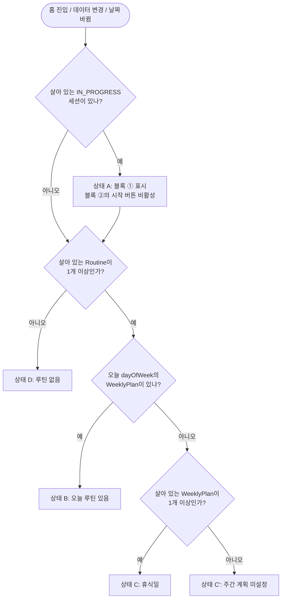

# 루틴·주간 계획(F-RT)과 홈(오늘) 화면 상세 기능 명세

- 작업: FP-16 (상위: FP-11 헬스 플래너 MVP 기능 상세 명세)
- 작성일: 2026-10-01
- 상태: 초안
- 대상 화면: S-01 홈(오늘), S-05 루틴 목록, S-06 루틴 편집, S-07 주간 계획
- 기준 문서
  - [기능 정의서 및 MVP 범위](../feature-definition.md) 2.2절(F-RT), 5장(화면 목록)
  - [데이터 모델·도메인 규칙 v1](../../1.architectur/mvp-design/data-model-v1.md) 2.2~2.5절(Routine, RoutineExercise, WeeklyPlan, WorkoutSession), 4장(trackingType), 6장(요일 규칙 Q-3), 7.2절(진행 중 세션 1개 Q-6)
  - [공통 UI·IA·내비게이션 명세](../../1.architectur/mvp-design/ia-navigation.md) 2.1절(경로), 3장(공통 컴포넌트), 4장(와이어프레임 표기), 5장(공통 UX 규칙)

이 문서는 M 항목 **F-RT-01(루틴 생성), F-RT-02(루틴 편집), F-RT-04(요일별 루틴 배정)** 과 **홈(S-01) 화면 구성**을 상세화하고, S 항목 **F-RT-03(복제·삭제), F-RT-05(주간 계획 보기)** 는 요약한다.
필드 범위·저장 규칙은 데이터 모델 문서를, 컴포넌트·표기·숫자/날짜 형식은 IA 문서를 따르며 여기서 반복하지 않는다.

---

## 1. 범위와 용어

### 1.1 기능·화면 매핑

| 기능 ID | 기능 | MoSCoW | 화면 | 이 문서 |
| --- | --- | --- | --- | --- |
| F-RT-01 | 루틴 생성 | M | S-05 → S-06 | 3장, 4장 상세 |
| F-RT-02 | 루틴 편집 | M | S-05 → S-06 | 4장 상세 |
| F-RT-03 | 루틴 복제·삭제 | S | S-05, S-06 | 7.1절 요약 |
| F-RT-04 | 요일별 루틴 배정 | M | S-07 | 5장 상세 |
| F-RT-05 | 주간 계획 보기 | S | S-07, S-01 | 7.2절 요약 |
| F-RT-06 | 운동 기본 휴식 시간 | C | S-06 | 범위 밖. `restSec`는 항상 `null`로 저장(데이터 모델 2.3절) |
| — | 홈(오늘) 화면 구성 | M | S-01 | 6장 상세 (F-WS-01·02·11 진입점 포함) |

### 1.2 용어

| 용어 | 정의 |
| --- | --- |
| 오늘 | 사용자 기기 로컬 시간대 기준 날짜. 요일 값은 `getDay()`(0=일 ~ 6=토, 데이터 모델 6장) |
| 오늘 루틴 | 오늘 요일(`dayOfWeek`)의 살아 있는 WeeklyPlan이 가리키는 살아 있는 Routine. 요일당 최대 1개 |
| 휴식일 | 그 요일에 살아 있는 WeeklyPlan이 없는 날. 별도 레코드로 저장하지 않는다 |
| 주간 계획 미설정 | 살아 있는 Routine은 있지만 살아 있는 WeeklyPlan이 하나도 없는 상태 |
| 이번 주 | 오늘이 속한 월요일 ~ 일요일 구간(`startOfWeek(today, { weekStartsOn: 1 })`) |
| 날짜의 완료 | 그 날짜(세션 `startedAt`의 로컬 날짜)에 살아 있는 `COMPLETED` 세션이 1개 이상 있음. 루틴 기반·빈 세션을 가리지 않는다 |
| 목표값 | RoutineExercise의 `targetSets`, `targetReps`, `targetWeight`, `targetDurationSec` |

---

## 2. 공통 규칙

### 2.1 목표값 요약 표시 형식

목록·미리보기(S-05, S-01, S-06 접힘 상태)에서 운동 1개의 목표를 한 줄로 보여 줄 때 쓴다. 숫자 형식은 IA 5.1절·5.3절을 따른다.

| trackingType | 형식 | 예 |
| --- | --- | --- |
| `WEIGHT_REPS` (중량 있음) | `{세트}세트 × {횟수}회, {중량}` | `4세트 × 8회, 60 kg` |
| `WEIGHT_REPS` (중량 없음) | `{세트}세트 × {횟수}회` | `4세트 × 8회` |
| `REPS_ONLY` | `{세트}세트 × {횟수}회` | `3세트 × 10회` |
| `DURATION` | `{세트}세트 × {mm:ss}` | `3세트 × 01:00` |

- 루틴 요약은 `운동 N개, M세트`이다. M은 살아 있는 RoutineExercise의 `targetSets` 합이다.
- 와이어프레임에서는 폭이 모호한 `×` 대신 `x`로 적는다(IA 4.1절).

### 2.2 요일 표시 규칙 (Q-3)

데이터 모델 6장을 그대로 따른다. 이 문서의 화면에 적용하면 다음과 같다.

| 항목 | 규칙 |
| --- | --- |
| 저장 | `WeeklyPlan.dayOfWeek` = `0(일) ~ 6(토)` |
| 표시 순서 | 월 화 수 목 금 토 일 (`[1, 2, 3, 4, 5, 6, 0]`), 표시 위치 = `(dayOfWeek + 6) % 7` |
| 주 구간 | 월요일 00:00 ~ 일요일 24:00 (로컬). S-07 `?week=`는 그 주 월요일 날짜 |
| 요일 이름 | 한 글자 `월`~`일`(목록·칩), 시트 제목은 `월요일`~`일요일` |
| 여러 요일 나열 | 표시 순서대로 쉼표로 잇는다. 예: `dayOfWeek` `[0, 1, 4]` → `월, 목, 일` |
| 주 시작 설정 | `Settings.weekStartsOn`은 MVP에서 `1` 고정. 화면은 이 값을 읽어 계산하고 상수로 박지 않는다 |

---

## 3. S-05 루틴 목록

- 경로: `/routines` (루틴 탭 루트, 탭 바 표시)
- 관련 기능: F-RT-01(생성 진입), F-RT-03(복제·삭제), F-RT-04(주간 계획 진입)

### 3.1 와이어프레임

```text
+--------------------------------------+
| 루틴                              #1 |
+--------------------------------------+
| [ 주간 계획 > ]  [ 라이브러리 > ] #2 |
+--------------------------------------+
| 상체 A                      [...] #3 |
| 운동 5개, 18세트                     |
| 매주 월, 목                       #4 |
+--------------------------------------+
| 하체 A                         [...] |
| 운동 4개, 16세트                     |
| 매주 화, 토                          |
+--------------------------------------+
| 팔 집중                        [...] |
| 운동 3개, 9세트                      |
| 배정 없음                            |
+--------------------------------------+
| [[           새 루틴           ]] #5 |
+--------------------------------------+
| 홈  *루틴*  히스토리  체성분  설정   |
+--------------------------------------+
```

| # | 요소 | 동작·규칙 |
| --- | --- | --- |
| 1 | 헤더 | 탭 루트라 뒤로 버튼 없음 |
| 2 | 바로가기 | `주간 계획` → S-07 `/routines/plan`, `라이브러리` → S-02 `/exercises`(둘러보기) |
| 3 | 루틴 카드 | 카드 탭 → S-06 `/routines/:id/edit`. `[...]` 메뉴: `편집`, `복제`(7.1절), `삭제`(7.1절). 정렬은 `updatedAt` 최신순 |
| 4 | 배정 요일 | 이 루틴을 가리키는 살아 있는 WeeklyPlan의 요일(2.2절 순서). 없으면 `배정 없음` |
| 5 | 새 루틴 | S-06 `/routines/new`. 목록 맨 아래가 아니라 화면 하단(탭 바 위)에 고정 |

### 3.2 상태별 변형

| 상태 | 표시 |
| --- | --- |
| 로딩 | 카드 자리 스켈레톤 3개 |
| 루틴 0개 | 카드 영역에 `EmptyState(empty)` "아직 루틴이 없어요" / 버튼 `루틴 만들기`(IA 3.4절). 하단 `새 루틴` 버튼은 숨긴다(Primary 중복 방지). #2 바로가기는 유지 |
| 불러오기 실패 | `EmptyState(error)` |

---

## 4. F-RT-01·02 루틴 생성·편집 (S-06)

- 경로: `/routines/new`(생성), `/routines/:routineId/edit`(편집), `/routines/new?copyFrom=:routineId`(복제, 7.1절)
- 탭 바 숨김, 하단 고정 `저장` 버튼(IA 1.4절). 운동 추가는 자식 라우트 `…/exercises`(S-02 선택 모드, IA 2.2절)
- 관련 데이터: Routine(2.2절), RoutineExercise(2.3절)

### 4.1 와이어프레임 — 편집 (trackingType 3종 포함)

```text
+--------------------------------------+
| <  루틴 편집                      #1 |
+--------------------------------------+
| 루틴 이름                            |
| [상체 B______________________]    #2 |
| 메모 (선택)                          |
| [가슴과 등 위주______________]       |
+--------------------------------------+
| 운동 3개, 10세트                  #3 |
+--------------------------------------+
| =  벤치프레스               [...] #4 |
|    바벨, 중량x횟수                #5 |
|    세트 [-| 4세트 |+]                |
|    횟수 [-| 8회 |+]                  |
|    중량 [-| 60 kg |+]  (선택)        |
+--------------------------------------+
| =  풀업                        [...] |
|    맨몸, 횟수만                   #6 |
|    세트 [-| 3세트 |+]                |
|    횟수 [-| 10회 |+]                 |
+--------------------------------------+
| =  플랭크                      [...] |
|    맨몸, 시간                     #7 |
|    세트 [-| 3세트 |+]                |
|    시간 [-| 01:00 |+]                |
+--------------------------------------+
| [ + 운동 추가 ]                   #8 |
+--------------------------------------+
| [[            저장            ]]  #9 |
+--------------------------------------+
```

| # | 요소 | 동작·규칙 |
| --- | --- | --- |
| 1 | 헤더 | 제목: 생성 `새 루틴`, 편집 `루틴 편집`. 뒤로: 변경이 있으면 `useBlocker`로 "변경 사항을 버릴까요?"(IA 2.4절). 편집 모드에서 `[...]` 메뉴에 `복제`, `삭제`(7.1절) |
| 2 | 루틴 이름·메모 | 이름 필수, 메모 선택. 검증은 4.6절 |
| 3 | 운동 요약 | 폼의 현재 값으로 실시간 계산(2.1절). 저장 전 값도 반영 |
| 4 | 운동 항목 헤더 | `=` 드래그 핸들(순서 변경 4.4절). 운동 이름. `[...]` 메뉴: `위로 이동`, `아래로 이동`, `삭제`(4.3절) |
| 5 | 운동 정보 줄 | `장비, 기록 유형`. 기록 유형에 따라 아래 목표값 입력 칸이 달라진다(4.2절) |
| 6 | `REPS_ONLY` 항목 | 세트·횟수만 입력. 중량 칸 없음 |
| 7 | `DURATION` 항목 | 세트·시간만 입력. 횟수·중량 칸 없음 |
| 8 | 운동 추가 | 자식 라우트 S-02 선택 모드로 이동. 선택한 운동을 목록 끝에 선택 순서대로 붙인다(4.3절) |
| 9 | 저장 | 4.5절 저장 처리. 저장 중 비활성 + 스피너 |

### 4.1.1 와이어프레임 — 새 루틴 (운동 없음, 이름 오류)

```text
+--------------------------------------+
| <  새 루틴                           |
+--------------------------------------+
| 루틴 이름                            |
| [예: 상체 A__________________]       |
| ! 루틴 이름을 입력해 주세요          |
| 메모 (선택)                          |
| [____________________________]       |
+--------------------------------------+
| 운동 0개                             |
|                                      |
|   아직 추가한 운동이 없어요          |
|   [ + 운동 추가 ]                    |
|                                      |
+--------------------------------------+
| [[            저장            ]]     |
+--------------------------------------+
```

- 첫 진입 시 이름 칸에 포커스를 두고 키보드를 올린다. 오류 문구는 저장을 눌렀을 때(또는 이름 칸 blur 시) 표시한다.
- 운동 0개로 저장하면 운동 영역 위에 `! 운동을 하나 이상 추가해 주세요`를 표시하고 `+ 운동 추가` 버튼으로 포커스를 옮긴다.

### 4.2 trackingType별 목표값 입력

운동 항목의 입력 칸은 해당 Exercise의 `trackingType`으로 정한다. 입력 컴포넌트는 `NumberStepper`(IA 3.1절)이고, 범위는 데이터 모델 2.3절을 따르되 아래 값으로 덮어쓴다.

| trackingType | 입력 칸 (위에서 아래 순서) | 저장 값 | 새로 추가할 때 기본값 |
| --- | --- | --- | --- |
| `WEIGHT_REPS` (중량×횟수) | 세트, 횟수, 중량(선택) | `targetSets`, `targetReps`, `targetWeight`(빈 칸이면 `null`), `targetDurationSec=null` | 3세트, 10회, 중량 빈 칸 |
| `REPS_ONLY` (횟수) | 세트, 횟수 | `targetSets`, `targetReps`, `targetWeight=null`, `targetDurationSec=null` | 3세트, 10회 |
| `DURATION` (시간, 목표 초) | 세트, 시간 | `targetSets`, `targetDurationSec`, `targetReps=null`, `targetWeight=null` | 3세트, 60초(`01:00`) |

**입력 칸별 스테퍼 설정**

| 칸 | step | min | max | precision | 표시 | `allowEmpty` | 비고 |
| --- | --- | --- | --- | --- | --- | --- | --- |
| 세트 | 1 | 1 | 20 | 0 | `N세트` | `false` | IA 3.1절 "목표 세트 수"와 같음 |
| 횟수 | 1 | 1 | 100 | 0 | `N회` | `false` | IA 기본(0~999)보다 좁힘. 데이터 모델 `targetReps` 1~100 |
| 중량 | 2.5 | 0 | 999.75 | 2 | `N kg` | `true` | 빈 칸 placeholder `비우면 세션에서 입력`. `0 kg`과 빈 칸은 다르다(0은 저장) |
| 시간 | 5초 | 5초 | 3600초 | 0 | `mm:ss`(60분은 `1:00:00`) | `false` | 직접 입력은 `1:30`, `90`(초) 둘 다 받는다. 데이터 모델 범위(1~3600초) 중 UI는 5초 이상만 받는다 |

- 저장 시 Repository가 trackingType에 맞지 않는 필드를 `null`로 맞춘다(데이터 모델 8장). 폼은 해당 칸을 아예 그리지 않으므로 사용자가 잘못된 조합을 만들 수 없다.
- 루틴에 들어 있는 운동은 기록 유형을 바꿀 수 없다(데이터 모델 4.3절). 따라서 편집 도중 입력 칸 구성이 바뀌는 일은 없다.
- 세션 시작 시 이 값이 세트에 어떻게 복사되는지는 데이터 모델 4.2절을 따른다. `targetWeight`가 `null`이면 세션에서 이전 기록(F-WS-08)을 placeholder로 보여 준다.

### 4.3 운동 추가·삭제

| 동작 | 규칙 |
| --- | --- |
| 추가 | S-02 선택 모드에서 여러 개 체크 후 `N개 추가`. 이미 폼에 있는 운동은 체크 칸 대신 `추가됨` 라벨을 보여 주고 선택할 수 없다(같은 루틴 안 중복 금지). 추가한 항목은 4.2절 기본값으로 목록 끝에 붙고, 첫 추가 항목으로 스크롤한다 |
| 선택 모드 취소 | 뒤로/`취소` → 폼 변경 없이 S-06으로 돌아온다 |
| 삭제 | 항목 `[...]` → `삭제`. 확인 없이 폼에서 즉시 제거하고 `<< 벤치프레스를 뺐어요   [실행 취소] >>`(5초, IA 5.4절). 실행 취소 시 원래 위치·값으로 복구 |
| 삭제 반영 시점 | 폼에서만 빠지고, 저장할 때 기존 RoutineExercise를 soft delete한다. 저장하지 않고 나가면 아무것도 바뀌지 않는다 |
| 개수 제한 | 최소 1개(저장 시 검사). 최대 개수는 두지 않는다 |

### 4.4 순서 변경

| 항목 | 규칙 |
| --- | --- |
| 터치 | `=` 핸들을 길게 누르면(250ms) 항목이 들리고 위아래로 끌어 놓는다. 핸들 밖을 길게 눌러도 들리지 않는다(스크롤과 충돌 방지) |
| 마우스 | `=` 핸들을 끌어 놓는다 |
| 키보드 | 핸들에 포커스 → `Space`로 들기 → `↑`/`↓`로 이동 → `Space`로 놓기, `Esc`로 취소 |
| 메뉴 대안 | 항목 `[...]`의 `위로 이동`/`아래로 이동`. 맨 위 항목은 `위로 이동`, 맨 아래 항목은 `아래로 이동`이 비활성 |
| 스크린리더 안내 | 이동 후 `aria-live="polite"`로 "벤치프레스, 3개 중 2번째" 처럼 새 위치를 읽어 준다 |
| 저장 | 순서 변경은 폼 상태만 바꾼다. 저장할 때 화면 순서대로 `orderIndex`를 `0`부터 연속으로 다시 매긴다 |
| 운동 1개 | 핸들과 이동 메뉴를 비활성으로 표시한다 |

### 4.5 저장 처리

1. Zod로 폼 전체를 검증한다(4.6절). 실패하면 첫 오류 필드로 포커스를 옮기고 멈춘다.
2. `RoutineRepository.save(routine, items)`를 하나의 `rw` 트랜잭션으로 실행한다.
   - Routine: 생성이면 새 UUID, 편집이면 같은 `id`로 `name`(앞뒤 공백 제거), `note`, `updatedAt` 갱신
   - 폼에 있는 항목: 기존 항목은 같은 `id`로 갱신, 새 항목은 새 `id`. `orderIndex` 재부여, trackingType에 맞지 않는 목표 필드는 `null`
   - 폼에서 빠진 기존 항목: soft delete
   - 검사: 살아 있는 Exercise인지, 같은 루틴 안 `exerciseId` 중복이 없는지(데이터 모델 8장)
3. 성공하면 이전 화면으로 돌아간다(앱 안 기록이 없으면 `/routines`로 replace). 화면이 바뀌므로 성공 토스트는 띄우지 않는다(IA 5.5절).
4. 실패하면 화면과 입력 값을 유지하고 `저장하지 못했어요` 오류 토스트 + `다시 시도`(IA 5.5절).

- 루틴을 수정해도 이미 시작한 세션·지난 세션은 바뀌지 않는다(세션 시작 시 목표값을 세트로 복사, 데이터 모델 4.2절). 진행 중 세션이 이 루틴으로 시작됐어도 편집을 막지 않는다.
- WeeklyPlan은 S-06에서 바꾸지 않는다. 요일 배정은 S-07에서만 한다.

### 4.6 검증 표 (F-RT-01·02)

| 대상 | 규칙 | 검사 시점 | 오류 문구 (인라인) | 위치 |
| --- | --- | --- | --- | --- |
| 루틴 이름 | 앞뒤 공백 제거 후 1자 이상 | blur, 저장 | 루틴 이름을 입력해 주세요 | Zod |
| 루틴 이름 | 50자 이하. 51자째부터 입력되지 않게 `maxLength=50` | 입력 중 | (입력 차단, 문구 없음) | 입력칸 + Zod |
| 루틴 이름 | 중복 허용(데이터 모델 2.2절) | — | — | — |
| 메모 | 0~500자, `maxLength=500`. 비면 `''` 저장 | 입력 중 | (입력 차단) 남은 글자 수 `480/500` 표시 | 입력칸 + Zod |
| 운동 항목 수 | 1개 이상 | 저장 | 운동을 하나 이상 추가해 주세요 | Zod |
| 운동 중복 | 같은 `exerciseId`는 1번만 | 추가 시(선택 불가), 저장 | (UI에서 막음) 저장 시 위반이면 오류 토스트 | 선택 모드 + Repository |
| 운동 상태 | 살아 있는 Exercise | 저장 | 삭제된 운동이 있어요. 빼고 저장해 주세요 | Repository |
| 세트 | 정수 1~20 | 스테퍼 onChange | 1~20 사이로 입력해 주세요 | 스테퍼 + Zod |
| 횟수 (`WEIGHT_REPS`, `REPS_ONLY`) | 정수 1~100, 필수 | 스테퍼 onChange, 저장 | 1~100회 사이로 입력해 주세요 | 스테퍼 + Zod |
| 중량 (`WEIGHT_REPS`) | 빈 칸 또는 0~999.75, 소수 둘째 자리 | 스테퍼 onChange | 0~999.75 kg 사이로 입력해 주세요 | 스테퍼 + Zod |
| 시간 (`DURATION`) | 정수 초 5~3600, 필수 | 스테퍼 onChange, 저장 | 0:05~60:00 사이로 입력해 주세요 | 스테퍼 + Zod |
| 시간 직접 입력 형식 | `m:ss`, `mm:ss` 또는 숫자(초). 초 부분 0~59 | blur | 시간은 1:30처럼 입력해 주세요 | 스테퍼 |
| 기록 유형별 null 필드 | 4.2절 표의 `null` 필드는 반드시 `null` | 저장 | (UI에서 막음) | Zod + Repository |

### 4.7 예외 처리 (F-RT-01·02)

| 상황 | 처리 |
| --- | --- |
| `/routines/:id/edit`의 루틴이 없거나 삭제됨 | `/routines`로 replace, 정보 토스트 "삭제된 루틴이에요" |
| `?copyFrom` 원본이 없거나 삭제됨 | 빈 새 루틴 폼으로 열고 정보 토스트 "원본 루틴을 찾지 못해 빈 루틴으로 시작해요" |
| 편집 중 다른 탭에서 루틴이 삭제됨 | 저장 시 Repository 오류 → 오류 토스트 "삭제된 루틴이라 저장하지 못했어요", `/routines`로 replace |
| 루틴 안 사용자 정의 운동이 삭제됨(이전) | 데이터 모델 1.3절 연쇄로 RoutineExercise도 삭제되어 폼에 나타나지 않는다. 남은 운동이 0개면 4.1.1절 빈 상태로 열린다 |
| 편집 중 다른 탭에서 폼 안의 운동이 삭제됨 | 저장 시 "삭제된 운동이 있어요" 오류. 해당 항목 정보 줄에 `! 삭제된 운동`을 표시하고 `삭제` 메뉴로 뺄 수 있게 한다 |
| 선택 모드에서 같은 운동을 다시 고름 | 이미 추가된 운동은 선택할 수 없다(4.3절) |
| 저장하지 않고 탭 이동·뒤로·새로고침 | 앱 안 이동은 `useBlocker` 확인 다이얼로그. 새로고침·창 닫기는 `beforeunload` 브라우저 기본 경고 |
| 저장 버튼 연타 | 저장 중 비활성(IA 5.5절)으로 1번만 저장 |
| 저장 공간 부족(`QuotaExceededError`) | IA 5.5절 전용 문구 + `설정으로` |

### 4.8 인수 조건 (F-RT-01·02)

**RT01-AC-01 루틴 생성 (`WEIGHT_REPS`)**
- Given 루틴이 없고 S-06 `/routines/new`에 있다
- When 이름에 "상체 A"를 입력하고, 운동 추가에서 벤치프레스(`WEIGHT_REPS`)를 고른 뒤 세트 4, 횟수 8, 중량 60 kg으로 바꾸고 `저장`을 누른다
- Then Routine 1개(`name="상체 A"`, `note=""`)와 RoutineExercise 1개(`orderIndex=0`, `targetSets=4`, `targetReps=8`, `targetWeight=60`, `targetDurationSec=null`, `restSec=null`)가 저장되고, S-05 목록 맨 위에 "상체 A / 운동 1개, 4세트 / 배정 없음"이 보인다

**RT01-AC-02 중량을 비워 두기**
- Given S-06에 `WEIGHT_REPS` 운동이 추가되어 중량 칸이 빈 칸이다
- When 그대로 저장한다
- Then `targetWeight=null`로 저장되고 오류가 나지 않는다

**RT01-AC-03 `REPS_ONLY` 목표값**
- Given S-06에서 풀업(`REPS_ONLY`)을 추가했다
- When 항목을 본다
- Then 세트(기본 3)와 횟수(기본 10) 칸만 있고 중량·시간 칸은 없으며, 저장 결과는 `targetReps=10`, `targetWeight=null`, `targetDurationSec=null`이다

**RT01-AC-04 `DURATION` 목표값**
- Given S-06에서 플랭크(`DURATION`)를 추가했다
- When 시간 칸에 `1:30`을 직접 입력하고 저장한다
- Then 시간 칸은 `01:30`으로 보이고 `targetDurationSec=90`, `targetReps=null`, `targetWeight=null`로 저장된다

**RT01-AC-05 시간 범위**
- Given `DURATION` 항목의 시간이 `00:05`이다
- When `-`를 누른다
- Then 값은 `00:05`에 머물고 `-` 버튼이 비활성이다

**RT01-AC-06 이름 누락**
- Given 이름 칸이 비어 있거나 공백만 있고 운동이 1개 있다
- When `저장`을 누른다
- Then 저장되지 않고 이름 칸 아래 "루틴 이름을 입력해 주세요"가 표시되며 이름 칸으로 포커스가 이동한다

**RT01-AC-07 운동 0개**
- Given 이름은 입력했고 운동이 0개다
- When `저장`을 누른다
- Then 저장되지 않고 "운동을 하나 이상 추가해 주세요"가 표시된다

**RT01-AC-08 중복 운동 방지**
- Given 폼에 벤치프레스가 이미 있다
- When 운동 추가(S-02 선택 모드)를 연다
- Then 벤치프레스 행에는 체크 칸 대신 `추가됨`이 표시되고 선택할 수 없다

**RT02-AC-01 순서 변경**
- Given 루틴에 A, B, C 순서로 운동이 있다(`orderIndex` 0, 1, 2)
- When C의 핸들을 끌어 맨 위에 놓고 저장한다
- Then 화면 순서는 C, A, B이고 `orderIndex`는 C=0, A=1, B=2로 저장된다

**RT02-AC-02 메뉴로 순서 변경**
- Given 운동이 3개 있다
- When 첫 번째 항목의 `[...]`를 연다
- Then `위로 이동`은 비활성이고 `아래로 이동`을 누르면 두 번째 위치로 옮겨지며 "…, 3개 중 2번째"가 스크린리더로 안내된다

**RT02-AC-03 운동 삭제와 실행 취소**
- Given 편집 중인 루틴에 벤치프레스가 두 번째 위치에 있다
- When `[...]` → `삭제`를 누른 뒤 5초 안에 토스트의 `실행 취소`를 누른다
- Then 벤치프레스가 원래 위치와 목표값 그대로 돌아온다

**RT02-AC-04 삭제 반영**
- Given 저장된 루틴에서 운동 하나를 삭제했다
- When `저장`을 누른다
- Then 그 RoutineExercise는 `deletedAt`이 설정되고, 남은 항목의 `orderIndex`는 0부터 연속이다

**RT02-AC-05 저장하지 않고 나가기**
- Given S-06에서 세트 값을 바꿨다
- When 헤더 뒤로 버튼을 누른다
- Then "변경 사항을 버릴까요?" 다이얼로그가 뜨고, `버리기`를 누르면 저장 없이 이전 화면으로, `취소`를 누르면 편집 화면에 남는다

**RT02-AC-06 지난 세션 보존**
- Given "상체 A"로 진행한 `COMPLETED` 세션이 있다
- When "상체 A"의 벤치프레스 목표 중량을 60 kg → 65 kg으로 바꿔 저장한다
- Then 지난 세션의 세트 값은 바뀌지 않고, 다음에 시작하는 세션부터 65 kg이 채워진다

---

## 5. F-RT-04 요일별 루틴 배정 (S-07)

- 경로: `/routines/plan`, `?week=YYYY-MM-DD`(그 주 월요일, 없으면 이번 주)
- 탭 바 표시(루틴 탭). 진입: S-05 `주간 계획`, S-01 `주간 계획 보기`
- 관련 데이터: WeeklyPlan(데이터 모델 2.4절)

### 5.1 배정 규칙

| 규칙 | 내용 |
| --- | --- |
| 요일당 1개 | 한 요일에는 루틴 1개만 배정한다. 살아 있는 WeeklyPlan끼리 `dayOfWeek` 중복 불가 |
| 배정 변경 | 이미 배정된 요일에 다른 루틴을 고르면 기존 레코드의 `routineId`를 바꾼다(새 레코드를 만들지 않음) |
| 휴식일 지정 | `휴식 (배정 없음)`을 고르면 그 요일 레코드를 soft delete한다. 휴식일 전용 레코드는 없다 |
| 다시 배정 | 휴식일에 루틴을 고르면 새 WeeklyPlan 레코드를 만든다(삭제된 레코드를 되살리지 않음) |
| 같은 루틴 여러 요일 | 허용. 예: 상체 A를 월·목에 배정 |
| 매주 반복 | 배정은 주차와 관계없이 매주 같다. 어느 주를 보고 있든 배정을 바꾸면 모든 주에 적용된다(주기화는 범위 밖) |
| 루틴 삭제 | 루틴을 삭제하면 그 루틴의 WeeklyPlan도 함께 soft delete되어 해당 요일은 휴식일이 된다(데이터 모델 1.3절) |
| 즉시 저장 | 배정 시트에서 항목을 누르는 즉시 저장한다(폼·저장 버튼 없음) |

### 5.2 주 시작 표시 규칙 (Q-3)

- 7개 행을 **월요일부터 일요일까지** 위에서 아래로 보여 준다. 저장 값과 표시 순서 변환은 2.2절.
- `?week` 값 처리

| 입력 | 처리 |
| --- | --- |
| 없음 | 이번 주 |
| 올바른 날짜, 월요일 | 그 주 |
| 올바른 날짜, 월요일 아님 | 그 날짜가 속한 주의 월요일로 바꿔 URL을 replace. 예: `?week=2026-10-01`(목) → `?week=2026-09-28` |
| 형식 오류(`2026-13-01`, `abc`) | 파라미터를 지우고 이번 주로 replace |

- 주 이동: `[<]`·`[>]`로 한 주씩 이동하며 `?week`를 바꾼다(push). 이동 범위 제한은 없다.
- 이번 주가 아닐 때 헤더 오른쪽에 `이번 주로` 버튼을 보여 준다.
- 행의 날짜는 `M/d`(IA 5.2절 좁은 공간 형식), 기간 제목은 `9월 28일 ~ 10월 4일`.

### 5.3 와이어프레임 — 주간 계획 (이번 주)

```text
+--------------------------------------+
| <  주간 계획                      #1 |
+--------------------------------------+
| [<]  9월 28일 ~ 10월 4일  [>]     #2 |
| 이번 주  2/4 완료                 #3 |
+--------------------------------------+
| 월  9/28  상체 A        완료 >    #4 |
| 화  9/29  하체 A        완료 >       |
| 수  9/30  휴식               >       |
| 목  10/1  상체 A        오늘 >       |
| 금  10/2  휴식               >       |
| 토  10/3  하체 A        예정 >       |
| 일  10/4  휴식               >       |
+--------------------------------------+
| 요일을 누르면 루틴을 바꿀 수 있어요  |
+--------------------------------------+
| 홈  *루틴*  히스토리  체성분  설정   |
+--------------------------------------+
```

| # | 요소 | 동작·규칙 |
| --- | --- | --- |
| 1 | 헤더 | 뒤로 → 이전 화면(기록 없으면 `/routines`). 이번 주가 아니면 오른쪽에 `이번 주로` |
| 2 | 주 이동 | 5.2절. 버튼 접근성 이름 "이전 주", "다음 주" |
| 3 | 완료 요약 | 7.2절(F-RT-05). 이번 주가 아니면 `이 주  N/M 완료` |
| 4 | 요일 행 | `요일  날짜  루틴 이름(없으면 휴식)  상태`. 행 전체가 터치 대상(높이 56px). 탭 → 배정 시트(5.4절). 오늘 행은 굵은 글씨 + `오늘` 텍스트로 강조. 상태 값은 7.2절 |

상태별 변형

| 상태 | 표시 |
| --- | --- |
| 루틴 0개 | 요일 목록 대신 `EmptyState(empty)` "배정할 루틴이 없어요" / `루틴 만들기`(→ `/routines/new`) |
| 배정 0개(루틴은 있음) | 7개 행 모두 `휴식`. 완료 요약 자리에 "요일을 눌러 루틴을 배정해 보세요" |
| 로딩 | 행 스켈레톤 7개 |
| 불러오기 실패 | `EmptyState(error)` |

### 5.4 와이어프레임 — 배정 시트 (목요일)

```text
+======================================+
| 목요일 루틴                       #5 |
| 매주 목요일에 할 루틴을 고르세요     |
+--------------------------------------+
| 상체 A  (운동 5개)               [v] |
| 하체 A  (운동 4개)               [ ] |
| 팔 집중  (운동 3개)              [ ] |
| 휴식 (배정 없음)                 [ ] |
+--------------------------------------+
| [ 루틴 편집 > ]                   #6 |
+======================================+
```

| # | 요소 | 동작·규칙 |
| --- | --- | --- |
| 5 | 선택 목록 | `BottomSheet`(IA 3.2절) 안의 단일 선택(radio group) 목록. 표기 `[v]`는 현재 선택. 살아 있는 루틴을 S-05와 같은 순서로 나열하고 맨 끝에 `휴식 (배정 없음)`. 항목을 누르면 즉시 저장(5.1절) → 시트 닫힘 → `<< 목요일에 하체 A를 배정했어요   [실행 취소] >>`. 현재 선택을 다시 누르면 저장 없이 닫는다 |
| 6 | 루틴 편집 | 현재 배정된 루틴의 S-06으로 이동. 휴식일이면 비활성 |

- 휴식으로 바꾼 경우 토스트 문구: `<< 목요일을 휴식일로 바꿨어요   [실행 취소] >>`
- `실행 취소`는 직전 상태로 되돌린다(변경이면 이전 `routineId`로, 휴식 지정이면 `deletedAt=null`로, 새 배정이면 soft delete).
- 저장 중에는 시트를 `busy`로 두어 연속 탭을 막는다.

### 5.5 검증 표 (F-RT-04)

| 대상 | 규칙 | 검사 시점 | 실패 시 | 위치 |
| --- | --- | --- | --- | --- |
| `dayOfWeek` | 정수 0~6 | 저장 | 오류 토스트(정상 UI에서는 발생하지 않음) | Zod |
| 요일 중복 | 살아 있는 WeeklyPlan 중 같은 `dayOfWeek`는 1개 | 저장 트랜잭션 안 | 기존 레코드를 갱신하는 방식이라 새로 생기지 않음. 가져오기 등으로 2개가 발견되면 `updatedAt` 최신 1개만 쓰고 나머지 soft delete | Repository |
| `routineId` | 살아 있는 Routine | 저장 | 시트 `error`: "삭제된 루틴이에요. 다른 루틴을 골라 주세요", 목록 새로 고침 | Repository |
| `?week` | `YYYY-MM-DD` 유효 날짜 | 화면 진입·이동 | 5.2절 표대로 replace | 화면 |

### 5.6 예외 처리 (F-RT-04)

| 상황 | 처리 |
| --- | --- |
| 시트를 연 사이 다른 탭에서 루틴 삭제 | `useLiveQuery`로 목록에서 사라진다. 이미 누른 경우 5.5절 `routineId` 오류 |
| 저장 실패(DB 오류) | 시트를 닫지 않고 `error` 표시, 오류 토스트 `다시 시도`(IA 3.2절, 5.5절) |
| 실행 취소 시 그 요일이 이미 다시 바뀜 | 되돌리지 않고 정보 토스트 "이미 다른 루틴이 배정되어 되돌리지 않았어요" |
| 진행 중 세션이 있음 | 배정 변경을 막지 않는다. 진행 중 세션은 영향을 받지 않는다 |
| 오늘 요일 배정 변경 | 홈(S-01)의 오늘 루틴이 즉시 바뀐다(`useLiveQuery`) |

### 5.7 인수 조건 (F-RT-04)

**RT04-AC-01 요일 배정**
- Given 루틴 "상체 A"가 있고 목요일에 배정이 없다
- When S-07에서 목요일 행을 누르고 "상체 A"를 고른다
- Then `dayOfWeek=4`, `routineId=상체 A`인 WeeklyPlan이 생기고, 시트가 닫히며 목요일 행에 "상체 A"가 보이고 "목요일에 상체 A를 배정했어요" 토스트가 뜬다

**RT04-AC-02 배정 변경은 요일당 1개 유지**
- Given 목요일에 "상체 A"가 배정되어 있다
- When 목요일 행에서 "하체 A"를 고른다
- Then 목요일의 살아 있는 WeeklyPlan은 여전히 1개이며 같은 레코드의 `routineId`가 "하체 A"로 바뀐다

**RT04-AC-03 휴식일 지정**
- Given 목요일에 "상체 A"가 배정되어 있다
- When 목요일 행에서 `휴식 (배정 없음)`을 고른다
- Then 그 WeeklyPlan에 `deletedAt`이 설정되고, 목요일 행에 "휴식"이 표시되며, 오늘이 목요일이면 홈은 휴식일 상태(6.3.3절)가 된다

**RT04-AC-04 같은 루틴 여러 요일**
- Given 월요일에 "상체 A"가 배정되어 있다
- When 목요일에도 "상체 A"를 배정한다
- Then 두 요일 모두 "상체 A"로 보이고 S-05의 "상체 A" 카드에 "매주 월, 목"이 표시된다

**RT04-AC-05 월요일 시작 표시**
- Given 일요일(`dayOfWeek=0`)에 "하체 A"가 배정되어 있다
- When S-07을 연다
- Then 일요일 행은 7개 행 중 맨 아래(7번째)에 표시된다

**RT04-AC-06 주 파라미터 보정**
- Given 사용자가 `/routines/plan?week=2026-10-01`로 진입한다
- When 화면이 열린다
- Then URL이 `?week=2026-09-28`로 replace되고 제목은 "9월 28일 ~ 10월 4일"이다

**RT04-AC-07 루틴 삭제 시 배정 해제**
- Given "상체 A"가 월·목에 배정되어 있다
- When S-05에서 "상체 A"를 삭제한다
- Then 월·목 WeeklyPlan도 같은 `deletedAt`으로 soft delete되고 S-07의 월·목 행은 "휴식"이 된다

**RT04-AC-08 실행 취소**
- Given 목요일을 "상체 A" → "하체 A"로 바꾼 직후다
- When 5초 안에 토스트의 `실행 취소`를 누른다
- Then 목요일 배정이 "상체 A"로 돌아온다

---

## 6. S-01 홈(오늘)

- 경로: `/` (홈 탭 루트, 앱 시작 화면)
- 관련 기능: F-RT-04(오늘 루틴), F-RT-05(이번 주 요약), F-WS-01(루틴 기반 시작), F-WS-02(빈 세션 시작), F-WS-11(진행 중 세션 이어하기), F-BM-01(체중 입력 진입)

### 6.1 화면 구성 블록

화면은 위에서 아래로 아래 블록으로 이루어진다. 상태에 따라 블록 ①·② 내용이 바뀐다.

| 블록 | 내용 | 표시 조건 |
| --- | --- | --- |
| 헤더 | `오늘 10월 1일 (목)` (IA 5.2절 기본 형식) | 항상 |
| ① 진행 중 세션 배너 | 루틴 이름(빈 세션은 `빈 세션`), 경과 시간, 완료 세트 수, `이어하기`, `세션 취소` | 진행 중 세션이 있을 때(상태 A) |
| ② 오늘 블록 | 오늘 루틴 / 휴식일 / 루틴 없음 중 하나와 시작 버튼 | 항상(상태 B·C·D) |
| ③ 이번 주 | 완료 요약 + 요일별 기호 줄 + `주간 계획 보기` | 항상(7.2절) |
| ④ 최근 체중 | 최근 측정 체중과 날짜, `+ 체중 입력` | 항상 |

### 6.2 상태 판정

상태 A는 블록 ①의 유무이고, 상태 B·C·D는 블록 ②의 내용이다. 따라서 화면 상태는 **A 여부 × (B | C | D)** 로 정해진다.



| 상태 | 조건 | 블록 ② 표시 | Primary 버튼 | 보조 동작 |
| --- | --- | --- | --- | --- |
| **A. 진행 중 세션 있음** | 살아 있는 `IN_PROGRESS` 세션 1개(Q-6) | B·C·D 판정대로 표시하되 `운동 시작`, `빈 세션으로 시작`은 비활성 + "진행 중인 운동이 있어요" | 블록 ①의 `이어하기` | `세션 취소`, `주간 계획 보기`, `루틴 만들기`(D일 때)는 활성 유지 |
| **B. 오늘 루틴 있음** | 진행 중 세션 없음 + 오늘 요일 WeeklyPlan 있음 | 루틴 이름, `운동 N개, M세트`, 운동 미리보기 | `운동 시작` | `빈 세션으로 시작` |
| **C. 휴식일** | 오늘 요일 WeeklyPlan 없음 + 다른 요일 배정 있음 | "오늘은 휴식일이에요" + 다음 운동 예정 | 없음 | `주간 계획 보기`, `빈 세션으로 시작` |
| **C'. 주간 계획 미설정** (C의 변형) | 루틴은 있으나 WeeklyPlan 0개 | "오늘 배정된 루틴이 없어요" / "주간 계획에서 요일별 루틴을 정해 보세요" | 없음 | `주간 계획 보기`, `빈 세션으로 시작` |
| **D. 루틴 없음** | 살아 있는 Routine 0개 | "아직 루틴이 없어요" + 안내 | `루틴 만들기` | `빈 세션으로 시작` |

- C와 C'은 배치가 같고 문구만 다르다. 와이어프레임은 C만 그린다.
- 판정은 `useLiveQuery`로 데이터가 바뀔 때마다 다시 한다. 날짜가 바뀌는 경우는 6.6절.

### 6.3 상태별 와이어프레임

#### 6.3.1 상태 B — 오늘 루틴 있음 (진행 중 세션 없음)

```text
+--------------------------------------+
| 오늘 10월 1일 (목)                #1 |
+--------------------------------------+
| 오늘의 루틴                       #2 |
| 상체 A  (운동 5개, 18세트)           |
| 벤치프레스, 바벨 로우, 풀업 외 2개   |
| [[           운동 시작            ]] |
| [ 빈 세션으로 시작 ]                 |
+--------------------------------------+
| 이번 주  2/4 완료                 #3 |
| 월  화  수  목  금  토  일           |
| v   v   -   *   -   o   -            |
| [ 주간 계획 보기 > ]                 |
+--------------------------------------+
| 최근 체중  72.4 kg (9월 29일)     #4 |
| [ + 체중 입력 ]                      |
+--------------------------------------+
| *홈*  루틴  히스토리  체성분  설정   |
+--------------------------------------+
```

| # | 요소 | 동작·규칙 |
| --- | --- | --- |
| 1 | 헤더 | 오늘 날짜. 탭 루트라 뒤로 버튼 없음 |
| 2 | 오늘의 루틴 | 루틴 이름 + `운동 N개, M세트`(2.1절). 미리보기 줄은 `orderIndex` 순 운동 이름 최대 3개, 나머지는 `외 N개`. 블록(이름·미리보기) 탭 → S-06 편집. `운동 시작` → 6.4절. `빈 세션으로 시작` → 6.4절 |
| 3 | 이번 주 | 7.2절. `주간 계획 보기` → S-07(이번 주) |
| 4 | 최근 체중 | 살아 있는 BodyMeasurement 중 `measuredOn` 최신 1건. 없으면 "측정 기록이 없어요". `+ 체중 입력` → S-15 `/body/new?from=home` |

B의 변형(배치 동일, 문구·버튼만 다름)

| 변형 | 조건 | 표시 |
| --- | --- | --- |
| 오늘 이미 완료 | 오늘 날짜에 `COMPLETED` 세션이 있음 | 루틴 이름 옆에 체크 아이콘 + `오늘 완료`. `운동 시작`을 일반 버튼 `[ 한 번 더 운동하기 ]`로 낮춘다(Primary 없음) |
| 운동 0개 루틴 | 오늘 루틴의 살아 있는 RoutineExercise가 0개(사용자 정의 운동 삭제 연쇄 등) | 미리보기 대신 "루틴에 운동이 없어요". `운동 시작` 비활성 + 사유 문구, 아래에 `[ 루틴 편집 > ]` |

#### 6.3.2 상태 A — 진행 중 세션 있음 (오늘 루틴 있음과 겹친 경우)

```text
+--------------------------------------+
| 오늘 10월 1일 (목)                   |
+--------------------------------------+
| 진행 중인 운동                    #1 |
| 상체 A   경과 32:10                  |
| 완료 8 / 18세트                      |
| [[           이어하기             ]] |
| [! 세션 취소 ]                    #2 |
+--------------------------------------+
| 오늘의 루틴                          |
| 상체 A  (운동 5개, 18세트)           |
| [-           운동 시작           -]  |
| [- 빈 세션으로 시작 -]               |
| ! 진행 중인 운동이 있어요         #3 |
+--------------------------------------+
| ~~ 이번 주, 최근 체중: 상태 B와 같음 |
+--------------------------------------+
| *홈*  루틴  히스토리  체성분  설정   |
+--------------------------------------+
```

| # | 요소 | 동작·규칙 |
| --- | --- | --- |
| 1 | 진행 중 세션 배너 | 루틴 이름(`routineId`가 삭제된 루틴이어도 이름 표시, 빈 세션이면 `빈 세션`), 경과 시간 `mm:ss`(1초마다 갱신, `aria-live="off"`), `완료 {완료 세트}/{전체 세트}세트`. 휴식 타이머가 돌고 있으면 `휴식 01:12` 줄을 추가. `이어하기` → S-08 `/workout`. 홈 탭 아이콘에 점 배지(IA 1.1절) |
| 2 | 세션 취소 | `ConfirmDialog`(destructive) "진행 중인 운동을 취소할까요?" / "이 세션의 기록이 모두 삭제돼요. 완료한 세트 8개도 함께 삭제돼요." / `세션 삭제`. 확인 시 세션·세트 soft delete, `<< 세션을 삭제했어요   [실행 취소] >>`(IA 5.4절) |
| 3 | 비활성 사유 | 비활성 버튼 바로 아래에 사유 문구. 버튼에 `aria-describedby`로 연결 |

- 블록 ②가 C 또는 D일 때도 같은 원칙이다. 시작 계열 버튼(`운동 시작`, `빈 세션으로 시작`)만 비활성이고 `주간 계획 보기`, `루틴 만들기`는 활성이다. 이때 블록 ②의 `루틴 만들기`는 Primary가 아닌 일반 버튼으로 낮춘다(Primary는 `이어하기` 1개).
- 데이터 모델 7.2절의 "시작 버튼 대신 이어하기·취소만"은 이 표시(시작 버튼은 비활성으로 남김)로 구체화한다.

#### 6.3.3 상태 C — 휴식일

```text
+--------------------------------------+
| 오늘 9월 30일 (수)                   |
+--------------------------------------+
|                                      |
|   오늘은 휴식일이에요             #1 |
|   다음 운동: 10월 1일 (목) 상체 A    |
|   [ 주간 계획 보기 ]                 |
|                                      |
| [ 빈 세션으로 시작 ]              #2 |
+--------------------------------------+
| ~~ 이번 주, 최근 체중: 상태 B와 같음 |
+--------------------------------------+
| *홈*  루틴  히스토리  체성분  설정   |
+--------------------------------------+
```

| # | 요소 | 동작·규칙 |
| --- | --- | --- |
| 1 | 휴식일 안내 | `EmptyState(empty)` 형식. 제목 "오늘은 휴식일이에요". 다음 운동 = 내일부터 6일 뒤까지 중 배정이 있는 가장 가까운 날의 날짜(IA 5.2절)와 루틴 이름. `[ 주간 계획 보기 ]` → S-07 |
| 2 | 빈 세션으로 시작 | 휴식일에도 계획에 없던 운동을 기록할 수 있다(F-WS-02) |

- C' 주간 계획 미설정: 제목 "오늘 배정된 루틴이 없어요", 설명 "주간 계획에서 요일별 루틴을 정해 보세요", 다음 운동 줄 없음. 버튼은 C와 같다.
- 이번 주 블록에서 오늘 열은 `-`(배정 없음)이고, 휴식일에 운동을 완료하면 `v`가 된다.

#### 6.3.4 상태 D — 루틴 없음

```text
+--------------------------------------+
| 오늘 10월 1일 (목)                   |
+--------------------------------------+
|                                      |
|   아직 루틴이 없어요              #1 |
|   루틴을 만들고 요일에 배정하면      |
|   오늘 할 운동을 여기서 보여 줘요    |
|   [[        루틴 만들기        ]]    |
|                                      |
| [ 빈 세션으로 시작 ]                 |
+--------------------------------------+
| 이번 주  운동 0회                 #2 |
+--------------------------------------+
| 최근 체중  측정 기록이 없어요     #3 |
| [ + 체중 입력 ]                      |
+--------------------------------------+
| *홈*  루틴  히스토리  체성분  설정   |
+--------------------------------------+
```

| # | 요소 | 동작·규칙 |
| --- | --- | --- |
| 1 | 루틴 없음 안내 | `EmptyState(empty)`. `루틴 만들기` → S-06 `/routines/new`. 첫 실행 사용자가 보는 기본 상태다 |
| 2 | 이번 주 | 배정이 0개라 완료 비율 대신 `이번 주  운동 N회`(N = 이번 주 `COMPLETED` 세션 수). 요일 기호 줄은 이번 주 운동한 날이 있을 때만 보여 준다(7.2절) |
| 3 | 최근 체중 | 기록이 없는 경우의 문구 예 |

### 6.4 홈에서 시작하는 동작

| 동작 | 처리 | 성공 | 실패 |
| --- | --- | --- | --- |
| `운동 시작` (B) | 버튼 busy → `SessionRepository.start({ routineId: 오늘 루틴 })`. 하나의 트랜잭션에서 진행 중 세션 검사 후 세션 생성, 데이터 모델 4.2절대로 미완료 세트 생성 | `/workout`으로 이동 | `SessionAlreadyInProgressError`: 정보 토스트 "이미 진행 중인 운동이 있어요" 후 `/workout`으로 이동. 그 외: 오류 토스트 "운동을 시작하지 못했어요" + `다시 시도` |
| `빈 세션으로 시작` (B·C·C'·D) | `SessionRepository.start({ routineId: null })` | `/workout`으로 이동 | 위와 같음 |
| `이어하기` (A) | 화면 이동만 | `/workout` | 그 사이 세션이 끝났으면 S-08 진입 규칙(IA 2.1절)에 따라 `/`로 돌아오고 정보 토스트 |
| `세션 취소` (A) | 6.3.2절 #2 | 배너 사라짐, 상태 B·C·D로 바뀜 | 다이얼로그 오류 상태(IA 3.3절) |
| `주간 계획 보기` | `/routines/plan` | — | — |
| `루틴 만들기` (D) | `/routines/new` | — | — |
| `+ 체중 입력` | `/body/new?from=home` | 저장 후 홈으로 복귀 | — |

### 6.5 검증 표 (홈 동작 조건)

홈은 입력 폼이 없으므로 동작 가능 조건을 검증한다.

| 동작 | 가능 조건 | 조건 불충족 시 표시 | 검사 위치 |
| --- | --- | --- | --- |
| `운동 시작` | 진행 중 세션 없음 + 오늘 루틴 있음 + 오늘 루틴의 살아 있는 운동 1개 이상 | 버튼 비활성 + 사유("진행 중인 운동이 있어요" / "루틴에 운동이 없어요") | 화면 + Repository(진행 중 세션 1개, 데이터 모델 7.2절) |
| `빈 세션으로 시작` | 진행 중 세션 없음 | 버튼 비활성 + "진행 중인 운동이 있어요" | 화면 + Repository |
| `이어하기`, `세션 취소` | 진행 중 세션 있음 | 블록 ① 자체를 그리지 않음 | 화면 |
| 오늘 루틴 판정 | WeeklyPlan과 Routine 모두 `deletedAt === null` | 둘 중 하나라도 삭제됐으면 휴식일로 본다 | Repository 조회 |
| 시작 버튼 연타 | 처리 중에는 1번만 | busy 동안 비활성 + 스피너 | 화면 |

### 6.6 예외 처리 (홈)

| 상황 | 처리 |
| --- | --- |
| 앱을 켜 둔 채 자정이 지남 | 로컬 자정에 맞춘 타이머와 `visibilitychange`(앱 복귀) 때 오늘 날짜를 다시 계산해 헤더·오늘 루틴·이번 주를 갱신한다([앱 수명주기 6장](../../1.architectur/mvp-design/app-lifecycle.md#6-포그라운드-복귀-처리)) |
| 어제 시작한 진행 중 세션이 남아 있음 | 상태 A로 그대로 보여 준다(날짜와 무관하게 이어하기 가능). 경과 시간이 60분 이상이면 `h:mm:ss` |
| 앱 재시작 후 진행 중 세션 | 앱 시작 시 `getInProgress()`로 찾아 상태 A로 보여 준다(F-WS-11, 데이터 모델 7.2절, [시작 순서](../../1.architectur/mvp-design/app-lifecycle.md#2-시작-순서) 4단계). 홈에서 자동으로 S-08로 이동하지는 않는다 |
| 오늘 루틴이 진행 중 세션과 다른 루틴 | 블록 ①은 진행 중 세션 기준, 블록 ②는 오늘 루틴 기준으로 각각 표시한다 |
| 다른 탭에서 세션 시작·종료 | `useLiveQuery`로 상태 A가 즉시 나타나거나 사라진다 |
| 데이터 불러오기 실패 | 실패한 블록만 `EmptyState(error)` + `다시 시도`. 다른 블록은 그대로 표시 |
| 로딩 중 | 블록별 스켈레톤. 상태 판정이 끝나기 전에는 시작 버튼을 그리지 않는다(잘못된 상태 깜빡임 방지) |

### 6.7 인수 조건 (홈)

**HOME-AC-01 상태 B 표시**
- Given 오늘이 2026-10-01(목)이고, 목요일(`dayOfWeek=4`)에 운동 5개·18세트인 "상체 A"가 배정되어 있으며 진행 중 세션이 없다
- When 홈을 연다
- Then "오늘의 루틴"에 "상체 A (운동 5개, 18세트)"와 운동 미리보기가 보이고, `운동 시작`이 Primary로 활성이다

**HOME-AC-02 루틴으로 운동 시작**
- Given 상태 B다
- When `운동 시작`을 누른다
- Then `routineId=상체 A`, `status=IN_PROGRESS`인 세션과 RoutineExercise별 `targetSets`개의 미완료 세트가 만들어지고 `/workout`으로 이동한다

**HOME-AC-03 상태 A 표시**
- Given 진행 중 세션(상체 A, 18세트 중 8세트 완료)이 있다
- When 홈을 연다
- Then 맨 위에 "진행 중인 운동" 배너와 경과 시간, "완료 8 / 18세트", `이어하기`, `세션 취소`가 보이고, 아래 `운동 시작`·`빈 세션으로 시작`은 비활성이며 "진행 중인 운동이 있어요"가 표시된다

**HOME-AC-04 이어하기**
- Given 상태 A다
- When `이어하기`를 누른다
- Then 새 세션을 만들지 않고 `/workout`에서 기존 세션을 이어서 보여 준다

**HOME-AC-05 세션 취소**
- Given 상태 A다
- When `세션 취소` → 다이얼로그 `세션 삭제`를 누른다
- Then 세션과 세트가 soft delete되고, 배너가 사라지며 시작 버튼들이 다시 활성화되고, "세션을 삭제했어요 [실행 취소]" 토스트가 뜬다

**HOME-AC-06 상태 C 휴식일**
- Given 오늘이 2026-09-30(수)이고 수요일 배정은 없으며 목요일에 "상체 A"가 배정되어 있다
- When 홈을 연다
- Then "오늘은 휴식일이에요", "다음 운동: 10월 1일 (목) 상체 A", `주간 계획 보기`, `빈 세션으로 시작`이 보이고 `운동 시작` 버튼은 없다

**HOME-AC-07 상태 C' 주간 계획 미설정**
- Given 루틴은 2개 있지만 WeeklyPlan이 하나도 없다
- When 홈을 연다
- Then "오늘 배정된 루틴이 없어요"와 "주간 계획에서 요일별 루틴을 정해 보세요", `주간 계획 보기`가 보이고 다음 운동 줄은 없다

**HOME-AC-08 상태 D 루틴 없음**
- Given 앱을 처음 실행해 루틴이 0개다
- When 홈을 연다
- Then "아직 루틴이 없어요"와 Primary `루틴 만들기`, `빈 세션으로 시작`이 보이고, `루틴 만들기`를 누르면 `/routines/new`로 이동한다

**HOME-AC-09 빈 세션 시작**
- Given 상태 C, C', D 중 하나이고 진행 중 세션이 없다
- When `빈 세션으로 시작`을 누른다
- Then `routineId=null`, 세트 0개인 `IN_PROGRESS` 세션이 만들어지고 `/workout`으로 이동한다

**HOME-AC-10 진행 중 세션 1개 제한**
- Given 다른 브라우저 탭에서 방금 세션을 시작했고 이 탭의 홈은 아직 갱신 전이다
- When 이 탭에서 `운동 시작`을 누른다
- Then 새 세션은 만들어지지 않고 "이미 진행 중인 운동이 있어요" 토스트 후 `/workout`으로 이동한다

**HOME-AC-11 날짜 바뀜**
- Given 수요일 23:59에 홈(휴식일 상태)을 열어 두었고 목요일에 "상체 A"가 배정되어 있다
- When 로컬 시간이 목요일 00:00이 된다
- Then 새로 고침 없이 헤더가 "오늘 10월 1일 (목)"으로 바뀌고 상태 B("상체 A")로 바뀐다

**HOME-AC-12 운동 0개 루틴**
- Given 오늘 루틴의 운동이 모두 삭제된 사용자 정의 운동이라 살아 있는 RoutineExercise가 0개다
- When 홈을 연다
- Then "루틴에 운동이 없어요"와 비활성 `운동 시작`, `루틴 편집 >`이 보인다

**HOME-AC-13 오늘 이미 완료**
- Given 상태 B이고 오늘 "상체 A" 세션을 완료했다
- When 홈으로 돌아온다
- Then "상체 A" 옆에 `오늘 완료`가 표시되고, 시작 버튼은 일반 버튼 `한 번 더 운동하기`로 바뀌며, 이번 주 목요일 기호가 `v`가 된다

---

## 7. S 항목 요약

### 7.1 F-RT-03 루틴 복제·삭제

| 항목 | 내용 |
| --- | --- |
| 진입 | S-05 카드 `[...]`, S-06(편집 모드) 헤더 `[...]` |
| 복제 | `/routines/new?copyFrom=:id`로 S-06을 연다. 이름은 `{원본 이름} (사본)`(50자를 넘으면 원본 이름 쪽을 잘라 맞춤), 메모·운동·순서·목표값을 복사한다. **저장하기 전까지는 아무것도 만들지 않는다.** 새 `id`를 쓰고 WeeklyPlan(요일 배정)은 복사하지 않는다 |
| 삭제 확인 | `ConfirmDialog`(destructive) "루틴을 삭제할까요?" / "'상체 A'와 월, 목 요일 배정이 삭제돼요. 지난 운동 기록은 남아요." / `삭제`. 배정이 없으면 요일 문장을 뺀다 |
| 삭제 처리 | Routine + RoutineExercise + WeeklyPlan을 같은 `deletedAt`으로 soft delete(데이터 모델 1.3절). 이 루틴으로 진행한 세션(진행 중 포함)은 유지 |
| 삭제 후 | S-06에서 삭제했으면 `/routines`로 replace. `<< 루틴을 삭제했어요   [실행 취소] >>`(5초) |
| 실행 취소 | 같은 `deletedAt`을 가진 하위 레코드까지 되살린다. 그 사이 같은 요일에 다른 배정이 생겼으면 그 요일 WeeklyPlan은 되살리지 않는다(요일당 1개 유지) |
| 인수 조건 | Given 루틴 "상체 A"(운동 5개, 월·목 배정) / When `복제` 후 그대로 저장 / Then "상체 A (사본)"이 운동 5개·같은 목표값으로 생기고 배정은 "배정 없음"이다. Given 같은 루틴 / When `삭제` 확인 / Then S-05에서 사라지고 월·목은 휴식일이 되며, 지난 세션 히스토리에는 "상체 A" 이름이 그대로 보인다 |

### 7.2 F-RT-05 주간 계획 보기 (완료 현황)

S-07 요일 행 상태와 S-01 이번 주 블록에 같은 규칙을 쓴다.

**요일 상태**

| 상태 | S-07 문구 | S-01 기호 | 조건 (우선순위 위에서부터) |
| --- | --- | --- | --- |
| 완료 | `완료` | `v` | 그 날짜에 살아 있는 `COMPLETED` 세션 1개 이상(배정 여부·루틴 일치 여부 무관) |
| 오늘 | `오늘` | `*` | 오늘이고 배정 있음, 아직 완료 없음 |
| 놓침 | `놓침` | `x` | 이번 주의 지난 날짜이고 배정 있음, 완료 없음 |
| 예정 | `예정` | `o` | 오늘 이후이고 배정 있음 |
| 휴식 | (빈 칸) | `-` | 배정 없음, 완료 없음 |

- 실제 화면은 기호 대신 아이콘 + 텍스트로 표시하고 색만으로 구분하지 않는다(IA 5.6절). 오늘 열·행은 굵게 강조한다.
- 진행 중 세션은 완료로 치지 않는다.

**완료 요약**

| 조건 | 표시 |
| --- | --- |
| 배정 요일 1개 이상 | `이번 주  {완료}/{배정}  완료`. 분모 = 배정된 요일 수, 분자 = 그중 완료 상태인 요일 수. 휴식일에 한 운동은 `v`로 보이지만 분자에 넣지 않는다 |
| 배정 0개 | `이번 주  운동 N회`(N = 이번 주 `COMPLETED` 세션 수). 요일 기호 줄은 N ≥ 1일 때만 |

**지난 주·다음 주 (S-07 `?week`)**

- 배정은 주차별로 저장되지 않으므로(5.1절) 모든 주에 **현재 배정**을 보여 준다.
- 완료는 그 주 실제 세션으로 판단한다. 단, 과거 배정 이력이 없으므로 **`놓침`은 이번 주에만 표시**하고, 지난 주 이전의 미완료 날짜는 빈 칸으로 둔다.
- 다음 주 이후는 배정 있는 날을 모두 `예정`으로 보여 준다.

**인수 조건**: Given 월·화·목·토 배정, 월·화 완료, 오늘 목요일(미완료) / When 홈과 S-07을 연다 / Then 홈은 `2/4 완료`와 `v v - * - o -`, S-07은 월·화 `완료`, 목 `오늘`, 토 `예정`, 수·금·일 `휴식`을 보여 준다. Given 같은 배정에서 오늘이 금요일이고 목요일 운동을 하지 않았다 / Then 목요일은 `놓침`(`x`)이다.

---

## 8. 관련 문서 반영 사항

| 문서 | 반영 내용 |
| --- | --- |
| [IA 명세](../../1.architectur/mvp-design/ia-navigation.md) 4.5절 예시 1 주석 #2 | "여러 개면 이 블록을 반복한다" → 요일당 1개(데이터 모델 2.4절)에 맞춰 수정, 상태별 정의는 이 문서 6장을 따르도록 연결 |
| IA 명세 4.5절 예시 1 주석 #3 | 요일 기호에 `x`(놓침) 추가(7.2절) |
| IA 명세 3.4절 화면별 문구 | S-01 휴식일·루틴 없음 문구, S-07 루틴 0개 문구 추가 |

---

## 9. 후속 작업

- S-08 운동 세션 명세에서 홈의 `운동 시작`·`이어하기` 이후 흐름(세트 미리 채우기 표시, 휴식 타이머 복구)을 이어서 상세화한다.
- 주차별 계획(주기화)·한 요일 여러 루틴이 필요해지면 WeeklyPlan에 `weekIndex` 등을 추가하고 7.2절의 지난 주 `놓침` 표시 제한을 다시 검토한다(5장 개선 문서 후보).
- F-RT-06(운동별 휴식 시간, C)을 넣게 되면 S-06 운동 항목에 `휴식` 스테퍼(IA 3.1절 "휴식 시간")를 4.2절 표 맨 아래 칸으로 추가한다.
