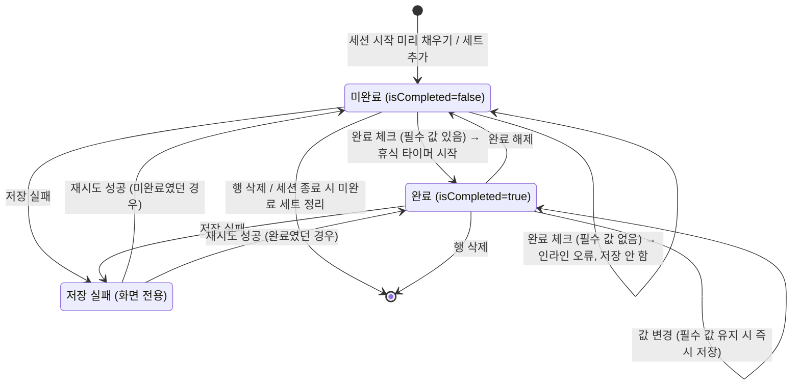
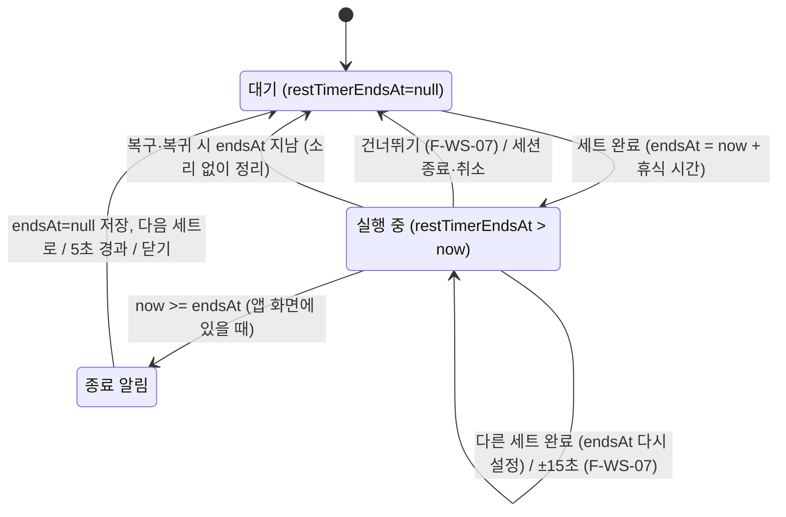
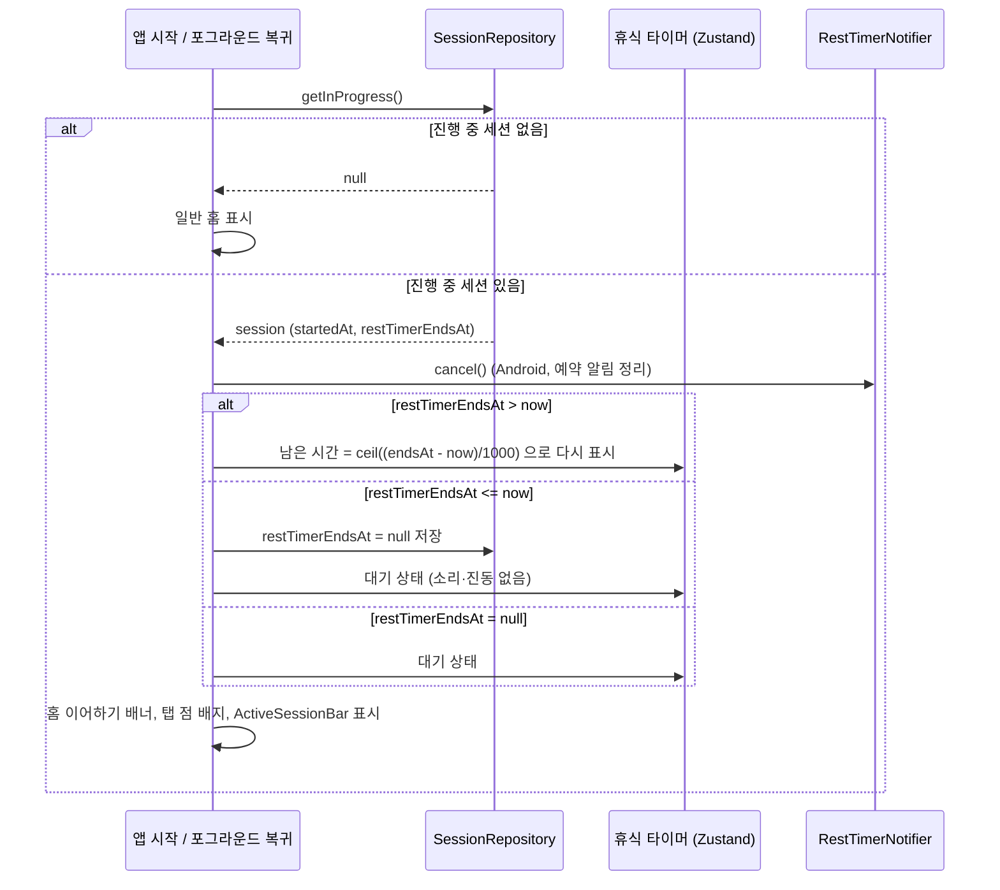

# 운동 세션 기록(F-WS) 상세 기능 명세

- 작업: FP-17 (상위: FP-11 헬스 플래너 MVP 기능 상세 명세)
- 작성일: 2026-10-01
- 상태: 초안
- 대상 화면: S-08 운동 세션(진행), S-09 휴식 타이머, S-10 세션 요약
- 기준 문서
  - [기능 정의서 및 MVP 범위](../feature-definition.md) 2.3절(F-WS), 5장(화면)
  - [데이터 모델·도메인 규칙 v1](../../1.architectur/mvp-design/data-model-v1.md) (이하 **T1**) 2.5·2.6절(세션·세트 필드), 3.3절(이전 기록 조회), 4장(기록 유형), 5장(계산 규칙), 7장(세션 상태·진행 중 세션)
  - [공통 UI·IA·내비게이션 명세](../../1.architectur/mvp-design/ia-navigation.md) (이하 **IA**) 경로, 공통 컴포넌트, 와이어프레임 표기, 공통 UX 규칙
  - [사전조사 종합 요약](../../1.architectur/pre-research-summary.md) C-6(휴식 타이머 알림), C-7(휴식 시간 기본값), R-5·R-6(타이머 유실·웹 백그라운드), Q-6(진행 중 세션 1개)

이 문서는 운동 세션 기록 기능의 **화면 배치, 입력·저장 규칙, 상태 전이, 예외 처리, 인수 조건**을 정한다.
필드·범위·계산식은 T1을, 컴포넌트·표기·숫자 형식은 IA를 따르며 여기서 반복하지 않는다. 이 문서와 T1·IA가 다르면 T1·IA를 먼저 고친 뒤 이 문서를 맞춘다.

---

## 1. 범위

### 1.1 기능 목록

| ID | 기능 | MoSCoW | 이 문서 | 화면 |
| --- | --- | --- | --- | --- |
| F-WS-01 | 세션 시작 (루틴 기반) | M | 상세 (4.1절) | S-01 → S-08 |
| F-WS-02 | 세션 시작 (빈 세션)·운동 추가 | M | 상세 (4.2절) | S-01 → S-08, S-02(선택 모드) |
| F-WS-03 | 세트 기록 | M | 상세 (4.3절) | S-08 |
| F-WS-06 | 휴식 타이머 | M | 상세 (4.4절) | S-09 |
| F-WS-08 | 이전 기록 표시 | M | 상세 (4.5절) | S-08 |
| F-WS-10 | 세션 종료·요약 | M | 상세 (4.6절) | S-08 → S-10 |
| F-WS-11 | 진행 중 세션 복구 (1개 제한 포함) | M | 상세 (4.7절) | S-01, S-08, S-09 |
| F-WS-04 | RPE 기록 (선택) | S | 요약 (5.1절) | S-08 |
| F-WS-07 | 휴식 타이머 조절 | S | 요약 (5.2절) | S-09 |
| F-WS-12 | 지난 세션 수정·삭제 | S | 요약 (5.3절) | S-12 |
| F-WS-05 | 세트 유형 표시(워밍업) | C | 범위 밖. `setType`은 항상 `NORMAL`로 만든다 | — |
| F-WS-09 | 세션 메모 | C | 범위 밖. `note`는 `''`로 둔다 | — |

- S-10의 새 기록 표시(F-ST-07)는 C라서 MVP 화면에 넣지 않는다.
- 운동별 휴식 시간(F-RT-06, `RoutineExercise.restSec`)은 C다. MVP는 `Settings.defaultRestSec` 하나로 타이머를 시작한다(C-7). 단 `restSec`에 값이 있으면(가져오기 등) 그 값을 우선한다.

### 1.2 용어

| 용어 | 뜻 |
| --- | --- |
| 진행 중 세션 | `status='IN_PROGRESS'`이고 `deletedAt=null`인 WorkoutSession. 전체에서 최대 1개(T1 7.2절, Q-6) |
| 운동 블록 | S-08에서 운동 하나와 그 세트 행들을 묶은 카드. 같은 `exerciseOrder`를 가진 WorkoutSet의 모음 |
| 세트 행 | WorkoutSet 1개를 보여 주는 입력 줄 |
| 집계 대상 세트 | T1 5장 정의. `deletedAt=null`, `isCompleted=true`, `setType='NORMAL'`, 소속 세션이 살아 있는 `COMPLETED`(요약 화면에서는 해당 세션 자신) |
| 휴식 시간 | `restSec ?? Settings.defaultRestSec` (기본 90초) |
| 종료 예정 시각 | `WorkoutSession.restTimerEndsAt`. 타이머는 남은 시간을 저장하지 않고 이 값으로 매번 다시 계산한다(R-5) |

---

## 2. 공통 규칙

### 2.1 trackingType별 세트 입력

세트 행의 입력칸은 그 운동의 `Exercise.trackingType`으로 정한다. 저장 필드 규칙은 T1 4.1절과 같다. **거리(distance) 입력은 어떤 유형에도 없다.**

| trackingType | 입력칸 | 완료 시 필수 | 저장 필드 | 항상 `null` |
| --- | --- | --- | --- | --- |
| `WEIGHT_REPS` | 중량(kg) + 횟수(회) | 중량 0 이상, 횟수 1 이상 | `weight`, `reps` | `durationSec` |
| `REPS_ONLY` | 횟수(회) | 횟수 1 이상 | `reps` | `weight`, `durationSec` |
| `DURATION` | 시간(분:초) | 합계 1초 이상 | `durationSec` | `weight`, `reps` |

입력칸 설정 (IA 3.1절 `NumberStepper`의 항목별 기본 설정을 따르고, 시간은 이 문서에서 정한다)

| 입력칸 | 컴포넌트 | step | min | max | precision | 비고 |
| --- | --- | --- | --- | --- | --- | --- |
| 중량 | `NumberStepper` (compact) | 2.5 | 0 | 999.75 | 2 | 단위 `kg` |
| 횟수 | `NumberStepper` (compact) | 1 | 0 | 999 | 0 | 단위 `회`. 0은 입력 가능하지만 완료할 수 없다 |
| 시간 | `DurationInput` (새 컴포넌트) | 15초 | 0:00 | 1440:00 | — | `[ 분 ]:[ 초 ]` 두 칸. 분 0~1440, 초 0~59. 저장 값 `durationSec = 분 × 60 + 초` (1~86400) |

- **compact 변형**: 세트 행은 40칸 폭(360px)에 맞추기 위해 입력칸만 보여 준다. 입력칸에 포커스가 가면 키보드 바로 위 **입력 보조 바**에 그 칸의 `-`/`+` 버튼(step 단위)과 `다음` 버튼(다음 입력칸으로 이동)을 보여 준다. 길게 누르기 반복 증감, 접근성 이름은 IA 3.1절과 같다.
- `DurationInput`: 초 칸에 60 이상을 입력하면 분으로 올린다(예: `0:90` → `1:30`). 입력 보조 바의 `-`/`+`는 15초 단위로 합계를 바꾼다. 표시 형식은 `mm:ss`, 60분 이상은 `h:mm:ss`(IA 5.3절).
- 소수점 입력 `,`는 `.`로 바꾼다(IA 5.1절).

### 2.2 즉시 저장 원칙

진행 중 세션은 앱이 언제 꺼져도 기록이 남도록 **모든 변경을 그 자리에서 DB(Dexie)에 쓴다**(R-5). 별도 "저장" 버튼은 없다.

| 사용자 동작 | 저장 시점 | 저장 내용 | 트랜잭션 |
| --- | --- | --- | --- |
| 세트 값 변경 | `NumberStepper`·`DurationInput`의 `onChange` 직후 (버튼 탭 즉시, 직접 입력은 blur·Enter) | 해당 필드, `updatedAt` | WorkoutSet 1건 |
| 세트 완료 체크 | 탭 즉시 | 입력 값, `isCompleted=true`, `completedAt=now` + 세션 `restTimerEndsAt=now+휴식 시간` | WorkoutSet + WorkoutSession 한 트랜잭션 |
| 세트 완료 해제 | 탭 즉시 | `isCompleted=false`, `completedAt=null` | WorkoutSet 1건 |
| 세트 추가·삭제, 운동 추가·삭제 | 탭 즉시 | 4.2·4.3절 | 해당 레코드들 한 트랜잭션 |
| 타이머 건너뛰기·조절·종료 | 탭 즉시 / 0초 도달 시 | 세션 `restTimerEndsAt` | WorkoutSession 1건 |

- 화면 표시는 `useLiveQuery`로 DB 값을 따른다. 입력 중인 값(포커스 중)만 컴포넌트 상태로 둔다(IA 5.5절, 낙관적 UI 없음).
- 저장 실패 처리는 IA 5.5절 "세션 중 자동 저장 실패"를 따른다: 화면의 입력 값은 유지, 행에 `! 저장 안 됨` + `[ 재시도 ]`, 오류 토스트. 저장 안 된 행이 하나라도 있으면 세션 종료를 막는다.

### 2.3 세트 행 상태



- `저장 실패`는 DB 상태가 아니라 화면 상태다. DB에는 마지막으로 성공한 값이 남아 있다.

---

## 3. 화면

### 3.1 S-08 운동 세션(진행)

- 경로: `/workout` (IA 2.1절). 진행 중 세션이 없으면 `/`로 대체 이동 + 정보 토스트 "진행 중인 세션이 없어요".
- 탭 바·사이드 내비게이션: 모든 폭에서 숨김(IA 1.3절).
- 관련 기능: F-WS-02~04, F-WS-08, F-WS-10, F-WS-11

#### 기본 — 루틴 기반, 세 가지 기록 유형, 휴식 타이머 동작 중(시트 닫힘)

```text
+--------------------------------------+
| < 상체 A  32:15  [ 종료 ] [...]   #1 |
| 휴식 01:12                        #2 |
+--------------------------------------+
| 1. 벤치프레스                [...] #3|
| 지난 기록 9월 29일 (월)           #4 |
| 세트  지난      kg      회    완료   |
| 1   60 x 10  [ 60  ] [ 10 ]  [v]  #5 |
| 2   60 x 8   [ 60  ] [ 10 ]  [v]     |
| 3   57.5 x 8 [ 62.5] [ 8  ]  [ ]  #6 |
| [ + 세트 추가 ]                   #7 |
+--------------------------------------+
| 2. 풀업                      [...]   |
| 지난 기록 9월 29일 (월)              |
| 세트  지난      회            완료   |
| 1   12회     [ 10 ]          [ ]  #8 |
| 2   10회     [ 10 ]          [ ]     |
| [ + 세트 추가 ]                      |
+--------------------------------------+
| 3. 플랭크                    [...]   |
| 첫 기록                           #9 |
| 세트  지난      분:초         완료   |
| 1   -        [ 01 ]:[ 00 ]   [ ] #10 |
| [ + 세트 추가 ]                      |
+--------------------------------------+
| [ + 운동 추가 ]                  #11 |
+--------------------------------------+
```

| # | 요소 | 동작·규칙 |
| --- | --- | --- |
| 1 | 헤더 | `<`: 세션을 유지한 채 홈으로(IA 2.4절). 제목: 루틴 이름, 빈 세션이면 "빈 세션". 경과 시간 `now - startedAt`을 `mm:ss`(60분 이상 `h:mm:ss`)로 1초마다 갱신(`aria-live="off"`). `종료`: 4.6절. `[...]`: "세션 취소"(4.6.4절) |
| 2 | 휴식 표시 | 휴식 타이머가 돌고 있고 S-09 시트가 닫혀 있을 때만 보인다. 남은 시간 `mm:ss`. 누르면 S-09 시트를 연다 |
| 3 | 운동 블록 헤더 | `exerciseOrder + 1`과 운동 이름. 삭제된 사용자 정의 운동도 이름을 그대로 보여 준다. `[...]`: "운동 삭제"(확인 없이 블록 전체 세트 soft delete + `실행 취소` 토스트, IA 5.4절) |
| 4 | 이전 기록 머리줄 | 4.5절. 이전 세션 날짜(IA 5.2절 형식) |
| 5 | 완료된 세트 행 | 체크 `[v]`. 행 배경을 완료색으로 바꾸고 체크 아이콘으로도 구분한다(색만으로 구분하지 않음). 값은 계속 고칠 수 있다(4.3절) |
| 6 | 미완료 세트 행 | 지난 열: 같은 순번의 이전 기록(4.5절). 입력칸이 비어 있으면 이전 값을 placeholder로 회색 표시. 행을 왼쪽으로 밀거나 길게 눌러 "세트 삭제"(확인 없이 즉시 + `실행 취소` 토스트) |
| 7 | 세트 추가 | 마지막 세트의 값을 복사한 미완료 세트를 맨 아래에 추가(4.3절). 블록당 최대 20세트(넘으면 비활성 + "세트는 20개까지 추가할 수 있어요") |
| 8 | `REPS_ONLY` 행 | 횟수 칸만 있다. 지난 열은 `12회` 형식 |
| 9 | 이전 기록 없음 | 같은 운동의 완료 기록이 없으면 "첫 기록". 지난 열은 `–` |
| 10 | `DURATION` 행 | `[ 분 ]:[ 초 ]` 입력. 지난 열은 `01:30` 형식 |
| 11 | 운동 추가 | S-02 선택 모드(`/workout/exercises`)를 연다(4.2절) |

- PC(`lg` 이상)는 같은 배치를 최대 폭 720px로 가운데 정렬한다. 별도 PC 와이어프레임은 두지 않는다.

#### 상태 변형 — 빈 세션, 운동 없음

```text
+--------------------------------------+
| < 빈 세션  00:42  [ 종료 ] [...]     |
+--------------------------------------+
|                                      |
|           운동을 추가해 주세요    #1 |
|      라이브러리에서 고른 운동이      |
|           여기에 표시돼요            |
|                                      |
|       [[      운동 추가       ]]     |
|                                      |
+--------------------------------------+
```

| # | 요소 | 동작·규칙 |
| --- | --- | --- |
| 1 | `EmptyState(empty)` | 운동 블록이 하나도 없을 때. 버튼은 S-02 선택 모드를 연다. 이때 `종료`를 누르면 4.6.3절(완료 세트 0개) 흐름 |

#### 상태 변형 — 저장 실패 행

```text
| 3   57.5 x 8 [ 62.5] [ 8  ]  [v]     |
| ! 저장 안 됨          [ 재시도 ]  #1 |
```

| # | 요소 | 동작·규칙 |
| --- | --- | --- |
| 1 | 저장 실패 표시 | 행 바로 아래 `role="alert"` 문구. `재시도`는 그 행의 마지막 변경을 다시 저장한다. 용량 부족(`QuotaExceededError`)이면 IA 5.5절 전용 문구 + `설정으로` |

### 3.2 S-09 휴식 타이머

- 경로 없음. S-08 위 `BottomSheet`(`md` 미만 Drawer, 이상 Dialog), `dismissible=true`(IA 3.2절).
- 관련 기능: F-WS-06, F-WS-07

#### 실행 중

```text
+======================================+
| 휴식                         [ X ] #1|
|                                      |
|               01:12               #2 |
|          /// 진행 링 ///          #3 |
|                                      |
|   [ -15초 ]   [ 건너뛰기 ]  [ +15초 ]|
|                                   #4 |
| 다음: 벤치프레스 3세트            #5 |
+======================================+
```

| # | 요소 | 동작·규칙 |
| --- | --- | --- |
| 1 | 닫기 | 시트만 닫는다. 타이머는 계속 돌고 S-08 헤더 #2에 남은 시간을 보여 준다 |
| 2 | 남은 시간 | `ceil((restTimerEndsAt - now) / 1000)`초를 `mm:ss`로. `tabular-nums`, `aria-live="off"` |
| 3 | 진행 링 | 남은 비율 표시. `prefers-reduced-motion`이면 애니메이션 없이 숫자만 |
| 4 | 조절·건너뛰기 | F-WS-07(S, 5.2절). S를 미루면 이 줄을 빼고 `건너뛰기`만 둔다 |
| 5 | 다음 세트 | 화면 순서상 첫 번째 미완료 세트(운동 블록 순 → 세트 순). 없으면 "남은 세트가 없어요" |

#### 종료

```text
+======================================+
| 휴식                         [ X ]   |
|                                      |
|               00:00                  |
|           휴식이 끝났어요         #1 |
|                                      |
|      [[      다음 세트로      ]]  #2 |
+======================================+
```

| # | 요소 | 동작·규칙 |
| --- | --- | --- |
| 1 | 종료 안내 | 0초 도달 시 소리·진동(Platform 인터페이스)과 함께 표시. 스크린리더에 "휴식이 끝났어요"를 한 번 알린다(`aria-live="assertive"`) |
| 2 | 다음 세트로 | 시트를 닫고 다음 미완료 세트 행으로 스크롤·포커스. 5초 동안 아무 동작이 없으면 시트가 저절로 닫힌다 |

- 시트가 닫힌 상태에서 0초가 되면 시트를 다시 열지 않고, S-08 헤더 #2 자리에 "휴식 끝"을 3초 보여 준 뒤 지운다. 소리·진동은 같다.

### 3.3 S-10 세션 요약

- 경로: `/workout/summary/:sessionId`. `COMPLETED` 세션만, 아니면 `/history`로 대체 이동(IA 2.1절). S-08에서 replace로 진입한다.
- 탭 바 숨김. 뒤로·`완료` 모두 홈으로 replace(IA 2.4절).
- 관련 기능: F-WS-10

```text
+--------------------------------------+
| < 세션 요약                          |
+--------------------------------------+
| 상체 A                            #1 |
| 10월 1일 (목)  19:00 ~ 19:52         |
+--------------------------------------+
| 총 시간          52분             #2 |
| 볼륨             1,080 kg         #3 |
| 총 횟수          10회             #4 |
| 유산소 총 시간   01:45            #5 |
| 세트 수          5세트            #6 |
+--------------------------------------+
| 운동별                            #7 |
| 벤치프레스   2세트   1,080 kg       >|
| 풀업         1세트   10회           >|
| 플랭크       2세트   01:45          >|
+--------------------------------------+
| [[             완료             ]]   |
+--------------------------------------+
```

| # | 요소 | 동작·규칙 |
| --- | --- | --- |
| 1 | 세션 정보 | 루틴 이름(빈 세션은 "빈 세션", 삭제된 루틴도 이름 표시), 날짜(`startedAt` 로컬 날짜), 시작~종료 시각 `HH:mm` |
| 2~6 | 요약 지표 | 계산식은 4.6.2절. 볼륨·총 횟수·유산소 총 시간은 해당 유형 세트가 1개 이상일 때만 줄을 보여 준다. 총 시간·세트 수는 항상 보인다 |
| 7 | 운동별 | `exerciseOrder` 순. 운동별로 집계 대상 세트 수와 유형별 대표 값(`WEIGHT_REPS` 볼륨, `REPS_ONLY` 총 횟수, `DURATION` 총 시간). 누르면 S-03 운동 상세 |

---

## 4. M 기능 상세

### 4.1 F-WS-01 세션 시작 (루틴 기반)

#### 4.1.1 와이어프레임 (S-01 진입점)

```text
+--------------------------------------+
| 오늘의 루틴                          |
| 상체 A  (운동 3개, 6세트)         #1 |
| [[           운동 시작            ]] |
| [ 빈 세션으로 시작 ]                 |
+--------------------------------------+
```

| # | 요소 | 동작·규칙 |
| --- | --- | --- |
| 1 | 오늘의 루틴 | 오늘 요일(`getDay()`)의 WeeklyPlan이 가리키는 루틴 1개(T1 2.4절). 운동 수 = 살아 있는 RoutineExercise 수, 세트 수 = `targetSets` 합. `운동 시작` → 시작 처리 후 S-08 |

- 진행 중 세션이 있을 때의 S-01은 4.7.1절 와이어프레임.
- 시작 직후 S-08은 3.1절 기본 와이어프레임에서 모든 세트가 미완료이고 목표값이 채워진 상태다.

#### 4.1.2 처리 규칙

`SessionRepository.start({ routineId })`가 **하나의 `rw` 트랜잭션**에서 처리한다.

1. 진행 중 세션이 있으면 `SessionAlreadyInProgressError`(4.7절).
2. WorkoutSession 생성: `routineId`, `status='IN_PROGRESS'`, `startedAt=now`, `endedAt=null`, `restTimerEndsAt=null`, `note=''`.
3. 루틴의 살아 있는 RoutineExercise를 `orderIndex` 순으로 읽어, 순서대로 `exerciseOrder = 0, 1, 2, …`를 매긴다(`orderIndex`에 빈 번호가 있어도 0부터 연속).
4. 각 RoutineExercise마다 `targetSets`개의 WorkoutSet을 만든다: `setOrder = 0 … targetSets-1`, `setType='NORMAL'`, `isCompleted=false`, `completedAt=null`, `rpe=null`, 값은 아래 미리 채우기 표(T1 4.2절과 같음).

| trackingType | `weight` | `reps` | `durationSec` |
| --- | --- | --- | --- |
| `WEIGHT_REPS` | `targetWeight` (`null`이면 `null`) | `targetReps` | `null` |
| `REPS_ONLY` | `null` | `targetReps` | `null` |
| `DURATION` | `null` | `null` | `targetDurationSec` |

5. 커밋 후 `/workout`으로 이동한다(`push`. 뒤로 가면 홈).

- 목표값이 `null`인 칸(예: `targetWeight=null`)은 빈 칸으로 두고, 이전 기록이 있으면 placeholder로 보여 준다(4.5절).
- 세션은 루틴의 스냅샷이 아니다. 시작 후 루틴을 고쳐도 이 세션의 세트는 바뀌지 않는다.

#### 4.1.3 검증

| 항목 | 규칙 | 위반 시 |
| --- | --- | --- |
| 진행 중 세션 | 없어야 한다 | 4.7절 |
| 루틴 | 살아 있는 Routine | 시작 버튼 숨김(오늘 루틴 블록이 `EmptyState`) |
| 루틴의 운동 수 | 1개 이상 | `[- 운동 시작 -]` + 사유 "루틴에 운동이 없어요". `빈 세션으로 시작`은 그대로 가능 |
| 목표값 | RoutineExercise가 T1 2.3절 규칙을 만족 | 규칙에 어긋난 값(가져오기로 들어온 경우)은 미리 채우지 않고 빈 칸으로 둔다. 시작은 막지 않는다 |

#### 4.1.4 예외 처리

| 상황 | 처리 |
| --- | --- |
| 시작 트랜잭션 실패 | 세션·세트가 하나도 생기지 않는다(원자성). 홈에 머물고 오류 토스트 "운동을 시작하지 못했어요" + `다시 시도`. 시작 버튼 다시 활성 |
| 시작 버튼 연속 탭 | 처리 중에는 버튼 비활성 + 스피너. 두 번째 탭은 무시. 그래도 중복 호출되면 두 번째는 `SessionAlreadyInProgressError`로 막힌다 |
| 루틴에 삭제된 운동이 섞임 | 운동 삭제 시 RoutineExercise가 연쇄 soft delete되므로 살아 있는 항목만 읽는다. 별도 처리 없음 |
| 날짜가 바뀌는 시점(자정 직전 시작) | 세션 날짜는 `startedAt` 기준. 자정을 넘겨 끝나도 시작한 날의 세션이다 |

#### 4.1.5 인수 조건 (Given-When-Then)

```gherkin
Scenario: 오늘 루틴으로 세션을 시작하면 목표값이 미리 채워진다
  Given 오늘이 목요일이고 목요일 WeeklyPlan에 루틴 "상체 A"가 배정되어 있다
    And "상체 A"에는 벤치프레스(WEIGHT_REPS, 3세트, 10회, 60kg), 풀업(REPS_ONLY, 2세트, 10회), 플랭크(DURATION, 1세트, 60초)가 순서대로 있다
    And 진행 중 세션이 없다
  When 홈에서 "운동 시작"을 누른다
  Then routineId가 "상체 A"이고 status가 IN_PROGRESS인 세션이 1개 생긴다
    And 미완료 세트 6개가 생긴다
    And 벤치프레스 세트 3개는 exerciseOrder 0, weight 60, reps 10, durationSec null이다
    And 풀업 세트 2개는 exerciseOrder 1, weight null, reps 10이다
    And 플랭크 세트 1개는 exerciseOrder 2, durationSec 60, 입력칸에 "01:00"이 보인다
    And 화면이 /workout으로 이동한다

Scenario: 목표 중량이 없는 운동은 빈 칸에 이전 기록이 placeholder로 보인다
  Given 루틴의 스쿼트(WEIGHT_REPS)는 targetWeight가 null, targetReps가 8이다
    And 지난 세션에서 스쿼트 첫 세트를 100kg x 8로 완료했다
  When 이 루틴으로 세션을 시작한다
  Then 스쿼트 첫 세트의 weight는 null로 저장된다
    And 중량 칸에 "100"이 회색 placeholder로 보이고 횟수 칸에는 8이 입력되어 있다

Scenario: 운동이 없는 루틴은 시작할 수 없다
  Given 오늘 배정된 루틴에 살아 있는 운동이 0개다
  When 홈을 연다
  Then "운동 시작" 버튼은 비활성이고 "루틴에 운동이 없어요"가 보인다
    And "빈 세션으로 시작"은 누를 수 있다

Scenario: 시작 저장에 실패하면 아무것도 남지 않는다
  Given 세트 생성 중 DB 쓰기가 실패한다
  When "운동 시작"을 누른다
  Then WorkoutSession과 WorkoutSet이 하나도 생기지 않는다
    And 홈에 머물고 "운동을 시작하지 못했어요" 토스트와 "다시 시도" 버튼이 보인다
```

### 4.2 F-WS-02 세션 시작 (빈 세션)·운동 추가

#### 4.2.1 와이어프레임

빈 세션 시작 직후 S-08은 3.1절 "빈 세션, 운동 없음" 와이어프레임이다. 운동 추가는 S-02 선택 모드(IA 2.2절)를 쓴다.

```text
+--------------------------------------+
| < 운동 추가                          |
| [ 운동 이름 검색____ ]               |
| (*전체*) ( 가슴 ) ( 등 ) ( 하체 ) ~~ |
+--------------------------------------+
| [v] 벤치프레스          바벨      #1 |
| [ ] 인클라인 덤벨 프레스 덤벨        |
| [- 풀업  이미 추가됨 -]           #2 |
| ~~                                   |
+--------------------------------------+
| [[          2개 추가            ]] #3|
+--------------------------------------+
```

| # | 요소 | 동작·규칙 |
| --- | --- | --- |
| 1 | 운동 선택 | 여러 개 체크. 선택 순서를 기억한다 |
| 2 | 이미 세션에 있는 운동 | 비활성 + "이미 추가됨". 한 세션에서 운동 하나는 블록 하나다(T1 2.6절: 같은 세션·같은 운동의 세트는 같은 `exerciseOrder`) |
| 3 | N개 추가 | 0개면 비활성. 누르면 아래 처리 후 S-08로 돌아가 첫 추가 블록으로 스크롤 |

#### 4.2.2 처리 규칙

- 빈 세션 시작: `SessionRepository.start({ routineId: null })`. 세트는 만들지 않는다. 그 밖은 4.1.2절 1·2·5단계와 같다.
- 운동 추가(`addExercises(sessionId, exerciseIds)`, 한 트랜잭션): 선택 순서대로 `exerciseOrder = 현재 최댓값 + 1, + 2, …`를 매기고, 운동마다 **빈 미완료 세트 1개**(`setOrder=0`, 값 모두 `null`)를 만든다. 빈 칸에는 이전 기록 placeholder가 보인다.
- 루틴 기반 세션에서도 같은 방법으로 운동을 추가할 수 있다.
- 운동 삭제(블록 `[...]`)는 그 운동의 세트를 모두 soft delete하고, 뒤 블록들의 `exerciseOrder`를 1씩 당겨 0부터 연속을 유지한다. `실행 취소`는 세트와 `exerciseOrder`를 되돌린다.

#### 4.2.3 검증

| 항목 | 규칙 | 위반 시 |
| --- | --- | --- |
| 진행 중 세션 | 시작 시 없어야 한다 | 4.7절 |
| 추가할 운동 | 살아 있는 Exercise, 이 세션에 아직 없음 | 선택 목록에서 비활성 |
| 블록 수 | 세션당 최대 30개 | 30개면 `운동 추가` 비활성 + "운동은 30개까지 추가할 수 있어요" |

#### 4.2.4 예외 처리

| 상황 | 처리 |
| --- | --- |
| 선택 모드에서 취소·뒤로 | 아무것도 추가하지 않고 S-08로 돌아간다 |
| 추가 저장 실패 | 선택 화면에 머물고 선택 상태 유지, 오류 토스트 "운동을 추가하지 못했어요" + `다시 시도` |
| 운동 없이 종료 | 4.6.3절(완료 세트 0개 → 세션 삭제 확인) |
| 선택 중 다른 탭(웹)에서 같은 운동이 추가됨 | 저장 시 다시 검사해 이미 있는 운동은 건너뛰고, 건너뛴 이름을 정보 토스트로 알린다 |

#### 4.2.5 인수 조건

```gherkin
Scenario: 빈 세션을 시작한다
  Given 진행 중 세션이 없다
  When 홈에서 "빈 세션으로 시작"을 누른다
  Then routineId가 null이고 status가 IN_PROGRESS인 세션이 생기고 세트는 0개다
    And S-08에 "운동을 추가해 주세요" 빈 상태와 "운동 추가" 버튼이 보이고 제목은 "빈 세션"이다

Scenario: 진행 중 세션에 운동 두 개를 추가한다
  Given 운동이 하나도 없는 진행 중 세션이 있다
  When "운동 추가"에서 벤치프레스, 풀업 순으로 체크하고 "2개 추가"를 누른다
  Then 벤치프레스는 exerciseOrder 0, 풀업은 exerciseOrder 1로 각각 빈 미완료 세트 1개가 생긴다
    And S-08로 돌아가 벤치프레스 블록이 보인다

Scenario: 이미 세션에 있는 운동은 다시 고를 수 없다
  Given 진행 중 세션에 풀업 블록이 있다
  When 운동 추가 화면을 연다
  Then 풀업 항목은 비활성이고 "이미 추가됨"이 표시된다
```

### 4.3 F-WS-03 세트 기록

#### 4.3.1 와이어프레임

S-08 3.1절 기본 와이어프레임의 세트 행. 유형별 행은 아래와 같다(2.1절).

```text
| 세트  지난      kg      회    완료   |
| 1   60 x 8   [ 60  ] [ 10 ]  [ ]     |   WEIGHT_REPS
| 세트  지난      회            완료   |
| 1   12회     [ 10 ]          [ ]     |   REPS_ONLY
| 세트  지난      분:초         완료   |
| 1   01:30    [ 01 ]:[ 00 ]   [ ]     |   DURATION
+--------------------------------------+
| [ -2.5 ]   중량   [ +2.5 ]  [ 다음 ] |   입력 보조 바 (중량 칸 포커스)
```

미완료 세트에서 필수 값 없이 완료를 누른 경우

```text
| 3   57.5 x 8 [_____] [ 8  ]  [ ]     |
| ! 중량을 입력해 주세요            #1 |
```

| # | 요소 | 동작·규칙 |
| --- | --- | --- |
| 1 | 인라인 오류 | 빈 필수 칸에 빨간 테두리 + `aria-invalid`, 행 아래 문구. 해당 칸으로 포커스. 값을 넣으면 사라진다. 토스트는 없다(IA 5.5절) |

#### 4.3.2 처리 규칙

- **값 변경**: 2.2절대로 즉시 저장. 미완료 세트는 빈 칸(`null`)도 저장할 수 있다.
- **완료 체크** (`completeSet`)
  1. 빈 필수 칸에 이전 기록 placeholder가 있으면 그 값으로 채운다(사용자가 지난번과 같은 값을 그대로 했을 때 입력을 줄이기 위해).
  2. 2.1절 필수 값을 검사한다. 하나라도 없으면 저장하지 않고 4.3.1절 인라인 오류.
  3. 한 트랜잭션: WorkoutSet `isCompleted=true`, `completedAt=now`, 값 저장 + WorkoutSession `restTimerEndsAt = now + 휴식 시간`.
  4. 커밋 후 휴식 타이머 시작(4.4절), S-09 시트 열기.
- **완료 해제**: `isCompleted=false`, `completedAt=null`. 돌고 있는 휴식 타이머는 그대로 둔다.
- **완료한 세트의 값 변경**: 필수 값이 남아 있으면 즉시 저장(`completedAt`은 바꾸지 않음). 필수 칸을 비우면 저장하지 않고 DB 값으로 되돌린 뒤 "완료한 세트는 값을 비울 수 없어요"를 보여 준다. 다시 채우려면 완료를 해제한다.
- **세트 추가**: 블록의 마지막 세트(`setOrder` 최대)의 `weight`·`reps`·`durationSec`를 복사한 미완료 세트를 `setOrder = 최댓값 + 1`로 만든다. 세트가 없으면 빈 세트.
- **세트 삭제**: 확인 없이 soft delete, 같은 블록 뒤 세트들의 `setOrder`를 당겨 0부터 연속으로 맞춘다. `실행 취소` 토스트(5초)로 되돌린다(IA 5.4절). 블록의 마지막 세트를 지우면 블록도 사라진다(운동 삭제와 같음).
- 세트 행의 번호는 `setOrder + 1`이다.

#### 4.3.3 검증

| 항목 | 규칙 (T1 2.6·4.1절) | 위반 시 |
| --- | --- | --- |
| 중량 | `WEIGHT_REPS`만, 0~999.75 kg, 소수 둘째 자리 | 스테퍼가 범위로 자르고 반올림. 완료 시 빈 칸이면 "중량을 입력해 주세요" |
| 횟수 | `WEIGHT_REPS`·`REPS_ONLY`만, 정수. 완료 시 1~999 | 0 또는 빈 칸으로 완료 시 "횟수를 1 이상 입력해 주세요" |
| 시간 | `DURATION`만, 합계 1~86400초 | 0:00으로 완료 시 "시간을 입력해 주세요" |
| 유형 밖 필드 | 항상 `null` | UI에 입력칸이 없다. Repository·Zod가 다시 검사해 위반 시 저장 거부(코드 오류로 기록) |
| 세트 수 | 블록당 1~20 | `+ 세트 추가` 비활성 |

#### 4.3.4 예외 처리

| 상황 | 처리 |
| --- | --- |
| 값·완료 저장 실패 | 3.1절 "저장 실패 행". 완료 체크 실패면 체크 표시를 되돌리고 타이머를 시작하지 않는다 |
| 저장 실패 행이 남은 채 종료 | 종료 버튼 비활성 + "저장되지 않은 세트가 있어요. 재시도해 주세요"(IA 5.5절) |
| 포커스 중 앱이 백그라운드로 감 | `visibilitychange`(웹)·`appStateChange`(Android)에서 포커스 칸의 값을 즉시 저장한다 |
| 기록 유형이 세션 도중 바뀜 | 기록이 있는 운동은 유형을 바꿀 수 없으므로(T1 4.3절) 일어나지 않는다 |
| 삭제된 사용자 정의 운동의 블록 | 진행 중 세션에서는 그대로 기록할 수 있다(이미 세션에 있는 운동) |

#### 4.3.5 인수 조건

```gherkin
Scenario Outline: 기록 유형별로 세트를 완료하면 즉시 저장된다
  Given 진행 중 세션에 <운동>(<유형>) 미완료 세트가 있다
  When <입력>을 입력하고 완료 체크를 누른다
  Then 그 WorkoutSet은 isCompleted true, completedAt 현재 시각으로 DB에 저장되어 있다
    And weight <weight>, reps <reps>, durationSec <durationSec>이다
    And 세션의 restTimerEndsAt은 completedAt + 90초다

  Examples:
    | 운동       | 유형        | 입력               | weight | reps | durationSec |
    | 벤치프레스 | WEIGHT_REPS | 중량 62.5, 횟수 8  | 62.5   | 8    | null        |
    | 풀업       | REPS_ONLY   | 횟수 12            | null   | 12   | null        |
    | 플랭크     | DURATION    | 1분 30초           | null   | null | 90          |

Scenario: 필수 값 없이 완료하면 저장되지 않는다
  Given 벤치프레스(WEIGHT_REPS) 세트의 중량이 비어 있고 이전 기록도 없다
  When 완료 체크를 누른다
  Then 세트는 isCompleted false로 남는다
    And 중량 칸에 "중량을 입력해 주세요" 오류가 보이고 포커스가 중량 칸으로 간다
    And 휴식 타이머는 시작되지 않는다

Scenario: 빈 칸은 이전 기록 값으로 채워서 완료한다
  Given 벤치프레스 2세트의 중량·횟수가 비어 있고 placeholder로 "60", "8"이 보인다
  When 완료 체크를 누른다
  Then 그 세트는 weight 60, reps 8, isCompleted true로 저장된다

Scenario: 앱이 강제 종료되어도 완료한 세트는 남는다
  Given 벤치프레스 1세트를 60kg x 10으로 완료했다
  When 앱 프로세스가 강제 종료된 뒤 다시 실행한다
  Then 진행 중 세션의 벤치프레스 1세트는 60kg x 10, 완료 상태로 보인다

Scenario: 세트 저장에 실패하면 행에 표시되고 종료가 막힌다
  Given 세트 완료 저장이 실패한다
  When 완료 체크를 누른다
  Then 체크가 해제된 상태로 돌아가고 행 아래에 "저장 안 됨"과 "재시도"가 보인다
    And "종료" 버튼은 비활성이다
  When "재시도"를 눌러 저장에 성공한다
  Then 행이 완료 상태가 되고 "종료" 버튼이 다시 활성이다

Scenario: 세트를 추가하면 마지막 세트 값이 복사된다
  Given 벤치프레스 블록의 마지막 세트가 62.5kg x 8이다
  When "+ 세트 추가"를 누른다
  Then setOrder가 하나 큰 미완료 세트가 62.5kg x 8 값으로 생긴다
```

### 4.4 F-WS-06 휴식 타이머

#### 4.4.1 와이어프레임

3.2절 S-09(실행 중, 종료)과 3.1절 S-08 헤더 #2.

#### 4.4.2 상태 전이



- 일시정지 상태는 두지 않는다(MVP). 필요하면 F-WS-07 확장으로 다룬다.

#### 4.4.3 처리 규칙

- **시작**: 세트 완료 트랜잭션에서 `restTimerEndsAt = completedAt + 휴식 시간`을 함께 저장한다(4.3.2절). 이미 돌고 있으면 새 값으로 덮어쓴다(마지막 완료 세트 기준으로 다시 시작).
- **남은 시간 계산**: `remainingSec = max(0, ceil((restTimerEndsAt - Date.now()) / 1000))`. 화면은 250ms마다 이 식으로 다시 계산한다. 1초씩 빼는 카운트다운을 쓰지 않으므로 백그라운드·절전으로 JS 타이머가 늦어져도 표시가 맞는다.
- **상한**: `remainingSec`이 3600을 넘으면(기기 시계를 되돌린 경우) 3600으로 보여 준다.
- **종료**: `remainingSec = 0`이 되는 첫 순간 한 번만 소리·진동·안내(3.2절)를 내고 `restTimerEndsAt=null`을 저장한다.
- **세션 종료·취소**: `restTimerEndsAt=null`, 예약된 알림 취소.
- 상태 위치: 종료 예정 시각은 DB(`WorkoutSession.restTimerEndsAt`), 시트 열림 여부·종료 알림 표시 여부는 Zustand(IA 2.5절).
- 화면 밖 동작: 종료 예정 시각이 DB에 있으므로 S-08을 벗어나도 타이머는 유지된다. 탭 바 위 `ActiveSessionBar`에 남은 시간을 보여 준다(IA 1.4절). 다른 화면에 있을 때 0초가 되면 소리·진동 + 정보 토스트 "휴식이 끝났어요".

#### 4.4.4 플랫폼별 종료 알림 (C-6)

휴식 타이머 알림은 F-WS-06(M)의 일부다(C-6). 운동일·측정일 예약 알림(X-05)과는 다른 기능이다. 화면 코드는 `src/platform`의 `RestTimerNotifier` 인터페이스만 부른다.

```ts
// src/platform/restTimerNotifier.ts (초안)
interface RestTimerNotifier {
  /** 종료 예정 시각에 시스템 알림을 예약한다. 이미 있으면 바꾼다. */
  schedule(endsAt: Date, content: { title: string; body: string }): Promise<void>;
  /** 예약된 휴식 알림을 취소한다. 없으면 아무 일도 하지 않는다. */
  cancel(): Promise<void>;
  /** 앱 화면에 있을 때 종료 시 소리·진동 */
  alertInApp(): Promise<void>;
  permissionState(): Promise<'granted' | 'denied' | 'prompt' | 'unsupported'>;
  requestPermission(): Promise<'granted' | 'denied'>;
}
```

**Android (Capacitor, `@capacitor/local-notifications` + `@capacitor/haptics`)**

| # | 요구사항 |
| --- | --- |
| AN-1 | 앱이 백그라운드로 가거나(`App` `appStateChange`의 `isActive=false`) 화면이 꺼질 때 휴식 타이머가 돌고 있으면 `restTimerEndsAt`에 로컬 알림 1건을 예약한다. 앱이 포그라운드로 돌아오면(`isActive=true`) 예약을 취소하고 앱 안 표시로 돌아간다. 포그라운드에서는 시스템 알림을 띄우지 않는다(중복 방지). |
| AN-2 | 알림 id는 고정값 하나(`REST_TIMER_NOTIFICATION_ID`)를 쓴다. 예약은 항상 기존 것을 바꾸므로 휴식 알림은 동시에 1건만 존재한다. |
| AN-3 | 백그라운드에 있는 동안 종료 예정 시각이 바뀌는 동작은 없지만, 앱 상태와 관계없이 `restTimerEndsAt`이 `null`이 되거나 바뀌는 모든 경로(건너뛰기, 조절, 세션 종료·취소, 다른 세트 완료)는 `cancel()` 또는 `schedule()`을 함께 호출한다. |
| AN-4 | 앱 프로세스가 종료되어도 예약된 알림은 울려야 한다. 백그라운드 전환 시점에 이미 예약하므로, 최근 앱 목록에서 밀어 종료해도 알림이 남는다. |
| AN-5 | 알림 채널 `rest-timer`(이름 "휴식 타이머", 중요도 HIGH, 소리·진동 켬)를 앱 시작 시 만든다. 시작 순서상 6단계(플랫폼 초기화)이고 첫 화면 렌더를 기다리게 하지 않는다([앱 시작 순서](../../1.architectur/mvp-design/app-lifecycle.md#2-시작-순서)). |
| AN-6 | 내용: 제목 "휴식이 끝났어요", 본문 "다음 세트: {운동 이름} {세트 번호}세트"(다음 세트가 없으면 "운동을 이어가세요"). 알림을 누르면 앱을 열고 `/workout`으로 이동한다(진행 중 세션이 없으면 IA 규칙대로 홈). |
| AN-7 | 정시성: 도즈(Doze) 중에도 울리도록 `allowWhileIdle: true`로 예약한다. Android 12 이상에서 정확한 알람(`SCHEDULE_EXACT_ALARM`)이 허용되면 종료 예정 시각 ±1초 이내, 허용되지 않으면 OS가 늦출 수 있다(허용 범위: 앱 안 표시 기준이 맞으면 알림 지연은 결함으로 보지 않음). 정확한 알람 권한 요청 화면으로 사용자를 보내지는 않는다(MVP). **(확인 필요: 플러그인 버전별 정확 알람 처리 방식)** |
| AN-8 | 권한: Android 13 이상은 `POST_NOTIFICATIONS` 런타임 권한이 필요하다. 처음으로 휴식 타이머가 시작될 때 한 번만 `requestPermission()`을 부른다. 거부되면 다시 묻지 않고, 정보 토스트 "알림이 꺼져 있어 앱 밖에서는 휴식 종료를 알려 드릴 수 없어요"를 한 번 띄운다. 타이머 자체는 앱 안에서 그대로 동작한다. |
| AN-9 | 앱 안 종료 알림(`alertInApp`): 짧은 진동(`Haptics.vibrate`, 약 500ms)과 짧은 알림음. 기기가 무음·진동 모드면 OS 설정을 따른다. |

**웹(PWA)** — R-6 대응

- 백그라운드 탭에서는 시스템 알림을 보내지 않는다(MVP). `RestTimerNotifier.schedule()`은 아무 일도 하지 않는다(`permissionState()='unsupported'`).
- 탭이 다시 보이면(`visibilitychange`) 남은 시간을 다시 계산한다. 그사이 종료 예정 시각이 지났으면 소리 없이 `restTimerEndsAt=null`로 정리하고 S-08 헤더에 "휴식 끝"을 3초 보여 준다. 복귀 때 하는 다른 일과의 순서는 [앱 수명주기 6장](../../1.architectur/mvp-design/app-lifecycle.md#6-포그라운드-복귀-처리)을 따른다.
- 포그라운드 종료 시 소리는 Web Audio로 짧게 낸다. 진동은 `navigator.vibrate`가 있을 때만.

#### 4.4.5 검증

| 항목 | 규칙 | 위반 시 |
| --- | --- | --- |
| 휴식 시간 | `restSec ?? defaultRestSec`, 10~600초 | 범위 밖 값(가져오기 등)은 90초로 대신한다 |
| `restTimerEndsAt` | `IN_PROGRESS` 세션에서만 값. `COMPLETED`면 `null`(T1 2.5절) | 세션 종료 트랜잭션이 항상 `null`로 만든다 |
| 동시 타이머 | 세션당(=앱 전체) 1개 | 새 세트 완료가 기존 값을 덮어쓴다 |

#### 4.4.6 예외 처리

| 상황 | 처리 |
| --- | --- |
| `restTimerEndsAt` 저장 실패 | 세트 완료와 같은 트랜잭션이므로 세트 완료도 실패한다(4.3.4절). 타이머를 띄우지 않는다 |
| 종료 시 `null` 저장 실패 | 화면 상태는 대기로 바꾸고, 다음 앱 시작·복귀 때 지난 값으로 판단해 다시 정리한다(4.7절). 토스트 없음 |
| 알림 예약 실패(Android) | 콘솔 기록만 남기고 앱 안 타이머는 그대로. 사용자에게 알리지 않는다 |
| 알림 권한 거부 | AN-8 |
| 기기 시계 변경 | 상한 3600초(4.4.3절). 시계를 앞으로 돌려 종료 예정 시각이 지나면 종료로 본다 |

#### 4.4.7 인수 조건

```gherkin
Scenario: 세트를 완료하면 휴식 타이머가 기본 시간으로 시작된다
  Given Settings.defaultRestSec가 90이다
  When 19:10:00에 세트 완료 체크를 누른다
  Then 세션의 restTimerEndsAt이 19:11:30으로 저장된다
    And S-09 시트가 열리고 남은 시간 "01:30"이 보인다

Scenario: 다른 세트를 완료하면 타이머가 다시 시작된다
  Given 휴식 타이머가 00:40 남아 있다
  When 다른 세트를 완료한다
  Then restTimerEndsAt이 새 완료 시각 + 90초로 바뀌고 남은 시간이 "01:30"부터 다시 줄어든다

Scenario: 화면에 있을 때 타이머가 끝나면 알린다
  Given S-08에 있고 휴식 타이머가 00:01 남았다
  When 1초가 지난다
  Then 소리·진동과 함께 "휴식이 끝났어요"가 보이고 스크린리더가 한 번 읽는다
    And 세션의 restTimerEndsAt은 null로 저장된다

Scenario: Android에서 백그라운드로 가면 종료 알림이 예약된다
  Given Android 앱에서 휴식 타이머가 01:00 남았고 알림 권한이 허용되어 있다
  When 홈 버튼을 눌러 앱을 백그라운드로 보낸다
  Then restTimerEndsAt 시각에 "휴식이 끝났어요" 로컬 알림 1건이 예약된다
  When 60초가 지난다
  Then 시스템 알림이 소리·진동과 함께 표시된다
  When 알림을 누른다
  Then 앱이 /workout 화면으로 열리고 휴식 타이머는 대기 상태다

Scenario: 포그라운드로 돌아오면 예약 알림을 취소한다
  Given Android 앱이 백그라운드에 있고 휴식 알림이 예약되어 있으며 남은 시간이 00:30이다
  When 앱으로 돌아온다
  Then 예약된 알림이 취소되고 S-08 헤더에 남은 시간이 "00:30" 근처로 보인다

Scenario: 알림 권한을 거부해도 타이머는 동작한다
  Given Android 13 기기에서 처음으로 세트를 완료한다
  When 알림 권한 요청을 거부한다
  Then "알림이 꺼져 있어 앱 밖에서는 휴식 종료를 알려 드릴 수 없어요" 토스트가 한 번 보인다
    And 휴식 타이머는 앱 안에서 정상으로 줄어든다
    And 이후 세트를 완료해도 권한을 다시 묻지 않는다
```

### 4.5 F-WS-08 이전 기록 표시

#### 4.5.1 와이어프레임

S-08 3.1절 기본 와이어프레임 #4, #6, #8, #9, #10.

```text
| 1. 벤치프레스                [...]   |
| 지난 기록 9월 29일 (월)           #1 |
| 세트  지난      kg      회    완료   |
| 1   60 x 10  [ 60  ] [ 10 ]  [v]     |
| 2   60 x 8   [_60_ ] [_8__]  [ ]  #2 |
| 3   57.5 x 8 [_57.5] [_8__]  [ ]     |
| 4   -        [_____] [____]  [ ]  #3 |
```

| # | 요소 | 동작·규칙 |
| --- | --- | --- |
| 1 | 머리줄 | 이전 기록 세션의 날짜. 이전 기록이 없으면 "첫 기록" |
| 2 | 지난 열·placeholder | 같은 `setOrder`의 이전 세트 값. 입력칸이 비어 있으면 같은 값을 회색 placeholder로 보여 준다(`_60_`는 placeholder 표기). 지난 열을 누르면 그 값을 입력칸에 복사해 저장한다(완료는 하지 않음) |
| 3 | 이전 세트 없음 | 이전 세션의 세트 수보다 순번이 크면 `–`, placeholder 없음 |

#### 4.5.2 조회 규칙

T1 3.3절 조회를 쓴다.

1. `[exerciseId+completedAt]` 인덱스를 `completedAt` 역순으로 읽어, `deletedAt=null`이고 `sessionId ≠ 현재 세션`인 첫 세트를 찾는다. 그 세트의 `sessionId`가 **이전 기록 세션**이다.
2. 이전 기록 세션에서 같은 `exerciseId`의 완료 세트(`deletedAt=null`, `isCompleted=true`)를 `setOrder` 순으로 가져와 1번째, 2번째 … 순서로 현재 세트 행에 맞춘다(`setOrder` 값이 아니라 정렬 후 순번으로 맞춘다).
3. `setType`은 구분하지 않는다(MVP는 모두 `NORMAL`).
4. 이전 기록 세션이 soft delete되었으면 그 세트도 연쇄 삭제되어 있으므로 1번 조건에서 빠진다.
5. 조회는 운동 블록마다 한 번, `useLiveQuery`로 한다. 현재 세션의 값 변경으로는 다시 조회하지 않는다.

#### 4.5.3 유형별 표시 형식

| trackingType | 지난 열 | placeholder | 예 |
| --- | --- | --- | --- |
| `WEIGHT_REPS` | `{중량} x {횟수}` (중량은 IA 5.1절 형식에서 단위 생략) | 중량 칸: 중량, 횟수 칸: 횟수 | `60 x 10`, `57.5 x 8`, `0 x 15` |
| `REPS_ONLY` | `{횟수}회` | 횟수 칸: 횟수 | `12회` |
| `DURATION` | `mm:ss` (60분 이상 `h:mm:ss`) | 분 칸·초 칸 | `01:30`, `1:05:00` |
| 공통: 이전 세트 없음 | `–` | 없음 | |

- 접근성 이름: 지난 열은 "지난 기록 60킬로그램 10회"처럼 단위를 풀어 읽게 한다.
- RPE는 지난 열에 보이지 않는다(5.1절).

#### 4.5.4 검증

조회 전용이라 입력 검증은 없다. 이전 값이 현재 입력 규칙 범위를 벗어나면(예: 가져오기로 들어온 이상값) placeholder로 쓰지 않고 지난 열에만 보여 준다.

#### 4.5.5 예외 처리

| 상황 | 처리 |
| --- | --- |
| 조회 실패 | 머리줄에 "지난 기록을 불러오지 못했어요", 지난 열 `–`. 세트 입력은 그대로 가능 |
| 이전 기록 세션이 `IN_PROGRESS` | 진행 중 세션은 현재 세션 하나뿐이라 1번 조건에서 빠진다 |
| 같은 날 같은 운동을 두 세션에서 함 | `completedAt`이 가장 늦은 세션을 쓴다 |
| 지난 세션 수정(F-WS-12)으로 값이 바뀜 | `useLiveQuery`로 바뀐 값을 보여 준다 |

#### 4.5.6 인수 조건

```gherkin
Scenario Outline: 기록 유형별 이전 기록 형식
  Given 지난 세션(9월 29일)에 <운동>을 <지난 기록>으로 완료했다
  When 오늘 세션에 <운동>을 추가한다
  Then 머리줄에 "지난 기록 9월 29일 (월)"이 보인다
    And 1세트 지난 열에 <표시>가 보이고 빈 입력칸에 같은 값이 placeholder로 보인다

  Examples:
    | 운동       | 지난 기록      | 표시      |
    | 벤치프레스 | 57.5kg x 8     | 57.5 x 8  |
    | 풀업       | 12회           | 12회      |
    | 플랭크     | 90초           | 01:30     |

Scenario: 이전 기록보다 세트가 많으면 남는 행은 비어 있다
  Given 지난 세션에 벤치프레스를 2세트 완료했다
  When 오늘 벤치프레스 블록에 세트가 3개 있다
  Then 3세트 지난 열은 "–"이고 placeholder가 없다

Scenario: 처음 하는 운동
  Given 스쿼트를 한 번도 완료한 적이 없다
  When 오늘 세션에 스쿼트를 추가한다
  Then 머리줄에 "첫 기록"이 보이고 모든 지난 열이 "–"다

Scenario: 삭제한 세션은 이전 기록에서 빠진다
  Given 9월 29일 세션과 9월 26일 세션에 벤치프레스 기록이 있고 9월 29일 세션은 삭제했다
  When 오늘 세션에 벤치프레스를 추가한다
  Then 이전 기록은 9월 26일 세션 값으로 보인다

Scenario: 현재 세션에서 완료한 세트는 이전 기록이 되지 않는다
  Given 오늘 세션에서 벤치프레스 1세트를 100kg x 5로 완료했다
  When 벤치프레스 2세트 행을 본다
  Then 지난 열은 지난 세션의 2번째 세트 값이다
```

### 4.6 F-WS-10 세션 종료·요약

#### 4.6.1 와이어프레임

요약 화면은 3.3절 S-10. 종료 확인 다이얼로그는 아래 두 가지다.

미완료 세트가 남은 경우

```text
+======================================+
| 운동을 종료할까요?                #1 |
|                                      |
| 완료하지 않은 세트 3개는 기록에서    |
| 빠져요.                              |
|                                      |
|                  [ 취소 ]  [[ 종료 ]]|
+======================================+
```

완료 세트가 0개인 경우

```text
+======================================+
| 기록된 세트가 없어요              #2 |
|                                      |
| 완료한 세트가 없어 이 세션을         |
| 삭제합니다.                          |
|                                      |
|            [ 취소 ]  [! 세션 삭제 ]  |
+======================================+
```

| # | 요소 | 동작·규칙 |
| --- | --- | --- |
| 1 | 종료 확인 | `ConfirmDialog(tone='default')`. 미완료 세트가 0개이면 다이얼로그 없이 바로 종료한다 |
| 2 | 삭제 확인 | `ConfirmDialog(tone='destructive')`. 삭제 후 홈으로 replace, `실행 취소` 토스트(5초) "세션을 삭제했어요" |

#### 4.6.2 요약 지표 계산식 (T1 5장과 같음)

계산 대상은 그 세션의 **집계 대상 세트** S다(T1 5장: `deletedAt=null`, `isCompleted=true`, `setType='NORMAL'`. 요약 화면은 해당 세션 자신을 포함).
값은 저장하지 않고 화면에서 계산한다(T1 5장, 기능 정의서 6.3절). 계산 중에는 반올림하지 않고 표시할 때만 IA 5.1·5.3절 형식으로 바꾼다.

| 지표 | 계산식 | 대상 유형 | 표시 형식 |
| --- | --- | --- | --- |
| 총 시간 | `endedAt − startedAt` (T1 2.5절) | — | `N시간 M분` / `M분` / `1분 미만` (IA 5.3절) |
| 볼륨 | `Σ weight × reps` (s ∈ S, trackingType=`WEIGHT_REPS`) (T1 5.1절) | `WEIGHT_REPS`만 | 정수 반올림, 쉼표, `kg` (`1,080 kg`) |
| 총 횟수 | `Σ reps` (s ∈ S, trackingType=`REPS_ONLY`) | `REPS_ONLY`만 | `N회` |
| 유산소 총 시간 | `Σ durationSec` (s ∈ S, trackingType=`DURATION`) | `DURATION`만 | `mm:ss`, 60분 이상 `h:mm:ss` |
| 세트 수 | `\|S\|` (유형 무관) (T1 5.1절) | 전부 | `N세트` |

- T1 5.1절: `REPS_ONLY`, `DURATION` 세트는 볼륨에 넣지 않고 "대신 총 횟수, 총 시간을 따로" 보여 준다. 따라서 **총 횟수는 `REPS_ONLY` 세트의 횟수 합**이고 `WEIGHT_REPS`의 횟수는 더하지 않는다(T1 5.1절 예시: 풀업 10회 → 총 횟수 10회).
- **유산소 총 시간**은 운동 부위가 아니라 기록 유형으로 정한다. `DURATION` 유형이면 플랭크처럼 유산소가 아닌 운동도 포함한다(T1 4.1절: 유산소는 `DURATION`으로 기록).
- `weight=0`인 `WEIGHT_REPS` 세트는 세트 수에 들어가고 볼륨에는 0을 더한다(T1 4.1절).
- 미완료 세트는 종료 시 soft delete되므로 계산에 들어가지 않는다.
- 운동별 줄(3.3절 #7)도 같은 식을 운동 단위로 적용한다.
- 같은 계산 함수(`src/domain/stats/sessionSummary.ts`)를 S-10, S-11 목록, S-12 상세에서 함께 쓴다.

```ts
// src/domain/stats/sessionSummary.ts (초안)
interface SessionSummary {
  durationMs: number;          // endedAt - startedAt
  volumeKg: number | null;     // WEIGHT_REPS 집계 대상 세트가 없으면 null (줄 숨김)
  totalReps: number | null;    // REPS_ONLY 집계 대상 세트가 없으면 null
  totalDurationSec: number | null; // DURATION 집계 대상 세트가 없으면 null
  setCount: number;
}
```

**계산 예시** (T1 5.1절 예시 + 시간 기록 세트)

| 운동 | 세트 | 집계 대상 | 볼륨 | 총 횟수 | 유산소 총 시간 |
| --- | --- | --- | --- | --- | --- |
| 벤치프레스 (WEIGHT_REPS) | 60 kg × 10 | O | 600 | — | — |
| 벤치프레스 (WEIGHT_REPS) | 60 kg × 8 | O | 480 | — | — |
| 벤치프레스 (WEIGHT_REPS) | 40 kg × 12 (WARMUP) | X | 제외 | — | — |
| 풀업 (REPS_ONLY) | 10회 | O | 제외 | 10 | — |
| 플랭크 (DURATION) | 60초 | O | 제외 | — | 60 |
| 플랭크 (DURATION) | 45초 | O | 제외 | — | 45 |
| 플랭크 (DURATION) | 30초, 미완료 | X (종료 시 삭제) | — | — | — |
| **합계** | | **5세트** | **1,080 kg** | **10회** | **01:45** |

`startedAt` 19:00:00, `endedAt` 19:52:30 → 총 시간 **52분**.
(`WARMUP` 세트는 MVP UI로 만들 수 없지만 가져오기 데이터에 있을 수 있어 규칙을 둔다.)

#### 4.6.3 종료 처리 규칙

`SessionRepository.finish(sessionId)`, 한 트랜잭션.

| 조건 | 처리 (T1 7.1절) |
| --- | --- |
| 저장 실패 행이 있음 | `종료` 버튼 비활성. 처리하지 않는다 |
| 완료 세트 1개 이상 | (미완료 세트가 있으면 확인 후) 미완료 세트 soft delete, `status=COMPLETED`, `endedAt=now`, `restTimerEndsAt=null` → 알림 취소 → `/workout/summary/:id`로 **replace** |
| 완료 세트 0개 | 삭제 확인 후 세션과 세트 soft delete → 홈으로 replace + `실행 취소` 토스트 |

- 종료 후 `COMPLETED → IN_PROGRESS`(재개)는 할 수 없다. 고칠 것은 F-WS-12로 한다.
- `endedAt − startedAt`이 0보다 작을 수 없다(`endedAt=now`, `startedAt ≤ now`). 기기 시계가 되돌려져 음수가 되면 `endedAt=startedAt`으로 저장한다.

#### 4.6.4 세션 취소

헤더 `[...]` → "세션 취소" → `ConfirmDialog(destructive)` "이 세션의 기록이 모두 삭제돼요" / `세션 삭제`(IA 5.4절) → 세션·세트 soft delete, `restTimerEndsAt=null`, 알림 취소 → 홈으로 replace + `실행 취소` 토스트. 실행 취소하면 세션은 `IN_PROGRESS`로 되살아난다(그사이 새 세션을 시작했으면 실행 취소를 막고 "진행 중인 세션이 있어 되돌릴 수 없어요" 토스트).

#### 4.6.5 검증

| 항목 | 규칙 |
| --- | --- |
| 상태 | `IN_PROGRESS` 세션만 종료·취소할 수 있다(Repository 검사, T1 7.1절) |
| `endedAt` | `>= startedAt` |
| S-10 진입 | `COMPLETED`이고 살아 있는 세션만. 아니면 `/history`로 대체 이동 |

#### 4.6.6 예외 처리

| 상황 | 처리 |
| --- | --- |
| 종료 트랜잭션 실패 | `ConfirmDialog` 오류 상태(다이얼로그 유지, "다시 시도"). 다이얼로그 없이 종료한 경우는 오류 토스트 + `다시 시도`. 세션은 `IN_PROGRESS`로 남는다 |
| S-10에서 새로고침 | 같은 경로로 다시 계산해 보여 준다 |
| S-10 요약 계산 중 세션이 삭제됨(다른 탭) | `/history`로 대체 이동 |

#### 4.6.7 인수 조건

```gherkin
Scenario: 세션 요약 지표는 T1 계산 규칙과 같다
  Given 진행 중 세션이 19:00:00에 시작했고 다음 세트가 있다
    | 운동       | 유형        | 값          | 완료 | setType |
    | 벤치프레스 | WEIGHT_REPS | 60kg x 10   | Y    | NORMAL  |
    | 벤치프레스 | WEIGHT_REPS | 60kg x 8    | Y    | NORMAL  |
    | 벤치프레스 | WEIGHT_REPS | 40kg x 12   | Y    | WARMUP  |
    | 풀업       | REPS_ONLY   | 10회        | Y    | NORMAL  |
    | 플랭크     | DURATION    | 60초        | Y    | NORMAL  |
    | 플랭크     | DURATION    | 45초        | Y    | NORMAL  |
    | 플랭크     | DURATION    | 30초        | N    | NORMAL  |
  When 19:52:30에 "종료"를 누르고 "완료하지 않은 세트 1개는 기록에서 빠져요" 확인에서 "종료"를 누른다
  Then 세션은 status COMPLETED, endedAt 19:52:30, restTimerEndsAt null로 저장된다
    And 미완료 플랭크 세트는 soft delete된다
    And S-10으로 replace 이동한다
    And 총 시간 "52분", 볼륨 "1,080 kg", 총 횟수 "10회", 유산소 총 시간 "01:45", 세트 수 "5세트"가 보인다

Scenario: 해당 유형 세트가 없으면 지표 줄을 숨긴다
  Given WEIGHT_REPS 세트만 완료한 세션을 종료했다
  When S-10을 본다
  Then 총 시간, 볼륨, 세트 수만 보이고 총 횟수와 유산소 총 시간 줄은 없다

Scenario: 모든 세트를 완료했으면 확인 없이 종료한다
  Given 진행 중 세션의 세트가 모두 완료 상태다
  When "종료"를 누른다
  Then 확인 다이얼로그 없이 S-10으로 이동한다

Scenario: 완료 세트가 없으면 세션을 삭제한다
  Given 진행 중 세션에 완료한 세트가 0개다
  When "종료"를 누르고 "세션 삭제"를 누른다
  Then 세션과 세트가 soft delete되고 홈으로 replace 이동한다
    And "세션을 삭제했어요" 토스트에 "실행 취소"가 있다

Scenario: S-10에서 뒤로 가면 홈으로 간다
  Given S-10 세션 요약 화면이다
  When 뒤로 가기를 누른다
  Then 홈으로 이동하고 S-08로 돌아가지 않는다
```

### 4.7 F-WS-11 진행 중 세션 복구 (1개 제한 포함)

#### 4.7.1 와이어프레임 — S-01, 진행 중 세션 있음

```text
+--------------------------------------+
| 오늘 10월 1일 (목)                   |
+--------------------------------------+
| 진행 중인 운동                    #1 |
| 상체 A   32분 경과   휴식 01:12      |
| [[           이어하기             ]] |
| [! 세션 취소 ]                       |
+--------------------------------------+
| 오늘의 루틴                          |
| 상체 A  (운동 3개, 6세트)            |
| [-           운동 시작            -] |
| [- 빈 세션으로 시작 -]            #2 |
| 진행 중인 운동을 먼저 끝내 주세요    |
+--------------------------------------+
| *홈*  루틴  히스토리  체성분  설정   |
+--------------------------------------+
```

| # | 요소 | 동작·규칙 |
| --- | --- | --- |
| 1 | 이어하기 배너 | 루틴 이름(빈 세션은 "빈 세션"), 경과 시간(`now − startedAt`, 1시간 이상이면 `N시간 M분 경과`), 휴식 타이머가 돌고 있으면 남은 시간. `이어하기` → `/workout`. `세션 취소` → 4.6.4절 |
| 2 | 시작 버튼 | 진행 중 세션이 있으면 둘 다 비활성 + 사유 문구(IA 4.5절 예시 1 주석 #2, T1 7.2절) |

- 다른 탭 화면에서는 `ActiveSessionBar`(IA 1.4절)와 홈 탭 점 배지가 보인다.

#### 4.7.2 진행 중 세션 1개 제한 (Q-6)

- 화면: 진행 중 세션이 있으면 세션을 시작하는 모든 진입점(S-01 `운동 시작`·`빈 세션으로 시작`, S-11 빈 상태 `운동 시작`)을 비활성으로 보여 준다.
- 저장: `SessionRepository.start()`가 `rw` 트랜잭션 안에서 진행 중 세션을 조회하고, 있으면 `SessionAlreadyInProgressError`를 던진다(T1 7.2절). 화면 비활성만으로는 막을 수 없는 경우(웹 여러 탭, 빠른 연속 탭, 오래된 화면)를 이 검사로 막는다.
- 오류를 받으면 아래 다이얼로그를 띄운다.

```text
+======================================+
| 진행 중인 운동이 있어요           #1 |
|                                      |
| 상체 A (32분 경과)를 이어서 하거나   |
| 취소한 뒤 새로 시작할 수 있어요.     |
|                                      |
|              [ 닫기 ]  [[ 이어하기 ]]|
+======================================+
```

| # | 요소 | 동작·규칙 |
| --- | --- | --- |
| 1 | 진행 중 세션 안내 | `ConfirmDialog(default)`, `confirmLabel='이어하기'` → `/workout`. 새 세션은 만들지 않는다. 기존 세션을 자동으로 종료·삭제하지 않는다 |

#### 4.7.3 복구 처리 (앱 시작·복귀)

앱 시작 때는 시작 순서 4단계(DB 열기·Settings·시드 다음, 첫 화면 렌더 전)에서, 포그라운드 복귀 때는 복귀 처리의 마지막 단계로 실행한다. 순서와 실패 시 앱 차단 여부는 [앱 시작 순서](../../1.architectur/mvp-design/app-lifecycle.md#2-시작-순서)와 [포그라운드 복귀 처리](../../1.architectur/mvp-design/app-lifecycle.md#6-포그라운드-복귀-처리)를 따른다.



- 앱 콜드 스타트 시 S-08로 자동 이동하지 않는다. 시작 화면은 홈이고, 이어하기 배너로 돌아간다. 단, Android 휴식 알림을 눌러 연 경우는 `/workout`으로 간다(AN-6).
- `/workout`으로 직접 들어오거나(새로고침) 이어하기를 누르면 DB의 세트를 그대로 보여 준다. 복구 과정에서 세트를 고치지 않는다.
- 복구할 때 타이머가 아직 돌고 있으면 S-09 시트를 자동으로 열지 않고 S-08 헤더 #2·`ActiveSessionBar`에 남은 시간을 보여 준다.
- 경과 시간은 `startedAt`으로 다시 계산하므로 앱이 꺼져 있던 시간도 포함된다(세션 시간 = `endedAt − startedAt`, T1 2.5절).
- 웹에서 여러 탭이 열려 있으면 Dexie `useLiveQuery`로 다른 탭의 변경이 반영된다. 한 탭에서 세션을 종료하면 다른 탭의 S-08은 진행 중 세션이 사라졌으므로 `/`로 대체 이동한다.

#### 4.7.4 검증

| 항목 | 규칙 | 위반 시 |
| --- | --- | --- |
| 진행 중 세션 수 | 살아 있는 `IN_PROGRESS` 최대 1개 | 시작 거부(4.7.2절). 가져오기는 T1 7.2절 |
| 복구 대상 | `deletedAt=null`, `status='IN_PROGRESS'` | 삭제된 세션은 복구하지 않는다 |
| `restTimerEndsAt` | `IN_PROGRESS`에서만 값 | 복구 시 지난 값은 `null`로 정리 |

#### 4.7.5 예외 처리

| 상황 | 처리 |
| --- | --- |
| DB에 진행 중 세션이 2개 이상(데이터 손상 등) | `startedAt`이 가장 늦은 세션을 복구 대상으로 쓰고, 나머지는 홈 배너 아래 "정리가 필요한 세션 N개" 안내 + 각 세션을 종료(완료 세트가 있으면 `COMPLETED`, 없으면 삭제)하는 버튼을 둔다. 콘솔에 오류를 기록한다 |
| `getInProgress()` 실패 | 홈 이어하기 자리에 `EmptyState(error)` "불러오지 못했어요" + `다시 시도`. 그동안 시작 버튼은 비활성(제한 위반 방지) |
| 오래된 진행 중 세션(예: 어제 시작) | 그대로 복구한다. 배너 경과 시간이 길게 보이고, 종료하면 `endedAt=now`로 기록된다(T1 7.1절). 종료 시각 고르기는 후속 검토(7장) |
| 복구 시 `restTimerEndsAt=null` 저장 실패 | 화면은 대기로 두고 다음 복구 때 다시 정리한다 |
| 알림을 눌러 열었는데 세션이 이미 종료됨 | `/workout` 진입 규칙대로 홈으로 대체 이동 + 정보 토스트 |

#### 4.7.6 인수 조건

```gherkin
Scenario: 진행 중 세션이 있으면 홈에서 새 세션을 시작할 수 없다
  Given "상체 A" 진행 중 세션이 있다
  When 홈을 연다
  Then "진행 중인 운동" 배너와 "이어하기" 버튼이 보인다
    And "운동 시작"과 "빈 세션으로 시작"은 비활성이고 "진행 중인 운동을 먼저 끝내 주세요"가 보인다

Scenario: 진행 중 세션이 있을 때 다른 경로로 새 세션 시작을 시도한다
  Given 웹 탭 A에서 "상체 A" 세션을 진행 중이다
    And 탭 B는 세션 시작 전 화면을 띄워 둔 채 갱신되지 않았다
  When 탭 B에서 "빈 세션으로 시작"을 누른다
  Then SessionRepository.start()가 SessionAlreadyInProgressError를 던지고 새 세션은 생기지 않는다
    And "진행 중인 운동이 있어요" 다이얼로그가 보인다
  When "이어하기"를 누른다
  Then 탭 B가 /workout으로 이동해 "상체 A" 세션을 보여 준다
    And 살아 있는 IN_PROGRESS 세션은 여전히 1개다

Scenario: 앱 재시작 후 세션과 휴식 타이머를 복구한다
  Given 진행 중 세션에서 10:00:00에 세트를 완료해 restTimerEndsAt이 10:01:30이다
    And 10:00:20에 앱 프로세스가 종료되었다
  When 10:00:50에 앱을 다시 실행한다
  Then 홈에 "진행 중인 운동" 배너가 보이고 완료한 세트가 그대로 남아 있다
    And 휴식 남은 시간이 "00:40"으로 보인다
  When "이어하기"를 누른다
  Then S-08 헤더에 "휴식 00:40"이 보이고 1초마다 줄어든다
    And 10:01:30에 휴식 종료 알림이 울리고 restTimerEndsAt이 null이 된다

Scenario: 앱 재시작 시 휴식 시간이 이미 지났으면 조용히 정리한다
  Given 진행 중 세션의 restTimerEndsAt이 10:01:30이다
  When 10:05:00에 앱을 다시 실행한다
  Then restTimerEndsAt이 null로 저장된다
    And 휴식 종료 소리·진동은 나지 않고 휴식 표시도 없다

Scenario: 세션 경과 시간은 앱이 꺼져 있던 시간도 포함한다
  Given 진행 중 세션이 09:30:00에 시작했고 앱이 09:40에 종료되었다
  When 10:00:00에 앱을 다시 실행한다
  Then 홈 배너의 경과 시간은 "30분 경과"다

Scenario: 진행 중 세션을 조회하지 못하면 시작을 막는다
  Given getInProgress() 조회가 실패한다
  When 홈을 연다
  Then "불러오지 못했어요"와 "다시 시도"가 보이고 시작 버튼은 비활성이다
```

---

## 5. S 기능 요약

MVP 일정이 부족하면 출시 직후로 미룰 수 있다. 미루더라도 데이터 필드(`rpe`)와 저장 규칙은 v1부터 둔다.

### 5.1 F-WS-04 RPE 기록 (선택)

- 세트 행의 `[...]`(행을 길게 누르기) → "RPE 입력"을 고르면 행 아래에 RPE 줄이 열린다. 기본은 접혀 있어 입력 부담이 없다.
- 입력: `NumberStepper`(step 0.5, min 6, max 10, precision 1, `allowEmpty=true`, IA 3.1절). 저장은 즉시(2.2절), 빈 칸은 `rpe=null`.
- 모든 기록 유형에서 선택 입력이며 완료 조건에 들어가지 않는다(T1 2.6절).
- 값이 있으면 행 안에 `RPE 8.5`로 작게 표시한다(IA 5.1절). 이전 기록 지난 열에는 보이지 않는다.
- 인수 조건 요약: Given 미완료 세트 / When RPE 8.5 입력 / Then `rpe=8.5`로 저장되고 완료 여부는 바뀌지 않는다. 6 미만·10 초과·0.5 단위 밖 값은 스테퍼가 범위·단위로 맞춘다.

### 5.2 F-WS-07 휴식 타이머 조절

- S-09의 `-15초`, `+15초`, `건너뛰기`(3.2절 #4).
- `±15초`: `restTimerEndsAt`을 15초 앞당기거나 미루고 즉시 저장. 남은 시간이 0 이하가 되면 바로 종료로 처리(4.4.2절, 소리·진동 없음). 남은 시간은 최대 3600초.
- `건너뛰기`: `restTimerEndsAt=null` 저장, 시트 닫기, 소리·진동 없음.
- Android: 백그라운드에서는 조절할 수 없으므로 예약 갱신은 포그라운드 규칙(AN-1, AN-3)을 따른다.
- 인수 조건 요약: Given 남은 01:00 / When `+15초` / Then `restTimerEndsAt`이 15초 늦춰지고 "01:15"가 보인다. When `건너뛰기` / Then `restTimerEndsAt=null`, 헤더 휴식 표시 사라짐.

### 5.3 F-WS-12 지난 세션 수정·삭제

- 화면: S-12 세션 상세(`/history/sessions/:sessionId`). 상세 와이어프레임은 히스토리 명세에서 다루고, 여기서는 규칙만 정한다.
- 수정(T1 7.1절 "지난 세션 수정"): 세트 값 수정·추가·삭제, `startedAt`·`endedAt` 수정(`endedAt >= startedAt`). 새로 추가한 세트는 `isCompleted=true`, `completedAt=endedAt`. 입력칸·검증은 2.1절·4.3.3절과 같다. `COMPLETED` 세션의 살아 있는 세트는 모두 완료 상태이므로 완료 체크는 없고, 필수 값을 비울 수 없다.
- 저장: 진행 중 세션과 달리 폼 방식(편집 → 저장). 저장하지 않은 변경이 있으면 이탈 확인(IA 2.4절).
- 휴식 타이머는 동작하지 않는다.
- 세션 삭제: `ConfirmDialog(destructive)`(IA 4.5절 예시 2) → 세션·세트 soft delete → S-11로 replace + `실행 취소` 토스트.
- 마지막 세트를 지우면 "세트가 없으면 세션을 삭제합니다" 확인 후 세션 삭제.
- 수정 결과는 요약 지표·통계·이전 기록에 바로 반영된다(모두 계산값이므로).
- 인수 조건 요약: Given COMPLETED 세션의 벤치프레스 60kg x 10 / When 62.5kg로 고치고 저장 / Then 그 세트 볼륨이 600에서 625로 바뀐 값으로 S-12 요약이 다시 계산되고 다음 세션의 이전 기록에 62.5 x 10이 보인다.

---

## 6. 데이터 접근 인터페이스 (초안)

화면은 Repository만 부른다(사전조사 4장). 이름은 구현 단계에서 확정한다.

| 메서드 | 기능 | 트랜잭션 내용 |
| --- | --- | --- |
| `SessionRepository.start({ routineId })` | F-WS-01, 02 | 진행 중 검사 + 세션 생성 + (루틴 기반) 세트 미리 채우기 |
| `SessionRepository.getInProgress()` | F-WS-11 | 조회. 2개 이상이면 `startedAt` 최신 1개 + 나머지 목록 |
| `SessionRepository.addExercises(sessionId, exerciseIds)` | F-WS-02 | 중복 검사 + `exerciseOrder` 부여 + 빈 세트 생성 |
| `SessionRepository.removeExercise(sessionId, exerciseId)` / `restore…` | F-WS-02 | 세트 soft delete + `exerciseOrder` 재정렬 |
| `SetRepository.addSet(sessionId, exerciseId)` | F-WS-03 | 마지막 세트 값 복사 |
| `SetRepository.update(setId, patch)` | F-WS-03, 04 | 4.1절 유형 규칙 검사 |
| `SetRepository.complete(setId, values, restSec)` | F-WS-03, 06 | 세트 완료 + 세션 `restTimerEndsAt` |
| `SetRepository.uncomplete(setId)` | F-WS-03 | |
| `SetRepository.remove(setId)` / `restore(setId)` | F-WS-03 | soft delete + `setOrder` 재정렬 |
| `SetRepository.getPrevious(exerciseId, currentSessionId)` | F-WS-08 | T1 3.3절 조회 |
| `SessionRepository.setRestTimer(sessionId, endsAt \| null)` | F-WS-06, 07 | |
| `SessionRepository.finish(sessionId)` | F-WS-10 | 미완료 세트 정리 + `COMPLETED` |
| `SessionRepository.cancel(sessionId)` / `restore(sessionId)` | F-WS-10 | 세션·세트 soft delete / 되돌리기 |

오류 타입: `SessionAlreadyInProgressError`, `SessionNotInProgressError`(종료·취소 대상이 진행 중이 아님), `SetValidationError`(유형 규칙 위반), 그 밖의 Dexie 오류(`QuotaExceededError` 등)는 IA 5.5절로 처리한다.

---

## 7. 후속 검토

| 항목 | 내용 |
| --- | --- |
| 오래된 진행 중 세션의 종료 시각 | 12시간 이상 지난 세션을 종료할 때 `endedAt`을 "지금 / 마지막 세트 완료 시각" 중에서 고르게 할지. 채택하면 T1 7.1절 종료 규칙을 고친다 |
| Android 정확 알람 | AN-7 플러그인 동작 확인 후 `SCHEDULE_EXACT_ALARM` 안내 여부 결정 |
| 웹 백그라운드 알림 | Notification API·Service Worker로 웹 휴식 종료 알림을 줄지(R-6) |
| 화면 꺼짐 방지 | 세션 중 화면 꺼짐 방지(Platform 인터페이스)를 기본으로 켤지 설정으로 둘지 |
| 운동별 휴식 시간 | F-RT-06(C) 도입 시 S-06 입력 UI와 4.4.3절 휴식 시간 결정 순서 확인 |
